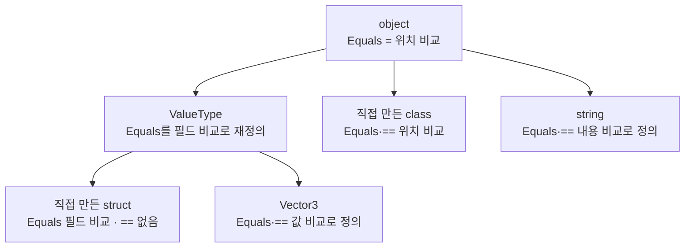
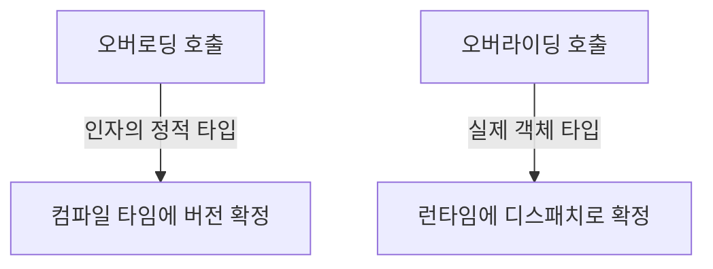
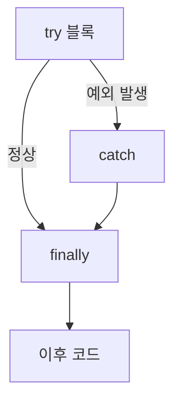

분야 핵심 개념을 얕고 넓게 정리한 노트. 쓱 훑어보며 복습한다.

## 값 타입 vs 참조 타입

변수는 메모리의 한 칸이고, 그 칸에 무엇이 들어가느냐로 갈림. 값 타입(struct)은 칸 안에 데이터가 직접 들어가고, 참조 타입(class)은 데이터(객체)가 힙에 따로 만들어지고 칸에는 그 객체의 위치(참조)만 들어감.

`=` 대입은 양쪽 모두 "오른쪽 칸의 내용을 왼쪽 칸에 복사"하는 같은 동작. 결과가 갈리는 건 복사되는 내용이 달라서 — struct는 데이터가 복사돼 두 벌이 되고, class는 위치가 복사돼 같은 객체 하나를 둘이 가리킴. 그래서 복사 후 한쪽을 고치면 struct는 원본이 그대로고, class는 둘이 보는 객체 하나가 바뀌어 원본 쪽에서 읽어도 바뀐 값이 나옴.

<svg viewBox="0 0 560 372" width="560" style="max-width:100%;height:auto" xmlns="http://www.w3.org/2000/svg" role="img" aria-label="같은 세 줄 코드를 struct와 class로 실행했을 때 줄마다 메모리 상태"><defs><marker id="vr-a" markerWidth="8" markerHeight="8" refX="6" refY="3" orient="auto"><path d="M0,0L6,3L0,6Z" fill="currentColor" opacity="0.6"/></marker></defs><g font-size="13" fill="currentColor" text-anchor="middle" opacity="0.8"><text x="140" y="20">struct — 값 타입</text><text x="420" y="20">class — 참조 타입</text></g><line x1="280" y1="32" x2="280" y2="345" stroke="currentColor" opacity="0.2"/><g font-size="11" font-family="monospace" fill="currentColor" opacity="0.75"><text x="16" y="54">var a = new SPos { hp = 10 };</text><text x="296" y="54">var x = new CPos { hp = 10 };</text><text x="16" y="158">var b = a;</text><text x="296" y="158">var y = x;</text><text x="16" y="262">b.hp = 5;</text><text x="296" y="262">y.hp = 5;</text></g><g fill="none" stroke="currentColor" stroke-opacity="0.6"><rect x="20" y="64" width="112" height="36" rx="4"/><rect x="300" y="76" width="36" height="30" rx="4"/><rect x="420" y="73" width="110" height="36" rx="4"/><rect x="20" y="168" width="112" height="36" rx="4"/><rect x="300" y="166" width="36" height="26" rx="4"/><rect x="420" y="177" width="110" height="36" rx="4"/><rect x="20" y="272" width="112" height="36" rx="4"/><rect x="300" y="270" width="36" height="26" rx="4"/><rect x="300" y="302" width="36" height="26" rx="4"/></g><g fill="#4f83e0" fill-opacity="0.12" stroke="#4f83e0"><rect x="150" y="168" width="112" height="36" rx="4"/><rect x="300" y="198" width="36" height="26" rx="4"/><rect x="176" y="353" width="10" height="10" rx="2"/></g><g fill="#e2574c" fill-opacity="0.12" stroke="#e2574c"><rect x="150" y="272" width="112" height="36" rx="4"/><rect x="420" y="281" width="110" height="36" rx="4"/><rect x="316" y="353" width="10" height="10" rx="2"/></g><g font-size="12" fill="currentColor" text-anchor="middle"><text x="76" y="87">a { hp: 10 }</text><text x="318" y="96">x</text><text x="475" y="96">{ hp: 10 }</text><text x="76" y="191">a { hp: 10 }</text><text x="206" y="191">b { hp: 10 }</text><text x="318" y="184">x</text><text x="318" y="216">y</text><text x="475" y="200">{ hp: 10 }</text><text x="76" y="295">a { hp: 10 }</text><text x="206" y="295">b { hp: 5 }</text><text x="318" y="288">x</text><text x="318" y="320">y</text><text x="475" y="304">{ hp: 5 }</text></g><g stroke="currentColor" stroke-opacity="0.6" stroke-width="1.4" marker-end="url(#vr-a)"><line x1="336" y1="91" x2="414" y2="91"/><line x1="336" y1="179" x2="414" y2="190"/><line x1="336" y1="211" x2="414" y2="200"/><line x1="336" y1="283" x2="414" y2="294"/><line x1="336" y1="315" x2="414" y2="304"/></g><g font-size="11" fill="currentColor" opacity="0.6" text-anchor="middle"><text x="140" y="120">칸 안에 직접 저장</text><text x="475" y="134">힙에 객체 생성</text><text x="140" y="224">hp: 10이 두 벌</text><text x="475" y="238">객체는 여전히 1개</text><text x="140" y="328">a는 그대로 10</text><text x="475" y="342">x로 읽어도 5</text></g><g font-size="11" fill="currentColor" opacity="0.7"><text x="192" y="362">= 로 복사된 칸</text><text x="332" y="362">값이 바뀐 곳</text></g></svg>

```csharp
struct SPos { public int hp; }   // 값 타입
class  CPos { public int hp; }   // 참조 타입

var a = new SPos { hp = 10 };
var b = a;               // 데이터 복사 → hp:10이 두 벌
b.hp = 5;                // b 칸만 바뀜 → a.hp = 10

var x = new CPos { hp = 10 };
var y = x;               // 위치 복사 → 객체는 1개
y.hp = 5;                // 그 객체가 바뀜 → x.hp = 5
ReferenceEquals(x, y);   // true — 같은 객체
```

struct도 `new`를 쓰지만 필드를 채우는 초기화 문법일 뿐 힙 할당이 아님. 데이터는 변수 칸 안에 그대로 있고(지역 변수면 스택), 힙에 객체를 새로 만드는 건 class의 `new`뿐.

| | 값 타입 | 참조 타입 |
| --- | --- | --- |
| 기본 제공 | `int` `float` `bool` `char` `enum` | `string` 배열 `List<T>` |
| 직접 정의 | `struct` | `class` |
| 유니티 | `Vector3` `Quaternion` `Color` | `GameObject` `Transform` MonoBehaviour |
| 대입하면 | 데이터가 한 벌 더 생김 | 같은 객체를 함께 가리킴 |

배열은 원소 타입과 무관하게 항상 참조 타입. `int[] b = a;` 후 `b[0]`을 바꾸면 `a[0]`도 바뀜.

고르는 기준은 복사했을 때 따로 노는 게 자연스러운가. 좌표·색상처럼 복사한 쪽을 고쳐도 원본은 지켜져야 하는 작은 데이터는 struct(힙 할당이 없어 GC 부담이 없는 대신 클수록 복사 비용이 커짐). 적 캐릭터처럼 여러 스크립트가 같은 대상 하나를 봐야 하는 건 class — AI가 체력을 깎으면 UI도 깎인 체력을 봐야 하므로.

```csharp
var enemy = new Enemy();   var ui = enemy;
enemy.hp -= 30;            // ui.hp도 70 — 같은 적 하나

Vector3 spawn = Vector3.zero;   Vector3 pos = spawn;
pos.x += 10;               // spawn은 (0, 0, 0) 그대로 — 원본 보존
```

## 반환된 struct 수정 — 원본 vs 복사본

`transform.position.x = 5f`는 컴파일 에러(CS1612)인데 `b.hp = 5`는 되는 이유. 값 타입은 `=`뿐 아니라 메서드가 `return`할 때도 복사본이 나감. 메서드가 돌려준 복사본의 필드를 고치면 그 복사본을 담은 변수가 없어 바로 사라지고 원본은 그대로라, 아무 효과 없는 코드가 됨 — 컴파일러가 실수로 보고 막음.

```csharp
Vector3 saved = Vector3.zero;
Vector3 GetSaved() => saved;   // saved를 복사해서 반환

Vector3 v = GetSaved();
v.x = 5f;                      // 복사본 수정 → saved.x는 0 그대로
GetSaved().x = 5f;             // 에러 — 고쳐도 버려질 복사본
```

프로퍼티와 `List`의 `[]`는 겉모양만 필드·배열이고 실제로는 메서드 호출(`get_position()`, `get_Item(0)`)이라 같은 경우. 배열의 `arr[0]`은 메서드가 아니라 원소 자리에 직접 접근하는 언어 내장 문법이라 원본을 고침. 배열과 List는 둘 다 참조 타입이고, 갈리는 건 원소에 접근하는 방식 — 값·참조 타입 여부와는 무관.

| 코드 | 실제 동작 | 고치는 대상 | 결과 |
| --- | --- | --- | --- |
| `b.hp = 5` | 내 변수 b를 직접 수정 | 원본 | OK |
| `arr[0].x = 5f` | 배열 0번 자리를 직접 수정 | 원본 | OK |
| `list[0].x = 5f` | `get_Item(0)`이 돌려준 값을 수정 | 복사본 | 에러 |
| `transform.position.x = 5f` | `get_position()`이 돌려준 값을 수정 | 복사본 | 에러 |

해법은 복사본을 변수로 받아 고친 뒤 set으로 다시 넣기. 에러 코드에 빠져 있던 게 이 set 호출.

```csharp
Vector3 p = transform.position;   // get — 복사본 받기
p.x = 5f;
transform.position = p;           // set — 원본에 반영

Vector3 e = list[0];   e.x = 5f;   list[0] = e;   // List도 같은 방식
```

프로퍼티가 class 타입을 반환하면 에러가 안 남. 돌려준 게 위치 값의 복사본이라 따라가면 원본 객체이므로 `transform.parent.name = "Root"`는 제대로 반영됨.

## 값 타입이 힙에 저장되는 경우

"값 타입은 스택, 참조 타입은 힙"은 앞부분이 부정확. 스택이냐 힙이냐를 정하는 건 타입이 아니라 그 값이 담긴 그릇 — 값 타입은 자기를 담은 그릇을 따라감. 지역 변수면 그릇이 스택 프레임이라 스택, 힙에 있는 무언가 안에 담기면 힙.

<svg viewBox="0 0 620 232" width="620" style="max-width:100%;height:auto" xmlns="http://www.w3.org/2000/svg" role="img" aria-label="같은 값 타입 Pos가 지역 변수면 스택, 클래스 필드나 배열 원소면 힙에 산다"><g fill="none" stroke="currentColor" stroke-opacity="0.25" stroke-dasharray="4 3"><rect x="16" y="40" width="170" height="170" rx="10"/><rect x="210" y="40" width="394" height="170" rx="10"/></g><g font-size="13" fill="currentColor" text-anchor="middle" opacity="0.8"><text x="101" y="32">스택</text><text x="407" y="32">힙</text></g><g fill="#3fae7a" fill-opacity="0.12" stroke="#3fae7a"><rect x="42" y="112" width="118" height="42" rx="4"/><rect x="262" y="98" width="110" height="40" rx="4"/><rect x="452" y="98" width="42" height="40" rx="4"/><rect x="498" y="98" width="42" height="40" rx="4"/><rect x="544" y="98" width="42" height="40" rx="4"/></g><g fill="none" stroke="#4f83e0"><rect x="240" y="66" width="150" height="86" rx="4"/><rect x="432" y="66" width="164" height="86" rx="4"/></g><g font-size="12" fill="currentColor" text-anchor="middle"><text x="101" y="130">Pos local</text><text x="101" y="175" font-size="11" opacity="0.6">지역 변수</text><text x="315" y="86" fill="#4f83e0" font-size="11">Player 객체</text><text x="317" y="123">Pos p</text><text x="315" y="175" font-size="11" opacity="0.6">클래스 필드</text><text x="514" y="86" fill="#4f83e0" font-size="11">Pos[] 배열 객체</text><text x="473" y="123">[0]</text><text x="519" y="123">[1]</text><text x="565" y="123">[2]</text><text x="514" y="175" font-size="11" opacity="0.6">배열·컬렉션 원소</text></g><text x="407" y="198" font-size="11" fill="currentColor" text-anchor="middle" opacity="0.6">그릇(객체·배열)이 힙에 있으니 안의 Pos도 힙</text></svg>

값 타입이 힙에 사는 세 경우:

- 클래스(참조 타입)의 필드일 때 — 객체가 힙에 통째로 만들어지고 그 안의 값 타입 필드도 함께 힙에
- 값 타입 배열·컬렉션의 원소일 때 — 배열이 힙 객체라 원소로 깔린 값 타입도 힙에 연속으로
- 박싱됐을 때 — `object`로 감싸지면 힙에 복사본이 할당됨(다음 항목)

```csharp
struct Pos { public int x, y; }

Pos local;                   // 스택 — 지역 변수
class Player { public Pos p; }
var pl = new Player();       // pl.p는 Player 객체 안 → 힙
Pos[] arr = new Pos[10];     // 원소들은 배열 객체 안 → 힙
object o = local;            // 박싱 → 힙에 복사본
```

배열뿐 아니라 `List`·`Dictionary`·`HashSet`·`Queue`도 내부적으로 힙 배열에 원소를 담으므로 같은 경우(C#의 `List<T>`가 C++ `std::vector` 자리). 단 박싱 여부가 갈림 — 제네릭 컬렉션은 타입 매개변수가 실제 struct라 내부 배열에 값 그대로 인라인 저장(박싱 없음), 옛 비제네릭 `ArrayList`·`Hashtable`은 원소를 `object`로 받아 값 타입을 넣는 순간 하나하나 박싱.

```csharp
var list = new List<Pos>();   // 내부 Pos[]에 인라인 — 박싱 없음
var old = new ArrayList();
old.Add(new Pos());           // object로 받음 → 박싱, 힙에 복사본
```

그래서 "값 타입이니 무조건 가볍다"가 아니라 어디에 담기느냐를 봐야 함. 클래스 필드·배열 원소로 든 struct는 힙에 있어도 별도 객체로 할당되지 않고 부모 한 덩어리에 얹혀 가 GC 대상 수가 늘지 않지만(배열이면 연속 저장으로 캐시 지역성도 유지), 박싱되면 힙 할당이 생겨 struct의 이점이 깎임.

## 박싱(boxing)

박싱은 값 타입을 `object`나 인터페이스로 담을 때 일어남. `object`는 참조 타입이라 변수 칸에 위치만 담을 수 있으므로, 값 타입을 넣으려면 런타임이 힙에 상자를 만들어 값을 복사해 넣고 그 상자의 위치를 가리키게 함. 다시 값 타입으로 꺼내는 게 언박싱. 즉 값을 참조로 변신시키는 변환.

<svg viewBox="0 0 620 168" width="620" style="max-width:100%;height:auto" xmlns="http://www.w3.org/2000/svg" role="img" aria-label="박싱은 스택의 값 타입을 힙 상자로 복사하고 object가 그것을 가리킨다"><defs><marker id="box-a" markerWidth="8" markerHeight="8" refX="6" refY="3" orient="auto"><path d="M0,0L6,3L0,6Z" fill="currentColor" opacity="0.6"/></marker></defs><g fill="none" stroke="currentColor" stroke-opacity="0.25" stroke-dasharray="4 3"><rect x="16" y="30" width="240" height="116" rx="10"/><rect x="356" y="30" width="248" height="116" rx="10"/></g><g font-size="13" fill="currentColor" text-anchor="middle" opacity="0.8"><text x="136" y="22">스택</text><text x="480" y="22">힙</text></g><g fill="#3fae7a" fill-opacity="0.12" stroke="#3fae7a"><rect x="46" y="52" width="128" height="38" rx="4"/></g><g fill="none" stroke="currentColor" stroke-opacity="0.6"><rect x="46" y="100" width="128" height="32" rx="4"/></g><g fill="#e2574c" fill-opacity="0.12" stroke="#e2574c"><rect x="422" y="66" width="120" height="44" rx="4"/></g><g font-size="12" fill="currentColor" text-anchor="middle"><text x="110" y="76">int n = 42</text><text x="110" y="121">object o</text><text x="482" y="85">상자</text><text x="482" y="101" font-size="11" opacity="0.65">42 (복사본)</text></g><g stroke="currentColor" stroke-opacity="0.6" stroke-width="1.4" marker-end="url(#box-a)"><line x1="174" y1="71" x2="420" y2="83"/><line x1="174" y1="116" x2="420" y2="98"/></g><g font-size="11" fill="currentColor" opacity="0.6" text-anchor="middle"><text x="300" y="66">박싱: 힙 할당 + 복사</text><text x="300" y="140">o는 상자의 위치를 가리킴</text></g></svg>

```csharp
int n = 42;
object o = n;     // 박싱 — 힙에 상자 할당, 42를 복사
int m = (int)o;   // 언박싱 — 상자에서 값 복사
```

박싱은 힙 할당이라 GC 대상이 하나 생김. 한 번은 사소하나 매 프레임·루프에서 반복되면 임시 쓰레기가 쌓여 GC가 잦아지고 그때마다 멈칫함(게임이면 스터터). 문제는 코드에 잘 안 보인다는 것 — 대표적으로 값 타입을 `object` 파라미터로 넘길 때(`Debug.Log(int)`, `string.Format` 인자, 옛 컬렉션 `Add`), 인터페이스로 담을 때(`IComparable c = myStruct`), `enum`을 `object`로 다룰 때.

피하는 법은 전부 한 문장의 변주 — 값 타입을 `object`·인터페이스에 담지 말고, 담아야 할 것 같으면 제네릭으로 컴파일러가 타입을 알게 함.

- 제네릭 컬렉션 — `List<int>`·`Dictionary<int,int>`는 내부 배열이 실제 타입이라 박싱 없음. 옛 `ArrayList`·`Hashtable`만 피함
- 제네릭 제약 — `where T : IComparable<T>`면 `object` 경유 없이 값에 직접 호출(constrained call). struct에 `IEquatable<T>`·`GetHashCode`를 두면 Dictionary 비교의 박싱도 사라짐
- `enum` — 옛 `HasFlag`는 내부 박싱, 비트 연산 `(e & flag) != 0`으로 검사하면 박싱 없음
- 로그·문자열 — 값을 `ToString()`으로 먼저 문자열로 만들어 넘기면 박싱은 없음. 단 결과 문자열은 힙에 할당되므로 "박싱만" 없는 것이지 할당까지 없는 건 아님(진짜 무할당은 미리 만든 문자열 재사용·로그 끄기)

```csharp
Debug.Log(hp);                 // int → object 파라미터 → 박싱
Debug.Log(hp.ToString());      // 이미 string → 박싱 없음(문자열 할당은 남음)
if ((eff & Eff.Fire) != 0) { } // HasFlag 대신 비트 검사 → 박싱 없음
T Max<T>(T a, T b) where T : IComparable<T> => a.CompareTo(b) >= 0 ? a : b;  // 박싱 없이 호출
```

`ToString()` 자체가 박싱이 아닌 건 `int`처럼 `ToString()`을 재정의한 타입이라 값에 직접 호출되기 때문. 재정의 안 한 커스텀 struct는 상속받은 `ValueType.ToString()`을 부르며 박싱되므로, struct엔 `ToString()` override를 두면 그 박싱도 사라짐.

## 배열 기본 초기화 — 값 타입 vs 참조 타입

`new T[n]`을 하면 런타임이 그 메모리 블록을 통째로 0으로 채움. "0으로 채운다"가 타입에 따라 다른 뜻이 됨 — 값 타입에겐 유효한 기본값이고, 참조 타입에겐 null.

- 값 타입 배열 — 각 원소의 필드가 기본값(`int` 0, `bool` false, 안의 참조는 null). 원소가 이미 유효한 기본값 struct라 바로 접근 가능
- 참조 타입 배열 — 각 원소는 참조라 0이 곧 null. n개의 null 칸만 있고 객체는 하나도 안 만들어져, `원소.멤버`에 접근하면 `NullReferenceException`

<svg viewBox="0 0 620 204" width="620" style="max-width:100%;height:auto" xmlns="http://www.w3.org/2000/svg" role="img" aria-label="값 타입 배열은 기본값으로, 참조 타입 배열은 null로 초기화된다"><g font-size="12" fill="currentColor"><text x="24" y="36" font-size="13">new Pos[3]</text><text x="150" y="36" opacity="0.6">값 타입 — 기본값으로 채워짐</text></g><g fill="#3fae7a" fill-opacity="0.12" stroke="#3fae7a"><rect x="24" y="50" width="118" height="44" rx="4"/><rect x="154" y="50" width="118" height="44" rx="4"/><rect x="284" y="50" width="118" height="44" rx="4"/></g><g font-size="12" fill="currentColor" text-anchor="middle"><text x="83" y="77">{ x:0, y:0 }</text><text x="213" y="77">{ x:0, y:0 }</text><text x="343" y="77">{ x:0, y:0 }</text></g><text x="420" y="77" font-size="12" fill="currentColor" opacity="0.7">바로 s[0].x 접근 가능</text><g font-size="12" fill="currentColor"><text x="24" y="134" font-size="13">new Player[3]</text><text x="164" y="134" opacity="0.6">참조 타입 — 전부 null</text></g><g fill="none" stroke="currentColor" stroke-opacity="0.4" stroke-dasharray="4 3"><rect x="24" y="148" width="118" height="44" rx="4"/><rect x="154" y="148" width="118" height="44" rx="4"/><rect x="284" y="148" width="118" height="44" rx="4"/></g><g font-size="12" fill="currentColor" text-anchor="middle" opacity="0.6"><text x="83" y="175">null</text><text x="213" y="175">null</text><text x="343" y="175">null</text></g><text x="420" y="175" font-size="12" fill="#e2574c">c[0].Hp 접근 → 예외</text></svg>

```csharp
struct Pos { public int x, y; }

var s = new Pos[3];       // 원소: {0,0} 셋 — s[0].x 바로 접근 가능
var i = new int[3];       // 0, 0, 0
var c = new Player[3];    // null, null, null — c[0].Hp 접근 시 NullReferenceException
var str = new string[3];  // null, null, null (string도 참조 타입)
```

class 배열은 칸만 만들고 내용물은 없으니 쓰기 전에 각 칸에 객체를 넣어야 함.

```csharp
for (int k = 0; k < c.Length; k++) c[k] = new Player();
```

이 "0으로 초기화"는 배열만이 아니라 클래스의 필드에도 그대로 적용됨 — `new`로 객체를 만들면 초기화 안 한 필드는 값 타입이면 0, 참조 타입이면 null. `default(T)`도 같은 값을 줌. 단 `new T[n]`은 원소 n개를 기본값으로 채운 상태고 `new List<T>()`는 원소 0개(비어 있음)라, `Length`와 `Count`가 다르게 시작함.

```csharp
new int[3].Length;      // 3 (0,0,0으로 이미 채워짐)
new List<int>().Count;  // 0 (비어 있음)
```

## ref — 참조도 값으로 복사된다

C#의 인자 전달은 값 타입이든 참조 타입이든 예외 없이 값 전달 — 변수 칸에 든 것을 복사해 넘김. 값 타입은 데이터가, 참조 타입은 위치(주소)가 복사됨. 그래서 참조 타입을 넘기면 매개변수와 원래 변수는 서로 다른 칸이지만 같은 객체를 가리킴. 여기서 두 동작이 갈림:

- `e.hp = 50` — 복사된 위치를 따라가 그 객체를 고침. 원래 변수도 같은 객체를 보므로 반영됨
- `e = new Enemy()` — 매개변수 칸에 새 위치를 덮어씀. 그 칸은 복사본이라 원래 변수는 옛 위치 그대로

<svg viewBox="0 0 540 176" width="540" style="max-width:100%;height:auto" xmlns="http://www.w3.org/2000/svg" role="img" aria-label="참조 타입 인자에서 필드 수정은 반영되고 재할당은 원본에 반영되지 않는다"><defs><marker id="rf-a" markerWidth="8" markerHeight="8" refX="6" refY="3" orient="auto"><path d="M0,0L6,3L0,6Z" fill="currentColor" opacity="0.6"/></marker></defs><g font-size="12" fill="currentColor" text-anchor="middle" opacity="0.8"><text x="138" y="18" font-family="monospace">e.hp = 50 · 반영됨</text><text x="405" y="18" font-family="monospace">e = new Enemy() · 원본 그대로</text></g><line x1="270" y1="30" x2="270" y2="150" stroke="currentColor" opacity="0.2"/><g fill="none" stroke="currentColor" stroke-opacity="0.6"><rect x="24" y="50" width="104" height="30" rx="4"/><rect x="24" y="104" width="104" height="30" rx="4"/><rect x="300" y="50" width="96" height="30" rx="4"/><rect x="300" y="104" width="96" height="30" rx="4"/><rect x="430" y="48" width="96" height="30" rx="4"/></g><g fill="#e2574c" fill-opacity="0.12" stroke="#e2574c"><rect x="168" y="76" width="86" height="34" rx="4"/><rect x="430" y="106" width="96" height="30" rx="4"/></g><g font-size="12" fill="currentColor" text-anchor="middle"><text x="76" y="69">enemy</text><text x="76" y="123">e (복사본)</text><text x="211" y="97">Enemy hp:50</text><text x="348" y="69">enemy</text><text x="348" y="123">e (복사본)</text><text x="478" y="67">원래 Enemy</text><text x="478" y="125">새 Enemy</text></g><g stroke="currentColor" stroke-opacity="0.6" stroke-width="1.4" marker-end="url(#rf-a)"><line x1="128" y1="65" x2="166" y2="88"/><line x1="128" y1="119" x2="166" y2="99"/><line x1="396" y1="64" x2="428" y2="63"/><line x1="396" y1="119" x2="428" y2="121"/></g><g font-size="11" fill="currentColor" opacity="0.6" text-anchor="middle"><text x="140" y="162">둘이 같은 객체 → 고치면 반영</text><text x="412" y="162">e 칸만 새 객체 → enemy는 그대로</text></g></svg>

```csharp
void Heal(Enemy e)    { e.hp = 50; }        // 객체를 고침 → 반영됨
void Replace(Enemy e) { e = new Enemy(); }  // 칸을 덮어씀 → 원본 그대로

var enemy = new Enemy { hp = 100 };
Heal(enemy);     // enemy.hp = 50 (반영)
Replace(enemy);  // enemy는 원래 객체 그대로
```

`ref`는 값을 복사해 넘기는 대신 원래 변수의 칸 자체(별칭)를 넘김. 그래서 메서드 안의 재할당이 곧 원래 변수에 대한 재할당이 됨. 호출할 때도 `ref`를 붙여 "이 변수 칸을 넘긴다"를 명시. 값 타입에도 쓰며 오히려 값 타입에서 더 자주 씀 — 원래 복사돼 넘어가 못 바꾸던 원본을 직접 고칠 수 있어서.

```csharp
void Replace(ref Enemy e) { e = new Enemy(); }  // 원본 변수가 진짜 교체됨
void AddOne(ref int n)    { n++; }              // 값 타입도 원본이 바뀜
Replace(ref enemy);   AddOne(ref x);            // 호출 때도 ref 명시
```

형제 키워드 `out`·`in`도 "변수 칸을 넘긴다"는 같은 계열이고 읽기·쓰기 권한만 다름.

| 키워드 | 방향 | 넘기기 전 초기화 | 주 용도 |
| --- | --- | --- | --- |
| `ref` | 읽기 + 쓰기 | 필요 | 원본 변수를 고침 |
| `out` | 쓰기 전용(메서드가 반드시 채움) | 불필요 | 결과를 여러 개 반환 |
| `in` | 읽기 전용(메서드가 못 바꿈) | 필요 | 큰 struct를 복사 없이 넘김 |

`in`은 성능용 — 큰 struct(예: `Matrix4x4`, 64바이트)를 그냥 넘기면 호출마다 통째로 복사되는데, `in`이면 칸 위치만 넘어가 복사가 없고 안에서 수정은 막힘. `ref`는 실행이 미뤄지는 `async` 메서드·이터레이터(`yield`)의 매개변수로는 못 쓰고 람다도 캡처 못 함 — 그때쯤 원래 변수의 스택 자리가 사라졌을 수 있어서.

## out 파라미터

`out`은 `ref`와 같은 계열 — 값을 복사해 넘기는 게 아니라 호출자 변수의 칸 자체를 넘겨, 메서드가 그 칸에 값을 써 넣으면 호출자 변수에 바로 반영됨. `return`은 값을 하나만 돌려주지만 `out`을 쓰면 결과를 여러 개 내보낼 수 있음 — 정식 반환값 옆문으로 값을 더 미는 셈.

`ref`와 갈리는 건 방향과 규칙. `out`은 "이 칸은 내가 채워서 돌려준다"는 쓰기 전용 약속이라 컴파일러가 둘을 강제함:

- 호출하는 쪽 — 넘기기 전 초기화 불필요(어차피 메서드가 덮어씀)
- 메서드 쪽 — `return` 전에 반드시 그 `out` 인자에 대입(안 하면 컴파일 에러)

즉 `ref`는 기존 값을 읽고 고치는 양방향, `out`은 기존 값을 무시하고 새로 채워 내보내는 단방향(밖으로).

<svg viewBox="0 0 540 180" width="540" style="max-width:100%;height:auto" xmlns="http://www.w3.org/2000/svg" role="img" aria-label="out을 쓰는 Try 패턴은 반환값으로 성공 여부를, out으로 변환된 값을 함께 내보낸다"><defs><marker id="out-a" markerWidth="8" markerHeight="8" refX="6" refY="3" orient="auto"><path d="M0,0L6,3L0,6Z" fill="currentColor" opacity="0.6"/></marker></defs><g font-size="12" fill="currentColor" text-anchor="middle"><rect x="16" y="70" width="104" height="40" rx="4" fill="none" stroke="currentColor" opacity="0.6"/><text x="68" y="87">입력 문자열</text><text x="68" y="103" opacity="0.6">"42"</text></g><rect x="170" y="62" width="150" height="52" rx="4" fill="#4f83e0" fill-opacity="0.12" stroke="#4f83e0"/><g font-size="12" fill="currentColor" text-anchor="middle"><text x="245" y="84">TryParse</text><text x="245" y="102" font-size="11" opacity="0.65">호출 1번 · 출력 2갈래</text></g><rect x="378" y="26" width="152" height="46" rx="4" fill="#3fae7a" fill-opacity="0.12" stroke="#3fae7a"/><g font-size="12" fill="currentColor" text-anchor="middle"><text x="454" y="48">return</text><text x="454" y="64" font-size="11" opacity="0.65">bool 성공 여부 → true</text></g><rect x="378" y="106" width="152" height="46" rx="4" fill="#e2574c" fill-opacity="0.12" stroke="#e2574c"/><g font-size="12" fill="currentColor" text-anchor="middle"><text x="454" y="128">out result</text><text x="454" y="144" font-size="11" opacity="0.65">호출자 칸에 42 씀</text></g><g stroke="currentColor" stroke-opacity="0.6" stroke-width="1.4" marker-end="url(#out-a)"><line x1="120" y1="90" x2="168" y2="90"/><line x1="320" y1="80" x2="376" y2="52"/><line x1="320" y1="98" x2="376" y2="128"/></g><g font-size="11" fill="currentColor" opacity="0.6"><text x="330" y="66">정식 반환</text><text x="330" y="120">옆문(out)</text></g></svg>

가장 흔한 자리가 Try 패턴. "성공했나"는 `bool`로 반환하고 "변환된 값"은 `out`으로 돌려줌 — 실패가 정상 범위인 입력 처리에서 예외 대신 성공 여부와 결과를 한 번에 받음. `out int n`처럼 호출 자리에서 변수를 바로 선언할 수 있고(`out var`도 됨), 안 쓸 값은 버림 `_`으로 받음.

```csharp
if (int.TryParse(input, out int n)) { Use(n); }   // 성공 시 n에 변환값이 채워짐
if (dict.TryGetValue(key, out var value)) { }      // 있는지 확인 + 값 꺼내기를 조회 1번에
if (dict.TryGetValue(key, out _)) { }              // 값이 필요 없으면 버림 _
```

`Dictionary.TryGetValue`도 같은 패턴 — `ContainsKey` 뒤 `[key]`로 다시 꺼내면 조회가 두 번인데 이건 한 번. 결과를 여럿 내보내는 데는 튜플·record도 있고 요즘은 튜플이 더 읽히지만, "성공 여부 + 값" 조합인 Try 패턴만은 `out`이 여전히 관용적.

```csharp
bool TryGetRange(int[] a, out int min, out int max) { }      // out 방식
(int min, int max) GetRange(int[] a) => (a.Min(), a.Max());  // 튜플 방식(요즘 선호)
```

## Span과 stackalloc

`Span<T>`는 연속된 메모리(배열·문자열·`stackalloc` 버퍼)의 한 구간을 복사 없이 가리키는 뷰. 내부는 "시작 위치 + 길이" 두 값만 든 작은 struct라 슬라이스를 떠도 새 배열·문자열을 안 만듦. 문자열 자르기가 확실한 대비 — `Substring`은 새 `string`을 힙에 할당하지만 `AsSpan().Slice()`(또는 `[a..b]`)는 원본 구간을 가리키기만 해 할당이 0.

<svg viewBox="0 0 620 176" width="620" style="max-width:100%;height:auto" xmlns="http://www.w3.org/2000/svg" role="img" aria-label="Span은 원본 구간을 가리키고 Substring은 새 문자열을 할당한다"><defs><marker id="sp-a" markerWidth="8" markerHeight="8" refX="6" refY="3" orient="auto"><path d="M0,0L6,3L0,6Z" fill="currentColor" opacity="0.6"/></marker></defs><text x="30" y="30" font-size="11" fill="currentColor" opacity="0.7">원본 "2026-09-21" (힙)</text><g font-size="13" fill="currentColor" text-anchor="middle"><rect x="30" y="40" width="36" height="38" rx="3" fill="none" stroke="currentColor" opacity="0.55"/><text x="48" y="64">2</text><rect x="66" y="40" width="36" height="38" rx="3" fill="none" stroke="currentColor" opacity="0.55"/><text x="84" y="64">0</text><rect x="102" y="40" width="36" height="38" rx="3" fill="none" stroke="currentColor" opacity="0.55"/><text x="120" y="64">2</text><rect x="138" y="40" width="36" height="38" rx="3" fill="#3fae7a" fill-opacity="0.14" stroke="#3fae7a"/><text x="156" y="64">6</text><rect x="66" y="40" width="36" height="38" rx="3" fill="#3fae7a" fill-opacity="0.14" stroke="#3fae7a"/><text x="84" y="64">0</text><rect x="102" y="40" width="36" height="38" rx="3" fill="#3fae7a" fill-opacity="0.14" stroke="#3fae7a"/><text x="120" y="64">2</text><rect x="30" y="40" width="36" height="38" rx="3" fill="#3fae7a" fill-opacity="0.14" stroke="#3fae7a"/><text x="48" y="64">2</text><rect x="174" y="40" width="36" height="38" rx="3" fill="none" stroke="currentColor" opacity="0.55"/><text x="192" y="64">-</text><rect x="210" y="40" width="36" height="38" rx="3" fill="none" stroke="currentColor" opacity="0.55"/><text x="228" y="64">0</text></g><rect x="410" y="34" width="180" height="46" rx="4" fill="#3fae7a" fill-opacity="0.12" stroke="#3fae7a"/><g fill="currentColor" text-anchor="middle"><text x="500" y="54" font-size="13">Span</text><text x="500" y="71" font-size="11" opacity="0.7">시작 0 · 길이 4 (할당 0)</text></g><path d="M30 86 L30 94 L174 94 L174 86" fill="none" stroke="#3fae7a" stroke-width="1.4"/><line x1="408" y1="72" x2="176" y2="96" stroke="currentColor" stroke-opacity="0.6" stroke-width="1.4" marker-end="url(#sp-a)"/><text x="100" y="112" font-size="11" fill="currentColor" opacity="0.7">앞 4칸을 가리킴</text><rect x="30" y="122" width="180" height="44" rx="4" fill="#e2574c" fill-opacity="0.12" stroke="#e2574c"/><g fill="currentColor" text-anchor="middle"><text x="120" y="142" font-size="13">Substring "2026"</text><text x="120" y="159" font-size="11" opacity="0.7">힙에 새 문자열 할당</text></g><text x="228" y="149" font-size="11" fill="currentColor" opacity="0.7">복사 발생, GC 대상 하나 생김</text></svg>

```csharp
string s = "2026-09-21";
string y1 = s.Substring(0, 4);            // 새 string "2026" 할당
ReadOnlySpan<char> y2 = s.AsSpan(0, 4);   // 할당 없이 "2026" 구간을 가리킴
int year = int.Parse(y2);                 // Span도 그대로 파싱 가능
```

`stackalloc`은 임시 버퍼를 힙이 아니라 스택에 잡음. GC 대상이 아니고 메서드가 끝나면 자동으로 사라짐. 보통 `Span`으로 받아 안전하게 씀.

```csharp
Span<byte> buf = stackalloc byte[128];   // 스택 버퍼 — GC 무관, 메서드 끝나면 사라짐
```

`Span<T>`는 `ref struct`라 제약이 따름 — 스택 메모리를 가리킬 수 있어, 그 스택 자리가 사라진 뒤에도 살아 있으면 안 되기 때문. 그래서 오래 사는 자리에 못 둠.

- 클래스 필드에 저장 못 함 — 객체는 힙에서 오래 사는데 Span이 이미 사라진 스택을 가리킬 수 있어서
- `await`·`yield`를 넘겨 못 씀 — 그 사이 스택 프레임이 바뀜
- 박싱 못 함, 제네릭 타입 인자로 못 씀

힙에 담아 오래 들고 다녀야 하면 `Memory<T>`(비동기에 걸쳐 쓸 수 있는 사촌), 읽기 전용이면 `ReadOnlySpan<T>`. 쓰는 자리는 파싱·버퍼 처리 핫 패스에서 "잠깐 보고 버리는" 데이터의 할당을 없앨 때 — 큰 문자열을 구분자로 잘라 조각을 `Substring` 없이 파싱하거나, 네트워크·파일 바이트를 `stackalloc` 버퍼로 처리. 일반 로직엔 과하고 매 프레임·대량 반복에서 값어치가 남.

## struct vs class의 기본 Equals

`Equals`는 두 값이 같은지 답하는 메서드로, 모든 타입이 최상위 부모 `object`에서 물려받아 따로 정의하지 않아도 쓸 수 있음. "같다"엔 두 뜻이 있음 — 같은 객체 하나를 가리키는지(참조 동등), 객체는 달라도 필드 값이 모두 같은지(값 동등).

기본값은 계열로 갈림. 참조 타입은 `object`의 원래 Equals를 그대로 써서 변수에 든 위치를 비교하고, 값 타입은 모든 struct의 부모인 `ValueType`이 Equals를 필드 비교로 재정의해 둬서 데이터를 비교. struct는 대입·전달마다 복사본이 생겨 "같은 객체인가"를 물으면 거의 항상 false라, 쓸모 있는 비교가 내용 비교뿐이기 때문.

```csharp
struct SPos { public int hp; }
class  CPos { public int hp; }

var c1 = new CPos { hp = 10 };   var c2 = new CPos { hp = 10 };   var c3 = c1;
c1.Equals(c2);   // false — hp는 같지만 다른 객체
c1.Equals(c3);   // true  — 같은 객체
c1 == c2;        // false — class의 기본 == 도 위치 비교

var s1 = new SPos { hp = 10 };   var s2 = new SPos { hp = 10 };
s1.Equals(s2);   // true  — 필드 값이 모두 같음
s1 == s2;        // 컴파일 에러 — struct엔 기본 == 가 없음
```

`==`는 Equals와 별개. Equals는 메서드라 자식이 부모 것을 물려받지만, `==`는 연산자라 물려받는 구조가 아니고 타입마다 따로 정의해야 생김. 그래서 `ValueType`이 Equals를 바꿔도 struct에 `==`는 생기지 않음. class의 위치 비교 `==`는 언어가 모든 class에 기본으로 붙여주는 것.

| | 기본 Equals | 기본 `==` |
| --- | --- | --- |
| 참조 타입 | 위치 비교 | 위치 비교 |
| 값 타입 | 값 비교(`ValueType`이 재정의) | 없음 — 직접 정의해야 사용 가능 |



`int`·`Vector3`·`string`처럼 표와 다르게 동작하는 타입은 예외가 아니라 그 타입이 Equals나 `==`를 직접 정의해 둔 것. 데이터 자체가 의미인 타입은 내용 비교로 정의하고 대개 Equals와 `==`를 같은 기준으로 맞춤. hp가 같은 적 두 마리가 서로 다른 적이듯, 개체를 나타내는 타입은 기본 위치 비교를 그대로 씀.

| 성격 | 예시 | "같다"의 의미 |
| --- | --- | --- |
| 값을 나타냄 | `int` `Vector3` `string` `DateTime` | 내용이 같으면 같음 — Equals·`==`를 내용 비교로 정의 |
| 대상을 나타냄 | `Enemy` `GameObject` 직접 만든 class | 같은 한 개체여야 같음 — 기본 위치 비교 |

class·struct가 아닌 것처럼 보이는 타입도 결국 두 계열 중 하나를 따름. `int`·`enum`·튜플은 값 타입 계열이라 값 비교, 배열·`List`는 class라 위치 비교. 그래서 원소가 똑같은 배열 두 개도 Equals와 `==`가 false고, 원소끼리 비교하려면 LINQ의 `SequenceEqual`을 씀.

```csharp
int[] a1 = { 1, 2 };   int[] a2 = { 1, 2 };
a1.Equals(a2);          // false — 서로 다른 배열 객체
a1.SequenceEqual(a2);   // true  — 원소를 하나씩 비교
```

struct의 기본 Equals는 어떤 struct든 처리하는 범용 구현이라, 필드 구성에 따라 리플렉션으로 필드를 찾아 꺼내는 느린 방식을 쓰고 인자를 `object`로 받아 박싱도 일어남. 딕셔너리 키처럼 비교가 잦은 struct는 `IEquatable<T>`로 직접 정의하고, 이때 `GetHashCode`도 같은 필드로 함께 정의. Dictionary는 `GetHashCode`로 버킷을 먼저 고른 뒤 그 안에서만 Equals로 확인하므로, 둘이 어긋나면 넣어둔 키를 못 찾음.

```csharp
struct Cell : IEquatable<Cell> {
    public int x, y;
    public bool Equals(Cell o) => x == o.x && y == o.y;            // 박싱 없는 비교
    public override bool Equals(object obj) => obj is Cell c && Equals(c);
    public override int GetHashCode() => HashCode.Combine(x, y);   // Equals와 같은 필드로
}
```

## record와 값 동등성

데이터를 묶는 타입은 "내용이 같으면 같다"가 자연스러운데, class로 만들면 기본이 위치 비교라 Equals·`GetHashCode`·`==`·`!=`·`ToString`을 전부 직접 써야 함. `record`는 이걸 컴파일러가 대신 만들어주는 문법 — "값을 나타내는 타입"을 한 줄로 만듦.

```csharp
record Point(int X, int Hp);   // 이 한 줄로 아래가 전부 생성됨
```

| 생성되는 것 | 내용 |
| --- | --- |
| 생성자 | `new Point(0, 10)` |
| 프로퍼티 `X`, `Hp` | `init` 전용 — 생성할 때만 값을 넣을 수 있음 |
| Equals·`GetHashCode`·`==`·`!=` | 모든 프로퍼티 값을 비교 |
| `ToString` | `Point { X = 0, Hp = 10 }` 형태로 출력 |
| `with` 식 | 일부만 바꾼 복사본 생성 |

`record`는 `record class`의 줄임말이라 여전히 참조 타입 — 힙에 객체가 만들어지고 변수엔 위치가 들어감. 바뀌는 건 "같다"의 기준뿐이라, 내용이 같으면 객체가 2개여도 `==`가 true.

```csharp
var p1 = new Point(0, 10);   var p2 = new Point(0, 10);
p1 == p2;                  // true  — 내용 비교
ReferenceEquals(p1, p2);   // false — 객체는 2개
```

비교는 프로퍼티마다 그 타입의 Equals로 함. 프로퍼티가 `List`·배열이면 그 부분은 위치 비교가 돼, 원소가 같아도 record끼리 false.

```csharp
record Inventory(List<int> Items);
var i1 = new Inventory(new List<int> { 1, 2 });
var i2 = new Inventory(new List<int> { 1, 2 });
i1 == i2;   // false — Items끼리 비교하는데 List의 Equals는 위치 비교
```

위치 매개변수 프로퍼티는 `init` 전용이라 생성 후 못 바꿈. 값을 바꾸려면 `with`로 일부만 바꾼 복사본을 새로 만들고 원본은 그대로 둠. 불변이 값 비교와 짝인 이유는 해시 — `GetHashCode`가 프로퍼티 값으로 계산되는데, Dictionary 키로 넣은 뒤 내용이 바뀌면 해시가 달라져 엉뚱한 버킷을 뒤지게 되고 넣어둔 키를 못 찾음. 아무도 못 바꾸니 여러 곳에서 안심하고 공유할 수 있기도 함.

```csharp
p1.Hp = 5;                     // 컴파일 에러 — init 전용
var p3 = p1 with { Hp = 5 };   // 새 객체, Hp만 5 → p1은 { X = 0, Hp = 10 } 그대로
```

`with`는 얕은 복사 — 프로퍼티 값을 `=`처럼 복사하므로 참조 타입 프로퍼티는 위치만 복사돼 원본과 같은 객체를 공유. 불변도 "프로퍼티에 다른 걸 대입할 수 없다"까지라, 프로퍼티가 가리키는 List 안의 내용은 여전히 바꿀 수 있음.

```csharp
var i3 = i1 with { };   // record 객체는 새로 생김
i3.Items.Add(3);        // i1.Items.Count도 3 — List는 새로 안 만들어져 하나를 공유
```

| | class | `record`(= `record class`) | `record struct` |
| --- | --- | --- | --- |
| 계열 | 참조 타입 | 참조 타입 | 값 타입 |
| 기본 `==` | 위치 비교 | 내용 비교 | 내용 비교 |
| 위치 매개변수 프로퍼티 | 해당 없음 | `init` 전용(불변) | 수정 가능(`readonly record struct`면 불변) |

`record struct`(C# 10)는 원래 `==`가 없던 struct에 `==`·`ToString` 등을 채워준 것. 유니티는 C# 9까지라 `record struct`는 못 쓰고, `record`도 `init`에 필요한 `IsExternalInit` 타입을 직접 선언해야 컴파일됨.

| | class | record |
| --- | --- | --- |
| 같다의 기준 | 같은 개체인가 | 내용이 같은가 |
| 상태 | 계속 바뀜 | 만든 뒤 안 바뀜 |
| 예시 | `Enemy`, 플레이어, 매니저 | 좌표, 아이템 정보, 설정값, 이벤트 메시지, 딕셔너리 키 |

## 튜플과 분해

`(int, string)` 값 튜플(`ValueTuple`)은 여러 값을 하나로 묶는 가벼운 값 타입. 임시 클래스나 여러 개의 `out` 대신 메서드가 값을 여러 개 돌려줄 때 씀. 필드명을 주면 이름으로, 안 주면 `.Item1`·`.Item2`로 접근.

```csharp
(int min, int max) Range(int[] a) => (a.Min(), a.Max());
var r = Range(nums);
r.min;  r.max;                // 묶음으로 받아 점 찍어 꺼냄
```

분해(deconstruction)는 묶음 하나로 받는 대신 여러 변수로 한 번에 풀어 받는 것 — 튜플의 `Item1`을 `lo`에, `Item2`를 `hi`에 각각 복사해 넣어 중간 묶음 변수 없이 바로 낱개 변수가 생김. 안 쓸 값은 버림 `_`으로 받음.

```csharp
var (lo, hi) = Range(nums);   // lo=min, hi=max 바로 낱개 변수로
var (lo, _)  = Range(nums);   // 하나만 필요하면 나머지는 버림
```

분해는 튜플만이 아니라 `Deconstruct` 메서드를 정의한 어떤 타입에도 됨. 이름이 정확히 `Deconstruct`, 반환형 `void`, 내보낼 값마다 `out` 파라미터 하나면 됨(인터페이스가 아니라 관례). `var (x, y) = p`는 컴파일러가 `p.Deconstruct(out var x, out var y)`로 바꿔 부르는 것 — 앞 `out`의 옆문 반환을 그대로 씀. `record`는 위치 매개변수로 선언하면 이 `Deconstruct`를 자동 생성.

```csharp
class Point {
    public int X, Y;
    public void Deconstruct(out int x, out int y) { x = X; y = Y; }
}
var (a, b) = point;           // Deconstruct 덕분에 분해됨 (없으면 컴파일 에러)
```

| | ValueTuple `(a, b)` | 옛 `Tuple<>` |
| --- | --- | --- |
| 계열 | 값 타입(struct) | 참조 타입(class) |
| 할당 | 힙 할당 없음 | 힙 할당 |
| 필드 | 이름 가능, 가변 | `.Item1`만, 불변 |

지금은 ValueTuple을 씀. 옛 `Tuple`은 힙을 쓰고 이름도 없어 읽기 나쁨.

튜플 필드 이름(`min`/`max`)은 컴파일 타임 설탕 — 컴파일하면 `Item1`/`Item2`로 치환돼 런타임엔 사라짐. 그래서 `(int min, int max)`와 `(int x, int y)`는 다른 타입이 아니라 똑같은 `(int, int)`이고, 동등 비교도 이름이 아니라 위치로 함(리플렉션으로 지역 튜플의 이름은 못 봄). record·클래스의 프로퍼티 이름이 런타임에 실재하는 것과 대비됨.

```csharp
(1, "a") == (1, "a");                // true — 원소별 비교
(min: 1, max: 2) == (lo: 1, hi: 2);  // true — 이름 무시, 위치가 같으면 같음
```

"성공 여부 + 값" 조합은 `out`(Try 패턴)이 관용적이고 그냥 "값 여러 개 반환"은 튜플이 더 읽힘. 공개 API에서 의미가 중요하면 이름 붙인 record가 더 나음.

## 기본 자료형과 부동소수점

정수는 `int`(4바이트)가 기본, 더 큰 범위는 `long`(8바이트). 실수는 `float`·`double`·`decimal`로 나뉘고 이 셋의 차이가 자주 나옴.

| 타입 | 크기 | 특징 |
| --- | --- | --- |
| `float` | 4바이트 | 정밀도 낮음, 접미사 `f`, 유니티 좌표 기본 |
| `double` | 8바이트 | 실수 기본값, float보다 정밀 |
| `decimal` | 16바이트 | 10진 기반, 오차 없음, 접미사 `m`, 느림 |

`float`·`double`은 2진 부동소수점이라 `0.1` 같은 10진 소수를 정확히 못 담아 미세한 오차가 생김. 그래서 실수는 `==`로 바로 비교하지 말고 오차 범위(epsilon) 안인지로 비교. 돈처럼 오차가 용납 안 되는 값은 10진 기반이라 정확한 `decimal`을 씀(대신 느림).

```csharp
0.1 + 0.2 == 0.3;              // false — 2진 부동소수점 오차
Math.Abs(a - b) < 1e-6;        // 실수 비교는 오차 범위로
decimal price = 0.1m + 0.2m;   // 0.3 정확 — 금액엔 decimal
```

## 문자열 불변성과 StringBuilder

`string`은 한 번 만들어지면 내용이 절대 안 바뀜. `Replace`·`ToUpper`·`Trim`·`Substring`은 원본을 고치는 게 아니라 바뀐 새 문자열을 반환 — 반환값을 안 받으면 아무 일도 안 일어남.

```csharp
string s = "abc";
s.ToUpper();          // 반환값 안 받음 → s는 그대로 "abc"
s = s.ToUpper();      // "ABC" — 새 문자열로 갈아 끼워야 반영
```

불변으로 만든 이유는 여러 이점이 겹침 — 값이 안 바뀌니 여러 스레드가 잠금 없이 공유해도 안전하고, 딕셔너리 키의 해시값을 한 번 계산해 캐싱할 수 있고, 같은 리터럴을 하나로 공유(interning)해 메모리를 아끼고, 검사를 통과한 경로·권한 문자열이 뒤에 몰래 바뀌지 않음. `string`이 참조 타입인데도 `==`가 내용을 비교하는 것도, 불변이라 값처럼 다뤄도 안전해 그렇게 재정의해 둔 것(앞 Equals 항목).

불변이라 `s += x`는 기존 문자열을 고치는 게 아니라 지금까지의 전체를 복사한 새 문자열을 매번 만듦. 루프에서 반복하면 매 단계가 길어진 전체를 복사해 전체 비용이 길이의 제곱(n²)이 되고 버려지는 임시 문자열도 잔뜩 생김. `StringBuilder`는 안에 늘어나는 가변 버퍼를 두고 거기에 덧붙이기만 해 복사 없이 선형(n)으로 끝남.

<svg viewBox="0 0 620 214" width="620" style="max-width:100%;height:auto" xmlns="http://www.w3.org/2000/svg" role="img" aria-label="문자열 반복 연결은 매번 전체를 복사하고 StringBuilder는 한 버퍼에 덧붙인다"><text x="24" y="26" font-size="13" fill="currentColor">s += x (반복)</text><g fill="#e2574c" fill-opacity="0.12" stroke="#e2574c"><rect x="24" y="36" width="58" height="26" rx="3"/><rect x="24" y="68" width="92" height="26" rx="3"/><rect x="24" y="100" width="126" height="26" rx="3"/><rect x="24" y="132" width="160" height="26" rx="3"/></g><g font-size="11" fill="currentColor" text-anchor="middle"><text x="53" y="53">"a"</text><text x="70" y="85">"ab"</text><text x="87" y="117">"abc"</text><text x="104" y="149">"abcd"</text></g><text x="210" y="85" font-size="11" fill="currentColor" opacity="0.7">매 단계 전체 복사 → 새 문자열</text><text x="210" y="141" font-size="11" fill="#e2574c">앞 3개는 버려짐(임시 쓰레기)</text><text x="24" y="184" font-size="11" fill="currentColor" opacity="0.75">비용: 길이의 제곱 (n²)</text><line x1="350" y1="20" x2="350" y2="196" stroke="currentColor" stroke-opacity="0.2"/><text x="374" y="26" font-size="13" fill="currentColor">StringBuilder</text><g fill="#3fae7a" fill-opacity="0.12" stroke="#3fae7a"><rect x="374" y="64" width="214" height="38" rx="4"/></g><text x="481" y="88" font-size="12" fill="currentColor" text-anchor="middle">a b c d …  (한 버퍼)</text><text x="374" y="132" font-size="11" fill="currentColor" opacity="0.7">같은 버퍼에 제자리로 덧붙임, 복사·임시 없음</text><text x="374" y="184" font-size="11" fill="currentColor" opacity="0.75">비용: 길이에 비례 (n)</text></svg>

```csharp
string s = "";
for (int i = 0; i < n; i++) s += i;       // 매번 전체 복사 → 전체 O(n²), 쓰레기 다량

var sb = new StringBuilder();
for (int i = 0; i < n; i++) sb.Append(i);  // 버퍼에 덧붙임 → O(n)
string result = sb.ToString();             // 마지막에 한 번만 문자열로
```

고정된 몇 개를 한 줄에서 잇는 `a + b + c`나 보간 `$"{a}{b}"`는 컴파일러가 한 번의 결합으로 최적화하므로 `StringBuilder`가 필요 없음. 문제는 루프에서 반복되는 `+=` — 반복 횟수가 많고 미리 개수를 모르는 연결일 때만 `StringBuilder`를 씀.

## var vs object vs dynamic

셋 다 "타입을 안 적는" 것처럼 보이지만 성격이 다름.

| | 실제 타입 | 결정 시점 | 타입 검사 |
| --- | --- | --- | --- |
| `var` | 우변으로 추론된 그 타입 | 컴파일 타임 | 그대로 받음(정적) |
| `object` | object로 취급, 원래 값은 그 안 | 컴파일 타임 | object 멤버만 |
| `dynamic` | 런타임까지 미룸 | 런타임 | 컴파일 검사 건너뜀 |

`var`는 타입을 생략하는 문법일 뿐 타입이 사라지는 게 아님 — 우변에서 추론해 확정하므로 `var n = 5;`는 그냥 `int`. `object`는 모든 타입의 부모라 무엇이든 담지만 원래 멤버를 쓰려면 캐스트가 필요하고 값 타입은 박싱됨. `dynamic`은 타입 검사를 런타임으로 미뤄 아무 멤버나 부를 수 있게 하지만, 틀리면 실행 중에 터지고 느림.

```csharp
var list = new List<int>();   // List<int>로 추론 — 자동완성 그대로
object o = 5;                 // 박싱, o의 멤버 쓰려면 캐스트
dynamic d = 5;
d.Foo();                      // 컴파일은 통과, 실행 때 없으면 예외
```

## 형 변환 — 캐스트·Parse·TryParse·Convert

바꾸려는 대상에 따라 도구가 다름.

| 상황 | 도구 | 실패 시 |
| --- | --- | --- |
| 숫자끼리, 상속 관계 타입 | 캐스트 `(int)`, `as` | 캐스트는 예외, `as`는 null |
| 문자열에서 숫자로 | `int.Parse` | 예외 |
| 문자열에서 숫자로(실패 허용) | `int.TryParse` | `false` 반환, 안 던짐 |
| 폭넓게 이 타입에서 저 타입 | `Convert.ToInt32` | null도 0으로, 관대 |

사용자 입력처럼 실패가 정상 범위면 `TryParse`가 정석 — 예외 대신 성공 여부를 `bool`로 돌려주고 결과는 `out`으로 받음. 반드시 숫자여야 하는 자리면 `Parse`로 바로 터뜨림. 정수 오버플로는 기본으로 조용히 감싸는데, `checked`로 감싸면 오버플로 시 예외를 던지고 `unchecked`는 명시적으로 무시.

```csharp
int a = (int)3.9;                     // 3 (소수점 버림)
if (int.TryParse(s, out int n)) { }   // 실패해도 안 던짐 — 입력 검증의 정석
int b = int.Parse("abc");             // FormatException
checked { int c = int.MaxValue + 1; } // OverflowException (기본은 조용히 감쌈)
```

## as vs 형변환 캐스트

객체를 다른 타입으로 바꿔 받는 방법이 둘 있고 성공 시 결과는 같음. 차이는 실패했을 때 — `(Type)obj` 캐스트는 실패하면 `InvalidCastException`을 던지고, `obj as Type`은 예외 없이 null을 돌려줌. 반드시 그 타입이어야 하는 자리(실패가 곧 버그)면 캐스트로 바로 터뜨리고, 실패가 정상 범위면 `as`로 받아 null 검사로 분기. 실패의 비용이 다름 — null은 값으로 분기, 예외는 비싸고 예외적 상황용.

```csharp
var e1 = obj as Enemy;      // 실패 시 null
if (e1 != null) e1.Hit();
var e2 = (Enemy)obj;        // 실패 시 InvalidCastException
```

`as`는 실패 시 null을 돌려줘야 하니 null을 담을 수 있는 타입(참조 타입·nullable 값 타입)에만 됨. 또 참조 변환만 하고 숫자·사용자 정의 변환은 안 거치므로 그런 변환은 캐스트를 씀.

```csharp
int n = (int)3.9;        // 캐스트 — 숫자 변환 됨(3)
// int m = obj as int;   // 컴파일 에러 — non-nullable 값 타입엔 as 불가
int? k = obj as int?;    // nullable이면 OK
```

"타입 확인하고 맞으면 그 타입으로 쓰기"는 `as`로 받아 null 검사하던 두 단계인데, 요즘은 `is` 패턴이 검사와 변수 바인딩을 한 줄로 합쳐 이걸 대체(다음 패턴 매칭 항목).

```csharp
if (obj is Enemy e) e.Hit();   // 형 검사 + e 바인딩 동시에
```

| | `(Type)` 캐스트 | `as` | `is` 패턴 |
| --- | --- | --- | --- |
| 실패 시 | 예외 | null | false로 분기 |
| 대상 타입 | 값·참조 다, 숫자·사용자 변환도 | 참조·nullable만, 참조 변환만 | 값·참조 다 |
| 쓰는 자리 | 반드시 그 타입일 때 | 실패 허용, null 검사할 때 | 검사하고 바로 쓸 때(요즘 기본) |

## 패턴 매칭

값이 어떤 모양인지 검사하면서 동시에 그 조각을 꺼내 변수에 담는 기능. `is`와 `switch`가 이걸 쓰는 두 입구고, `is` 검사들이 전부 "패턴".

| 패턴 | 예시 | 검사 내용 |
| --- | --- | --- |
| 타입 | `obj is Enemy e` | 그 타입인가 + `e`로 바인딩 |
| 상수 | `n is 0`, `s is "hi"` | 특정 값인가 |
| 관계 | `n is > 0`, `n is <= 10` | 범위 |
| 논리 | `is >= 1 and <= 10`, `is not null` | 조합·부정 |
| 프로퍼티 | `obj is Enemy { Hp: 0 }` | 타입 + 안의 값 |
| 위치 | `point is (0, var y)` | 분해하며 검사 |

`and`·`or`·`not`은 패턴 전용 연산자라 `&&`·`||`보다 짧고 읽기 좋게 조건을 엮음. `is`는 한 패턴을 검사(true/false)하면서 바인딩까지 한 줄에.

```csharp
if (obj is Enemy { Hp: 0 } dead) Bury(dead);   // 타입+프로퍼티 검사 + 바인딩
```

`switch` 식은 여러 패턴으로 갈래를 치고 값을 반환. 같은 패턴 문법을 그대로 씀. 옛 `switch`문과 달리 값을 반환하고 `break`가 없으며, 모든 경우를 안 다루면 경고를 줘 빠뜨림을 막음.

```csharp
decimal fee = shape switch {
    Circle { R: 0 }             => 0m,          // 프로퍼티 패턴
    Circle c                    => c.R * 3.14m, // 타입 + 바인딩
    Rect { W: var w, H: var h } => w * h,
    null                        => 0m,          // null 패턴
    _                           => throw new()  // 나머지
};
```

`if`/`switch`로 타입·값을 분기하고 캐스트하던 장황한 코드를 간결·안전하게 만듦 — 검사와 추출이 한 번에 되니 실수(캐스트 빠뜨림·null 누락)가 줄고 빠진 경우를 컴파일러가 짚어 줌. 단, 타입에 따라 동작이 갈리는 걸 다형성(가상 디스패치)으로 풀 수 있으면 그쪽이 우선 — 각 타입이 `override`로 자기 동작을 갖는 게 자연스러운데 `switch`로 타입을 분기하면 타입이 늘 때마다 그 `switch`를 다 찾아 고쳐야 함. 패턴 매칭은 내가 못 고치는 타입이거나 한 곳에서 여러 타입을 모아 처리하는 게 나은 경우에 씀.

## nullable 값 타입 (int?)

값 타입은 원래 null을 못 담지만, `int?`처럼 물음표를 붙이면 "값이 없음"도 표현 가능. `int?`는 `Nullable<int>`의 축약이고, 값 하나와 값이 있는지 여부를 함께 든 struct.

- `HasValue` — 값이 들어 있는지
- `Value` — 실제 값(없을 때 꺼내면 예외)
- `??`·`?.`와 잘 맞음 — 없으면 기본값으로 대체

DB의 빈 칸, "아직 안 정해짐", 실패할 수 있는 계산 결과를 표현할 때 씀. 참조 타입의 nullable(다음 항목)이 컴파일 경고용 표시인 것과 달리, 값 타입의 nullable은 실제로 null 상태를 담는 별도 타입.

```csharp
int? score = null;
score.HasValue;          // false
int shown = score ?? 0;  // 없으면 0
score = 90;
int v = score.Value;     // 90 (없을 때 호출하면 예외)
```

## nullable 참조 타입(#nullable)

참조 타입에 `?`를 붙여 null 허용 여부를 타입에 표시하는 기능(C# 8, `#nullable enable`로 켬). `string`은 "null이 아니어야 한다", `string?`은 "null일 수 있다"는 의도. 컴파일러가 코드 흐름을 분석해 null을 잘못 다룰 것 같은 자리에 경고를 줌.

- `string`(non-null) — null을 대입하거나 초기화를 빠뜨리면 경고
- `string?`(nullable) — 값을 꺼내 쓰기(역참조) 전에 null 검사를 요구

```csharp
string a = null;                // 경고 — non-null 타입에 null
string? b = null;               // OK — null 가능 표시
int len = b.Length;             // 경고 — null일 수 있는데 검사 없이 역참조
if (b != null) len = b.Length;  // OK — 검사 뒤엔 non-null로 취급
```

`int?`(nullable 값 타입)와 갈리는 결정적 지점 — `int?`는 런타임에 `Nullable<int>`라는 실제로 다른 타입이라 진짜 null 상태를 담지만, `string?`과 `string`은 런타임에 똑같은 `string`이고 `?`는 실행 파일에 남는 실체가 아니라 컴파일러가 정적 분석에 쓰는 표시일 뿐. 그래서 런타임 강제가 아니라 컴파일 타임 경고.

| | `int?` (nullable 값 타입) | `string?` (nullable 참조 타입) |
| --- | --- | --- |
| 런타임 타입 | `Nullable<int>` — 다른 타입 | 그냥 `string` — 같은 타입 |
| `?`의 정체 | 진짜 null 상태를 담는 구조 | 컴파일러용 표시(주석) |
| 강제력 | 런타임에 실재 | 컴파일 타임 경고만 |

컴파일러는 null 상태를 흐름을 따라 추적해 `if (s != null)` 안에서는 non-null로 앎. 개발자가 "여긴 확실히 null 아니다"라고 이길 때는 null 무시 연산자 `!`로 경고를 끔(책임은 개발자에게, 틀리면 런타임 NRE).

```csharp
int len = maybeNull!.Length;   // "믿어라, null 아니다" → 경고 끔
```

목적은 `NullReferenceException`을 실행 중이 아니라 작성 단계에서 줄이는 것. 다만 경고라, 애노테이션 안 된 라이브러리·리플렉션·역직렬화처럼 컴파일러가 못 보는 경로에선 여전히 null이 흘러들 수 있어 `!`나 nullable 애트리뷰트로 미세 조정. 다음 항목의 `??`·`?.`가 이 nullable 값을 다루는 짝꿍 연산자.

## ?? 와 ?. 연산자

`??`(null 병합)는 좌변이 null이면 우변 반환. `?.`(null 조건부)는 좌변이 null이면 평가를 멈추고 null 반환. `a`가 null일 때 `a ?? "default"` → `"default"`, `a?.Length` → null(`int?`로 받음).

```csharp
string a = null;
a ?? "default";   // "default"
a?.Length;        // null (int? 로 받음)
```

## 연산자 오버로딩

직접 만든 타입에 `+`·`-`·`==`·`<` 같은 연산자가 어떻게 동작할지 정하는 기능. 정의하지 않으면 사용자 타입엔 연산자를 못 씀. 앞의 "`Vector3`가 `==`를 직접 정의해 뒀다"의 그 정의가 이것 — `Vector3`끼리 `+`가 되는 것도 같은 이유.

```csharp
struct Vec {
    public float x, y;
    public Vec(float x, float y) { this.x = x; this.y = y; }

    public static Vec operator +(Vec a, Vec b) => new Vec(a.x + b.x, a.y + b.y);
    public static Vec operator -(Vec v)         => new Vec(-v.x, -v.y);        // 단항
    public static Vec operator *(Vec v, float k) => new Vec(v.x * k, v.y * k);
}
var c = new Vec(1, 2) + new Vec(3, 4);   // (4, 6)
```

형태는 `public static 반환타입 operator 기호(매개변수)`로 고정. 컴파일러가 `a + b`를 이 메서드 호출로 바꿔주는 것뿐이라, 연산자는 메서드를 짧게 부르는 표기.

static인 이유는 연산자가 두 피연산자 중 한쪽 소속이 아니기 때문. 인스턴스 메서드로 만들면 `a + b`가 `a`에 딸린 메서드가 돼 `a`가 주인·`b`가 손님으로 대등하지 않고, 두 가지가 막힘 — `2 * v`는 왼쪽 `float`이 주인이라 내 타입에서 정의할 수 없고, `m == null`은 `m`이 null이면 메서드 호출 자체가 예외. static이면 두 값을 매개변수 2개로 받아 대등하게 다루고 null도 안에서 안전하게 검사. 그래서 `c * 2`와 `2 * c`도 순서만 다른 별개 메서드라 각각 정의해야 함.

```csharp
public static Vec operator *(float k, Vec v) => v * k;   // 2 * c 를 쓰려면 이걸 추가
```

짝을 이루는 비교 연산자는 함께 정의하도록 컴파일러가 강제 — `==`/`!=`, `<`/`>`, `<=`/`>=`. `a == b`가 true인데 `a != b`도 true인 모순을 막기 위함.

`==`를 정의하면 `Equals`·`GetHashCode`도 같은 기준으로 맞춤. 내가 직접 쓴 `a == b`는 `operator ==`를 부르지만, `List.Contains`·`Dictionary`·`HashSet` 같은 컬렉션 내부는 `Equals`·`GetHashCode`를 씀. `==`만 고치고 `Equals`를 기본 위치 비교로 두면 `a == b`는 true인데 `list.Contains(a)`는 false인 어긋남이 생김.

```csharp
class Money {
    public int amount;   public Money(int a) { amount = a; }
    public static bool operator ==(Money a, Money b) => a.amount == b.amount;
    public static bool operator !=(Money a, Money b) => !(a == b);
    // Equals·GetHashCode를 재정의 안 하면 class 기본인 위치 비교 그대로
}
new Money(100) == new Money(100);              // true  — 내 == 가 amount 비교
new List<Money> { new Money(100) }
    .Contains(new Money(100));                 // false — Contains는 Equals(위치 비교)를 씀
```

`+=`·`-=` 등 복합 대입은 따로 정의하지 않음 — `+`가 있으면 `a += b`를 `a = a + b`로 풀어 자동으로 씀. `=`·`&&`·`||`·`?:`·`??`·`.`·`new`는 언어 기본 동작이라 오버로딩 불가.

변환 연산자도 있음 — 한 타입을 다른 타입으로 바꾸는 규칙을 연산자로 정의. 기준은 정보 손실 — 변환해도 잃는 게 없으면 `implicit`(캐스트 없이 자동), 뭔가 잘려 나가면 `explicit`(`(타입)` 캐스트를 적게 강제). 기본 제공 변환도 같은 원리라 `int → double`은 자동, `double → int`는 `(int)` 필수.

```csharp
struct Celsius {
    public float temp;   public Celsius(float t) { temp = t; }
    public static implicit operator Celsius(float t) => new Celsius(t);   // 잃는 것 없음 → 자동
    public static explicit operator int(Celsius c) => (int)c.temp;        // 소수점 잘림 → 캐스트 필수
}
Celsius c = 36.5f;      // implicit — 캐스트 없이
int r = (int)c;         // explicit — (int) 필수 → 36
int w = c;              // 컴파일 에러 — explicit인데 캐스트 안 적음
```

유니티의 `Vector3 → Vector2`가 implicit이라 `Vector2 flat = transform.position;`이 캐스트 없이 되고 z가 버려짐.

의미가 자명하지 않은 곳에 붙이면 읽는 쪽이 동작을 추측해야 해 오히려 손해. `target - position`(벡터 뺄셈)·`price * quantity`(금액×수량)처럼 수학적 의미가 뚜렷한 값 타입에만 쓰고, `player + sword`처럼 장착인지 합산인지 모를 동작은 `player.Equip(sword)`로 이름을 붙임.

## Index·Range 연산자

`^`(끝 기준 인덱스)와 `..`(범위)로 컬렉션 일부를 간결히 지목. `a[^1]`은 마지막 원소, `a[2..5]`는 인덱스 2부터 4까지. 배열에 `..`를 쓰면 새 배열이 복사되지만, `Span`·`ReadOnlySpan`에 쓰면 복사 없는 슬라이스라 할당이 없음. 파싱·버퍼 처리에서 Span과 함께 쓰면 부분 접근이 깔끔하고 저비용.

```csharp
int[] a = { 10, 20, 30, 40, 50 };
a[^1];             // 50 (마지막)
a[2..4];           // {30, 40} — 새 배열 복사
a.AsSpan()[2..4];  // {30, 40} — 복사 없는 슬라이스
```

## 비트 연산자와 시프트

정수를 2진수 비트 단위로 다루는 연산자. 플래그 조합·마스킹·저수준 최적화에 씀.

| 연산자 | 의미 |
| --- | --- |
| `&` | AND, 둘 다 1인 비트만 1 (마스크 검사) |
| `\|` | OR, 하나라도 1이면 1 (플래그 합치기) |
| `^` | XOR, 다르면 1 (토글) |
| `~` | NOT, 비트 반전 |
| `<<` `>>` | 왼쪽·오른쪽 시프트 (한 칸이 곱하기 2, 나누기 2) |

`[Flags]` 열거형이 이 연산으로 여러 상태를 한 정수에 조합·검사하는 게 대표 용례. `x << 1`은 곱하기 2, `x >> 1`은 나누기 2와 같아 예전엔 최적화로 썼지만, 지금은 컴파일러가 알아서 하므로 의미가 분명할 때만.

```csharp
int flags = 0b0000;
flags |= 0b0010;                  // 비트 켜기 → 0b0010
bool on = (flags & 0b0010) != 0;  // 켜졌는지 검사 → true
flags &= ~0b0010;                 // 비트 끄기 → 0b0000
int doubled = 3 << 1;             // 6
```

## 단축 평가(short-circuit)

`&&`와 `||`는 왼쪽만으로 결과가 정해지면 오른쪽을 아예 실행 안 함. `&&`는 왼쪽이 false면 전체가 false라 오른쪽을 건너뛰고, `||`는 왼쪽이 true면 오른쪽을 건너뜀. 이 성질로 null 검사와 접근을 한 줄에 안전하게 묶음 — 왼쪽에서 null이 아님을 확인한 뒤에야 오른쪽이 실행되므로 예외가 안 남.

```csharp
if (obj != null && obj.IsReady) { }          // 왼쪽이 false면 obj.IsReady를 안 봄
if (list.Count == 0 || list[0] == null) { }  // 왼쪽이 true면 list[0]을 안 봄
```

비트 연산자 `&`·`|`는 단축이 없어 양쪽을 항상 평가. 오른쪽에 부수효과(함수 호출 등)가 있으면 `&&`/`||`와 결과가 달라질 수 있음. 논리 판단엔 `&&`/`||`를, 비트 조작엔 `&`/`|`를 씀.

## 열거형과 [Flags]

enum은 이름 붙인 정수 상수 집합이라 매직 넘버 대신 의미를 드러냄. `[Flags]`를 붙이고 값을 1, 2, 4, 8…로 주면 비트 OR로 여러 상태를 한 변수에 조합(`Fire | Ice`)하고 AND로 검사 — 상태 효과·LayerMask가 이 방식. 기본 밑 타입은 int이나 지정 가능하고, 정의 안 된 정수값도 담길 수 있어 검증이 필요.

```csharp
[Flags] enum Eff { None = 0, Fire = 1, Ice = 2, Stun = 4 }
var e = Eff.Fire | Eff.Ice;          // 조합
bool onFire = (e & Eff.Fire) != 0;   // 검사
```

## 정수 나눗셈

`25 / 4`는 둘 다 int라 정수 나눗셈으로 6 → float에 대입돼도 6.0. `1 / 3 * 100f`는 `1/3`이 먼저 int 0이 된 뒤 ×100f → 0. 나눗셈이 int끼리 먼저 평가되는 게 함정. 고치려면 `(float)`로 캐스팅.

```csharp
float a = 25 / 4;               // int끼리 나눠 6 → 6.0
float b = 1 / 3 * 100f;         // (1/3)=0 먼저 → 0
float c = (float)1 / 3 * 100f;  // 33.33
```

## 정수 오버플로

`int`는 부호 1비트 + 값 31비트. `int.MaxValue` = 2³¹−1(2,147,483,647). +1하면 오버플로로 감싸져 `int.MinValue` = −2³¹. 비트로 `0111...111` → `1000...000`.

```csharp
int max = int.MaxValue;   //  2,147,483,647
int wrap = max + 1;       // -2,147,483,648 (int.MinValue)
```

## const vs readonly

| | 확정 시점 | 쓸 수 있는 값 | 함정 |
| --- | --- | --- | --- |
| `const` | 컴파일 타임 | 리터럴/불변값 전용 | 사용처에 값이 인라인됨 → 라이브러리 const를 참조하는 쪽이 재컴파일 안 하면 옛값 유지 |
| `readonly` | 런타임(선언/생성자) | 인스턴스별 값, 참조 타입도 가능 | 참조 타입은 재할당만 막고 객체 내부는 변경 가능 |

## 객체지향 4대 특성

| 특성 | 뜻 | C#에서 |
| --- | --- | --- |
| 캡슐화 | 상태를 숨기고 공개 표면만 노출 | `private` 필드 + 프로퍼티, 접근 제한자 |
| 상속 | 공통을 부모에 모으고 물려받음 | `class B : A`, 추상 클래스 |
| 다형성 | 같은 호출이 실제 타입에 따라 다르게 동작 | `virtual`/`override` 가상 디스패치 |
| 추상화 | 세부는 감추고 필요한 계약만 드러냄 | 인터페이스, 추상 클래스 |

넷은 따로 노는 게 아니라 맞물림. 캡슐화로 내부를 감추면 추상화된 표면만 남고, 그 표면을 인터페이스·추상 클래스로 약속한 뒤 상속으로 나눠 가지며, 실제 호출은 다형성으로 각 타입에 맞게 갈라짐. 뒤 항목들이 이 넷의 구체적 장치.

## 접근 제한자

멤버·타입의 노출 범위를 정하는 키워드. 좁게 열수록 캡슐화가 강해져, 바깥이 의존할 표면이 줄고 내부를 자유롭게 바꿀 수 있음.

| 제한자 | 접근 가능 범위 |
| --- | --- |
| `private` | 같은 클래스 안에서만 (멤버 기본값) |
| `protected` | 같은 클래스 + 파생 클래스 |
| `internal` | 같은 어셈블리(프로젝트) 안에서만 |
| `protected internal` | 같은 어셈블리 또는 파생 클래스 |
| `private protected` | 같은 어셈블리이면서 파생 클래스 |
| `public` | 어디서나 |

`protected`는 상속으로, `internal`은 어셈블리로 나누는 축이라 서로 직교. top-level 클래스는 `internal`이 기본이고 `public`으로 열어야 다른 프로젝트가 씀. 필드는 되도록 `private`로 감추고 프로퍼티로 노출하는 게 캡슐화의 기본형.

```csharp
class Account {
    private decimal balance;             // 내부 상태는 숨김
    public decimal Balance => balance;   // 읽기만 노출
    protected virtual void OnCharge() {} // 파생 클래스가 확장
}
```

## 프로퍼티 (필드 vs 프로퍼티)

필드는 값을 담는 저장 공간이고, 프로퍼티는 겉모습은 필드지만 실제로는 읽기용 `get`과 쓰기용 `set` 메서드 한 쌍. 그래서 값을 꺼내거나 넣는 순간에 검증·계산·알림 같은 코드를 끼워 넣을 수 있음. 필드를 그냥 `public`으로 여는 대신 프로퍼티로 감싸는 이유:

- 검증 — `set`에서 범위를 막거나 예외를 던짐
- 계산 — 저장 없이 다른 값으로 즉석 계산(계산 프로퍼티)
- 변경 여지 — 나중에 로직을 넣어도 쓰는 쪽 코드는 그대로

```csharp
class Player {
    public int Hp { get; private set; }    // 자동 프로퍼티, 밖에선 읽기만
    public int MaxHp { get; init; } = 100; // init: 생성 때만 설정, 이후 불변
    public bool IsDead => Hp <= 0;          // 계산 프로퍼티(저장 안 함)
    private int _mp;
    public int Mp {                          // 검증을 넣은 전체 프로퍼티
        get => _mp;
        set => _mp = Math.Clamp(value, 0, 100);
    }
}
```

`{ get; set; }` 자동 프로퍼티는 컴파일러가 숨은 백킹 필드를 만들어 줌. `init`은 생성·객체 초기화 때만 설정되고 이후 불변이라 record와 잘 맞음. 유니티의 `[SerializeField]`가 프로퍼티가 아니라 필드에 붙는 것도, 인스펙터 직렬화가 필드를 대상으로 하기 때문.

## 생성자 실행 순서

상속 관계에서 자식 생성자는 본문 전에 부모 생성자를 암묵 호출 → 부모 생성자가 먼저 실행되고 자식 생성자가 나중. 부모가 완전히 초기화된 뒤 자식이 동작.

```csharp
class A { public A() => Console.Write("A"); }
class B : A { public B() => Console.Write("B"); }
new B();   // "AB" — 부모 먼저
```

## static 필드

static은 클래스당 하나라 모든 인스턴스가 공유. 인스턴스 필드는 객체별로 따로. `id = ++total`이면 `a.id = 1`, `b.id = 2`, `total = 2`.

```csharp
class E { static int total; public int id = ++total; }
var a = new E(); var b = new E();   // a.id=1, b.id=2, total=2
```

## sealed·정적 클래스·정적 생성자

`sealed`는 더 이상의 상속·재정의를 막음. 클래스에 붙이면 상속 불가, `override` 메서드에 붙이면 그 아래에서 더는 재정의 불가. 확장 지점을 닫아 의도를 못 벗어나게 하고, 가상 호출을 직접 호출로 바꿀 여지를 줘 약간의 최적화도 됨.

정적 클래스(`static class`)는 인스턴스를 못 만들고 정적 멤버만 담는 상자. 상태 없는 유틸리티 모음에 씀(예: `Math`). 확장 메서드도 정적 클래스에만 둘 수 있음.

정적 생성자는 그 타입이 처음 쓰이기 직전에 딱 한 번 자동 실행돼 정적 필드를 초기화. 호출 시점을 못 정하고 매개변수도 못 받음.

```csharp
sealed class FinalBoss : Enemy {}       // 더는 상속 불가
static class MathUtil {                   // 인스턴스 없음
    public static float Sq(float x) => x * x;
}
class Config {
    public static readonly string Path;
    static Config() { Path = Load(); }    // 최초 사용 직전 1회
}
```

## 추상 클래스 vs 인터페이스

| | 상속 | 가질 수 있는 것 | 의미 |
| --- | --- | --- | --- |
| 추상 클래스 | 단일 상속 | 필드·생성자·공통 구현 | "종류(is-a)" |
| 인터페이스 | 다중 구현 | 기능 계약 | "can-do" |

공통 상태·구현을 공유하면 추상 클래스, 무관한 클래스들이 같은 기능을 가지면 인터페이스.

## virtual/override vs new

`override`는 가상 디스패치라 실제 객체 타입 기준으로 호출됨. `new`는 메서드를 숨겨서(hide) 컴파일 타임(선언) 타입 기준으로 호출됨. `Animal a = new Cat()`에서 Cat이 `new`면 Animal의 메서드가 불림.

```csharp
class Animal { public virtual string V() => "A"; public string N() => "A"; }
class Cat : Animal { public override string V() => "C"; public new string N() => "C"; }
Animal a = new Cat();
a.V();   // "C" — override는 런타임 타입 기준
a.N();   // "A" — new는 선언 타입 기준
```

## 메서드 오버로딩 vs 오버라이딩

이름이 비슷하지만 완전히 다른 것. 오버로딩은 같은 이름 메서드를 매개변수만 다르게 여럿 두는 것이고, 오버라이딩은 부모의 가상 메서드를 자식이 다시 구현하는 것.

| | 오버로딩(overloading) | 오버라이딩(overriding) |
| --- | --- | --- |
| 무엇 | 같은 이름 + 다른 매개변수 | 부모 `virtual`을 자식이 재정의 |
| 관계 | 한 클래스 안(상속 무관) | 부모–자식 상속 |
| 선택 시점 | 컴파일 타임(인자 타입으로) | 런타임(실제 객체 타입으로) |
| 키워드 | 없음 | `virtual`/`override` |

핵심은 결정 시점. 오버로딩은 컴파일러가 인자의 정적 타입을 보고 어느 버전을 부를지 그 자리에서 정하고, 오버라이딩은 실행 중 실제 객체가 무엇이냐에 따라 가상 디스패치로 갈라짐.

```csharp
void Log(int n) {}   void Log(string s) {}   // 오버로딩 — 인자 타입으로 컴파일 때 선택
class A { public virtual void Hit() {} }
class B : A { public override void Hit() {} } // 오버라이딩 — 런타임 타입으로 선택
A a = new B();  a.Hit();   // B.Hit — 실제 객체가 B라서
```



## 추상 메서드 디스패치

부모(추상 클래스)의 `DealDamage`가 추상 `Attack()`을 호출하면, 가상 디스패치로 실제 런타임 타입의 오버라이드가 불림. Enemy 참조로 호출해도 고블린이면 고블린의 `Attack`이 실행 → 다형성.

```csharp
abstract class Enemy { public abstract void Attack();
    public void DealDamage() => Attack(); }         // 가상 디스패치
class Goblin : Enemy { public override void Attack() { /* ... */ } }
Enemy e = new Goblin();
e.DealDamage();   // Goblin.Attack 실행
```

## 제네릭 where 제약

제약이 없으면 컴파일러가 T를 object 수준으로만 취급 → object의 멤버만 보장돼 `CompareTo` 호출 불가. `where T : IComparable<T>`를 걸면 모든 T가 `CompareTo`를 가짐이 보장돼 호출 가능. 제약은 T의 멤버·기능을 컴파일러에게 약속하는 것.

```csharp
T Max<T>(T a, T b) where T : IComparable<T>
    => a.CompareTo(b) >= 0 ? a : b;   // 제약이 없으면 CompareTo 호출 불가
```

## 제네릭 공변성·반공변성(in/out)

`IEnumerable<out T>`는 공변 — `IEnumerable<Cat>`을 `IEnumerable<Animal>`에 대입 가능(T를 꺼내기만 해 안전). `Action<in T>`는 반공변 — `Action<Animal>`을 `Action<Cat>`에 대입 가능(T를 받기만 함). `out`은 반환 위치, `in`은 입력 위치에만 T가 쓰일 때 허용. `List<T>` 같은 가변 컬렉션은 넣고 빼기를 다 해 불변(둘 다 불가).

```csharp
IEnumerable<Animal> a = new List<Cat>();   // 공변(out T): Cat → Animal 대입 OK
Action<Animal> printAny = x => { };
Action<Cat> onCat = printAny;              // 반공변(in T): Animal → Cat 대입 OK
```

## 확장 메서드

기존 타입(수정할 수 없는 것 포함)에 인스턴스 메서드처럼 보이는 static 메서드를 덧붙임. static 클래스의 static 메서드 첫 인자에 `this`를 붙이면 그 타입의 메서드처럼 호출 가능. LINQ 전체가 `IEnumerable<T>`의 확장 메서드이고, 유니티에서 Transform·Vector 유틸을 붙일 때 흔히 씀. 실제 타입을 안 건드리므로 private 멤버엔 접근 못 함.

```csharp
static class StringExt {
    public static bool IsEmpty(this string s) => s.Length == 0;
}
"".IsEmpty();   // 인스턴스 메서드처럼 호출
```

## 리플렉션과 어트리뷰트

리플렉션은 런타임에 타입의 메타데이터(필드·메서드·어트리뷰트)를 읽고 동적으로 호출. 어트리뷰트는 코드에 붙이는 선언적 메타데이터(`[SerializeField]`, `[Obsolete]`)로, 리플렉션으로 읽어 동작을 바꿈 — 유니티 인스펙터·직렬화·테스트 프레임워크가 이 방식. 유연하나 느리고 컴파일 타임 검사를 우회하므로 핫 패스에선 캐싱하거나 소스 제너레이터로 대체.

## delegate vs event

`event`는 외부에서 `+=`/`-=` 구독·해지만 가능하고 호출은 선언한 클래스에서만 가능. public delegate는 외부에서 직접 호출하거나 `=`로 구독 목록을 덮어쓸 수 있어 위험. 그래서 `event`가 안전.

```csharp
public event Action OnHit;   // 외부에서는 OnHit += / -= 만 가능
// 외부: OnHit();  → 불가 (호출은 선언 클래스만)
// 외부: OnHit = null;  → 불가 (구독 목록 덮어쓰기 방지)
```

## 멀티캐스트 델리게이트 반환값

`f +=` 로 여러 함수를 묶으면 다 실행되지만 반환값은 마지막 것만 남고 앞의 것들은 버려짐. `Func<int>`에 1, 2, 3을 묶어 호출하면 3.

```csharp
Func<int> f = () => 1;
f += () => 2;
f += () => 3;
int r = f();   // 3 — 마지막 것만, 앞의 1·2는 버려짐
```

## for 루프 클로저

`for (int i...)`의 람다는 변수 i 자체를 캡처(공유). 루프는 i가 (마지막 사용값 2가 아니라) 3이 되어 끝나므로 람다 실행 시 모두 3 3 3을 출력. 고치려면 루프 안에서 지역 변수에 복사한 뒤 그걸 캡처.

```csharp
var acts = new List<Action>();
for (int i = 0; i < 3; i++)
    acts.Add(() => Console.Write(i));   // i를 공유 캡처
foreach (var a in acts) a();            // 3 3 3

for (int i = 0; i < 3; i++) {
    int copy = i;                       // 반복마다 새 지역 변수
    acts.Add(() => Console.Write(copy));
}                                       // 0 1 2
```

## 로컬 함수 vs 람다

메서드 안에 이름 있는 함수를 두는 로컬 함수는, 델리게이트 객체를 만드는 람다와 달리 힙 할당·델리게이트 호출 오버헤드가 없음(캡처가 없으면 특히). 재귀·이터레이터 분리·인자 검증 분리에 적합하고, 캡처한 지역 변수를 `ref`로도 다룰 수 있음. 이벤트 구독처럼 델리게이트 인스턴스 자체가 필요한 자리엔 람다가 맞음.

```csharp
int Square(int x) => x * x;        // 로컬 함수 — 캡처 없으면 힙 할당 없음
Func<int, int> sq = x => x * x;    // 람다 — 델리게이트 객체 생성
```

## yield return과 지연 실행

`GetNumbers()` 호출 시점엔 본문이 전혀 안 돎(이터레이터 객체만 생성). foreach가 `MoveNext()`를 부를 때마다 다음 `yield`까지 한 조각씩 실행됨. 컴파일러가 메서드를 state 변수 기반 switch문(상태 기계)으로 변환하기 때문. foreach가 없으면 본문은 영영 실행 안 됨(호출 ≠ 실행).

```csharp
IEnumerable<int> Nums() { Console.Write("start"); yield return 1; yield return 2; }
var it = Nums();            // 아무것도 안 찍힘 (본문 미실행)
foreach (var n in it) { }   // 여기서 "start" 찍고 1, 2를 하나씩
```

## LINQ 지연 실행(deferred execution)

`Where`·`Select` 같은 LINQ 쿼리는 정의 시점엔 안 돌고, `foreach`·`ToList`·`Count` 등으로 열거할 때 비로소 실행됨(yield 기반). 그래서 쿼리를 만든 뒤 원본 컬렉션이 바뀌면 결과도 바뀌고, 같은 쿼리를 두 번 열거하면 두 번 계산됨. 결과를 고정하거나 반복 사용하려면 `ToList()`로 즉시 실체화.

```csharp
var q = list.Where(x => x > 0);   // 아직 실행 안 됨
list.Add(5);
q.Count();               // 이 시점에 평가 → 추가된 5도 반영
var snapshot = q.ToList();  // 즉시 실체화로 결과 고정
```

## 순회 중 컬렉션 수정

`foreach`로 순회하는 도중 `Add`/`Remove`로 컬렉션 크기를 바꾸면 `InvalidOperationException`. 열거자가 "보던 게 바뀜"을 감지해 예외를 던짐 → 이후 코드 미실행. 해법은 for 역순 루프, 복사본 순회, 또는 `RemoveAll(조건)`.

```csharp
foreach (var x in list) list.Remove(x);       // InvalidOperationException
for (int i = list.Count - 1; i >= 0; i--)     // 역순 for는 안전
    if (IsDead(list[i])) list.RemoveAt(i);
list.RemoveAll(IsDead);                        // 또는 이 한 줄
```

## async/await와 Task

`async` 메서드는 `await`를 만나면 그 지점에서 제어를 호출자에게 돌려주고, 기다리던 작업이 끝나면 이어서 실행 — 스레드를 붙잡지 않아 UI·서버가 안 멈춤. 컴파일러가 메서드를 상태 기계로 변환(yield와 같은 원리). `Task`는 진행 중이거나 완료될 작업의 핸들. async void는 예외를 못 잡으니 이벤트 핸들러 외엔 `Task`를 반환하고, 무작정 `.Result`/`.Wait()`로 기다리면 교착(deadlock) 위험.

```csharp
async Task<int> LoadAsync() {
    var data = await FetchAsync();   // 여기서 제어 반환, 완료 후 이어서 실행
    return data.Length;
}
// async void는 예외를 못 잡음, .Result / .Wait() 는 교착 위험
```

## lock과 스레드 안전 컬렉션

`lock(obj)`은 한 번에 한 스레드만 임계 구역에 들이는 문법 설탕(Monitor.Enter/Exit) — 공유 상태 갱신을 감쌈. 잠글 객체는 외부에 노출 안 된 전용 인스턴스를 쓰고, `this`·타입 객체 잠금은 피함. 잦은 동시 접근엔 락 대신 `ConcurrentDictionary`·`ConcurrentQueue` 같은 스레드 안전 컬렉션이나 `Interlocked`가 경합을 줄여 유리.

```csharp
private readonly object gate = new();
lock (gate) { balance += amount; }   // 전용 객체로 잠금 — this·타입 잠금은 피함
```

## 예외 처리 — try/catch/finally

`try`에서 예외가 나면 그 지점부터 남은 코드를 건너뛰고 맞는 `catch`로 점프, `finally`는 정상·예외에 상관없이 항상 실행돼 자원을 해제. `catch`는 구체 타입부터 잡고, 빈 catch로 삼키지 말고 처리·로깅·재던지기. `using`이 곧 try/finally의 축약.

```csharp
try { Risky(); }
catch (IOException e) { Log(e); }   // 구체 타입부터
finally { Cleanup(); }              // 정상·예외 무관 항상 실행
```



## 세대별 GC

힙을 Gen0/1/2로 나눔. Gen0이 빠른 이유는 최근 할당된 작은 영역만 스캔하면 되고, 대부분의 객체는 금방 죽어(generational hypothesis) 적은 일로 많이 회수하기 때문. 수집에서 살아남으면 상위 세대로 승격돼 덜 자주 수거됨. 매 프레임 임시 할당이 많으면 Gen0이 자주 차 GC가 잦아짐.


## IDisposable과 using

GC는 관리 메모리만 회수하고 비관리 리소스(파일 핸들, 소켓, 네이티브 메모리 등)는 못 챙김. GC 시점도 비결정적. `IDisposable`로 직접 해제하고, `using`으로 예외 상황에서도 `Dispose` 호출을 보장.

```csharp
using (var f = File.OpenRead(path)) { /* ... */ }   // 예외에도 Dispose 보장
using var g = File.OpenRead(path);                   // C# 8 축약(스코프 끝에 해제)
```

## 소멸자(finalizer)

`~ClassName` 형태의 메서드로, GC가 객체를 수거하기 직전에 한 번 불러 비관리 자원을 마지막으로 정리하는 안전망. 호출 시점을 못 정하고(GC에 달림), 있으면 수거가 한 번에 안 끝나고 두 단계로 늦어져 비용이 큼.

그래서 정리는 `IDisposable`의 `Dispose`로 즉시 하는 게 원칙이고, finalizer는 `Dispose`를 깜빡했을 때를 위한 보험으로만 둠. 둘을 함께 쓸 땐 `Dispose`에서 `GC.SuppressFinalize`를 불러 이미 정리했으니 finalizer는 건너뛰라고 알림(dispose 패턴).

```csharp
class Handle : IDisposable {
    public void Dispose() {
        Free();
        GC.SuppressFinalize(this);   // 정리 끝 → finalizer 생략
    }
    ~Handle() { Free(); }            // Dispose 놓쳤을 때의 보험
    void Free() { /* 비관리 자원 해제 */ }
}
```

순수 관리 객체만 담은 클래스엔 finalizer를 두지 않음 — 괜히 두면 수거만 느려짐.

