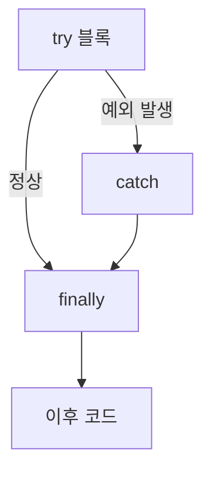

분야 핵심 개념을 얕고 넓게 정리한 노트. 쓱 훑어보며 복습한다.

## 값 타입 vs 참조 타입

struct는 값 타입(`=`에서 값 복사), class는 참조 타입(같은 객체 공유). 그래서 복사 후 한쪽만 바꾸면 struct는 원본이 유지되고 class는 함께 변함.

<svg viewBox="0 0 340 185" width="340" style="max-width:100%;height:auto" xmlns="http://www.w3.org/2000/svg" role="img" aria-label="값 타입은 복사되고 참조 타입은 공유된다"><defs><marker id="vr-a" markerWidth="8" markerHeight="8" refX="6" refY="3" orient="auto"><path d="M0,0L6,3L0,6Z" fill="#4f83e0"/></marker></defs><text x="80" y="22" font-size="12" fill="currentColor" opacity="0.7" text-anchor="middle">struct — 값 복사</text><g fill="none" stroke="currentColor" opacity="0.65"><rect x="28" y="40" width="104" height="36" rx="4"/><rect x="28" y="92" width="104" height="36" rx="4"/></g><text x="80" y="63" font-size="13" fill="currentColor" text-anchor="middle">a  { hp:10 }</text><text x="80" y="115" font-size="13" fill="currentColor" text-anchor="middle">b  { hp:10 }</text><text x="80" y="150" font-size="11" fill="currentColor" opacity="0.6" text-anchor="middle">서로 독립</text><line x1="162" y1="30" x2="162" y2="158" stroke="currentColor" opacity="0.2"/><text x="258" y="22" font-size="12" fill="currentColor" opacity="0.7" text-anchor="middle">class — 참조 공유</text><g fill="none" stroke="currentColor" opacity="0.65"><rect x="184" y="46" width="44" height="30" rx="4"/><rect x="184" y="104" width="44" height="30" rx="4"/><rect x="274" y="74" width="56" height="34" rx="4"/></g><text x="206" y="66" font-size="13" fill="currentColor" text-anchor="middle">a</text><text x="206" y="124" font-size="13" fill="currentColor" text-anchor="middle">b</text><text x="302" y="95" font-size="12" fill="currentColor" text-anchor="middle">{ hp:10 }</text><line x1="228" y1="61" x2="272" y2="86" stroke="#4f83e0" stroke-width="2" marker-end="url(#vr-a)"/><line x1="228" y1="119" x2="272" y2="96" stroke="#4f83e0" stroke-width="2" marker-end="url(#vr-a)"/><text x="258" y="150" font-size="11" fill="currentColor" opacity="0.6" text-anchor="middle">같은 객체 공유</text></svg>

```csharp
struct SPos { public int hp; }   class CPos { public int hp; }
var a = new SPos { hp = 10 }; var b = a; b.hp = 5;   // a.hp = 10 (독립)
var x = new CPos { hp = 10 }; var y = x; y.hp = 5;   // x.hp = 5  (공유)
```

## struct vs class의 기본 Equals

| | 기본 `Equals` | 결과 |
| --- | --- | --- |
| struct | 모든 필드 값을 비교(값 동등) | 값이 같으면 true |
| class | 참조 비교(같은 객체인지) | 다른 객체면 false |

## record와 값 동등성

`record`(및 `record struct`)는 값 동등성을 자동 구현 — 모든 프로퍼티 값이 같으면 `==`도 true(class의 기본 참조 비교와 반대). 불변 객체를 간결히 만들고, `with` 식으로 일부만 바꾼 복사본을 생성(`p with { hp = 5 }`).

```csharp
record Point(int X, int Hp);
var p = new Point(0, 10);
var q = p with { Hp = 5 };          // 일부만 바꾼 복사본
bool same = p == new Point(0, 10);  // true (값 동등)
```

| | 기본 `==` | 용도 |
| --- | --- | --- |
| class | 참조 비교 | 식별자·가변 상태 객체 |
| record | 값 비교(전 프로퍼티) | 불변 데이터, DTO |

## 연산자 오버로딩

`operator +`·`==` 등을 정의해 사용자 타입에 연산자 문법을 부여 — Vector·복소수·통화처럼 수학적 의미가 뚜렷한 값 타입에 적합. `==`를 오버로드하면 `Equals`·`GetHashCode`도 일관되게 함께 고쳐야 컬렉션이 올바로 동작. 의미가 불분명한 곳에 남용하면 오히려 읽기 어려워지므로 값 의미가 자연스러운 경우에만.

```csharp
struct Vec {
    public float x, y;
    public static Vec operator +(Vec a, Vec b) => new Vec { x = a.x + b.x, y = a.y + b.y };
}
var v = new Vec { x = 1 } + new Vec { x = 2 };   // v.x = 3
```

## ref — 참조도 값으로 복사된다

참조 타입도 파라미터로 넘기면 참조가 값으로 복사됨. 메서드 안에서 `e = new Enemy(...)`로 재할당하면 지역 복사본만 새 객체를 가리키고 원본은 안 바뀜. 내부 필드 수정(`e.hp = ...`)은 전파되지만 재할당은 전파 안 됨. 진짜 바꾸려면 `ref`.

```csharp
void Swap(Enemy e)      { e = new Enemy(); }   // 지역 복사본만 교체 → 원본 그대로
void Heal(Enemy e)      { e.hp = 100; }        // 내부 필드 수정은 전파됨
void Swap(ref Enemy e)  { e = new Enemy(); }   // ref면 진짜 원본이 교체됨
```

## out 파라미터

인자의 저장 위치 자체를 넘겨 메서드가 호출자의 변수에 직접 씀(`ref`와 유사). 메서드 안 `result = 42`가 곧 호출자 변수에 기록. `out`은 메서드 안에서 반드시 대입해야 하고, 호출 전 초기화는 불필요(기존 값은 덮어써짐).

```csharp
bool TryHalf(int n, out int result) { result = n / 2; return n % 2 == 0; }
if (TryHalf(10, out int half)) { }   // half = 5, 호출 전 초기화 불필요
```

## 배열 기본 초기화 — 값 타입 vs 참조 타입

값 타입 배열 원소는 모든 필드가 0으로 초기화됨(null 아님). 참조 타입 배열 원소는 null로 초기화됨. 그래서 struct 배열은 바로 접근 가능하지만, class 배열은 그대로 접근하면 `NullReferenceException`.

```csharp
var s = new SPos[2];   // 원소 { hp:0 } — 바로 접근 가능
var c = new CPos[2];   // 원소 null — c[0].hp 접근 시 NullReferenceException
```

## 값 타입이 힙에 저장되는 경우

"값 타입 = 스택"은 부정확. 박싱됐을 때, 클래스(참조 타입)의 필드일 때(객체 안에 함께 저장), 값 타입 배열의 원소일 때(배열 자체가 힙 객체) 힙에 삶.

## 박싱(boxing)

값 타입을 object로 변환할 때 힙에 할당 → GC 부담. `Debug.Log(int)`처럼 값 타입을 object 파라미터로 넘길 때 발생. 문자열(참조 타입)을 넘기면 박싱 없음. 핵심 핫 패스에선 로그·박싱을 피할 것.

```csharp
int n = 42;
object o = n;      // 박싱 — 힙에 복사본 할당
int m = (int)o;    // 언박싱
Debug.Log(n);      // int가 object 파라미터로 → 박싱 발생
```

## Span과 stackalloc

`Span<T>`는 배열·문자열의 일부를 복사 없이 가리키는 뷰. `Substring` 대신 `Slice`로 부분을 잘라 쓰면 힙 할당·복사를 피함. `stackalloc`으로 스택에 임시 버퍼를 잡으면 GC 대상이 아님. 파싱·버퍼 처리 핫 패스에서 할당을 없애는 데 씀.

<svg viewBox="0 0 340 115" width="340" style="max-width:100%;height:auto" xmlns="http://www.w3.org/2000/svg" role="img" aria-label="Span은 배열의 일부를 복사 없이 가리키는 뷰"><g font-size="14" fill="currentColor" text-anchor="middle"><rect x="20" y="42" width="44" height="38" rx="4" fill="none" stroke="currentColor" opacity="0.6"/><text x="42" y="67">3</text><rect x="66" y="42" width="44" height="38" rx="4" fill="none" stroke="currentColor" opacity="0.6"/><text x="88" y="67">1</text><rect x="112" y="42" width="44" height="38" rx="4" fill="#4f83e0" fill-opacity="0.12" stroke="#4f83e0"/><text x="134" y="67">4</text><rect x="158" y="42" width="44" height="38" rx="4" fill="#4f83e0" fill-opacity="0.12" stroke="#4f83e0"/><text x="180" y="67">1</text><rect x="204" y="42" width="44" height="38" rx="4" fill="#4f83e0" fill-opacity="0.12" stroke="#4f83e0"/><text x="226" y="67">5</text><rect x="250" y="42" width="44" height="38" rx="4" fill="none" stroke="currentColor" opacity="0.6"/><text x="272" y="67">9</text></g><path d="M112 34 L112 28 L248 28 L248 34" fill="none" stroke="#4f83e0" stroke-width="1.6"/><text x="180" y="22" font-size="12" fill="#4f83e0" text-anchor="middle">Span — 복사 없이 참조</text><text x="20" y="104" font-size="12" fill="currentColor" opacity="0.7">AsSpan(2, 3) — 원본 배열의 일부를 그대로 가리킴</text></svg>

```csharp
int[] arr = { 3, 1, 4, 1, 5, 9 };
Span<int> mid = arr.AsSpan(2, 3);      // {4,1,5} — 복사 없는 뷰
Span<byte> buf = stackalloc byte[64];  // 스택 버퍼, GC 대상 아님
```

## Index·Range 연산자

`^`(끝 기준 인덱스)와 `..`(범위)로 컬렉션 일부를 간결히 지목. `a[^1]`은 마지막 원소, `a[2..5]`는 인덱스 2부터 4까지. 배열에 `..`를 쓰면 새 배열이 복사되지만, `Span`·`ReadOnlySpan`에 쓰면 복사 없는 슬라이스라 할당이 없음. 파싱·버퍼 처리에서 Span과 함께 쓰면 부분 접근이 깔끔하고 저비용.

```csharp
int[] a = { 10, 20, 30, 40, 50 };
a[^1];             // 50 (마지막)
a[2..4];           // {30, 40} — 새 배열 복사
a.AsSpan()[2..4];  // {30, 40} — 복사 없는 슬라이스
```

## 세대별 GC

힙을 Gen0/1/2로 나눔. Gen0이 빠른 이유는 최근 할당된 작은 영역만 스캔하면 되고, 대부분의 객체는 금방 죽어(generational hypothesis) 적은 일로 많이 회수하기 때문. 수집에서 살아남으면 상위 세대로 승격돼 덜 자주 수거됨. 매 프레임 임시 할당이 많으면 Gen0이 자주 차 GC가 잦아짐.


## virtual/override vs new

`override`는 가상 디스패치라 실제 객체 타입 기준으로 호출됨. `new`는 메서드를 숨겨서(hide) 컴파일 타임(선언) 타입 기준으로 호출됨. `Animal a = new Cat()`에서 Cat이 `new`면 Animal의 메서드가 불림.

```csharp
class Animal { public virtual string V() => "A"; public string N() => "A"; }
class Cat : Animal { public override string V() => "C"; public new string N() => "C"; }
Animal a = new Cat();
a.V();   // "C" — override는 런타임 타입 기준
a.N();   // "A" — new는 선언 타입 기준
```

## 추상 메서드 디스패치

부모(추상 클래스)의 `DealDamage`가 추상 `Attack()`을 호출하면, 가상 디스패치로 실제 런타임 타입의 오버라이드가 불림. Enemy 참조로 호출해도 고블린이면 고블린의 `Attack`이 실행 → 다형성.

```csharp
abstract class Enemy { public abstract void Attack();
    public void DealDamage() => Attack(); }         // 가상 디스패치
class Goblin : Enemy { public override void Attack() { /* ... */ } }
Enemy e = new Goblin();
e.DealDamage();   // Goblin.Attack 실행
```

## 추상 클래스 vs 인터페이스

| | 상속 | 가질 수 있는 것 | 의미 |
| --- | --- | --- | --- |
| 추상 클래스 | 단일 상속 | 필드·생성자·공통 구현 | "종류(is-a)" |
| 인터페이스 | 다중 구현 | 기능 계약 | "can-do" |

공통 상태·구현을 공유하면 추상 클래스, 무관한 클래스들이 같은 기능을 가지면 인터페이스.

## 생성자 실행 순서

상속 관계에서 자식 생성자는 본문 전에 부모 생성자를 암묵 호출 → 부모 생성자가 먼저 실행되고 자식 생성자가 나중. 부모가 완전히 초기화된 뒤 자식이 동작.

```csharp
class A { public A() => Console.Write("A"); }
class B : A { public B() => Console.Write("B"); }
new B();   // "AB" — 부모 먼저
```

## static 필드

static은 클래스당 하나라 모든 인스턴스가 공유. 인스턴스 필드는 객체별로 따로. `id = ++total`이면 `a.id = 1`, `b.id = 2`, `total = 2`.

```csharp
class E { static int total; public int id = ++total; }
var a = new E(); var b = new E();   // a.id=1, b.id=2, total=2
```

## yield return과 지연 실행

`GetNumbers()` 호출 시점엔 본문이 전혀 안 돎(이터레이터 객체만 생성). foreach가 `MoveNext()`를 부를 때마다 다음 `yield`까지 한 조각씩 실행됨. 컴파일러가 메서드를 state 변수 기반 switch문(상태 기계)으로 변환하기 때문. foreach가 없으면 본문은 영영 실행 안 됨(호출 ≠ 실행).

```csharp
IEnumerable<int> Nums() { Console.Write("start"); yield return 1; yield return 2; }
var it = Nums();            // 아무것도 안 찍힘 (본문 미실행)
foreach (var n in it) { }   // 여기서 "start" 찍고 1, 2를 하나씩
```

## LINQ 지연 실행(deferred execution)

`Where`·`Select` 같은 LINQ 쿼리는 정의 시점엔 안 돌고, `foreach`·`ToList`·`Count` 등으로 열거할 때 비로소 실행됨(yield 기반). 그래서 쿼리를 만든 뒤 원본 컬렉션이 바뀌면 결과도 바뀌고, 같은 쿼리를 두 번 열거하면 두 번 계산됨. 결과를 고정하거나 반복 사용하려면 `ToList()`로 즉시 실체화.

```csharp
var q = list.Where(x => x > 0);   // 아직 실행 안 됨
list.Add(5);
q.Count();               // 이 시점에 평가 → 추가된 5도 반영
var snapshot = q.ToList();  // 즉시 실체화로 결과 고정
```

## 순회 중 컬렉션 수정

`foreach`로 순회하는 도중 `Add`/`Remove`로 컬렉션 크기를 바꾸면 `InvalidOperationException`. 열거자가 "보던 게 바뀜"을 감지해 예외를 던짐 → 이후 코드 미실행. 해법은 for 역순 루프, 복사본 순회, 또는 `RemoveAll(조건)`.

```csharp
foreach (var x in list) list.Remove(x);       // InvalidOperationException
for (int i = list.Count - 1; i >= 0; i--)     // 역순 for는 안전
    if (IsDead(list[i])) list.RemoveAt(i);
list.RemoveAll(IsDead);                        // 또는 이 한 줄
```

## 멀티캐스트 델리게이트 반환값

`f +=` 로 여러 함수를 묶으면 다 실행되지만 반환값은 마지막 것만 남고 앞의 것들은 버려짐. `Func<int>`에 1, 2, 3을 묶어 호출하면 3.

```csharp
Func<int> f = () => 1;
f += () => 2;
f += () => 3;
int r = f();   // 3 — 마지막 것만, 앞의 1·2는 버려짐
```

## delegate vs event

`event`는 외부에서 `+=`/`-=` 구독·해지만 가능하고 호출은 선언한 클래스에서만 가능. public delegate는 외부에서 직접 호출하거나 `=`로 구독 목록을 덮어쓸 수 있어 위험. 그래서 `event`가 안전.

```csharp
public event Action OnHit;   // 외부에서는 OnHit += / -= 만 가능
// 외부: OnHit();  → 불가 (호출은 선언 클래스만)
// 외부: OnHit = null;  → 불가 (구독 목록 덮어쓰기 방지)
```

## for 루프 클로저

`for (int i...)`의 람다는 변수 i 자체를 캡처(공유). 루프는 i가 (마지막 사용값 2가 아니라) 3이 되어 끝나므로 람다 실행 시 모두 3 3 3을 출력. 고치려면 루프 안에서 지역 변수에 복사한 뒤 그걸 캡처.

```csharp
var acts = new List<Action>();
for (int i = 0; i < 3; i++)
    acts.Add(() => Console.Write(i));   // i를 공유 캡처
foreach (var a in acts) a();            // 3 3 3

for (int i = 0; i < 3; i++) {
    int copy = i;                       // 반복마다 새 지역 변수
    acts.Add(() => Console.Write(copy));
}                                       // 0 1 2
```

## 로컬 함수 vs 람다

메서드 안에 이름 있는 함수를 두는 로컬 함수는, 델리게이트 객체를 만드는 람다와 달리 힙 할당·델리게이트 호출 오버헤드가 없음(캡처가 없으면 특히). 재귀·이터레이터 분리·인자 검증 분리에 적합하고, 캡처한 지역 변수를 `ref`로도 다룰 수 있음. 이벤트 구독처럼 델리게이트 인스턴스 자체가 필요한 자리엔 람다가 맞음.

```csharp
int Square(int x) => x * x;        // 로컬 함수 — 캡처 없으면 힙 할당 없음
Func<int, int> sq = x => x * x;    // 람다 — 델리게이트 객체 생성
```

## 문자열 불변성과 StringBuilder

문자열은 불변이라 `Replace`·`ToUpper`는 원본을 안 바꾸고 새 문자열을 반환. 반환값을 안 받으면 원본은 그대로라 `s = s.Replace(...)`가 필요. 불변인 이유는 보안, 해시 키 캐싱, 멀티스레드 안전.

`+=`로 반복 연결하면 매번 전체를 복사해 전체 O(n²)이고 객체도 많이 생김. `StringBuilder`는 가변 버퍼라 O(n).

```csharp
string s = "abc";
s.ToUpper();          // 반환값 안 받으면 s는 그대로 "abc"
s = s.ToUpper();      // "ABC"

var sb = new StringBuilder();
for (int i = 0; i < n; i++) sb.Append(i);   // O(n) — += 반복은 O(n²)
string result = sb.ToString();
```

## 확장 메서드

기존 타입(수정할 수 없는 것 포함)에 인스턴스 메서드처럼 보이는 static 메서드를 덧붙임. static 클래스의 static 메서드 첫 인자에 `this`를 붙이면 그 타입의 메서드처럼 호출 가능. LINQ 전체가 `IEnumerable<T>`의 확장 메서드이고, 유니티에서 Transform·Vector 유틸을 붙일 때 흔히 씀. 실제 타입을 안 건드리므로 private 멤버엔 접근 못 함.

```csharp
static class StringExt {
    public static bool IsEmpty(this string s) => s.Length == 0;
}
"".IsEmpty();   // 인스턴스 메서드처럼 호출
```

## 제네릭 where 제약

제약이 없으면 컴파일러가 T를 object 수준으로만 취급 → object의 멤버만 보장돼 `CompareTo` 호출 불가. `where T : IComparable<T>`를 걸면 모든 T가 `CompareTo`를 가짐이 보장돼 호출 가능. 제약은 T의 멤버·기능을 컴파일러에게 약속하는 것.

```csharp
T Max<T>(T a, T b) where T : IComparable<T>
    => a.CompareTo(b) >= 0 ? a : b;   // 제약이 없으면 CompareTo 호출 불가
```

## 제네릭 공변성·반공변성(in/out)

`IEnumerable<out T>`는 공변 — `IEnumerable<Cat>`을 `IEnumerable<Animal>`에 대입 가능(T를 꺼내기만 해 안전). `Action<in T>`는 반공변 — `Action<Animal>`을 `Action<Cat>`에 대입 가능(T를 받기만 함). `out`은 반환 위치, `in`은 입력 위치에만 T가 쓰일 때 허용. `List<T>` 같은 가변 컬렉션은 넣고 빼기를 다 해 불변(둘 다 불가).

```csharp
IEnumerable<Animal> a = new List<Cat>();   // 공변(out T): Cat → Animal 대입 OK
Action<Animal> printAny = x => { };
Action<Cat> onCat = printAny;              // 반공변(in T): Animal → Cat 대입 OK
```

## 리플렉션과 어트리뷰트

리플렉션은 런타임에 타입의 메타데이터(필드·메서드·어트리뷰트)를 읽고 동적으로 호출. 어트리뷰트는 코드에 붙이는 선언적 메타데이터(`[SerializeField]`, `[Obsolete]`)로, 리플렉션으로 읽어 동작을 바꿈 — 유니티 인스펙터·직렬화·테스트 프레임워크가 이 방식. 유연하나 느리고 컴파일 타임 검사를 우회하므로 핫 패스에선 캐싱하거나 소스 제너레이터로 대체.

## as vs 형변환 캐스트

`as`는 실패 시 null을 반환하고 예외가 없으며, 참조 타입·Nullable에만 사용 가능. `(Type)` 캐스트는 실패 시 `InvalidCastException`.

```csharp
var e = obj as Enemy;   // 실패 시 null (예외 없음)
var f = (Enemy)obj;     // 실패 시 InvalidCastException
```

## 패턴 매칭

`is`·`switch` 식으로 타입·구조·값을 한 번에 검사·분해. `if (obj is Enemy e)`는 형 검사와 변수 바인딩을 동시에, `switch { > 90 => "A", … }`는 값 범위를, `(0, var y)`는 튜플을 분해. if/switch로 타입을 분기하던 코드를 간결·안전하게. 단 다형성(가상 디스패치)으로 풀 수 있으면 그쪽이 우선.

```csharp
if (obj is Enemy e) e.Hit();   // 형 검사 + 변수 바인딩 동시에
string grade = score switch { > 90 => "A", > 80 => "B", _ => "C" };
```

## 튜플과 분해

`(int, string)` 값 튜플(`ValueTuple`)은 이름 붙인 여러 값을 가벼운 값 타입으로 묶어 반환 — 임시 클래스나 여러 개의 out을 대신. `var (id, name) = GetUser()`로 분해해 받고, 필드명을 주면 `.min`·`.max`처럼 접근. 옛 `Tuple`(참조 타입, `.Item1`)과 달리 값 타입이라 할당이 없고, 사용자 타입도 `Deconstruct`를 정의하면 같은 분해 문법을 지원.

```csharp
(int min, int max) Range(int[] a) => (a.Min(), a.Max());
var (lo, hi) = Range(nums);   // 분해해서 받기
var r = Range(nums); r.min;   // 이름으로 접근
```

## 열거형과 [Flags]

enum은 이름 붙인 정수 상수 집합이라 매직 넘버 대신 의미를 드러냄. `[Flags]`를 붙이고 값을 1, 2, 4, 8…로 주면 비트 OR로 여러 상태를 한 변수에 조합(`Fire | Ice`)하고 AND로 검사 — 상태 효과·LayerMask가 이 방식. 기본 밑 타입은 int이나 지정 가능하고, 정의 안 된 정수값도 담길 수 있어 검증이 필요.

```csharp
[Flags] enum Eff { None = 0, Fire = 1, Ice = 2, Stun = 4 }
var e = Eff.Fire | Eff.Ice;          // 조합
bool onFire = (e & Eff.Fire) != 0;   // 검사
```

## 정수 나눗셈

`25 / 4`는 둘 다 int라 정수 나눗셈으로 6 → float에 대입돼도 6.0. `1 / 3 * 100f`는 `1/3`이 먼저 int 0이 된 뒤 ×100f → 0. 나눗셈이 int끼리 먼저 평가되는 게 함정. 고치려면 `(float)`로 캐스팅.

```csharp
float a = 25 / 4;               // int끼리 나눠 6 → 6.0
float b = 1 / 3 * 100f;         // (1/3)=0 먼저 → 0
float c = (float)1 / 3 * 100f;  // 33.33
```

## 정수 오버플로

`int`는 부호 1비트 + 값 31비트. `int.MaxValue` = 2³¹−1(2,147,483,647). +1하면 오버플로로 감싸져 `int.MinValue` = −2³¹. 비트로 `0111...111` → `1000...000`.

```csharp
int max = int.MaxValue;   //  2,147,483,647
int wrap = max + 1;       // -2,147,483,648 (int.MinValue)
```

## const vs readonly

| | 확정 시점 | 쓸 수 있는 값 | 함정 |
| --- | --- | --- | --- |
| `const` | 컴파일 타임 | 리터럴/불변값 전용 | 사용처에 값이 인라인됨 → 라이브러리 const를 참조하는 쪽이 재컴파일 안 하면 옛값 유지 |
| `readonly` | 런타임(선언/생성자) | 인스턴스별 값, 참조 타입도 가능 | 참조 타입은 재할당만 막고 객체 내부는 변경 가능 |

## ?? 와 ?. 연산자

`??`(null 병합)는 좌변이 null이면 우변 반환. `?.`(null 조건부)는 좌변이 null이면 평가를 멈추고 null 반환. `a`가 null일 때 `a ?? "default"` → `"default"`, `a?.Length` → null(`int?`로 받음).

```csharp
string a = null;
a ?? "default";   // "default"
a?.Length;        // null (int? 로 받음)
```

## nullable 참조 타입(#nullable)

참조 타입도 `string?`처럼 null 허용 여부를 타입에 표기해, 컴파일러가 null 가능성을 흐름 분석으로 경고. `string`은 non-null 의도라 null 대입·미초기화에 경고가 뜨고, `string?`은 역참조 전에 null 검사를 요구. 런타임 강제가 아니라 컴파일 타임 경고라 `!`(null 무시 연산자)로 끌 수 있음. NullReferenceException을 설계 단계에서 줄이는 장치.

```csharp
string s = null;    // 경고: non-null 타입에 null 대입
string? t = null;   // OK — 역참조 전 null 검사를 요구
int len = t!.Length;  // ! 로 경고 무시(책임은 개발자)
```

## async/await와 Task

`async` 메서드는 `await`를 만나면 그 지점에서 제어를 호출자에게 돌려주고, 기다리던 작업이 끝나면 이어서 실행 — 스레드를 붙잡지 않아 UI·서버가 안 멈춤. 컴파일러가 메서드를 상태 기계로 변환(yield와 같은 원리). `Task`는 진행 중이거나 완료될 작업의 핸들. async void는 예외를 못 잡으니 이벤트 핸들러 외엔 `Task`를 반환하고, 무작정 `.Result`/`.Wait()`로 기다리면 교착(deadlock) 위험.

```csharp
async Task<int> LoadAsync() {
    var data = await FetchAsync();   // 여기서 제어 반환, 완료 후 이어서 실행
    return data.Length;
}
// async void는 예외를 못 잡음, .Result / .Wait() 는 교착 위험
```

## lock과 스레드 안전 컬렉션

`lock(obj)`은 한 번에 한 스레드만 임계 구역에 들이는 문법 설탕(Monitor.Enter/Exit) — 공유 상태 갱신을 감쌈. 잠글 객체는 외부에 노출 안 된 전용 인스턴스를 쓰고, `this`·타입 객체 잠금은 피함. 잦은 동시 접근엔 락 대신 `ConcurrentDictionary`·`ConcurrentQueue` 같은 스레드 안전 컬렉션이나 `Interlocked`가 경합을 줄여 유리.

```csharp
private readonly object gate = new();
lock (gate) { balance += amount; }   // 전용 객체로 잠금 — this·타입 잠금은 피함
```

## 예외 처리 — try/catch/finally

`try`에서 예외가 나면 그 지점부터 남은 코드를 건너뛰고 맞는 `catch`로 점프, `finally`는 정상·예외에 상관없이 항상 실행돼 자원을 해제. `catch`는 구체 타입부터 잡고, 빈 catch로 삼키지 말고 처리·로깅·재던지기. `using`이 곧 try/finally의 축약.

```csharp
try { Risky(); }
catch (IOException e) { Log(e); }   // 구체 타입부터
finally { Cleanup(); }              // 정상·예외 무관 항상 실행
```



## IDisposable과 using

GC는 관리 메모리만 회수하고 비관리 리소스(파일 핸들, 소켓, 네이티브 메모리 등)는 못 챙김. GC 시점도 비결정적. `IDisposable`로 직접 해제하고, `using`으로 예외 상황에서도 `Dispose` 호출을 보장.

```csharp
using (var f = File.OpenRead(path)) { /* ... */ }   // 예외에도 Dispose 보장
using var g = File.OpenRead(path);                   // C# 8 축약(스코프 끝에 해제)
```
