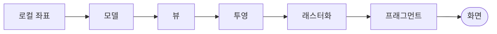

분야 핵심 개념을 얕고 넓게 정리한 노트. 쓱 훑어보며 복습한다.

## 모델 → 뷰 → 투영 변환

| 단계 | 하는 일 |
| --- | --- |
| 모델 | 로컬 좌표를 월드의 실제 위치·회전·크기로 배치 |
| 뷰 | 월드를 카메라 기준으로(카메라가 원점서 정면 보도록) |
| 투영 | 3D를 2D 화면으로(원근/직교), 절두체를 표준 정육면체로 |

왜 분리하나 — 각 단계를 독립 교체·재사용 가능. 카메라만 움직이면 뷰 행렬만, 오브젝트만 움직이면 모델 행렬만 바꾸면 됨.

## UV 매핑

3D 메시 표면을 2D 텍스처에 펼치는 과정. 각 버텍스에 텍스처 좌표(u, v)를 대응시켜, GPU가 각 픽셀에 텍스처의 어느 텍셀을 쓸지 알게 함.

## 텍스처 래핑·주소 모드

UV가 0에서 1 밖으로 나갔을 때 텍셀을 어떻게 정할지의 규칙. Repeat는 무늬를 타일처럼 반복(바닥·벽), Clamp는 가장자리 텍셀을 늘려 이음매·번짐을 막음(스카이·그라디언트), Mirror는 뒤집어 반복해 경계를 매끄럽게. 아틀라스·타일맵에서 Clamp와 Repeat를 잘못 고르면 옆 타일이 새어 드는 경계 누출이 생김.

## 정점 셰이더 vs 프래그먼트 셰이더

| | 하는 일 | 실행 횟수 |
| --- | --- | --- |
| 정점 셰이더 | 각 정점 처리(3D → 화면 좌표 변환 등) | 정점당 1번 |
| 프래그먼트 셰이더 | 래스터화된 픽셀의 최종 색 결정 | 픽셀(프래그먼트)당 1번 |

삼각형 하나가 정점 3개인데 수천 픽셀을 덮으니 프래그먼트가 훨씬 많이 실행됨. 그래서 무거운 연산은 정점 셰이더에 두고 결과를 보간해 쓰는 게 유리하고, 오버드로우를 줄이는 게 크리티컬.

## 삼각형 래스터화와 무게중심 보간

래스터화는 삼각형을 덮는 픽셀을 찾아 프래그먼트를 만드는 단계. 각 픽셀에서 정점 속성(색·UV·법선)은 세 정점까지의 무게중심 좌표(barycentric)로 가중 보간됨 — 정점에서 정한 값이 삼각형 내부에 매끄럽게 퍼짐. 원근 보정을 안 하면 기울어진 면의 텍스처가 뒤틀리므로 깊이로 나눠 보정(perspective-correct).

<svg viewBox="0 0 300 175" width="300" style="max-width:100%;height:auto" xmlns="http://www.w3.org/2000/svg" role="img" aria-label="삼각형 내부 점은 세 정점 값의 무게중심 가중 보간"><polygon points="150,28 58,140 250,140" fill="none" stroke="currentColor" stroke-width="1.5" opacity="0.5"/><line x1="150" y1="95" x2="150" y2="28" stroke="currentColor" stroke-dasharray="3 3" stroke-width="1" opacity="0.5"/><line x1="150" y1="95" x2="58" y2="140" stroke="currentColor" stroke-dasharray="3 3" stroke-width="1" opacity="0.5"/><line x1="150" y1="95" x2="250" y2="140" stroke="currentColor" stroke-dasharray="3 3" stroke-width="1" opacity="0.5"/><circle cx="150" cy="28" r="5" fill="#e2574c"/><circle cx="58" cy="140" r="5" fill="#3fae7a"/><circle cx="250" cy="140" r="5" fill="#4f83e0"/><circle cx="150" cy="95" r="4" fill="currentColor"/><text x="150" y="88" font-size="12" fill="currentColor" text-anchor="middle">P</text><text x="20" y="165" font-size="12" fill="currentColor" opacity="0.75">P의 값 = 세 정점 값을 거리 비중(무게중심)으로 가중 보간</text></svg>

## 테셀레이션·지오메트리 셰이더

정점·프래그먼트 사이에 낀 선택 단계로, GPU에서 지오메트리를 생성·증식. 테셀레이션은 패치를 잘게 쪼개 정점을 늘려 가까울수록 곡면·변위를 디테일하게(원경은 적게). 지오메트리 셰이더는 프리미티브 하나를 받아 정점을 더하거나 없애 새 프리미티브를 방출(외곽선·풀·파티클)하나, 실측 성능이 나빠 많은 파이프라인이 컴퓨트 셰이더로 대체. 정점 증식은 정점 셰이더로는 못 하는 일.

## 드로우콜

CPU가 GPU에 "이 메시를 이 머티리얼로 그려라"라고 보내는 요청. 셰이더·머티리얼 상태 설정과 명령 버퍼 작성 오버헤드가 CPU에 걸리므로, 드로우콜이 많으면 GPU는 놀고 CPU가 허덕이는 CPU 바운드가 됨. 머티리얼이 다르면 콜이 그만큼 늘어남. 줄이는 방법은 같은 머티리얼로 묶어 배칭·GPU 인스턴싱하기, 텍스처 아틀라스로 머티리얼 수 줄이기.

## 깊이 버퍼 — 불투명은 순서 무관

픽셀마다 지금까지 본 것 중 가장 가까운 깊이를 저장, 그보다 멀면 무시(Z-test). 프래그먼트가 어떤 순서로 도착하든 픽셀별 최종 승자(가장 앞)는 동일 → 불투명은 그리는 순서 무관.

## Z-fighting

거의 같은 깊이의 두 면을 깊이 버퍼 정밀도가 구분 못 해 깜빡이는 현상. 깊이 정밀도는 카메라에서 멀수록 나빠짐. 해결은 간격 띄우기, near 평면을 너무 가깝게 안 두기(far/near 비율 줄이기), 깊이 오프셋.

## 스텐실 버퍼

픽셀마다 정수 태그를 저장하는 화면 크기 버퍼. 그리기 전 스텐실 값을 기준으로 통과·기각을 정해 "어디에 그릴지"를 마스킹함. 특정 영역에만 렌더(포털·거울·UI 마스크), 아웃라인(오브젝트를 스텐실에 찍고 살짝 키운 실루엣을 그 밖에만 그림), 데칼 제한 등에 쓰임. 깊이 테스트와 함께 프래그먼트 단위로 동작.

## 반투명 렌더링 순서

불투명은 깊이 버퍼로 가려진 픽셀을 버려 순서가 자유롭지만, 반투명은 뒤 배경에 블렌딩되므로 순서가 곧 결과. 블렌딩은 교환법칙이 성립 안 해서 "이미 그려진 뒤 색 위에 앞 색을 alpha 비율로 덧칠"하는 계산이 뒤가 먼저 깔려 있어야 성립함. 그래서 불투명을 다 그린 뒤, 반투명끼리는 앞→뒤가 아니라 뒤에서 앞(back-to-front)으로 그림. 보통 깊이 쓰기(ZWrite)도 끔.

## 알파 블렌딩 vs 알파 테스트

| | 방식 | 특징 |
| --- | --- | --- |
| 알파 블렌딩 | 뒤 색과 alpha 비율로 섞음 | 반투명(유리·연기), 정렬 필요·ZWrite 끔 |
| 알파 테스트(컷아웃) | alpha 임계값 미만 픽셀을 버림 | 불투명 취급이라 순서 무관·그림자 정상, 경계가 딱딱 |

나뭇잎·울타리처럼 구멍 뚫린 불투명은 컷아웃이 적합 — 픽셀을 통째로 버려 깊이·정렬 문제를 피함. 부드러운 반투명은 블렌딩이 필요하지만 정렬·오버드로우 비용이 붙음.

## 오버드로우

같은 픽셀을 여러 번 덧칠하는 것. 불투명은 깊이 버퍼로 가려진 게 일찍 버려져 적음. 반투명은 뒤가 비쳐야 해 깊이 버퍼로 못 버리고 겹친 것을 다 그려 색을 섞음(블렌딩). 파티클·이펙트가 화면을 겹쳐 덮으면 한 픽셀이 수십 번 칠해져 프레임 급락. 파티클 수·크기·겹침을 줄여 대응.

## Z 프리패스(뎁스 프리패스)

색을 칠하기 전에 깊이만 먼저 한 번 렌더해 깊이 버퍼를 채우는 사전 패스. 본 컬러 패스에서는 이미 가려진 프래그먼트가 Z-test로 일찍 탈락해, 비싼 픽셀 셰이더를 가장 앞 표면에만 실행 → 불투명 오버드로우 낭비를 제거. 대가는 지오메트리를 두 번 그리는 정점 비용이라, 픽셀 셰이더가 무거운 씬에서 이득이 큼. 반투명은 이 방식으로 못 걸러냄.

## 프러스텀 컬링

카메라 시야(절두체) 밖 오브젝트는 렌더링에서 제외. 드로우콜 전에 걸러내 CPU(드로우콜 준비)·GPU(정점·프래그먼트) 양쪽 비용 절감.

## 백페이스 컬링

카메라를 등진 삼각형(뒷면)을 그리지 않아 처리할 삼각형·프래그먼트 수를 줄임(드로우콜이 아니라 처리량을 줄이는 것). 판별은 보통 화면 투영된 정점의 감김 순서(winding order)로 하며, 법선·시선 내적 부호와 같은 결과.

## LOD(Level of Detail)

멀면 화면에서 작아져 디테일이 안 보이니 단순 메시로 교체. 단순 메시는 정점·삼각형 수가 적어 GPU 정점 처리량·메모리 대역폭 절감. 작게 보이는 물체에 풀디테일은 픽셀당 수많은 삼각형을 헛계산하는 낭비.

## 빌보드와 임포스터

빌보드는 항상 카메라를 향하는 사각형에 텍스처를 붙여, 멀리 있는 나무·풀·연기를 폴리곤 없이 표현. 임포스터는 3D 모델을 여러 각도에서 미리 렌더해둔 텍스처로, 원경에서 실제 메시 대신 각도에 맞는 그림을 보여줌. LOD의 극단으로, 실루엣이 중요치 않을 만큼 작아진 물체의 정점 비용을 거의 0으로 낮춤. 가까워지면 실제 메시로 교체.

## 밉맵과 텍스처 필터링

미리 만들어둔 축소 버전 텍스처. 멀리 있는 면은 한 픽셀이 여러 텍셀을 덮는데, 밉맵 없이 그중 몇 개만 샘플링하면 카메라가 조금만 움직여도 찍히는 텍셀이 들쭉날쭉해 지글거림·모아레가 생김(언더샘플링/에일리어싱). 밉맵은 미리 평균낸 축소본을 거리별로 골라 써 샘플링을 안정시키고, 작은 텍스처라 텍스처 캐시 효율도 좋아짐. 단점은 메모리 약 33% 증가.

필터링은 Bilinear가 주변 4텍셀 보간, Trilinear가 거기에 밉맵 레벨 간 보간을 더해 레벨 경계를 부드럽게 함.

## 안티에일리어싱 (MSAA / FXAA / TAA)

폴리곤 경계의 계단 현상(에일리어싱)을 완화. 밉맵이 텍스처 안쪽 에일리어싱을 다룬다면 AA는 실루엣 경계를 다룸.

| 기법 | 방식 | 특징 |
| --- | --- | --- |
| MSAA | 경계 픽셀만 여러 서브샘플로 커버리지 계산 | 품질 좋음, 비쌈, 디퍼드와 상성 나쁨 |
| FXAA | 렌더 후 이미지에서 경계를 찾아 블러 | 싸고 빠름, 전체가 살짝 뭉개짐 |
| TAA | 프레임마다 살짝 흔들어 샘플하고 이전 프레임과 누적 | 저비용 고품질, 움직임에서 잔상·번짐 |

## 텍스처 압축 (BC / ASTC / ETC)

GPU가 압축된 채로 직접 샘플링하는 블록 기반 포맷. JPEG처럼 풀어 쓰는 게 아니라 블록 단위로 실시간 디코드 → VRAM 사용량·대역폭을 크게 줄임. 데스크톱은 BC(DXT) 계열, 모바일은 ASTC·ETC를 씀(플랫폼마다 지원 포맷이 달라 빌드 타깃별로 선택). 손실 압축이라 노멀맵·UI 등은 아티팩트에 주의.

## 노멀 맵(Normal Map)

폴리곤을 안 늘리고 라이팅을 속여 굴곡을 표현. 텍스처 픽셀에 색 대신 법선 방향을 저장(RGB → 법선 xyz, 그래서 푸르스름). 라이팅 시 평면의 진짜 법선 대신 노멀 맵 법선으로 `dot(N, L)` 계산 → 픽셀마다 밝기가 달라져 입체로 보임. 한계는 실루엣·자기 그림자가 그대로라는 것(비스듬히 보면 평평함이 들통). 더 정교한 건 패럴랙스·변위 매핑.

## 디퓨즈 라이팅과 내적

밝기 = `max(0, dot(N, L))`. 단위 벡터 N·L이 사이각의 cos이므로, 정면(각 0°)이면 1로 최대, 스칠수록(90°) 0, 뒤(90° 초과)면 음수라 0으로 클램프. 비스듬히 닿으면 빛이 넓은 면적에 퍼져 단위 면적당 에너지가 cos만큼 줄어듦(람베르트).

<svg viewBox="0 0 300 175" width="300" style="max-width:100%;height:auto" xmlns="http://www.w3.org/2000/svg" role="img" aria-label="표면 법선과 광원 방향의 각도로 밝기 결정"><defs><marker id="df-n" markerWidth="8" markerHeight="8" refX="6" refY="3" orient="auto"><path d="M0,0L6,3L0,6Z" fill="#4f83e0"/></marker><marker id="df-l" markerWidth="8" markerHeight="8" refX="6" refY="3" orient="auto"><path d="M0,0L6,3L0,6Z" fill="#e2574c"/></marker></defs><line x1="30" y1="130" x2="270" y2="130" stroke="currentColor" stroke-width="2.5" opacity="0.35"/><line x1="150" y1="130" x2="150" y2="52" stroke="#4f83e0" stroke-width="2.5" marker-end="url(#df-n)"/><text x="156" y="60" font-size="13" fill="#4f83e0">N</text><line x1="150" y1="130" x2="78" y2="60" stroke="#e2574c" stroke-width="2.5" marker-end="url(#df-l)"/><text x="66" y="58" font-size="13" fill="#e2574c">L</text><path d="M150 96 A34 34 0 0 0 122 100" fill="none" stroke="currentColor" stroke-width="1.4" opacity="0.55"/><text x="126" y="90" font-size="12" fill="currentColor" opacity="0.7">θ</text><text x="30" y="160" font-size="12" fill="currentColor" opacity="0.7">밝기 = max(0, N·L) = cos θ  (람베르트)</text></svg>

## 스페큘러 라이팅

디퓨즈는 시점 무관이지만 스페큘러 하이라이트는 반사광이 눈 쪽으로 튈 때 보임 → 시선 방향 V에 의존.

| | 계산 |
| --- | --- |
| Phong | `dot(R, V)^광택도` (R = 반사 벡터) |
| Blinn-Phong | 반벡터 `H = normalize(L + V)`로 `dot(N, H)^광택도` |

V가 들어가니 카메라가 움직이면 하이라이트도 이동.

## PBR (물리 기반 렌더링)

빛 반사를 물리 법칙(에너지 보존, 프레넬)에 맞춰 계산해, 어떤 조명 아래서도 재질이 일관되게 보이게 함. 재질을 알베도 + 메탈릭 + 러프니스로 기술하는 메탈릭·러프니스 워크플로가 표준 — 러프니스가 하이라이트 퍼짐을, 메탈릭이 금속/비금속을 가름. 아티스트가 조명마다 값을 손보던 과거와 달리 재질과 조명이 분리됨.

## 큐브맵과 환경 반사

주변 환경을 정육면체 6면 텍스처에 담아, 표면의 반사 방향으로 샘플해 비치는 풍경을 표현. 스카이박스와 금속·유리 반사가 대표 예. PBR에선 이 큐브맵을 흐림 정도별로 미리 필터링해 러프니스에 맞는 반사를 얻는 이미지 기반 라이팅(IBL)으로 간접광을 근사. 유니티의 반사 프로브가 위치별 큐브맵을 구워 지역 반사를 제공.

## 스크린 스페이스 리플렉션(SSR)

이미 렌더된 화면(색·깊이 버퍼)에서 반사 방향으로 광선을 행진시켜 반사색을 얻음 — 큐브맵과 달리 동적 물체가 실시간으로 그대로 비침. 화면에 없는(가려지거나 시야 밖) 대상은 반사할 정보가 없어, 가장자리·오프스크린에서 반사가 끊기는 게 근본 한계. 그 빈틈은 큐브맵·반사 프로브로 폴백. 물웅덩이·젖은 바닥·유리에 흔히 씀.

## 감마와 선형 색공간

모니터는 sRGB(감마) 곡선으로 출력하고 텍스처도 sRGB로 저장됨. 그런데 빛 계산(덧셈·곱셈)은 밝기가 선형이어야 맞으므로, 샘플한 sRGB 텍스처를 선형으로 풀어 계산하고 결과를 다시 sRGB로 인코딩해 출력함. 이 변환을 빼먹으면 라이팅이 뿌옇거나 과하게 어두워짐. 노멀맵·마스크처럼 색이 아닌 데이터 텍스처는 선형으로 둬야 함.

## HDR와 톤매핑

라이팅 결과는 1.0을 넘는 밝기가 자연스럽게 나옴(태양·발광). HDR 버퍼(부동소수점)에 그대로 담아 계산하고, 마지막에 톤매핑으로 0~1 범위(LDR)로 압축해 화면에 맞춤. 단순 클램프는 밝은 부분이 뭉개지므로 ACES 같은 곡선으로 하이라이트를 부드럽게 말아넣음. 블룸·노출도 이 HDR 단계에서 처리.

## 포스트 프로세싱

씬을 다 그린 뒤 최종 이미지(렌더 타겟)에 화면 공간 효과를 입히는 단계. 블룸(밝은 부분 번짐)·톤매핑·색보정·비네트·모션 블러·피사계 심도가 여기서 처리. 지오메트리와 무관하게 픽셀 단위로 동작해 씬 복잡도와 비용이 분리되나, 전체 화면을 여러 번 훑어 대역폭을 먹음. HDR 버퍼 위에서 순서대로 체인처럼 적용.

## 앰비언트 오클루전

좁은 틈·구석처럼 주변에 가려 간접광이 덜 닿는 곳을 어둡게 해 입체감을 더함. 물체 접점·주름이 자연스럽게 그늘져 형태가 또렷해짐. SSAO는 깊이 버퍼에서 각 픽셀 주변을 샘플해 얼마나 가려졌는지 실시간 추정 → 화면 공간이라 씬 복잡도와 무관하지만 경계 노이즈·헤일로가 단점.

## 섀도우 맵

광원 시점에서 가장 가까운 표면 깊이를 섀도우 맵에 저장. 카메라 픽셀을 광원 공간으로 변환해 그 깊이와 비교, 저장값보다 멀면 앞에 가리는 게 있는 것 → 그림자.

## 글로벌 일루미네이션과 라이트맵

직접광만 계산하면 그림자 속이 새까맣지만, 실제로는 빛이 벽·바닥에 튕겨 간접적으로 채움 — 이 반사광이 GI. 실시간 계산은 비싸서 정적 씬·정적 광원은 미리 계산해 라이트맵(텍스처)에 구워두고 런타임엔 샘플만 함(베이킹). 동적 물체엔 라이트 프로브로 구운 간접광을 보간해 입힘. 실시간 GI는 복셀·SDF·레이 트레이싱 기반 기법으로 근사.

## 렌더 타겟과 MRT

화면 대신 텍스처(렌더 타겟)에 그려 그 결과를 다음 단계 입력으로 씀 — 그림자 맵·반사·포스트 프로세싱·미니맵이 이 오프스크린 렌더링. MRT(다중 렌더 타겟)는 픽셀 셰이더 한 번에 색·법선·깊이를 여러 타겟에 동시에 출력 — 디퍼드의 G-buffer가 대표. 대역폭이 비싸 타겟 수·포맷·해상도를 아끼는 게 관건.

## 포워드 vs 디퍼드 렌더링

라이트를 언제 계산하느냐가 갈림.

| | 방식 | 강점 | 약점 |
| --- | --- | --- | --- |
| 포워드 | 물체를 그리며 그 자리에서 라이팅 | 투명·MSAA 자연스럽고 저사양·모바일에 유리 | 라이트 수가 늘면 물체×라이트로 비용 급증 |
| 디퍼드 | 색·법선·깊이를 G-buffer에 먼저 쓰고, 화면 픽셀 단위로 한 번에 라이팅 | 라이트 많아도 화면 픽셀 수에 비례 | G-buffer 대역폭 큼, 투명·MSAA 처리가 까다로움 |

라이트가 적으면 포워드, 동적 라이트가 많으면 디퍼드가 유리. 그 절충으로 Forward+, 타일·클러스터드 방식도 있음.

## 래스터화 vs 레이 트레이싱

래스터화는 삼각형을 화면에 투영해 픽셀을 칠하는 방식 — 빠르고 GPU 파이프라인의 기본이나, 반사·그림자·간접광은 별도 기법으로 흉내내야 함. 레이 트레이싱은 픽셀마다 광선을 쏴 부딪힌 표면을 추적 → 반사·굴절·그림자가 물리적으로 정확하지만 광선당 교차 판정이 비쌈. 실무는 래스터화를 기본으로 두고 반사·그림자 등 일부만 레이 트레이싱으로 보강하는 하이브리드가 흐름.

## 컴퓨트 셰이더

렌더 파이프라인 밖에서 GPU를 범용 병렬 계산에 쓰는 셰이더(GPGPU). 정점·픽셀 단계와 무관하게 수천 스레드로 데이터를 병렬 처리 — 파티클 시뮬레이션, 컬링, 포스트 프로세싱, 물리에. 결과를 버퍼·텍스처에 써 이후 렌더 단계에 넘김.

## 셰이더 변형과 키워드

셰이더가 키워드(기능 on/off)마다 별도 코드로 컴파일된 것이 변형(variant). 조건 조합이 늘면 변형 수가 곱으로 폭발해 빌드 시간·용량·메모리를 잡아먹음. 안 쓰는 키워드를 정리하고 `shader_feature`(안 쓰면 빌드 제외)와 `multi_compile`(런타임 전환용 전부 포함)을 구분해 씀. 첫 사용 때 컴파일되면 렉이 생겨 미리 워밍업하기도 함.

## 더블 버퍼링과 VSync

화면에 그리는 도중 그 버퍼를 바로 표시하면 위아래가 어긋나 보이는 티어링이 생김. 앞 버퍼(표시)와 뒤 버퍼(그리기)를 나눠, 다 그린 뒤 통째로 교체(swap)하면 완결된 프레임만 보임. VSync는 이 교체를 모니터 주사율에 맞춰 티어링을 없애지만, 주사율을 못 맞추면 프레임이 배수로 뚝 떨어짐(60 → 30).
