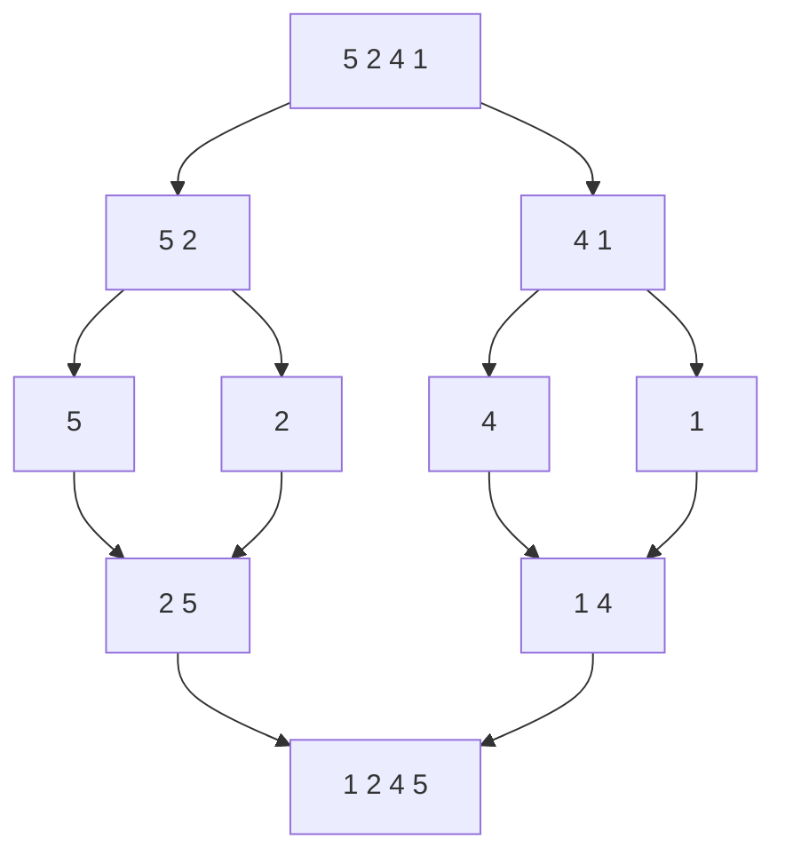
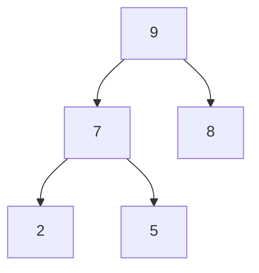
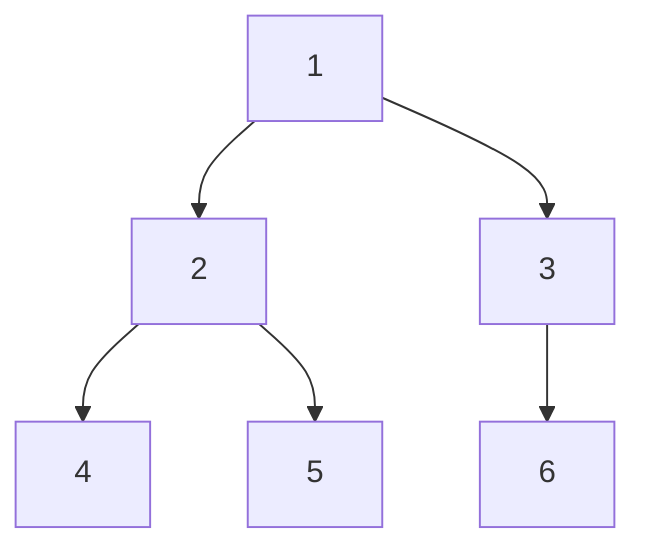
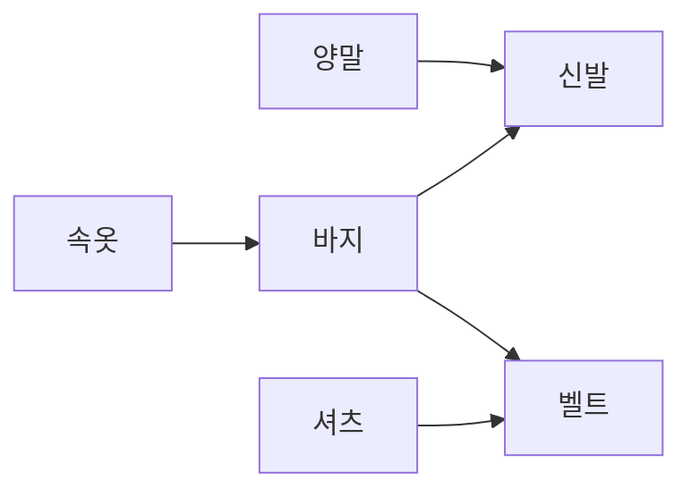
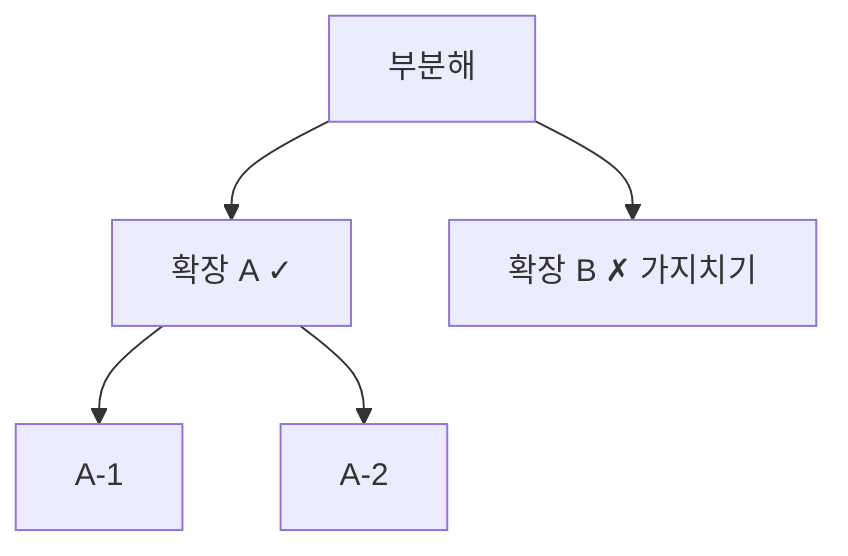

분야 핵심 개념을 얕고 넓게 정리한 노트. 쓱 훑어보며 복습한다.

## 시간복잡도 — 중첩 루프

바깥 루프가 `i *= 2`면 1 → 2 → 4 → 8…로 두 배씩이라 log₂(n)번. 안쪽이 n이면 전체 O(n log n). 반복 변수가 곱·나눗셈으로 변하면 대체로 log가 붙는다.

## 분할 정복 — 마스터 정리

문제를 같은 형태의 작은 하위 문제로 쪼개 풀고 합치는 패러다임. 병합·퀵 정렬, 이분 탐색이 대표 예. 점화식 `T(n) = a·T(n/b) + f(n)`의 복잡도는 마스터 정리로 판정 — 쪼개는 비용 f(n)과 하위 문제 총량 n^(log_b a)의 크기를 비교해 결정. 병합 정렬은 a=2, b=2, f(n)=n이라 양쪽이 n으로 비겨 O(n log n).

## 병합 정렬이 O(n log n)인 이유

절반씩 나눠 깊이가 log n. 각 레벨의 병합을 다 합치면 n개 원소를 한 번씩 훑어 O(n)(n은 한 레벨의 병합 총량). 따라서 n × log n.

## 퀵 정렬 최악 O(n²)

이미 정렬된 배열에서 첫 원소를 피벗으로 잡으면 분할이 0개 vs n-1개로 완전히 치우쳐 재귀 깊이 n → O(n²). 완화는 랜덤 피벗, median-of-three(첫·중간·끝의 중앙값).

## 퀵 vs 병합 — 실무 배열 정렬

| | 장점 | 대가 |
| --- | --- | --- |
| 퀵 | 제자리(in-place)라 추가 메모리 불필요, 인접 원소 교환이라 캐시 지역성 높음, 작은 상수 | 최악 O(n²) |
| 병합 | 안정 정렬, 최악까지 O(n log n) 보장 | 보조 배열 O(n)과 복사 비용 |

둘 다 평균 O(n log n)이라 배열 정렬엔 퀵 계열이 선호됨. 병합이 유리한 곳은 안정 정렬이 필요할 때, 최악 보장이 필요할 때, 연결 리스트 정렬, 외부 정렬.

## 삽입 정렬 — 거의 정렬된 배열

각 원소를 왼쪽 정렬부에 넣을 때 큰 원소를 밀며 자리를 찾음. 거의 정렬돼 있으면 이 안쪽 시프트가 거의 0이라(비교 약 1회) O(n)에 수렴.

## 계수 정렬(Counting Sort)

원소를 비교하지 않고 각 값의 등장 횟수를 세서 정렬 → 비교 정렬의 하한 O(n log n)에 안 걸리고 O(n + k). 단 값을 배열 인덱스로 쓰므로 범위가 한정된 정수에만 가능(실수·문자열 불가). 값 범위 k가 원소 수 n보다 훨씬 크면 O(n+k)가 폭발해 메모리 낭비·저속. "n과 비슷한 좁은 정수 범위"에서만 유리.

## 힙 정렬과 우선순위 큐

힙은 부모가 자식보다 항상 크거나(최대 힙) 작은(최소 힙) 완전 이진 트리. 삽입·삭제가 O(log n), 최댓값/최솟값 조회 O(1)이라 우선순위 큐의 표준 구현체. 힙 정렬은 배열을 힙으로 만든 뒤 루트를 하나씩 빼며 정렬 → O(n log n) 보장에 제자리(추가 메모리 없음). 단 원소 접근이 트리를 오르내려 캐시 지역성이 나빠 실측은 퀵보다 느림. C#은 .NET 6+의 `PriorityQueue<TElement, TPriority>` 제공.

최대 힙 — 부모가 자식보다 크므로 루트(9)가 최댓값. 루트를 빼고 정리하길 반복해 정렬.

## 안정 정렬(stable sort)

같은 키를 가진 원소들의 상대 순서가 정렬 후에도 유지. 예를 들어 점수가 같으면 먼저 등록한 사람이 위. C#에서 `List.Sort`/`Array.Sort`는 불안정, LINQ `OrderBy`는 안정.

## 이진 탐색과 lower bound

일반 이진 탐색은 아무 일치 지점에서 멈추지만, lower bound는 "target 이상인 가장 왼쪽(첫 번째)" 위치를 찾음. 중복 원소가 많을 때, target이 없어도 삽입 위치를 반환. 범위 개수 질의(구간 개수 = `upper_bound(b) − lower_bound(a)`)에도 쓰임.

## BFS vs DFS

BFS는 큐(FIFO)로 구현. 한 노드의 이웃을 모두 펼쳐 가까운 칸부터 레벨 순으로 탐색하므로, 가중치 없는 그래프에서 처음 목표에 도달한 경로가 곧 최단. DFS는 막힐 때까지 파고들다 막히면 최근 갈림길로 되돌아가야 해 LIFO 스택. 재귀 DFS는 호출 스택을 쓰는 것이고, 반복문 DFS는 이를 명시적 스택으로 대체한 것.

BFS는 레벨 순 `1 → 2 3 → 4 5 6`(큐), DFS는 한 길로 파고들어 `1 → 2 → 4 → 5 → 3 → 6`(스택).

## 다익스트라 vs A*

A*는 다익스트라에 휴리스틱 h(목표까지 추정 비용)를 추가한 것. 노드 우선순위를 `f = g + h`(g = 실제 비용, h = 추정)로 매겨 목표 방향을 먼저 탐색 → 더 적은 노드 탐색. h = 0이면 다익스트라와 동일.

h가 실제 남은 거리를 과대평가하면 좋은 경로의 f가 부풀려져 우선순위에서 밀려 최적해를 놓침. 과소평가(admissible)여야 최단 경로 보장.

## 벨만-포드와 플로이드-워셜

다익스트라는 음수 간선을 못 다룸 — 방문 확정한 노드를 나중에 더 줄일 수 없기 때문. 벨만-포드는 모든 간선을 V-1번 반복 완화(relax)해 음수 간선을 허용하고, 한 번 더 완화되는 간선이 있으면 음수 사이클로 탐지. 플로이드-워셜은 중간 정점을 하나씩 거치는 3중 루프로 모든 쌍 최단 경로를 구함.

| | 용도 | 음수 간선 | 복잡도 |
| --- | --- | --- | --- |
| 다익스트라 | 단일 출발점 | 불가 | O(E log V) |
| 벨만-포드 | 단일 출발점 | 가능(사이클 탐지) | O(VE) |
| 플로이드-워셜 | 모든 쌍 | 가능 | O(V³) |

## 위상 정렬(Topological Sort)

의존 관계를 어기지 않는 일렬 순서. Kahn은 진입 차수 0인 노드를 큐에 넣고 처리하며 이웃 차수를 감소시키고, DFS는 후위 순회를 뒤집음. DAG(방향·사이클 없음)에서만 가능 — 사이클이 있으면 순서 모순. 결과 노드 수가 전체보다 적으면 사이클 존재(탐지에도 쓰임).

## 최소 신장 트리(MST)

모든 정점을 잇는 간선 가중치 합이 최소인 트리 — 사이클 없이 간선 V-1개. 크루스칼은 간선을 가중치 오름차순으로 정렬해 사이클을 안 만드는 것부터 추가(사이클 판정은 유니온-파인드) → 간선이 성긴 그래프에 유리. 프림은 한 정점에서 시작해 트리에 닿는 최소 간선을 우선순위 큐로 골라 확장 → 간선이 조밀한 그래프에 유리. 둘 다 국소 최선을 고르는 그리디이며 MST에선 최적을 보장.

## 유니온-파인드(서로소 집합)

원소들을 겹치지 않는 집합으로 관리 — find(대표 원소 찾기)와 union(두 집합 합치기). 경로 압축(find 도중 거친 노드를 루트에 직접 연결)과 랭크/사이즈 기반 병합을 함께 쓰면 연산이 사실상 O(1)(역아커만 함수 α). 연결 요소 개수, 사이클 판정, 크루스칼 MST에 쓰임.

## 투 포인터

정렬된 배열에서 양 끝 포인터를 좁히며 합을 target과 비교. 작으면 왼쪽을 오른쪽으로(합 증가), 크면 오른쪽을 왼쪽으로(합 감소). 포인터가 안쪽으로만 이동해 배열을 한 번만 훑으므로 O(n). 정렬 전제 필수.

<svg viewBox="0 0 340 110" width="340" style="max-width:100%;height:auto" xmlns="http://www.w3.org/2000/svg" role="img" aria-label="정렬된 배열의 양 끝 두 포인터"><defs><marker id="tp-a" markerWidth="8" markerHeight="8" refX="6" refY="3" orient="auto"><path d="M0,0L6,3L0,6Z" fill="#4f83e0"/></marker><marker id="tp-b" markerWidth="8" markerHeight="8" refX="6" refY="3" orient="auto"><path d="M0,0L6,3L0,6Z" fill="#e2574c"/></marker></defs><g font-size="15" fill="currentColor" text-anchor="middle"><rect x="20" y="25" width="48" height="42" rx="4" fill="none" stroke="currentColor" opacity="0.7"/><text x="44" y="52">1</text><rect x="70" y="25" width="48" height="42" rx="4" fill="none" stroke="currentColor" opacity="0.7"/><text x="94" y="52">3</text><rect x="120" y="25" width="48" height="42" rx="4" fill="none" stroke="currentColor" opacity="0.7"/><text x="144" y="52">4</text><rect x="170" y="25" width="48" height="42" rx="4" fill="none" stroke="currentColor" opacity="0.7"/><text x="194" y="52">6</text><rect x="220" y="25" width="48" height="42" rx="4" fill="none" stroke="currentColor" opacity="0.7"/><text x="244" y="52">8</text><rect x="270" y="25" width="48" height="42" rx="4" fill="none" stroke="currentColor" opacity="0.7"/><text x="294" y="52">11</text></g><path d="M44 90 L44 72" stroke="#4f83e0" stroke-width="2" marker-end="url(#tp-a)"/><path d="M294 90 L294 72" stroke="#e2574c" stroke-width="2" marker-end="url(#tp-b)"/><text x="44" y="105" font-size="12" fill="#4f83e0" text-anchor="middle">L →</text><text x="294" y="105" font-size="12" fill="#e2574c" text-anchor="middle">← R</text></svg>

## 슬라이딩 윈도우

크기 K 윈도우의 합을 매번 다시 더하면 O(n·K). 나간 값 빼고 들어온 값 더하는 누적 합으로 매 스텝 O(1) → 전체 O(n). 연속 윈도우가 K-1개 겹치니 양 끝 변화만 반영하면 됨.

## 누적 합(prefix sum)

구간 합을 매번 더하면 질의마다 O(n). 앞에서부터 누적한 배열 P를 미리 만들면(P[i] = a[0] + … + a[i]) 임의 구간 [l, r]의 합 = P[r] − P[l−1]로 O(1). 슬라이딩 윈도우가 고정 크기 구간에만 쓰인다면 누적 합은 임의 구간에 대응. 2차원으로 확장하면 부분 직사각형 합도 O(1).

<svg viewBox="0 0 330 150" width="330" style="max-width:100%;height:auto" xmlns="http://www.w3.org/2000/svg" role="img" aria-label="누적 합으로 구간 합을 O(1)에"><g font-size="14" fill="currentColor" text-anchor="middle"><text x="12" y="50" font-size="12" opacity="0.7">a</text><rect x="30" y="27" width="46" height="36" rx="4" fill="none" stroke="currentColor" opacity="0.6"/><text x="53" y="50">2</text><rect x="80" y="27" width="46" height="36" rx="4" fill="#4f83e0" fill-opacity="0.12" stroke="#4f83e0"/><text x="103" y="50">4</text><rect x="130" y="27" width="46" height="36" rx="4" fill="#4f83e0" fill-opacity="0.12" stroke="#4f83e0"/><text x="153" y="50">1</text><rect x="180" y="27" width="46" height="36" rx="4" fill="#4f83e0" fill-opacity="0.12" stroke="#4f83e0"/><text x="203" y="50">5</text><rect x="230" y="27" width="46" height="36" rx="4" fill="none" stroke="currentColor" opacity="0.6"/><text x="253" y="50">3</text><text x="12" y="105" font-size="12" opacity="0.7">P</text><rect x="30" y="82" width="46" height="36" rx="4" fill="#e2574c" fill-opacity="0.12" stroke="#e2574c"/><text x="53" y="105">2</text><rect x="80" y="82" width="46" height="36" rx="4" fill="none" stroke="currentColor" opacity="0.6"/><text x="103" y="105">6</text><rect x="130" y="82" width="46" height="36" rx="4" fill="none" stroke="currentColor" opacity="0.6"/><text x="153" y="105">7</text><rect x="180" y="82" width="46" height="36" rx="4" fill="#e2574c" fill-opacity="0.12" stroke="#e2574c"/><text x="203" y="105">12</text><rect x="230" y="82" width="46" height="36" rx="4" fill="none" stroke="currentColor" opacity="0.6"/><text x="253" y="105">15</text></g><text x="30" y="140" font-size="12" fill="currentColor" opacity="0.75">구간 [1..3] 합 = P[3] − P[0] = 12 − 2 = 10</text></svg>

## 비트마스크

정수 한 개의 각 비트에 상태를 대응(켜짐 1 / 꺼짐 0). OR(`|=`)로 켜기, AND(`&`)로 확인, XOR(`^=`)로 토글. 빠르고 메모리를 절약하며 여러 상태를 한 번에 검사·조합 가능. 예: 상태 효과, LayerMask.

## 에라토스테네스의 체

2부터 각 소수의 배수를 모두 지우면 남는 수가 소수. 2의 배수 제거 → 다음 안 지워진 3의 배수 제거 → … √n까지만 하면 됨(그 위 합성수는 이미 작은 소인수로 지워졌으므로). 전체 O(n log log n)이라 소수를 대량으로 구할 때 빠름.

<svg viewBox="0 0 310 130" width="310" style="max-width:100%;height:auto" xmlns="http://www.w3.org/2000/svg" role="img" aria-label="에라토스테네스의 체 — 배수를 지우면 소수가 남음"><g font-size="14" text-anchor="middle"><rect x="20" y="25" width="44" height="34" rx="4" fill="#4f83e0" fill-opacity="0.12" stroke="#4f83e0"/><text x="42" y="47" fill="#4f83e0">2</text><rect x="66" y="25" width="44" height="34" rx="4" fill="#4f83e0" fill-opacity="0.12" stroke="#4f83e0"/><text x="88" y="47" fill="#4f83e0">3</text><rect x="112" y="25" width="44" height="34" rx="4" fill="none" stroke="currentColor" opacity="0.5"/><text x="134" y="47" fill="currentColor" opacity="0.5">4</text><line x1="118" y1="31" x2="150" y2="53" stroke="#e2574c" stroke-width="1.5"/><rect x="158" y="25" width="44" height="34" rx="4" fill="#4f83e0" fill-opacity="0.12" stroke="#4f83e0"/><text x="180" y="47" fill="#4f83e0">5</text><rect x="204" y="25" width="44" height="34" rx="4" fill="none" stroke="currentColor" opacity="0.5"/><text x="226" y="47" fill="currentColor" opacity="0.5">6</text><line x1="210" y1="31" x2="242" y2="53" stroke="#e2574c" stroke-width="1.5"/><rect x="250" y="25" width="44" height="34" rx="4" fill="#4f83e0" fill-opacity="0.12" stroke="#4f83e0"/><text x="272" y="47" fill="#4f83e0">7</text><rect x="20" y="70" width="44" height="34" rx="4" fill="none" stroke="currentColor" opacity="0.5"/><text x="42" y="92" fill="currentColor" opacity="0.5">8</text><line x1="26" y1="76" x2="58" y2="98" stroke="#e2574c" stroke-width="1.5"/><rect x="66" y="70" width="44" height="34" rx="4" fill="none" stroke="currentColor" opacity="0.5"/><text x="88" y="92" fill="currentColor" opacity="0.5">9</text><line x1="72" y1="76" x2="104" y2="98" stroke="#e2574c" stroke-width="1.5"/><rect x="112" y="70" width="44" height="34" rx="4" fill="none" stroke="currentColor" opacity="0.5"/><text x="134" y="92" fill="currentColor" opacity="0.5">10</text><line x1="118" y1="76" x2="150" y2="98" stroke="#e2574c" stroke-width="1.5"/><rect x="158" y="70" width="44" height="34" rx="4" fill="#4f83e0" fill-opacity="0.12" stroke="#4f83e0"/><text x="180" y="92" fill="#4f83e0">11</text><rect x="204" y="70" width="44" height="34" rx="4" fill="none" stroke="currentColor" opacity="0.5"/><text x="226" y="92" fill="currentColor" opacity="0.5">12</text><line x1="210" y1="76" x2="242" y2="98" stroke="#e2574c" stroke-width="1.5"/><rect x="250" y="70" width="44" height="34" rx="4" fill="#4f83e0" fill-opacity="0.12" stroke="#4f83e0"/><text x="272" y="92" fill="#4f83e0">13</text></g><text x="20" y="122" font-size="12" fill="currentColor" opacity="0.75">√n까지 각 소수의 배수를 지우면 남는 수(파랑)가 소수</text></svg>

## 유클리드 호제법(GCD)

두 수의 최대공약수는 큰 수를 작은 수로 나눈 나머지로 바꿔도 안 변함 — gcd(a, b) = gcd(b, a mod b), b가 0이면 a가 답. 뺄셈 반복 대신 나머지로 접어 로그 시간. 기약분수, LCM(= a·b / gcd) 계산에 쓰임.

## 백트래킹 가지치기

유망하지 않은 부분 해에서 뻗어나갈 하위 트리를 통째로 잘라냄. 셀 몇 개를 빼는 게 아니라, 그 시작으로 만들어질 지수적으로 많은 경우(서브트리)를 한 번에 버리는 것.

유망하지 않은 B는 그 아래 서브트리를 통째로 버려 탐색을 건너뛴다.

## 그리디가 실패하는 경우

국소 최선이 전역 최적과 어긋날 때 실패. 예를 들어 1·3·4 동전으로 6을 만들면 그리디는 4+1+1로 3개, 최적은 3+3으로 2개. 기준은 배수 관계가 아니라 그리디 선택 속성 — 그리디가 최적을 보장하려면 그리디 선택 속성 + 최적 부분 구조가 필요.

## DP 탑다운 vs 바텀업

| | 방식 | 장점 | 대가 |
| --- | --- | --- | --- |
| 탑다운 | 메모이제이션, 재귀 | 필요한 부분 문제만 계산 | 재귀 오버헤드, 스택 오버플로 위험 |
| 바텀업 | 타뷸레이션, 반복문 | 스택 위험 없고 캐시 친화적 | 모든 부분 문제를 계산 |

## 재귀 스택 오버플로

메서드 호출마다 스택 프레임이 쌓여, 재귀가 깊으면 스택 고갈로 오버플로. 반복문은 프레임을 안 쌓고, 꼬리 재귀는 같은 프레임 재사용이 가능. 단 C#/.NET은 꼬리 호출 최적화(TCO)를 보장하지 않으므로 확실한 해법은 반복문/명시적 스택.
