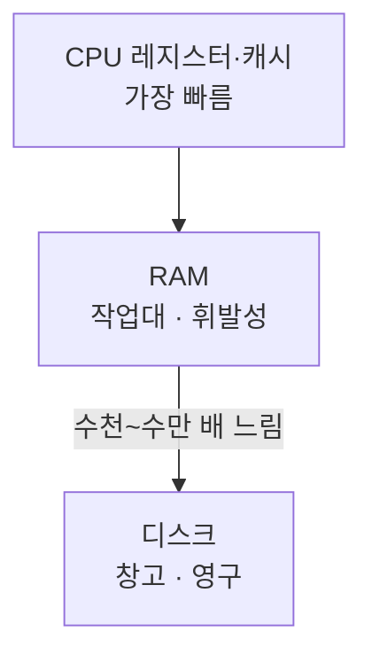
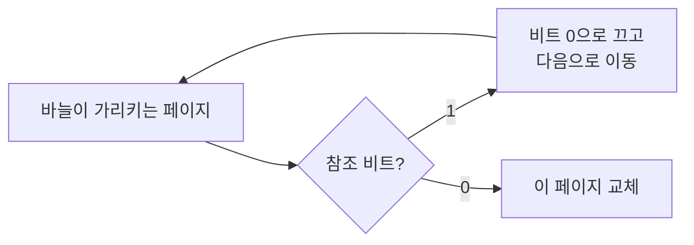
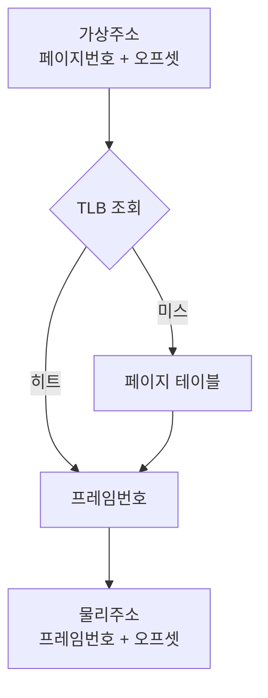
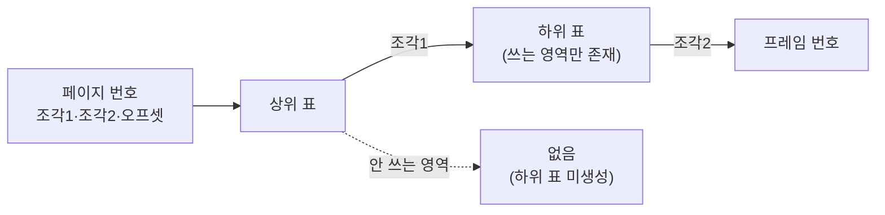
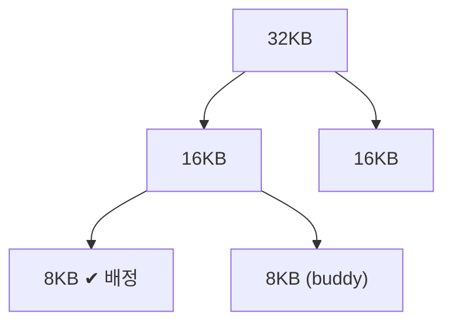
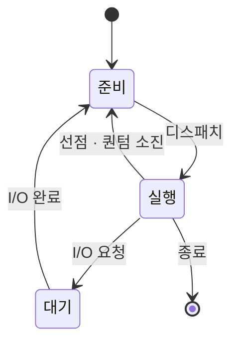
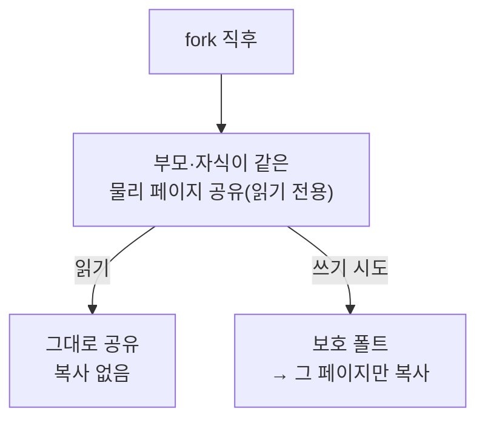
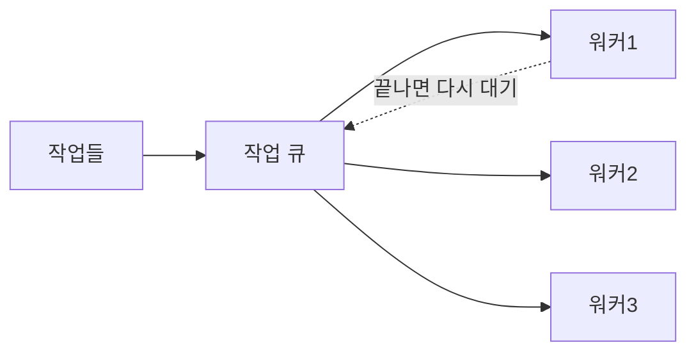
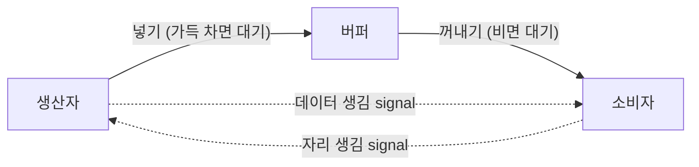

분야 핵심 개념을 얕고 넓게 정리한 노트. 쓱 훑어보며 복습한다.

## RAM vs 디스크 (메모리 계층)

CPU는 RAM에서만 일하고 디스크는 직접 못 씀. 디스크의 프로그램을 실행하려면 먼저 RAM으로 올린 뒤 CPU가 읽음. 창고(디스크)에서 꺼내 작업대(RAM)에 올려놓고 일하는 구조.

| | RAM(주기억) | 디스크(보조기억) |
| --- | --- | --- |
| 역할 | CPU의 작업대 | 영구 보관 창고 |
| 속도 | 나노초, 빠름 | μs~ms, RAM보다 수천~수만 배 느림 |
| 휘발성 | 꺼지면 날아감 | 꺼져도 유지 |
| 크기 | 작음(수십 GB) | 큼(수백 GB~TB) |

이 속도 격차가 가상 메모리 얘기의 밑바탕. 페이지 폴트가 멈칫하는 것도, 스래싱이 재앙인 것도 느린 디스크 왕복 때문. 안 쓰는 페이지를 잠시 내려두는 디스크 영역이 스왑. 반면 페이지 테이블은 RAM에 상주하므로 TLB 미스는 RAM만 한 번 더 읽는 것(빠름)이고, 디스크까지 가는 페이지 폴트와는 비용이 하늘과 땅 차이.

## 가상 메모리와 페이지 폴트

프로세스마다 0번지부터 이어진 독립 가상 주소 공간을 줌. 접근 때 MMU가 페이지 테이블을 참조해 가상 주소를 물리 프레임으로 변환(단위는 페이지, 보통 4KB). 이 변환 계층으로 얻는 것:

- 보호·격리 — 프로세스별 매핑이 따로라 남의 메모리는 주소로 표현조차 못 함
- 초과 사용 — 안 쓰는 페이지를 디스크(스왑)로 내려 물리 RAM보다 큰 주소 공간을 씀

페이지 테이블 항목의 유효 비트가 그 페이지가 지금 RAM에 있는지 표시. 유효 비트가 꺼진 페이지에 접근하면 페이지 폴트(예외)가 남. 처리 흐름:

- 트랩 — CPU가 멈추고 OS 폴트 핸들러로 진입
- 로드 — OS가 디스크에서 빈 프레임으로 올림(디스크 I/O, RAM보다 수만 배 느림)
- 교체 — 빈 프레임 없으면 기존 페이지를 내보냄
- 재개 — 페이지 테이블 갱신 후 멈춘 명령부터 다시 실행

프로그램은 이어지지만 로드 때문에 그 순간 멈칫함(게임이면 스터터). 최초 접근 폴트는 정상. 병목은 이미 있던 페이지를 쫓아냈다 곧 다시 부르는 폴트가 반복될 때이고, 심해지면 스래싱.

## 요구 페이징과 워킹셋·스래싱

- 요구 페이징 — 페이지를 미리 안 올리고 실제 접근(폴트) 시점에 올림. 안 쓰는 페이지는 메모리를 안 차지함
- 워킹셋 — 프로세스가 최근 일정 시간 동안 실제 참조한 페이지 집합. 지금 돌아가는 데 필요한 페이지 뭉치

워킹셋이 물리 프레임에 다 들어가면 올린 페이지를 재활용해 폴트가 드묾. 넘치면 무엇을 내보내도 곧 다시 필요해져 폴트가 폭증하고, CPU가 디스크만 기다리는 스래싱에 빠짐.

스래싱은 악순환이라 무서움. CPU 사용률이 낮은 게 할 일이 없어서가 아니라 다들 디스크 대기 중이어서인데, OS가 이를 놀고 있다고 착각해 프로세스를 더 띄우면 워킹셋 합이 더 커져 폴트가 더 늘고 성능이 절벽처럼 떨어짐. 대응:

- 다중 프로그래밍 수준 낮추기 — 일부를 스왑아웃해 악순환 고리를 끊음
- 메모리 증설 — 프레임 자체를 늘림
- 워킹셋 기반 스케줄링 — 프레임 확보 가능할 때만 실행

## 페이지 교체 알고리즘

물리 프레임이 꽉 찼을 때 어떤 페이지를 내보낼지 정하는 정책. 잘 고르면 곧 다시 쓸 페이지는 남기고 안 쓸 것만 내보내 폴트가 줌.

| 알고리즘 | 내보내는 기준 | 특징 |
| --- | --- | --- |
| OPT | 앞으로 가장 늦게 쓸 페이지 | 폴트 이론상 최소. 미래를 알아야 해 구현 불가, 비교 기준용 |
| FIFO | 가장 먼저 들어온 페이지 | 단순. "오래됨 ≠ 안 씀"이라 지금 쓰는 핵심 페이지도 내보냄. Belady 이상 현상(프레임 늘렸는데 폴트 증가) |
| LRU | 가장 오래전에 마지막 접근한 페이지 | 시간 지역성에 잘 맞아 OPT에 근접. 접근 시각 추적 비용이 커 순수 구현은 비쌈 |
| Clock | 참조 비트로 LRU 근사 | 비트 1개 + 바늘 회전으로 저렴하게 근사, 실전 표준 |

원리 순서로 보면 OPT(이상, 불가능) → LRU(이상에 근접하나 비쌈) → Clock(LRU를 싸게 근사, 실전) → FIFO(단순하나 사용 패턴 무시). Clock은 페이지를 원형으로 두고 접근 때 참조 비트를 켬. 교체 때 바늘이 돌며 비트가 1이면 끄고 지나가고(한 번 봐줌), 0이면 교체.

## 페이징 주소 변환

가상 주소를 두 조각으로 쪼갬 — 페이지 번호(앞쪽, 몇 번째 페이지) + 오프셋(뒤쪽, 페이지 안 몇 바이트째). 페이지가 4KB면 뒤 12비트가 오프셋.

변환은 페이지 번호만 바꿈. 페이지 테이블에서 페이지 번호로 물리 프레임 번호를 찾고, 오프셋은 그대로 붙여 물리 주소 완성. 페이지와 프레임 크기가 같아 "페이지 안 위치 = 프레임 안 위치"라 오프셋은 안 건드림. 그래서 변환의 본질은 페이지 번호 → 프레임 번호 매핑 하나.

이 간접 변환의 이득:

- 외부 단편화 회피 — 프레임이 균일 크기라 흩어진 빈 프레임 아무거나 하나면 됨. 연속을 요구하지 않으니 단편화가 원천적으로 없음(대신 페이지 끝 자투리의 내부 단편화가 대가)
- 보호·격리 — 프로세스별 페이지 테이블이 따로라 매핑이 안 겹침

페이지 테이블은 RAM에 있어 변환마다 메모리를 한 번 더 읽어야 함. TLB가 최근 변환(페이지 번호 → 프레임 번호)을 캐싱해, 히트면 테이블 조회 없이 즉시 변환하고 미스면 테이블을 읽어 TLB를 채움.

## 다단계 페이지 테이블

단일 배열 페이지 테이블은 주소 공간 크기에 비례해 터무니없이 큼. 64비트·4KB 페이지면 페이지가 2⁵²개라, 항목(PTE) 하나가 8바이트여도 프로세스당 표가 수십 페타바이트. 게다가 대부분 빈 항목 — 실제 쓰는 건 코드·데이터·힙·스택·라이브러리 몇 조각뿐이고 나머지 광대한 주소 공간은 매핑 없는 허공이라, 배열은 그 허공까지 항목을 잡아둠.

다단계는 표를 트리로 쪼갬. 페이지 번호를 여러 조각으로 나눠 상위 표가 하위 표를 가리키게 하고, 상위 항목을 "없음"으로 비우면 그 아래 하위 표를 아예 안 만듦. 실제 쓰는 영역의 하위 표만 존재해 페타바이트가 KB~MB로 줄어듦. 대가는 변환마다 단계 수만큼(x86-64는 4단계) 표를 타는 것이라, 한 번에 건너뛰는 TLB 히트가 더 중요해짐.

역페이지 테이블은 반대로 프레임마다 항목 하나만 둬, 표 크기를 주소 공간이 아닌 물리 메모리에 비례하게 줄임. 대신 가상→물리를 바로 못 찾아 해시로 보완.

## 메모리 매핑 파일(mmap)

파일을 프로세스 주소 공간 한 구간에 매핑해, `read`/`write` 시스템 콜 대신 포인터 접근으로 파일을 다룸. `read`/`write`는 디스크→커널 버퍼→유저 버퍼로 복사가 일어나는데, mmap은 그 복사를 없앰.

- 요구 페이징으로 로드 — 매핑만 걸면 파일 전체가 아니라, 처음 접근하는 페이지만 폴트로 올라옴. 거대한 파일도 건드린 부분만 RAM에 옴
- 복사 없음 — 파일 페이지가 페이지 캐시에 오르면 커널·유저가 같은 물리 페이지를 봄. 유저 버퍼로 또 복사하지 않아 오버헤드가 적음
- 공유가 자연스러움 — 여러 프로세스가 같은 파일을 매핑하면 같은 물리 페이지를 공유(공유 라이브러리·공유 메모리가 이 메커니즘)

용도는 큰 파일 랜덤 접근(필요한 부분만 폴트로), 프로세스 간 공유 메모리, 실행 파일·라이브러리 로딩(OS가 내부적으로 이 방식).

## 내부 단편화

할당 블록이 실제 필요보다 커서 안쪽이 낭비되는 것. 고정 크기로 나눠줄 때 생김.

- 페이징 — 프로세스 크기가 페이지의 정확한 배수가 아니라 마지막 페이지에 자투리가 남음(10KB → 페이지 3개 12KB, 2KB 낭비). 페이징이 외부 단편화를 없앤 대가
- 고정 크기 슬롯 — 슬롯보다 작은 객체를 넣으면 안쪽이 놀음(256B 슬롯에 200B → 56B)

낭비 크기가 예측 가능하고 상한(세그먼트·객체당 최대 한 슬롯 미만)이 정해져 있어 다루기 쉬움.

## 외부 단편화

전체 여유는 충분한데 빈 공간이 잘게 쪼개져, 요청한 크기의 연속 블록이 없어 할당 실패. 가변 크기를 연속 공간에 담을 때 생김.

- 세그멘테이션 — 크기 제각각인 세그먼트를 물리에 배치하다 해제 자리에 어정쩡한 구멍이 남음
- 힙(malloc/new) — 크고 작은 객체를 오래 할당·해제하면 들쭉날쭉한 구멍이 흩어짐. 오브젝트 풀링으로 완화

내부와 달리 언제 어디에 얼마나 큰 구멍이 생길지 예측 불가하고, 여유가 충분해도 큰 할당이 통째로 실패할 수 있어 다루기 어려움.

## 버디·슬랩 할당자

커널이 물리 메모리를 나눠 주는 방식. 역할이 달라 위아래로 쌓임 — 버디가 페이지 단위, 슬랩이 그 위 객체 단위.

버디 할당자는 메모리를 2의 거듭제곱 블록(4·8·16KB…)으로만 관리.

- 할당 — 요청 이상의 가장 작은 블록을 찾고, 없으면 큰 블록을 반씩 쪼개(두 조각이 서로 buddy) 필요 크기까지 내려감
- 해제 — 반납할 때 짝이 비어 있으면 도로 합쳐 큰 블록으로 되돌림. 흩어진 조각이 짝을 만나 다시 뭉쳐 외부 단편화를 억제
- 단점 — 2의 거듭제곱으로만 줘 9KB에 16KB를 배정하는 식의 내부 단편화

슬랩 할당자는 자주 쓰는 같은 크기 커널 객체(inode·task_struct 등)를 다룸. 물리 메모리를 직접 안 가져오고 버디에게 페이지를 받아 그 안을 객체 크기로 딱 맞게 칸을 내 2차로 나눔 — 내부 단편화를 최소화하고, 해제한 객체는 반납하지 않고 초기화된 채 캐시에 재워둬 재할당·초기화 비용을 줄임. 버디는 외부 단편화를, 슬랩은 내부 단편화·재할당 비용을 잡음.

## 세그멘테이션 vs 페이징

메모리를 어떤 단위로 나눠 관리하느냐가 갈림.

| | 나누는 단위 | 단편화 |
| --- | --- | --- |
| 페이징 | 고정 크기 페이지·프레임 | 내부(페이지 끝 자투리) |
| 세그멘테이션 | 논리 단위(코드·스택·힙 등 가변) | 외부(빈 공간 조각남) |

페이징은 크기가 같아 외부 단편화가 없는 대신 페이지 끝 자투리(내부)가 생기고, 세그멘테이션은 의미 단위라 단위별 보호·경계 검사·공유가 자연스러운 대신 크기가 제각각이라 외부 단편화. 둘 다 프로세스를 통째로 연속 배치하던 방식의 외부 단편화를 극복한 갈래.

단편화는 어느 방식도 완전히 못 없애고 무엇을 감수할지 고르는 문제. 예측 불가하고 큰 할당을 통째로 막는 외부보다, 상한이 정해진 내부가 다루기 쉬워 페이징 계열이 주력.

x86은 논리 주소를 세그먼트로 선형 주소로 바꾸고, 그 선형 주소를 다시 페이징으로 물리 주소로 바꾸는 2단 변환으로 둘을 결합. 단 이는 세그멘테이션(8086)이 먼저 있고 페이징(80386)이 나중에 추가된 역사적 유산 — 세그가 주던 논리 단위 보호는 OS가 페이징 위에서 소프트웨어로(리눅스 VMA + 페이지 권한 비트) 대신할 수 있음. 그래서 현대 x86-64는 세그멘테이션을 사실상 끄고(flat model) 페이징 단독으로 감.

## 스택 vs 힙 메모리

프로세스 주소 공간 안 두 영역. 스택은 함수 호출 단위로 프레임을 쌓고 벗겨 꼭대기 포인터(SP)만 밀고 당기면 되므로 빠르고 스코프 종료 시 자동 해제. 힙은 런타임에 원하는 크기를 빈 공간 찾아 할당하고 원할 때까지 유지하지만, 탐색·단편화·관리 비용이 있어 느림.

| | 스택 | 힙 |
| --- | --- | --- |
| 할당 방식 | 포인터(SP) 이동 | 빈 공간 탐색 |
| 속도 | 빠름 | 느림 |
| 해제 | 스코프 종료 시 자동 | 직접(delete) 또는 GC |
| 수명 | 함수 범위 | 자유 |
| 크기 | 컴파일 타임에 고정 | 런타임에 가변 |
| 문제 | 스택 오버플로 | 단편화·누수 |

함수를 넘어 오래 사는 데이터나 런타임에 크기가 정해지는 데이터는 힙에, 그 외 짧게 쓰는 지역 데이터는 스택에 둠.

<svg viewBox="0 0 300 200" width="300" style="max-width:100%;height:auto" xmlns="http://www.w3.org/2000/svg" role="img" aria-label="주소 공간에서 스택은 아래로 힙은 위로 자란다"><defs><marker id="sh-s" markerWidth="8" markerHeight="8" refX="6" refY="3" orient="auto"><path d="M0,0L6,3L0,6Z" fill="#4f83e0"/></marker><marker id="sh-h" markerWidth="8" markerHeight="8" refX="6" refY="3" orient="auto"><path d="M0,0L6,3L0,6Z" fill="#e2574c"/></marker></defs><text x="150" y="16" font-size="12" fill="currentColor" opacity="0.7" text-anchor="middle">높은 주소</text><rect x="90" y="24" width="120" height="150" fill="none" stroke="currentColor" opacity="0.5"/><rect x="90" y="24" width="120" height="40" fill="#4f83e0" fill-opacity="0.12" stroke="#4f83e0"/><text x="150" y="49" font-size="14" fill="#4f83e0" text-anchor="middle">스택</text><line x1="150" y1="70" x2="150" y2="94" stroke="#4f83e0" stroke-width="2" marker-end="url(#sh-s)"/><line x1="150" y1="122" x2="150" y2="98" stroke="#e2574c" stroke-width="2" marker-end="url(#sh-h)"/><rect x="90" y="124" width="120" height="26" fill="#e2574c" fill-opacity="0.12" stroke="#e2574c"/><text x="150" y="142" font-size="14" fill="#e2574c" text-anchor="middle">힙</text><rect x="90" y="150" width="120" height="24" fill="none" stroke="currentColor" opacity="0.5"/><text x="150" y="166" font-size="12" fill="currentColor" opacity="0.7" text-anchor="middle">코드·데이터</text><text x="150" y="192" font-size="12" fill="currentColor" opacity="0.7" text-anchor="middle">낮은 주소</text></svg>

## 프로세스 vs 스레드

프로세스는 실행 중인 프로그램 하나(게임·엑셀)로 격리된 자기 주소 공간을 가짐. 스레드는 그 프로세스 안에서 동시에 진행되는 실행 갈래(엑셀의 UI 입력·백그라운드 재계산·자동 저장이 각각 스레드). 싱글 스레드면 무거운 작업이 도는 동안 UI가 얼지만, 갈래를 나누면 동시에 처리됨.

| | 스레드끼리 | 이유 |
| --- | --- | --- |
| 코드·데이터·힙 | 공유 | 프로세스의 공용 데이터(게임 세계 상태 등)를 같이 봄 |
| 페이지 테이블·파일 핸들 | 공유 | 프로세스 자원 |
| 스택·레지스터·PC | 각자 | 각자 다른 함수의 다른 지점을 실행하니 현재 위치·지역 변수가 다름 |

이 차이로 두 가지가 갈림.

- 생성·전환이 가벼움 — 새 프로세스는 주소 공간을 통째로 세팅하지만 스레드는 공유하므로 스택·레지스터만 준비하면 됨. 스레드 전환은 페이지 테이블·TLB를 안 갈아 프로세스 전환보다 쌈
- 통신이 쉽지만 위험 — 스레드끼리는 힙·전역을 그냥 공유해 포인터로 주고받으면 되지만(프로세스끼리는 IPC 필요), 같은 메모리를 동시에 건드려 레이스 컨디션·동기화 문제를 떠안음

## 프로세스 상태 전이

CPU 코어 하나는 한 순간에 하나만 실행하는데 프로그램은 수십 개라, 상태로 갈림.

- 준비(Ready) — 실행 준비가 됐고 CPU만 주면 바로 도는데 차례를 기다리는 중(준비 큐)
- 실행(Running) — CPU를 쥐고 명령 실행 중. 코어 수만큼만 존재
- 대기(Waiting) — I/O·이벤트를 기다려, CPU를 줘도 할 게 없어 CPU를 놓고 빠진 상태

- 준비 → 실행(디스패치) — 스케줄러가 준비 큐에서 하나 골라 CPU를 줌
- 실행 → 준비(선점·퀀텀 소진) — 시간을 다 썼거나 더 급한 게 와 CPU를 뺏김. 일할 능력은 있어 대기가 아닌 준비로 감
- 실행 → 대기(I/O 요청) — 결과가 올 때까지 CPU를 쥐어도 놀 뿐이라 놓고 빠짐
- 대기 → 준비(I/O 완료) — 기다리던 게 옴. CPU를 그새 남이 쥐었을 수 있어 바로 실행이 아니라 준비 큐에 다시 섬
- 실행 → 종료

헷갈리는 두 지점 — 선점은 일할 능력이 있으니 준비로(대기는 기다릴 게 있어 CPU가 필요 없는 상태), I/O 완료도 CPU가 하나뿐이라 바로 실행이 아니라 준비로 복귀.

## Copy-on-Write와 fork

`fork`는 부모를 복제한 자식 프로세스를 만드는 유닉스 시스템 콜(새 프로그램 실행은 보통 fork 후 자식이 `exec`로 자신을 덮어씀). 주소 공간을 통째로 복사하면 낭비 — 부모 힙이 크면 복사 비용이 크고, 곧 exec로 덮어쓸 자식에겐 복사한 게 바로 버려짐.

copy-on-write는 복사를 미룸.

- fork 시점 — 물리 페이지를 복사하지 않고 부모·자식이 같은 페이지를 공유, 전부 읽기 전용 표시
- 읽기 — 공유 페이지를 그대로 같이 봄, 복사 없음
- 쓰기 — 읽기 전용 페이지에 쓰기라 보호 폴트 발생 → OS가 그 페이지 하나만 복사해 쓰는 쪽에 주고 쓰기 허용

실제 바뀌는 페이지만 바뀌는 순간 복사되므로, exec로 덮어쓰거나 읽기 위주인 상황에서 복사 비용·메모리를 크게 절약. 여러 페이지 테이블이 같은 프레임을 의도적으로 가리키는 대표 예.

## 좀비·고아 프로세스

자식이 종료해도 곧장 사라지지 않고, 종료 코드를 부모가 `wait`로 거둬가야(reap) 완전히 정리됨. 그전까진 종료 코드만 남긴 시체 상태로 프로세스 테이블에 남음. 좀비와 고아는 이 거두기가 어긋나는 두 방향.

- 좀비 — 자식이 먼저 죽음. 부모가 `wait`를 안 불러 시체가 안 치워진 상태. PID를 계속 차지해, 쌓이면 PID 고갈로 새 프로세스를 못 만듦. 부모의 버그(보통 서버·데몬처럼 오래 도는 부모가 거두기를 빠뜨릴 때)
- 고아 — 부모가 먼저 죽음. 자식은 살아 있지만 부모를 잃음. 커널이 부모 종료 순간 ppid를 init(PID 1)으로 재지정해 입양시키고, init이 나중에 거둬줘 좀비가 안 됨. 정상 처리 경로

| | 누가 먼저 죽나 | 상태 | 성격 |
| --- | --- | --- | --- |
| 좀비 | 자식 | 죽었는데 안 치워짐 | 부모 버그 |
| 고아 | 부모 | 살아있는데 부모 잃음 | 정상(init 입양) |

부모가 죽으면 그 밑의 좀비들도 init으로 넘어가 즉시 거둬지므로, 좀비는 부모가 살아 있는 동안만 문제. 그래서 오래 도는 부모가 위험.

## 스레드 풀

스레드 생성은 공짜가 아님 — 커널 자원 할당(커널 스택·스케줄링 정보)·스택 확보가 따르고, 작업마다 만들었다 부수면 이 비용과 스위칭·스케줄링 부담이 쌓임. 스레드 풀은 워커 스레드를 미리 N개 만들어 재사용해 이를 없앰.

- 작업이 오면 작업 큐에 넣음
- 노는 워커가 큐에서 작업을 꺼내 처리
- 처리가 끝나면 워커는 죽지 않고 다시 큐를 보며 대기 → 다음 작업에 같은 워커 재사용

워커 수를 정해두므로 개수 제한 효과도 있음 — 작업이 폭주해도 스레드가 무한정 늘지 않고 큐에 쌓여 순서대로 처리돼, 동시 실행 수를 통제. C#의 `ThreadPool`·`Task`, 서버 프레임워크가 내부적으로 이 방식.

## 컨텍스트 스위칭 비용

CPU를 A에서 떼어 B에 붙이는 전환. 두 종류의 비용이 듦.

- 보이는 비용 — A의 CPU 상태(레지스터·PC·SP)를 PCB(프로세스마다 두는 관리 구조체)에 저장하고 B의 상태를 복원. 잦으면 쌓임
- 숨은 비용 — 전환 직후 캐시·TLB가 B 기준으로 식어(cold) 캐시 미스가 잔뜩 남. RAM에서 다시 퍼오느라 느려지는데, PCB 저장·복원보다 클 때도 많음

프로세스 전환은 주소 공간이 바뀌어 TLB까지 비워야 하지만, 같은 프로세스 안 스레드 전환은 주소 공간을 공유해 TLB를 안 비워도 됨 — 그래서 스레드 전환이 더 쌈. 스레드 풀이 재사용하는 것도 이 생성+전환 비용을 줄이려는 것.

## 사용자 모드 vs 커널 모드

CPU의 두 실행 권한 레벨. 앱이 하드웨어를 직접 만지거나 남의 메모리를 건드리면 버그 하나로 시스템이 무너지므로, 위험한 작업을 커널 모드에서만 하게 하드웨어로 막는 보호 경계.

| | 누가 | 권한 |
| --- | --- | --- |
| 사용자 모드 | 일반 앱(게임·엑셀) | 제한적 — 자기 메모리만, 특권 명령 금지 |
| 커널 모드 | OS 핵심 | 전권 — 모든 메모리·하드웨어 |

앱이 파일·네트워크 같은 특권 작업을 하려면 커널에 대신 요청 = 시스템 콜.

- 앱이 시스템 콜을 부름 → 트랩이 걸려 커널 모드로 전환
- 아무 데로나 못 들어가고 정해진 진입점(시스템 콜 테이블)을 통해서만 — 커널 아무 코드나 실행하는 걸 막음
- 커널이 작업 수행 후 사용자 모드로 복귀, 앱은 결과를 받아 이어감

모드 전환 자체가 비용이라, 한 바이트씩 매번 콜하면 전환이 폭발 — 버퍼링으로 모아 처리해 횟수를 줄임. 페이지 폴트 처리·fork·wait·스레드 생성이 전부 커널 모드의 특권 작업이고, 앱은 시스템 콜로 요청.

## 레이스 컨디션

여러 스레드가 같은 데이터를 동시에 고칠 때 실행 순서가 꼬여 결과가 틀어지는 현상. `count++` 한 줄이 CPU엔 읽기 → 증가 → 쓰기 세 단계라, 이 사이에 다른 스레드가 끼어들 수 있음.

| 시점 | 스레드 A | 스레드 B | count |
| --- | --- | --- | --- |
| 1 | 읽기(0) | | 0 |
| 2 | | 읽기(0) | 0 |
| 3 | 증가→1 | | 0 |
| 4 | | 증가→1 | 0 |
| 5 | 쓰기(1) | | 1 |
| 6 | | 쓰기(1) | 1 |

둘 다 +1 했으니 2여야 하는데, B가 A의 갱신 전에 0을 읽어 A의 증가가 덮여 유실되고 1이 나옴. 실행마다 결과가 달라 재현·디버깅이 어려움. 이렇게 한 번에 한 스레드만 들어가야 하는 코드 구간이 임계 구역(critical section).

해결은 세 단계가 쪼개지지 않게 묶는 것 — lock(뮤텍스)으로 임계 구역에 한 스레드만 넣거나, 원자적 연산(`Interlocked.Increment`)으로 읽기·증가·쓰기를 하드웨어가 한 덩어리로 처리.

## 메모리 배리어와 원자적 연산

멀티코어 동기화 문제는 두 층. 도구도 각각 다름.

- 원자성 — `count++`처럼 복합 연산이 읽기·증가·쓰기로 쪼개져 중간에 끼어듦
- 가시성·순서 — 코어마다 캐시가 달라 쓴 값이 늦게 퍼지고, CPU·컴파일러가 단일 스레드 결과가 같은 범위에서 명령을 재정렬(as-if 규칙)해, 다른 코어엔 쓰기 순서가 뒤바뀌어 보임

원자적 연산(`Interlocked`, CAS)이 원자성을 해결 — 읽기-수정-쓰기를 하드웨어가 쪼갤 수 없는 한 단위로 묶음. CAS는 "기대값이면 바꾸고 아니면 실패"를 원자적으로 해 lock-free의 기반.

메모리 배리어가 가시성·순서를 해결 — 순서를 지킬 두 연산 사이에 넣는 펜스로, 앞뒤 재정렬을 막고 앞의 쓰기를 다른 코어에 보이게 강제. `data=42; ready=true`에서 순서가 뒤집히면 상대가 ready만 보고 옛 data를 읽으므로, 쓰는 쪽·읽는 쪽에 배리어를 짝으로 넣어 막음. 실무에선 lock·원자적 연산이 배리어를 품어 직접 쓸 일은 드묾.

`volatile`은 재정렬·캐싱을 제한해 가시성 일부만 도울 뿐, `count++` 같은 복합 연산의 원자성은 보장하지 않음.

## 뮤텍스 vs 세마포어

| | 허용 수 | 소유권 |
| --- | --- | --- |
| 뮤텍스 | 한 번에 1개 스레드만 | 있음 — 잠근 스레드가 풀어야 함 |
| 세마포어 | 카운터로 최대 N개 | 없음 — 아무나 올리고 내림 |

뮤텍스는 소유권이 있어 A가 잠그면 A만 풂. 그래서 배타적 보호에 안전하고, 주인이 안 풀고 죽어도 OS가 버려진 뮤텍스로 감지해 자동 해제+경고 가능(단 보호 데이터는 불일치일 수 있어 복구 필요). 대신 "A가 신호 주고 B가 받기"는 못 함.

세마포어는 카운터 하나 + 원자적 wait(−1, 0이면 대기)·signal(+1)뿐이라 소유권이 없음. 쓰임이 둘로 갈림.

- 자원 N개 제한 — 같은 스레드가 진입 시 wait, 종료 시 signal(예: DB 커넥션 10개, 카운터 10)
- 신호 전달 — 내리는 쪽과 올리는 쪽이 달라도 됨. 생산자가 signal, 소비자가 wait 하는 식(뮤텍스로는 불가능한 용법)

단일 자원 배타 접근엔 뮤텍스, N개 동시 제한·신호엔 세마포어.

## 스핀락(Spinlock)

락을 못 얻으면 잠들지 않고 얻을 때까지 반복문을 돌며 계속 시도(spin). 블로킹 락은 잠들었다 깨는 컨텍스트 스위칭 비용이 드는데, 락이 아주 짧게만 잡힐 거면 그 비용보다 몇 바퀴 도는 게 싸 — 풀리는 순간 바로 잡아 진행. 그래서 락이 짧게 잡히고 + 멀티코어일 때 유리.

- 오래 잡히면 — CPU를 헛돌며 아무 일도 안 해 순수 낭비. 차라리 자고 CPU를 양보하는 게 나음
- 단일 코어에선 최악 — 스핀하는 스레드가 CPU를 붙들고 도는데 락 주인이 그 CPU를 못 얻어 실행을 못 함. 주인이 락을 못 풀어 영영 막힘(멀티코어면 주인이 다른 코어에서 돌아 곧 풂)

유불리를 가르는 건 대기 시간의 길이 — 짧으면 스핀락, 길거나 불확실하면 블로킹 락.

## 뮤텍스 vs 스핀락

둘 다 상호 배제를 걸지만 못 얻었을 때 하는 행동이 다름.

| | 대기 방식 | 유리한 상황 |
| --- | --- | --- |
| 뮤텍스 | 잠들고(블로킹) CPU를 양보, 풀리면 깨어남 | 락 유지가 길거나 단일 코어 |
| 스핀락 | 안 자고 반복문으로 계속 시도 | 락 유지가 아주 짧고 멀티코어 |

핵심은 컨텍스트 스위칭 비용과 대기 시간의 비교 — 재우고 깨우는 비용보다 짧게 기다릴 거면 스핀이 이득. 둘을 섞은 적응형 락은 일단 짧게 스핀해보고 그 안에 못 얻으면 그때 잠들어, 짧으면 스핀·길면 블로킹의 이득을 런타임에 자동으로 탐.

## 우선순위 역전

우선순위 H > M > L 세 스레드에서 락이 끼면 실행 순서가 뒤집힘.

- L(낮음)이 락을 쥐고 실행 중
- H(높음)가 L을 선점해 실행하나, 그 락이 필요해 대기(블록)로 빠짐 → CPU가 비어 L이 다시 준비 상태로 돌 차례
- 그런데 M(중간, 락 불필요)이 준비돼 있으면 스케줄러가 L 대신 M을 선택 → L이 CPU를 못 받아 락을 못 풀고 → H도 계속 대기

결과적으로 중간짜리 M이 최고짜리 H보다 먼저 도는 역전. M이 끊임없이 들어오면 L·H가 무한정 밀리는 무한 역전이 되어, 고우선순위 작업 미완료를 감지한 워치독이 시스템을 리셋한 화성 탐사선 Pathfinder 사례가 유명.

해결은 락 쥔 L을 잠시 끌어올려 M에게 안 밀리고 빨리 락을 풀게 하는 것.

- 우선순위 상속 — L이 H가 기다리는 락을 쥔 동안 L을 H만큼 올림. M보다 높아져 L이 CPU를 받아 락을 풂, 풀면 원래대로 복귀. 역전 시간이 L의 임계 구역 길이로 유한하게 묶임
- 우선순위 상한 프로토콜 — 락마다 쥐면 올릴 상한을 미리 정해둠

<svg viewBox="0 0 330 165" width="330" style="max-width:100%;height:auto" xmlns="http://www.w3.org/2000/svg" role="img" aria-label="우선순위 역전 — 높은 우선순위 H가 중간 M에 밀림"><g font-size="12" fill="currentColor" opacity="0.75"><text x="10" y="44">H</text><text x="10" y="82">M</text><text x="10" y="120">L</text></g><line x1="30" y1="138" x2="315" y2="138" stroke="currentColor" opacity="0.3"/><rect x="40" y="106" width="55" height="22" rx="3" fill="#3fae7a" fill-opacity="0.2" stroke="#3fae7a"/><text x="67" y="121" font-size="10" fill="#3fae7a" text-anchor="middle">락 보유</text><rect x="120" y="68" width="95" height="22" rx="3" fill="#4f83e0" fill-opacity="0.18" stroke="#4f83e0"/><text x="167" y="83" font-size="10" fill="#4f83e0" text-anchor="middle">M 실행(끼어듦)</text><rect x="95" y="30" width="130" height="22" rx="3" fill="none" stroke="#e2574c" stroke-dasharray="4 3"/><text x="160" y="45" font-size="10" fill="#e2574c" text-anchor="middle">H 대기 — 락 막힘</text><text x="20" y="160" font-size="11" fill="currentColor" opacity="0.7">L의 락을 기다리는 H가, 끼어든 M 때문에 뒤로 밀린다</text></svg>

## 생산자-소비자와 조건 변수

생산자가 데이터를 버퍼에 넣고 소비자가 꺼내는 구조. 버퍼가 가득 차면 생산자가, 비면 소비자가 기다려야 함. 바쁜 대기(계속 확인)는 CPU 낭비라, 조건 변수로 조건이 될 때까지 재우고 상대가 상태를 바꾸면 signal로 깨움.

락과 함께 쓰는 흐름 — 락을 쥐고 조건 검사 → 아니면 `wait()`로 락을 풀며 원자적으로 잠듦 → 깨어나면 다시 락을 잡고 재검사.

- 락 쥐고 검사하는 이유 — 버퍼가 공유 데이터라 안전하게 읽고, "검사 → 잠들기" 사이 틈으로 signal이 새어 영영 못 깨는 놓친 깨어남을 막음(`wait`가 락 풀기+잠들기를 원자적으로 처리)
- `while`로 재검사 — 깼다고 조건이 참이란 보장이 없음(여럿이 깨 하나만 가져가는 등). 아니면 다시 잠
- 락은 버퍼 넣고 빼는 짧은 구간만 — 데이터 생성·처리는 락 밖에서 해 병렬성을 살림
- 소비자가 여럿이면 처리 순서는 스케줄러·락 구현이 정해 보장 없음. 순서가 필요하면 공정한 락으로 직접 구현

세마포어(빈 칸·찬 칸 카운트) 두 개로도 구현 — 생산자는 빈 칸 wait 후 넣고 찬 칸 signal, 소비자는 찬 칸 wait 후 꺼내고 빈 칸 signal(신호 전달 용법).

## 데드락 4조건과 예방

서로가 쥔 자원을 기다리며 아무도 못 나아가는 상태. 아래 4조건이 동시에 다 성립해야 발생하는 필요조건이라, 하나만 깨도 예방됨.

- 상호 배제 — 자원을 한 번에 하나만 씀(락)
- 점유와 대기 — 자원을 쥔 채 다른 자원을 기다림
- 비선점 — 남이 쥔 자원을 강제로 못 뺏음
- 순환 대기 — 기다림이 고리를 이룸(A→B→A)

예방은 넷 중 하나를 봉쇄. 가장 실용적인 건 순환 대기 깨기 — 자원에 번호를 매겨 항상 낮은 번호부터 획득. 순환이 닫히려면 누군가 자기가 가진 것보다 낮은 번호를 기다려야 하는데 규칙상 불가능하므로 고리가 못 닫힘(락을 항상 같은 순서로 잡는 것). 나머지는 점유와 대기 깨기(한 번에 다 잡거나 못 잡으면 가진 것도 놓기 — `TryEnter` 타임아웃), 비선점 깨기(자원을 뺏을 수 있게), 상호 배제 깨기(자원을 공유 가능하게).

## 데드락 회피 — 은행원 알고리즘

예방이 4조건 중 하나를 원천 봉쇄한다면, 회피는 조건은 두고 요청마다 "지금 내줘도 안전한가"를 판단해 안전 상태만 유지. 안전 상태는 자원을 어떻게 배분해도 모든 프로세스가 끝까지 완료될 실행 순서(안전 순서)가 하나라도 남는 상태.

은행원 알고리즘 동작:

- 각 프로세스가 최대 요구량을 미리 선언
- 요청이 오면 "내줬다고 가정"하고 그 상태에 안전 순서가 남는지 계산
- 남으면 허가, 없으면 지금 당장 데드락이 아니어도 위험하니 대기시킴

한계는 최대 요구량을 미리 알아야 하고 매 요청마다 판정 비용이 들어, 범용 OS보단 이론·특수 환경에서 씀.

데드락 대응은 네 갈래.

| 접근 | 언제 | 방식 |
| --- | --- | --- |
| 예방 | 사전 | 4조건 중 하나 원천 봉쇄 |
| 회피 | 요청 시 | 안전 상태만 유지(은행원) |
| 탐지·복구 | 사후 | 대기 그래프 사이클로 감지 → 프로세스 종료·자원 회수(롤백). DB의 트랜잭션 abort |
| 무시 | — | 드무니 방치, 사용자가 강제 종료(타조 알고리즘) |

## CPU 스케줄링 알고리즘

준비 큐에서 다음에 실행할 프로세스를 고르는 규칙. 고르는 기준에 따라 성격이 갈림.

| 알고리즘 | 기준 | 특징 |
| --- | --- | --- |
| FCFS (First-Come First-Served, 선착순) | 도착 순서 | 단순하나 긴 작업 뒤가 다 밀림(호위 효과) |
| SJF (Shortest Job First, 최단 작업 우선) | 실행 시간 짧은 것 | 평균 대기 최소, 실행 시간 예측 필요·기아 위험 |
| 우선순위 (Priority) | 우선순위 높은 것 | 낮은 우선순위 기아 → 에이징으로 완화 |
| RR (Round Robin, 라운드 로빈) | 타임 퀀텀씩 돌아가며 | 응답성 좋음, 퀀텀 너무 짧으면 스위칭 오버헤드 |
| MLFQ (Multi-Level Feedback Queue, 다단계 피드백 큐) | 여러 우선순위 큐 + 승·강등 | RR·우선순위·에이징을 종합한 실전형 |

- 호위 효과(Convoy Effect) — FCFS에서 긴 작업이 앞에 오면 뒤의 짧은 작업들이 줄줄이 밀림. SJF가 짧은 것 먼저 처리해 해결
- 기아(Starvation) — 특정 작업이 계속 밀려 영영 실행 못 됨. SJF·우선순위에서 발생
- 타임 퀀텀(Time Quantum) — RR이 각 작업에 주는 CPU 시간 조각. 짧으면 응답성↑·스위칭↑, 길면 반대(극단적으로 길면 FCFS와 같아짐)
- MLFQ — CPU를 오래 쓰면 강등, 오래 기다리면 승격(에이징). 실행 시간을 몰라도 짧은·대화형 작업이 자연히 우대됨

## SJF 기아와 에이징

SJF는 짧은 작업 우선이라 평균 대기가 최소 — 짧은 것을 먼저 보내면 뒤 작업들의 대기가 짧아짐(긴 것을 먼저 보내면 모두가 그 긴 시간을 다 기다림). FCFS의 호위 효과를 정면으로 해결.

그러나 짧은 작업이 계속 들어오면 긴 작업이 영영 뒤로 밀리는 기아가 발생. 에이징은 대기 시간에 비례해 우선순위를 점점 올려, 오래 기다린 작업이 결국 실행되게 함. 우선순위 스케줄링의 기아에도 같은 방식으로 쓰이고, MLFQ의 승격도 에이징의 일종.

## 선점 vs 비선점 스케줄링

실행 중인 작업을 끝나기 전에 강제로 CPU에서 뺏을 수 있는가로 갈림.

| | 실행 중인 작업을 뺏나 | 예 |
| --- | --- | --- |
| 선점(Preemptive) | O — 더 급한 게 오거나 퀀텀 소진 시 회수 | RR, 선점형 우선순위 |
| 비선점(Non-preemptive) | X — 스스로 끝내거나 I/O 대기로 양보할 때까지 유지 | FCFS, 비선점형 SJF |

- 비선점 — 단순하고 스위칭이 적음. 대신 긴 작업이 CPU를 오래 붙잡으면 급한 작업이 끼어들 수 없어 응답성이 나쁨(FCFS 호위 효과)
- 선점 — 급한 작업이 즉시 끼어들고 독점을 막아 응답성↑·기아↓. 대신 뺏고 넘기는 컨텍스트 스위칭 비용이 늘고, 실행 도중 뺏길 수 있어 동기화가 더 중요

상태 전이의 "실행 → 준비(선점·퀀텀 소진)"가 곧 선점. 현대 OS는 대화형 작업이 많아 대부분 선점형.

## 인터럽트 vs 폴링

CPU가 장치 이벤트를 알아채는 방식.

- 폴링 — CPU가 직접 "왔나?" 확인. 바쁜 대기식(tight loop)이면 확인만 반복해 CPU 낭비, 주기적이면 다른 일 하며 간격마다 확인하나 반응이 지연. 확인은 같은 스레드의 인라인 코드라 문맥 교체는 없음
- 인터럽트 — 장치가 이벤트 시 신호를 보냄. CPU는 평소 다른 일 하다가, 신호가 오면 하던 일을 멈추고 핸들러(ISR)로 점프해 처리 후 복귀. 확인이 필요 없어 효율·반응성 우수하나, 신호마다 상태 저장·복원의 문맥 교체 비용

보통 인터럽트가 유리하지만 이벤트가 폭주하면 신호마다 무는 교체 비용이 커짐. 그래서 인터럽트 병합(coalescing)으로 여러 이벤트를 모아 한 번에 처리하거나(처리량↑·지연↑), 하이브리드(NAPI — 첫 신호로 깨어나 폴링으로 쌓인 것을 훑고 비면 다시 인터럽트)로 양쪽 장점을 취함.

## 디스크 스케줄링

HDD는 헤드를 데이터가 있는 트랙으로 물리적으로 옮겨야 읽는데, 이 기계적 이동(seek)이 제일 느림. 그래서 쌓인 요청의 순서를 재배열해 헤드 이동 거리를 줄임.

- FCFS(선착순) — 온 순서대로. 공평·단순하나 헤드가 이리저리 왕복해 이동 거리가 큼
- SSTF(Shortest Seek Time First) — 현재 헤드에서 가장 가까운 요청부터. 빠르나 근처에 요청이 몰리면 먼 요청이 밀리는 기아(SJF와 같은 성질)
- SCAN(엘리베이터) — 한 방향으로 끝까지 훑으며 처리하고 끝에서 반대로 되돌음. 편향이 없어 기아 없이 균등

SSD는 기계적 헤드가 없어 seek 개념이 거의 없으므로 이 seek 최소화 스케줄링의 의미가 약함 — 병렬성·큐를 살리는 다른 방식을 씀. 디스크 스케줄링은 주로 HDD의 seek 비용 얘기.

<svg viewBox="0 0 320 120" width="320" style="max-width:100%;height:auto" xmlns="http://www.w3.org/2000/svg" role="img" aria-label="SCAN 디스크 스케줄링 — 한 방향으로 훑기"><defs><marker id="ds" markerWidth="8" markerHeight="8" refX="6" refY="3" orient="auto"><path d="M0,0L6,3L0,6Z" fill="#3fae7a"/></marker></defs><line x1="30" y1="72" x2="290" y2="72" stroke="currentColor" stroke-width="1.5" opacity="0.5"/><text x="30" y="90" font-size="11" fill="currentColor" opacity="0.6" text-anchor="middle">0</text><text x="290" y="90" font-size="11" fill="currentColor" opacity="0.6" text-anchor="middle">199</text><circle cx="60" cy="72" r="4" fill="#4f83e0"/><circle cx="95" cy="72" r="4" fill="#4f83e0"/><circle cx="150" cy="72" r="4" fill="#4f83e0"/><circle cx="200" cy="72" r="4" fill="#4f83e0"/><circle cx="245" cy="72" r="4" fill="#4f83e0"/><path d="M104 62 L116 62 L110 72 Z" fill="#e2574c"/><text x="110" y="56" font-size="12" fill="#e2574c" text-anchor="middle">헤드</text><line x1="120" y1="44" x2="258" y2="44" stroke="#3fae7a" stroke-width="2" marker-end="url(#ds)"/><text x="30" y="110" font-size="12" fill="currentColor" opacity="0.75">한 방향으로 끝까지 훑고 반대로 되돌아 균등하게 처리</text></svg>

## 동기·비동기 / 블로킹·논블로킹 I/O

자주 섞이는 두 축. 블로킹·논블로킹은 "호출이 바로 돌아오는가", 동기·비동기는 "결과를 누가 알려주는가".

| | 블로킹 | 논블로킹 |
| --- | --- | --- |
| 동기 | 완료까지 대기(가장 흔함) | 바로 반환, 완료됐는지 직접 반복 확인(폴링) |
| 비동기 | 드묾 | 바로 반환, 완료되면 콜백·이벤트로 통지 |

I/O 대기가 긴 작업(파일·네트워크)에서 비동기·논블로킹을 쓰면 대기 동안 CPU가 다른 일을 할 수 있음.

## I/O 멀티플렉싱(select·poll·epoll)

한 스레드가 여러 소켓·파일을 동시에 감시하다 준비된 것만 처리. 연결마다 스레드를 두는 대신 이벤트 기반으로 다뤄 대량 동시 연결을 감당. select·poll은 매 호출마다 전체 fd 목록을 훑어 O(n)이고, epoll은 관심 목록을 한 번 등록해두면 커널이 준비된 fd만 알려줘 O(1)에 가까움. 논블로킹 I/O·이벤트 루프의 토대.

## CPU 캐시와 캐시 지역성

CPU는 메모리를 캐시 라인(예: 64바이트) 단위로 읽어옴. 지역성은 프로그램이 가까운(공간적)·최근(시간적) 메모리를 자주 접근하는 경향. 순차 접근은 다음 원소가 이미 캐시에 있어 캐시 히트라 빠르고, 흩어진 접근은 캐시 미스로 RAM 대기가 걸려 느림. 캐시 라인 로드는 하드웨어 동작이고 지역성은 접근 경향 원리라는 점을 구분한다.

## 캐시 매핑 방식

메모리 블록을 캐시 어느 자리에 둘지 정하는 규칙.

| 방식 | 배치 | 특징 |
| --- | --- | --- |
| 직접 매핑 | 인덱스로 한 자리 고정 | 단순·빠름, 같은 인덱스끼리 충돌 잦음 |
| 완전 연관 | 아무 자리나 | 충돌 최소, 전체를 뒤져야 해 검색 비쌈 |
| 집합 연관 | 집합 안 아무 자리(N-way) | 절충 — 실무 캐시의 표준 |

직접 매핑은 서로 다른 주소가 같은 칸을 계속 밀어내는 충돌이 잦고, 완전 연관은 그 반대라 유연하나 비쌈. 집합 연관이 둘의 절충이라 대부분의 CPU 캐시가 채택.

## 거짓 공유(false sharing)

서로 다른 코어가 논리적으로 무관한 변수를 각각 갱신해도, 두 변수가 같은 캐시 라인(예: 64바이트)에 있으면 한쪽 쓰기가 라인 전체를 무효화해 상대 캐시가 계속 튕김. 락도 공유도 없는데 캐시 일관성 트래픽만으로 성능이 급락. 스레드별 데이터를 캐시 라인 크기로 띄우거나(패딩), 각자 지역 변수에 누적한 뒤 마지막에 합쳐 완화.

## 파일 시스템 — inode와 저널링

inode는 파일 하나의 메타데이터(크기·권한·데이터 블록 위치)를 담는 구조체이고, 디렉터리는 이름 → inode 번호의 매핑일 뿐. 그래서 하드 링크는 같은 inode를 여러 이름이 가리키는 것. 저널링은 실제 쓰기 전에 "무엇을 바꿀지"를 저널에 먼저 기록해, 쓰기 도중 전원이 꺼져도 저널을 되짚어 일관성을 복구 → 크래시 후 전체 검사(fsck) 없이 빠르게 복원.

## IPC — 공유 메모리 vs 메시지 전달

| | 속도 | 대가 |
| --- | --- | --- |
| 공유 메모리 | 빠름(메모리를 직접 공유) | 동시 접근에 동기화(락)를 직접 해야 하고 오염 위험 |
| 메시지 전달 | 느림(복사·전달 비용) | 각자 자기 메모리만 만져 격리·안전, 동기화 문제가 적음 |
