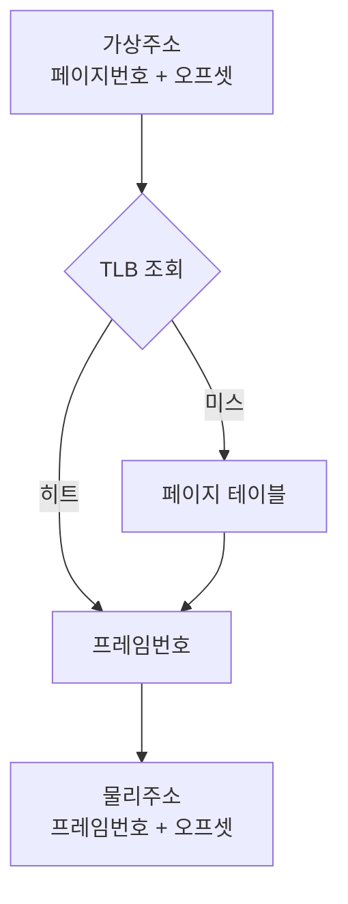
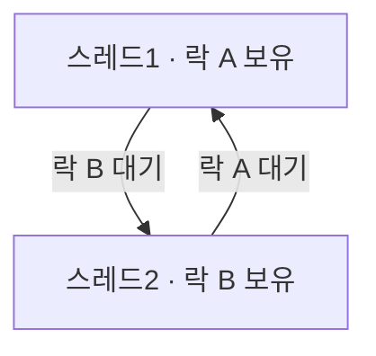

분야 핵심 개념을 얕고 넓게 정리한 노트. 쓱 훑어보며 복습한다.

## 가상 메모리와 페이지 폴트

가상 메모리는 프로세스에 독립된 주소 공간을 줘 보호하고, 물리 메모리 초과 사용을 가능하게 함. 새 지역 진입 시 데이터가 아직 RAM에 없으면 페이지 폴트가 나고 디스크에서 로드하느라 끊김(디스크 I/O). 페이지 교체가 과도하면 스래싱.

## 요구 페이징과 워킹셋·스래싱

요구 페이징은 페이지를 미리 안 올리고 실제 접근(페이지 폴트) 시점에 올리는 방식 — 안 쓰는 페이지는 메모리를 안 차지함. 워킹셋은 프로세스가 최근에 실제로 참조하는 페이지 집합으로, 이게 물리 메모리에 다 들어가면 폴트가 드묾. 워킹셋 합이 물리 메모리를 넘으면 서로 페이지를 밀어내며 폴트가 폭증해 CPU가 디스크만 기다리는 스래싱에 빠짐. 대응은 다중 프로그래밍 수준 낮추기, 메모리 증설, 워킹셋 기반 스케줄링.

## 페이지 교체 알고리즘

물리 프레임이 꽉 찼을 때 어떤 페이지를 내보낼지 정하는 정책.

| 알고리즘 | 기준 | 특징 |
| --- | --- | --- |
| FIFO | 가장 먼저 들어온 페이지 | 단순하나 자주 쓰는 페이지도 내보냄. Belady 이상 현상(프레임 늘렸는데 폴트 증가) |
| LRU | 가장 오래 안 쓴 페이지 | 지역성에 잘 맞지만 접근 시각 추적 비용 큼 |
| Clock | 참조 비트로 LRU 근사 | 원형 큐를 돌며 참조 비트 0인 걸 교체, 저비용 |

이론상 최적(OPT)은 "앞으로 가장 늦게 쓸 페이지"를 내보내지만 미래를 알아야 해 실제로는 불가능, 비교 기준으로만 씀.

## 페이징 주소 변환

가상 주소 = 페이지 번호 + 오프셋. 페이지 테이블에서 페이지 번호로 물리 프레임 번호를 찾고 오프셋을 붙여 물리 주소 완성. 간접 변환 덕에 연속 가상 주소를 흩어진 물리 프레임에 매핑(외부 단편화 회피) + 프로세스별 주소 공간으로 보호·격리. TLB가 이 변환을 캐싱해 가속.

## 내부 단편화

할당받은 블록이 실제 필요보다 커서 안쪽 공간이 낭비되는 것(예: 256B 슬롯에 200B 객체 → 56B 낭비). 페이징은 외부 단편화를 없애는 대신 페이지 끝 자투리의 내부 단편화를 만듦.

## 외부 단편화

전체 여유 메모리는 충분한데 빈 공간이 작게 쪼개져 있어, 요청한 크기의 연속된 블록이 없어 할당 실패. 오래 플레이하며 객체를 할당·해제하다 구멍이 생겨 발생. 오브젝트 풀링으로 완화.

## 스택 vs 힙 메모리

스택은 포인터 이동만으로 할당/해제하므로 빠르고, 스코프 종료 시 자동 해제. 힙은 빈 공간을 찾아 할당하고 단편화·관리 비용이 있어 느림.

## 프로세스 vs 스레드

스레드는 코드·데이터·힙을 공유하고 스택·레지스터만 따로 가짐. 새 프로세스는 별도 주소 공간(페이지 테이블 등)을 통째로 만들어야 하지만 스레드는 그걸 공유하므로 생성·컨텍스트 스위칭이 가벼움.

## Copy-on-Write와 fork

`fork`는 부모 주소 공간을 자식에 복제하지만, 실제로는 물리 페이지를 바로 복사하지 않고 읽기 전용으로 공유(copy-on-write). 어느 쪽이든 페이지에 쓰려는 순간에만 그 페이지를 복제 → 대부분 읽기만 하는 상황에서 복사 비용·메모리를 크게 절약. 곧 `exec`로 다른 프로그램을 덮어쓸 자식에게 전체 복사는 낭비라 이 지연 복사가 유효.

## 좀비·고아 프로세스

자식이 종료하면 종료 코드를 부모가 `wait`로 거둘 때까지 프로세스 테이블에 시체로 남는데, 이 상태가 좀비. 부모가 `wait`를 안 하면 좀비가 쌓여 PID를 낭비함. 반대로 부모가 자식보다 먼저 죽으면 자식은 고아가 되고, init(PID 1)이 새 부모로 입양해 대신 거둠. 좀비는 부모의 버그, 고아는 정상 처리 경로.

## 스레드 풀

스레드를 매번 생성·파괴하지 않고 미리 만든 워커를 재사용. 스레드 생성은 커널 자원 할당·스택 확보가 따르고, 잦은 생성·소멸은 스위칭·스케줄링 부담을 키움. 풀이 이걸 없앰.

## 컨텍스트 스위칭 비용

프로세스가 바뀔 때 레지스터·프로그램 카운터·스택 포인터 등 CPU 상태를 PCB에 저장·복원. 잦으면 이 오버헤드가 쌓임. 숨은 비용은 스위칭 후 캐시·TLB가 식어 있어 캐시 미스가 많이 난다는 것(PCB 저장보다 클 때도 있음).

## 사용자 모드 vs 커널 모드

| | 권한 |
| --- | --- |
| 사용자 모드 | 일반 앱. 제한된 명령, 자기 메모리만 |
| 커널 모드 | OS 핵심. 전권 |

위험한 작업을 OS만 하게 막는 하드웨어 보안 경계. 파일 I/O 같은 특권 작업은 시스템 콜(트랩)로 커널 모드 진입 → 정해진 진입점(시스템 콜 테이블)을 통해서만. 모드 전환은 비용이 있어 I/O는 버퍼링으로 모아 처리.

## 레이스 컨디션

두 스레드가 공유 변수를 동시에 갱신할 때 발생. `count++`는 읽기·증가·쓰기 세 단계라, 사이에 끼어들면 갱신이 유실되어 결과가 작아짐. 해결은 lock(뮤텍스) 또는 `Interlocked.Increment`.

## 뮤텍스 vs 세마포어

| | 허용 수 | 소유권 |
| --- | --- | --- |
| 뮤텍스 | 한 번에 1개 스레드만 | 있음(잠근 스레드가 풀어야 함) |
| 세마포어 | 카운터로 최대 N개 | 없음(신호 전달 가능) |

"동시에 최대 N개"는 카운터를 N으로 둔 세마포어로 구현. 진입 시 카운터 감소, 종료 시 증가, 0이면 대기. 단일 자원 배타 접근엔 뮤텍스, N개 동시 제한·신호엔 세마포어.

## 스핀락(Spinlock)

락을 얻을 때까지 반복문을 돌며 대기(안 잠). 락이 아주 짧게 잡힐 때 유리 — 재우고 깨우는 스위칭 비용을 회피(멀티코어에서 특히). 락이 오래 잡히면 CPU를 헛돌며 낭비, 단일 코어에선 최악(락 주인이 실행 못 해 안 풀림). 짧으면 스핀락, 길거나 불확실하면 블로킹 락 — 유불리를 가르는 건 대기 시간의 길이.

## 뮤텍스 vs 스핀락

둘 다 상호 배제를 걸지만 못 얻었을 때 하는 행동이 다름.

| | 대기 방식 | 유리한 상황 |
| --- | --- | --- |
| 뮤텍스 | 잠들고(블로킹) CPU를 양보, 풀리면 깨어남 | 락 유지가 길거나 단일 코어 |
| 스핀락 | 안 자고 반복문으로 계속 시도 | 락 유지가 아주 짧고 멀티코어 |

핵심은 컨텍스트 스위칭 비용과 대기 시간의 비교 — 재우고 깨우는 비용보다 짧게 기다릴 거면 스핀이 이득.

## 생산자-소비자와 조건 변수

생산자가 데이터를 버퍼에 넣고 소비자가 꺼내는 구조 — 버퍼가 가득 차면 생산자가, 비면 소비자가 기다려야 함. 바쁜 대기(계속 확인) 대신 조건 변수로 조건이 될 때까지 재우고, 상대가 상태를 바꾸면 깨움(signal). 락과 함께 써서 "락을 쥔 채 조건 검사 → 아니면 락을 풀고 대기 → 깨어나면 다시 락"의 흐름. 세마포어(빈 칸·찬 칸 카운트)로도 구현.

버퍼가 가득 차면 생산자가, 비면 소비자가 기다린다.

## 데드락 4조건과 예방

상호 배제, 점유와 대기, 비선점, 순환 대기 — 넷이 동시에 성립해야 발생하는 필요조건이라 하나만 깨도 예방됨. 락을 서로 반대 순서로 잡으면 순환 대기로 교착에 빠짐.

자원에 번호를 매겨 항상 낮은 번호부터 획득하게 하면, 어떤 스레드도 자기가 가진 것보다 낮은 번호를 기다리지 않음. 순환이 성립하려면 누군가 낮은 번호를 기다려야 하는데 규칙상 불가능 → 고리가 못 닫혀 순환 대기가 차단됨. `TryEnter` 타임아웃은 점유와 대기를 차단.

서로 반대 순서로 잡아 고리가 닫히면 아무도 못 나아간다.

## 데드락 회피 — 은행원 알고리즘

예방이 네 조건 중 하나를 원천 봉쇄한다면, 회피는 요청을 그때그때 허가할지 판단해 안전 상태만 유지. 은행원 알고리즘은 각 프로세스의 최대 요구량을 미리 알고, 자원을 내줬을 때 모두가 끝까지 완료될 수 있는 순서(안전 순서)가 남으면 허가하고 아니면 대기시킴. 안전 상태 판정 비용과 최대 요구량 사전 고지가 필요해 실제 OS보단 이론·특수 환경에서 씀.

## CPU 스케줄링 알고리즘

준비 큐에서 다음에 실행할 프로세스를 고르는 규칙.

| 알고리즘 | 기준 | 특징 |
| --- | --- | --- |
| FCFS | 도착 순서 | 단순하나 긴 작업 뒤가 다 밀림(호위 효과) |
| SJF | 실행 시간 짧은 것 | 평균 대기 최소, 실행 시간 예측 필요·기아 위험 |
| 우선순위 | 우선순위 높은 것 | 낮은 우선순위 기아 → 에이징으로 완화 |
| RR | 타임 퀀텀씩 돌아가며 | 응답성 좋음, 퀀텀 너무 짧으면 스위칭 오버헤드 |
| MLFQ | 여러 우선순위 큐 + 승·강등 | RR·우선순위·에이징을 종합한 실전형 |

## SJF 기아와 에이징

SJF는 짧은 작업 우선이라 평균 대기가 최소. 그러나 짧은 작업이 계속 들어오면 긴 작업이 영영 밀리는 기아가 발생. 에이징은 대기 시간에 따라 우선순위를 점점 올려 결국 실행되게 함.

## 선점 vs 비선점 스케줄링

| | 실행 중인 작업을 뺏는가 | 예 |
| --- | --- | --- |
| 선점 | O — 더 급한 게 오거나 퀀텀 소진 시 회수 | RR, 선점형 우선순위 |
| 비선점 | X — 스스로 끝내거나 I/O 대기로 양보할 때까지 유지 | FCFS, 비선점형 SJF |

선점은 응답성이 좋고 기아를 줄이지만 컨텍스트 스위칭·동기화 비용이 늘고, 비선점은 단순하나 긴 작업이 시스템을 오래 붙잡을 수 있음.

## 인터럽트 vs 폴링

폴링은 CPU가 계속 "왔나?" 확인해 낭비. 인터럽트는 이벤트 발생 시에만 신호를 줘 CPU가 다른 일을 하다 즉시 반응 → CPU 효율·반응성 모두 우수.

## 동기·비동기 / 블로킹·논블로킹 I/O

자주 섞이는 두 축. 블로킹·논블로킹은 "호출이 바로 돌아오는가", 동기·비동기는 "결과를 누가 알려주는가".

| | 블로킹 | 논블로킹 |
| --- | --- | --- |
| 동기 | 완료까지 대기(가장 흔함) | 바로 반환, 완료됐는지 직접 반복 확인(폴링) |
| 비동기 | 드묾 | 바로 반환, 완료되면 콜백·이벤트로 통지 |

I/O 대기가 긴 작업(파일·네트워크)에서 비동기·논블로킹을 쓰면 대기 동안 CPU가 다른 일을 할 수 있음.

## CPU 캐시와 캐시 지역성

CPU는 메모리를 캐시 라인(예: 64바이트) 단위로 읽어옴. 지역성은 프로그램이 가까운(공간적)·최근(시간적) 메모리를 자주 접근하는 경향. 순차 접근은 다음 원소가 이미 캐시에 있어 캐시 히트라 빠르고, 흩어진 접근은 캐시 미스로 RAM 대기가 걸려 느림. 캐시 라인 로드는 하드웨어 동작이고 지역성은 접근 경향 원리라는 점을 구분한다.

## 파일 시스템 — inode와 저널링

inode는 파일 하나의 메타데이터(크기·권한·데이터 블록 위치)를 담는 구조체이고, 디렉터리는 이름 → inode 번호의 매핑일 뿐. 그래서 하드 링크는 같은 inode를 여러 이름이 가리키는 것. 저널링은 실제 쓰기 전에 "무엇을 바꿀지"를 저널에 먼저 기록해, 쓰기 도중 전원이 꺼져도 저널을 되짚어 일관성을 복구 → 크래시 후 전체 검사(fsck) 없이 빠르게 복원.

## IPC — 공유 메모리 vs 메시지 전달

| | 속도 | 대가 |
| --- | --- | --- |
| 공유 메모리 | 빠름(메모리를 직접 공유) | 동시 접근에 동기화(락)를 직접 해야 하고 오염 위험 |
| 메시지 전달 | 느림(복사·전달 비용) | 각자 자기 메모리만 만져 격리·안전, 동기화 문제가 적음 |
