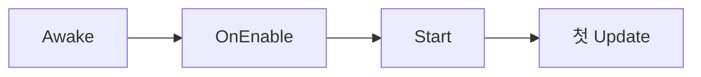
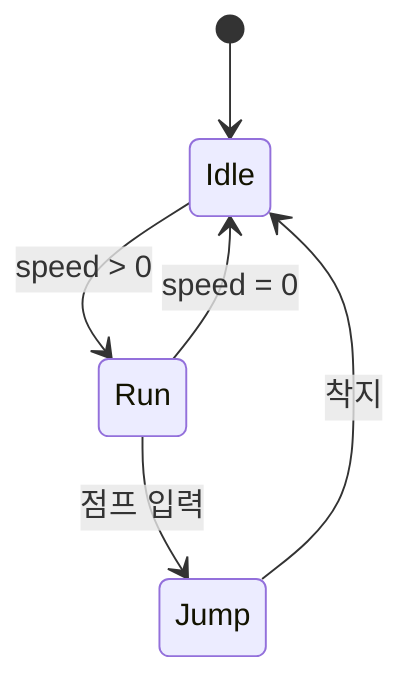
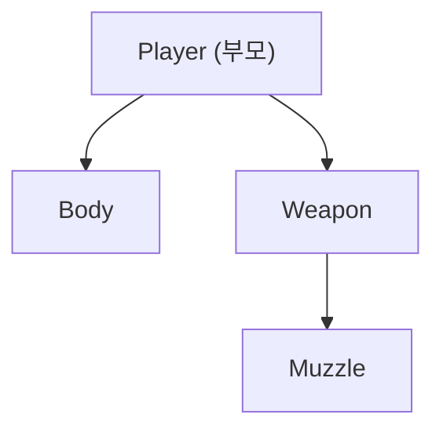

분야 핵심 개념을 얕고 넓게 정리한 노트. 쓱 훑어보며 복습한다.

## Awake / OnEnable / Start 순서

`Awake`(생성 시 1회, 자기 초기화) → `OnEnable`(활성화될 때마다) → `Start`(모든 Awake 후 첫 프레임 직전 1회, 다른 오브젝트 참조 초기화). 모든 Awake가 먼저 끝난 뒤 Start가 도니 Start 시점엔 다른 오브젝트가 초기화돼 있음을 믿고 참조 가능(오브젝트 간 Awake 호출 순서 자체는 보장 안 됨). "내 준비는 Awake, 남과 연결은 Start".

## Update vs FixedUpdate

물리(Rigidbody)는 고정 타임스텝의 `FixedUpdate`에서 처리해야 프레임률과 무관하게 일관됨. 입력 감지(`GetKeyDown`)는 `Update`에 — `FixedUpdate`는 프레임당 0번·1번·여러 번 실행될 수 있어 한 프레임만 true인 입력을 놓칠 수 있음.

## Update vs LateUpdate

`LateUpdate`는 모든 `Update` 뒤에 실행. 카메라 추적은 플레이어가 Update에서 이동을 마친 뒤 따라가야 지터가 없으므로 LateUpdate에 작성.

## 입력 시스템 — 레거시 vs 새 Input System

| | 방식 | 특징 |
| --- | --- | --- |
| 레거시 (Input Manager) | `Input.GetKey`로 폴링 | 간단하나 키 하드코딩·리바인딩이 번거로움 |
| 새 Input System | 액션·바인딩을 에셋으로 분리 | 게임패드·키보드·터치 통합, 런타임 리바인딩 쉬움, 설정 복잡 |

레거시는 `Update`에서 키를 직접 폴링해 빠르게 쓰지만 장치·리바인딩 대응이 약함. 새 Input System은 "점프·이동" 같은 액션과 실제 키의 바인딩을 분리해 여러 기기를 한 번에 다루고 런타임 리바인딩이 쉬움.

## 코루틴 yield 종류

| yield | 재개 시점 |
| --- | --- |
| `yield return null` | 다음 프레임 |
| `WaitForSeconds(t)` | t초 후(스케일된 시간. `timeScale = 0`이면 안 풀림 → 실시간은 `WaitForSecondsRealtime`) |
| `WaitForEndOfFrame` | 그 프레임 렌더링이 끝난 직후(스크린샷 등) |

## WaitForSeconds 캐싱

반복할 때마다 `new WaitForSeconds(...)`를 만들면 힙에 객체가 계속 생겨 GC 부담. 미리 한 번 만들어 필드에 캐싱해 재사용.

## 코루틴 vs async/await

코루틴은 유니티 플레이어 루프에 얹혀 프레임 단위로 재개되며, 붙은 게임오브젝트가 비활성·파괴되면 자동 중단. async/await는 엔진 밖 Task 기반이라 씬을 넘어도 살아 있어 파괴된 객체를 건드리면 위험(수동 취소 필요). 프레임 대기·간단한 연출은 코루틴, 파일·네트워크 같은 진짜 비동기 I/O는 async가 맞음. 실무에선 GC 없는 UniTask로 둘의 장점을 합치기도 함.

## OnEnable / OnDisable 이벤트 구독

`Start`는 한 번뿐이라, 풀링으로 활성/비활성을 반복하는 오브젝트는 `OnEnable`에서 구독·`OnDisable`에서 해제해야 짝이 맞음. `Start`에서만 구독하면 비활성 상태에서도 반응하거나 재활성 시 중복 구독이 쌓임.

## UnityEvent vs C# event

| | 연결 | 특징 |
| --- | --- | --- |
| C# event | 코드에서 `+=` 구독 | 빠르고 타입 안전, 인스펙터에 안 보임 |
| UnityEvent | 인스펙터에서 드래그로 연결 | 기획자가 코드 없이 배선, 리플렉션 호출이라 느리고 GC 있음 |

코드끼리의 고빈도 통신은 C# event(또는 Action), 인스펙터에 노출해 비프로그래머가 잇는 버튼·트리거 콜백은 UnityEvent. UnityEvent는 대상이 파괴돼도 자동 해제되지 않으니 관리가 필요.

## SetActive vs enabled

`SetActive(false)`는 게임 오브젝트 전체(자식 포함)를 비활성 → Update도 안 돌고 `OnDisable` 호출. `enabled = false`는 그 컴포넌트 하나만 끔(나머지·렌더링은 유지). 풀 반환은 SetActive, 공격 히트박스만 잠깐 끄기는 enabled.

## activeSelf vs activeInHierarchy

`activeSelf`는 자신의 SetActive 플래그(부모 무관). `activeInHierarchy`는 조상까지 모두 활성일 때만 true인 실제 활성 상태. 자신은 켜져 있어도 부모가 꺼져 있으면 `activeSelf = true`, `activeInHierarchy = false`.

## Destroy vs DestroyImmediate

`Destroy`는 현재 프레임 끝에 지연 파괴(런타임 안전). `DestroyImmediate`는 즉시 파괴 — 원래 에디터 툴링용이고, 런타임에 특히 컬렉션 순회 중 쓰면 참조·순회가 깨져 에러.

## DontDestroyOnLoad

씬 전환 후에도 유지할 매니저용. 씬을 다시 들어오면 중복 인스턴스가 생기니, 이미 존재하는지 검사해 새로 생긴 중복을 파괴.

## GC 스파이크

GC가 힙을 회수할 때 메인 스레드를 잠깐 멈춰 프레임이 끊김. 원인은 무거운 계산이 아니라 힙 할당. Update에서 new 객체 생성, 박싱, LINQ, 문자열 결합, 람다 클로저를 피하고 캐싱·풀링으로 대응.

## 오브젝트 풀링

`Instantiate`/`Destroy` 반복 비용을 풀 보관·재활용으로 없앰. 특히 `Destroy` 반복은 GC 부담을 키워 프레임이 끊김. 미리 만들어두고 활성/비활성으로 재활용해 할당·해제 자체를 없애는 것.

## Instantiate 위치 인자

`Instantiate(prefab, pos, rot)`는 처음부터 그 위치로 생성해 Transform 갱신이 1회. `Instantiate` 후 `transform.position` 대입은 "기본 위치 생성 → 다시 이동"이라 갱신(자식 월드 좌표 재계산, 물리 통보)이 2회 일어날 수 있음. 대량 스폰에서 차이가 쌓임.

## GetComponent 캐싱과 TryGetComponent

`GetComponent`는 컴포넌트 목록을 뒤지는 비용이 있어 매 프레임 `Update`에 넣지 말고 `Awake`/`Start`에서 캐싱해 재사용. 한 번 쓰거나 조건부면 `TryGetComponent`가 깔끔 — bool + out 패턴이라 null 체크가 포함되고, 못 찾았을 때 발생하던 가비지 할당도 피함.

## Camera.main 캐싱

`Camera.main`은 호출마다 'MainCamera' 태그 오브젝트를 `FindWithTag`로 찾음 → Update에서 매 프레임 호출하면 비쌈. `Awake`/`Start`에서 한 번 캐싱해 재사용.

## GameObject.Find / FindObjectOfType 비용

씬의 모든 오브젝트를 순회해 비쌈(특히 `Update`에서 매 프레임이면 치명적). 대신 `Awake`/`Start`에서 캐싱, `[SerializeField]`로 직접 연결, 또는 이벤트/의존성 주입으로 넘겨받기.

## Update 일괄 처리

엔진(C++)이 각 MonoBehaviour의 `Update`를 매 프레임 하나씩 호출하는데, C++↔C# 경계 넘기에 건당 오버헤드가 있음. 매니저 하나가 리스트를 돌면 경계 호출이 1번으로 줄고 나머지는 C# 내부 루프. 빈 `Update`도 호출 비용이 있으니 안 쓰면 지울 것. 핵심은 "매 프레임 콜백을 가진 인스턴스 수"를 줄여 경계 호출 횟수를 낮추는 것.

## Job System과 Burst

C# 잡을 워커 스레드에 분산해 멀티코어를 활용하는 멀티스레딩 프레임워크. 메인 스레드만 쓰던 무거운 계산(대량 이동·충돌·절차 생성)을 병렬화. Burst 컴파일러가 잡 코드를 SIMD 최적화된 네이티브 코드로 바꿔 수 배 가속. 데이터를 촘촘히 배열로 두는 DOTS/ECS와 맞물려 캐시 지역성을 극대화. 안전을 위해 관리 객체 대신 NativeArray 등 값 타입 컨테이너를 씀.

## IL2CPP vs Mono

| | 방식 | 특징 |
| --- | --- | --- |
| Mono | IL을 런타임 JIT 컴파일 | 빌드 빠름, 개발 중 유리, 일부 플랫폼 미지원 |
| IL2CPP | IL을 C++로 변환 후 네이티브 컴파일(AOT) | 실행 빠르고 역공학이 어려움, iOS 등 필수, 빌드 느림 |

IL2CPP는 AOT라 런타임 코드 생성(일부 리플렉션·`dynamic`)에 제약이 있어 코드 스트리핑 설정에 주의. 출시 빌드는 성능·보안·플랫폼 요건으로 IL2CPP가 흔함.

## 어셈블리 정의(asmdef)

기본적으로 모든 스크립트가 하나의 큰 어셈블리로 컴파일돼, 한 줄만 고쳐도 전체가 재컴파일. asmdef로 코드를 여러 어셈블리로 쪼개면 바뀐 모듈과 그 의존만 다시 컴파일해 반복 빌드가 빨라짐. 의존 방향을 명시해 계층을 강제(순환 참조 차단)하고, 테스트·에디터 전용 코드를 분리하는 데도 씀. 대가는 초기 설정과 참조 관리 부담.

## Animator StringToHash

`SetTrigger("Jump")`는 매 호출마다 문자열을 내부적으로 해시로 변환·조회함. `StringToHash`로 해시를 미리 구해 캐싱하고 정수로 넘기면 반복되는 문자열 해싱을 건너뜀. 아끼는 건 GC가 아니라 문자열 해싱 비용이다.

## Animator 상태 머신과 블렌드 트리

애니메이션을 상태(Idle·Run·Jump 등)로 두고 파라미터(속도·isGrounded) 조건으로 전이. 블렌드 트리는 한 상태 안에서 파라미터로 여러 클립을 섞음(속도에 따라 걷기·뛰기 보간). 전이마다 블렌드 시간을 줘 뚝 끊기지 않고 부드럽게 이어짐.

## 배칭 — Static / Dynamic / GPU Instancing

| | 대상 | 제약 |
| --- | --- | --- |
| Static Batching | 움직이지 않는 오브젝트를 결합 | 정적이어야 함 |
| Dynamic Batching | 작은 메시 | 정점 수 제한 |
| GPU Instancing | 같은 메시·머티리얼 다수 | 움직이든 정점이 많든 한 드로우콜로 처리 |

Dynamic Batching는 정점 수 제한이 있으므로, 정점 많은 동일 메시가 다수면 GPU Instancing.

## 렌더 파이프라인 — Built-in / URP / HDRP

| | 대상 | 특징 |
| --- | --- | --- |
| Built-in | 레거시 기본 | 검증됐으나 커스터마이즈가 어렵고 확장 한계 |
| URP | 모바일·중간 사양 | 가볍고 플랫폼 폭넓음, 단일 패스 포워드 중심 |
| HDRP | 고사양 PC·콘솔 | 고품질 라이팅·포스트, 무겁고 모바일 불가 |

SRP(스크립터블 렌더 파이프라인)로 렌더 흐름을 C#에서 제어. URP·HDRP는 프로젝트 초기에 정하며, 중간 전환은 셰이더·머티리얼을 다 갈아야 해 비쌈.

## 오클루전 컬링

프러스텀 컬링이 시야 밖을 걸러낸다면, 오클루전 컬링은 시야 안이지만 다른 물체에 완전히 가려 안 보이는 것을 그리지 않음. 정적 지형을 미리 구워(bake) 셀·포털 정보로 런타임에 가시성을 판정. 실내·복잡한 도심처럼 가림이 많은 씬에서 드로우콜을 크게 줄이나, 굽는 비용과 데이터가 들고 탁 트인 야외에선 효과가 적음.

## UGUI 캔버스 리빌드

UGUI는 캔버스 단위로 UI 메시를 묶어(배치) 그리는데, 한 요소만 바뀌어도 그 캔버스 전체가 더티로 표시돼 다시 빌드됨. 큰 캔버스 하나에 자주 바뀌는 것과 정적인 것을 섞으면 매 변경마다 전체 리빌드라 비쌈. 자주 갱신되는 요소(체력바·타이머)는 별도 캔버스로 분리하고, 안 쓰는 그래픽의 Raycast Target을 꺼 레이캐스트 비용도 줄임.

## 스프라이트 아틀라스

여러 스프라이트를 한 텍스처로 묶어, 같은 아틀라스를 쓰는 것끼리 드로우콜을 배칭. 텍스처 전환(머티리얼 변경)마다 배치가 끊기는데, 아틀라스로 텍스처를 하나로 합치면 UI·2D 스프라이트가 한 콜로 묶임. 텍스처 바인딩 횟수를 줄이는 게 핵심이고, 관련 없는 스프라이트를 한 아틀라스에 몰면 메모리 낭비.

## material vs sharedMaterial

`renderer.material` 접근 시 머티리얼 인스턴스가 복제됨 → 렌더러마다 고유 머티리얼이 되어 배칭이 깨지고 드로우콜 증가, 인스턴스도 누수. 전체 공유는 `sharedMaterial`, 개별 색만 바꾸려면 `MaterialPropertyBlock`.

## transform.position vs Rigidbody.MovePosition

`transform` 직접 대입은 순간 이동(물리 무시) — 콜라이더를 뚫는 터널링 위험. `MovePosition`은 물리 엔진을 통해 이동해 충돌을 존중하고 보간이 적용됨.

## 물리 오브젝트 이동과 broad phase

물리 엔진은 오브젝트 위치를 자체 자료구조(공간 분할)에 캐싱. 물리 함수(`MovePosition`)는 이동을 엔진에 등록해 캐시가 갱신됨. `transform` 직접 대입은 엔진 캐시와 실제 위치가 어긋나 강제 재계산(비쌈) + 경로 중간을 건너뛰어 터널링·충돌 누락.

## Rigidbody vs CharacterController

| | 물리 | 용도 |
| --- | --- | --- |
| Rigidbody | 물리 엔진으로 중력·힘·충돌 자동 처리 | 물리 상호작용 |
| CharacterController | 물리 안 쓰고 충돌 감지만, 중력·이동은 직접 구현 | 미끄러짐 없는 정밀한 캐릭터 이동 |

## OnCollision vs OnTrigger

`isTrigger` 여부로 갈림. 트리거는 물리적으로 안 부딪히고 통과(범위 감지용), 콜리전은 물리 충돌(부딪힘). 둘 다 호출되려면 적어도 한쪽에 Rigidbody가 필요한데, 이건 둘의 차이가 아니라 공통 전제.

## 레이어 충돌 매트릭스

오브젝트를 물리 레이어로 나누고, Physics 설정의 매트릭스에서 어떤 레이어 쌍이 서로 충돌·감지할지 켜고 끔. 무관한 쌍(예: 아군 총알↔아군)의 충돌 계산을 아예 건너뛰어 broad phase 비용을 줄이고 원치 않는 충돌을 없앰. Raycast의 LayerMask와 같은 레이어 개념을 물리 충돌 전반에 적용한 것.

## Raycast와 LayerMask

광선(origin + direction)을 쏴 부딪히는 첫 콜라이더를 `RaycastHit`로 반환(맞은 오브젝트·지점·법선·거리). 마우스는 `ScreenPointToRay`로 화면 좌표를 월드 광선으로 변환. LayerMask(비트마스크)로 특정 레이어만 검사 → 성능(대상 축소) + 정확성(원치 않는 것 무시). 가장 가까운 하나는 `Raycast`, 전부는 `RaycastAll`, 다발은 `RaycastNonAlloc`.

## NavMesh 길찾기

걸을 수 있는 표면을 미리 구운 내비게이션 메시(폴리곤 그물) 위에서 A*로 경로를 찾음. NavMeshAgent가 목적지까지 경로를 따라 이동하며 서로 회피. 정적 지형은 굽고(bake), 동적 장애물은 NavMeshObstacle로 실시간에 구멍을 냄. 계단·점프처럼 끊긴 구간은 Off-Mesh Link로 잇는다.

## Transform 계층 — 로컬과 월드

씬은 Transform의 부모-자식 트리다. 자식의 위치·회전·크기는 부모 기준(로컬)이라 부모가 움직이면 자식도 따라감. 월드 좌표는 조상들의 변환을 누적해 계산 — `position`은 월드, `localPosition`은 부모 기준. 부모에 스케일이 걸리면 자식의 월드 크기·거리가 함께 왜곡되니 주의.

## ScriptableObject

데이터를 MonoBehaviour에서 분리해 에셋으로 관리. 핵심은 공유 참조 — 적 1000마리가 같은 스킬 데이터를 쓸 때 MonoBehaviour면 인스턴스마다 복제되지만 SO는 하나의 에셋을 모두가 참조해 메모리에 한 벌만 존재. 단일 진실 공급원이 되고 씬 간 공유·데이터 교체도 쉬움.

## 프리팹과 프리팹 변형

프리팹은 게임오브젝트 구성을 에셋으로 저장한 틀 — 원본을 고치면 모든 인스턴스에 반영돼 일관 관리. 인스턴스에서 특정 값만 바꾸면 그 항목이 오버라이드로 남고 나머지는 원본을 따름. 프리팹 변형(Variant)은 기존 프리팹을 상속해 일부만 바꾼 파생본으로, 공통은 부모에서 물려받고 차이만 유지(색·스탯만 다른 적 종류). 중첩 프리팹으로 조립도 가능.

## SerializeField private

private이라 외부 코드 접근을 막아 캡슐화를 지키면서 인스펙터엔 노출돼 편집·디버깅 가능. public은 인스펙터 노출과 외부 접근이 한 묶음이라 다른 클래스가 마음대로 바꿔 불변식이 깨질 수 있음. "에디터 편집"과 "코드 접근 권한"을 분리하는 것.

## 유니티 직렬화 규칙

인스펙터 노출·저장·프리팹은 유니티 직렬화를 거치는데, 대상은 public이거나 `[SerializeField]`인 필드로 한정. 프로퍼티·static·readonly·Dictionary는 기본적으로 직렬화되지 않고, 다형 필드도 기본은 안 돼 `[SerializeReference]`가 필요. 직렬화되는지 여부가 값 유지·인스펙터 노출·스크립트 핫 리로드 생존을 좌우.

## Resources.Load vs Addressables

| | 로드 방식 | 대가 |
| --- | --- | --- |
| Resources | 폴더 내용이 빌드에 통째로 포함되어 로컬에서 로드 | 빌드 크기 증가, 문자열 경로 오류 위험 |
| Addressables | 주소로 온디맨드 로드 | 원격 다운로드·콘텐츠 갱신·비동기·참조 카운트 관리 가능 |

Resources는 원격 다운로드가 아니라 빌드에 포함된 로컬 로드라는 점에 주의.

## LoadSceneAsync / Additive

비동기 로드라 로딩 중 프레임 멈춤 없이 로딩 화면·진행바 진행 가능. Additive는 현재 씬 위에 새 씬을 얹어 동시 유지(대형 맵 스트리밍, UI 씬 분리).

## timeScale과 unscaledDeltaTime

`timeScale = 0`이면 `deltaTime`이 0이 되어(timeScale이 곱해짐) 게임 움직임이 정지. 일시정지 메뉴 UI 애니메이션은 timeScale의 영향을 안 받는 `unscaledDeltaTime`으로 구동해야 계속 움직임.
