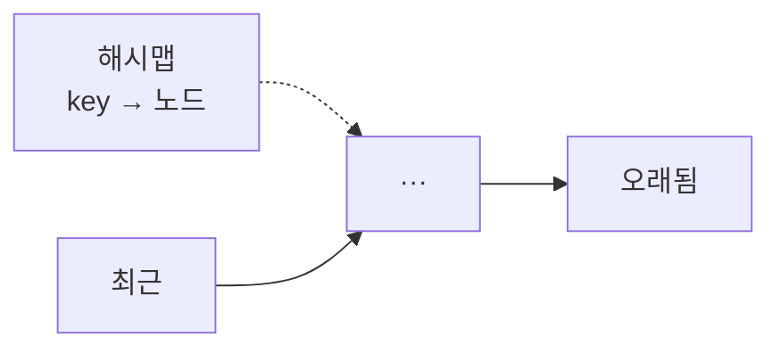
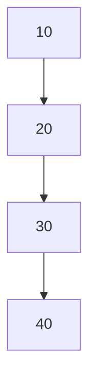
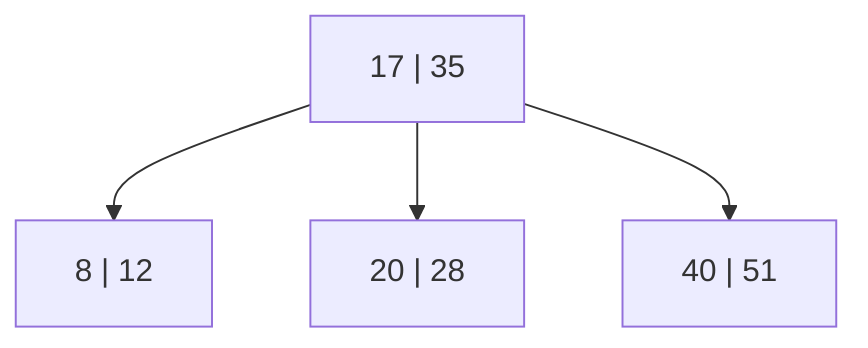
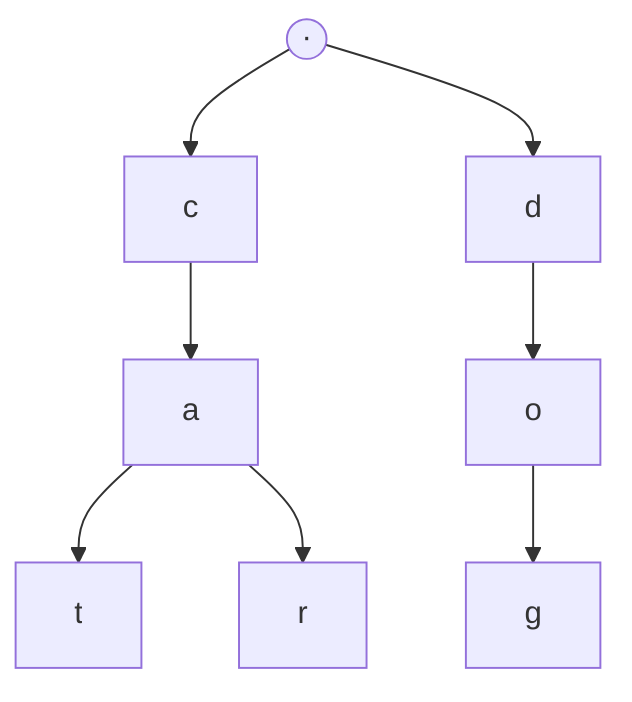

분야 핵심 개념을 얕고 넓게 정리한 노트. 쓱 훑어보며 복습한다. 카테고리마다 개념 항목이 먼저 오고, 그 뒤에 비교·응용 항목이 온다.

## 선형 구조

넣고 빼는 순서를 어떻게 제한하느냐로 갈리는 구조들.

### 스택

한쪽 끝(top)에서만 넣고 빼는 LIFO(Last In First Out) 구조. push·pop·peek 모두 top 한 곳만 건드려 O(1). 가장 최근에 넣은 것이 가장 먼저 나오므로, 중첩된 것을 역순으로 풀어야 하는 문제에 맞음 — 함수 호출과 괄호 짝이 대표적.

<svg viewBox="0 0 300 175" width="450" style="max-width:100%;height:auto" xmlns="http://www.w3.org/2000/svg" role="img" aria-label="스택은 top에서만 넣고 뺀다 (LIFO)"><defs><marker id="st-p" markerWidth="8" markerHeight="8" refX="6" refY="3" orient="auto"><path d="M0,0L6,3L0,6Z" fill="#3fae7a"/></marker><marker id="st-o" markerWidth="8" markerHeight="8" refX="6" refY="3" orient="auto"><path d="M0,0L6,3L0,6Z" fill="#e2574c"/></marker></defs><g font-size="15" text-anchor="middle" fill="currentColor"><rect x="100" y="122" width="90" height="32" rx="3" fill="none" stroke="currentColor" opacity="0.6"/><text x="145" y="143">(</text><rect x="100" y="88" width="90" height="32" rx="3" fill="none" stroke="currentColor" opacity="0.6"/><text x="145" y="109">[</text><rect x="100" y="54" width="90" height="32" rx="3" fill="#4f83e0" fill-opacity="0.12" stroke="#4f83e0"/><text x="145" y="75">{</text></g><text x="214" y="74" font-size="12" fill="#4f83e0">top</text><path d="M70 44 L70 66" stroke="#3fae7a" stroke-width="2" marker-end="url(#st-p)"/><text x="70" y="38" font-size="11" fill="#3fae7a" text-anchor="middle">push</text><path d="M50 66 L50 44" stroke="#e2574c" stroke-width="2" marker-end="url(#st-o)"/><text x="40" y="38" font-size="11" fill="#e2574c" text-anchor="middle">pop</text><text x="30" y="168" font-size="12" fill="currentColor" opacity="0.7">가장 최근에 넣은 것이 가장 먼저 나온다 (LIFO)</text></svg>

LIFO가 아니면 안 되는 이유는, 중첩을 다루려면 "가장 최근에 시작한 것"의 종류와 순서를 함께 기억해야 하기 때문. 개수만 세는 카운터는 종류를 구분 못 해 `(]`처럼 어긋난 중첩을 통과시키고, 큐는 먼저 넣은 것을 먼저 꺼내 매칭 방향이 정반대. 가장 최근 것을 꺼내주는 스택만 맞음.

게임에서 쓰이는 자리.

- UI 화면·팝업 스택 — 인벤토리 위에 장비창, 그 위에 확인 팝업이 쌓이고 뒤로가기는 가장 최근 것부터 닫음. 열린 순서의 역순으로 닫히는 중첩 구조
- 게임 상태 스택 — 일시정지를 push, 해제하면 pop해 직전 상태로 복귀. 상태를 교체하는 일반 FSM은 돌아갈 곳이 사라지는데 스택은 중첩된 복귀가 공짜(pushdown automaton)
- 오브젝트 풀 — 가장 최근 반납된 것을 재사용하면 그 메모리가 아직 CPU 캐시에 남아 있을 확률이 높아 큐보다 유리. 유니티 `ObjectPool<T>`도 내부가 `Stack<T>`
- 실행 취소 — 레벨 에디터에서 작업을 쌓고 undo는 pop. redo까지 하려면 스택 두 개로 주고받음
- DFS(Depth First Search) 백트래킹 — 미로 생성이나 대안 경로 탐색에서 재귀 대신 명시적 스택. 깊이가 깊어도 스택 오버플로가 없음

구현은 두 가지. 인터페이스는 같아도 메모리 배치가 달라 성능 성격이 갈림.

배열 기반 — 인덱스 하나가 top.

```csharp
class ArrayStack<T>                     // 비었을 때 예외 처리는 생략
{
    private T[] _items = new T[4];
    private int _count;                 // 원소 수 = 다음에 넣을 자리, top은 _count-1

    public void Push(T x)
    {
        if (_count == _items.Length)
            Array.Resize(ref _items, _items.Length * 2);   // 꽉 차면 두 배 재할당
        _items[_count++] = x;
    }

    public T Pop()
    {
        T x = _items[--_count];         // 값을 지우지 않고 인덱스만 내림
        _items[_count] = default!;      // 참조를 남기지 않아 GC가 수거 가능
        return x;
    }

    public T Peek() => _items[_count - 1];
}
```

연결 리스트 기반 — head를 갈아끼움.

```csharp
class LinkedStack<T>
{
    private sealed class Node { public T Value; public Node? Next; }
    private Node? _head;                // head가 곧 top

    public void Push(T x) => _head = new Node { Value = x, Next = _head };
    public T Pop() { T x = _head!.Value; _head = _head.Next; return x; }
}
```

| | 배열 기반 | 연결 리스트 기반 |
| --- | --- | --- |
| top 표현 | 인덱스 하나(`count-1`) | head 포인터 |
| push 최악 | O(n) — 꽉 차면 두 배 재할당 | 항상 O(1) |
| push 분할 상환 | O(1) | O(1) |
| 캐시 지역성 | 연속이라 친화적 | 흩어져 미스 잦음 |
| 할당·GC | 재할당 때만 | push마다 노드 |

배열 기반이 기본. 재할당은 드물게 일어나고, 그 대가로 연속 메모리의 캐시 이점을 매 접근마다 얻음. pop은 값을 실제로 지우지 않고 인덱스만 내려 O(1) — 단 참조형이면 꺼낸 자리를 비워야 이미 꺼낸 객체를 배열이 계속 붙들지 않음.

C# `Stack<T>`는 배열 기반에 두 배 재할당. `ConcurrentStack<T>`는 반대로 연결 리스트 기반인데, head 포인터 하나를 CAS로 갈아끼우는 것은 원자적으로 되지만 배열 재할당은 원자적으로 불가능하기 때문. 최악 지연이 튀면 안 되는 루프에서는 초기 용량을 충분히 잡아 재할당을 아예 없애는 것이 정석.

### 큐

뒤(tail)로 넣고 앞(head)에서 빼는 FIFO(First In First Out) 구조. 먼저 들어온 것이 먼저 나와 들어온 순서가 보존됨. 스택이 순서를 뒤집는 구조라면 큐는 순서를 지키는 구조.

큐가 대체 불가능한 이유는 자료구조를 바꾸면 알고리즘의 성질까지 바뀌기 때문. BFS(Breadth First Search)는 시작점에서 가까운 것부터 차례로 방문해 목표에 처음 닿은 순간이 최단 거리인데, 그 차례를 큐가 만듦 — 거리 1인 칸들을 먼저 넣었으면 거리 2인 칸들보다 먼저 꺼내짐. 큐를 스택으로 바꾸면 가장 최근 것부터 파고들어 DFS가 되고 최단 경로 보장이 사라짐.

게임에서 쓰이는 자리. 전부 "순서를 지켜 나중에 처리"라는 공통점.

- 입력·커맨드 큐 — 한 프레임에 여러 입력이 들어와도 눌린 순서대로 소비. 콤보 선입력이 이 구조
- 이벤트·메시지 큐 — 여러 시스템이 던진 이벤트를 모아 다음 프레임에 순서대로 처리. 즉시 실행하면 어떤 목록을 순회하는 중에 그 목록이 바뀌는 문제가 생기는데, 큐에 쌓아 미루면 피함
- BFS 길찾기·영역 채우기 — 격자 최단 경로, flood fill
- AI 행동 큐 — 이동 후 공격처럼 명령을 순서대로 대기
- 네트워크 수신 큐 — 도착한 패킷을 순서대로 처리

처리 순서가 의미를 가지면 큐, 가장 최근 것으로 되돌아가야 하면 스택. 오브젝트 풀이 큐가 아니라 스택인 것도 이 기준.

구현의 함정은 dequeue. 배열이나 `List<T>`로 그대로 만들면 앞을 뺄 때 뒤 원소를 전부 한 칸씩 당겨 O(n). 당기지 않고 head만 올리면 O(1)이지만 배열 앞쪽이 못 쓰는 빈 공간으로 버려져 끝없이 커짐. 그 앞쪽을 다시 쓰는 것이 원형 배열.

<svg viewBox="0 0 340 196" width="510" style="max-width:100%;height:auto" xmlns="http://www.w3.org/2000/svg" role="img" aria-label="dequeue를 단순 배열과 원형 배열로 구현했을 때의 차이"><defs><marker id="q-l" markerWidth="8" markerHeight="8" refX="6" refY="3" orient="auto"><path d="M0,0L6,3L0,6Z" fill="#e2574c"/></marker><marker id="q-h" markerWidth="8" markerHeight="8" refX="6" refY="3" orient="auto"><path d="M0,0L6,3L0,6Z" fill="#4f83e0"/></marker></defs><text x="10" y="18" font-size="11" fill="currentColor" opacity="0.75">단순 배열</text><rect x="60" y="26" width="40" height="30" rx="3" fill="none" stroke="currentColor" opacity="0.35" stroke-dasharray="4 3"/><g font-size="13" text-anchor="middle" fill="currentColor"><rect x="104" y="26" width="40" height="30" rx="3" fill="none" stroke="currentColor" opacity="0.6"/><text x="124" y="46">B</text><rect x="148" y="26" width="40" height="30" rx="3" fill="none" stroke="currentColor" opacity="0.6"/><text x="168" y="46">C</text><rect x="192" y="26" width="40" height="30" rx="3" fill="none" stroke="currentColor" opacity="0.6"/><text x="212" y="46">D</text><rect x="236" y="26" width="40" height="30" rx="3" fill="none" stroke="currentColor" opacity="0.6"/><text x="256" y="46">E</text></g><path d="M256 68 L80 68" stroke="#e2574c" stroke-width="2" marker-end="url(#q-l)"/><text x="170" y="86" font-size="11" fill="#e2574c" text-anchor="middle">뒤 원소를 전부 당김 — O(n)</text><text x="10" y="108" font-size="11" fill="currentColor" opacity="0.75">원형 배열</text><text x="124" y="112" font-size="11" fill="#4f83e0" text-anchor="middle">head</text><path d="M124 116 L124 130" stroke="#4f83e0" stroke-width="2" marker-end="url(#q-h)"/><rect x="60" y="134" width="40" height="30" rx="3" fill="none" stroke="currentColor" opacity="0.35" stroke-dasharray="4 3"/><g font-size="13" text-anchor="middle" fill="currentColor"><rect x="104" y="134" width="40" height="30" rx="3" fill="#4f83e0" fill-opacity="0.12" stroke="#4f83e0"/><text x="124" y="154" fill="#4f83e0">B</text><rect x="148" y="134" width="40" height="30" rx="3" fill="none" stroke="currentColor" opacity="0.6"/><text x="168" y="154">C</text><rect x="192" y="134" width="40" height="30" rx="3" fill="none" stroke="currentColor" opacity="0.6"/><text x="212" y="154">D</text><rect x="236" y="134" width="40" height="30" rx="3" fill="none" stroke="currentColor" opacity="0.6"/><text x="256" y="154">E</text></g><text x="170" y="186" font-size="11" fill="#4f83e0" text-anchor="middle">데이터 그대로, head만 +1 — O(1)</text></svg>

원형 배열 — head·tail을 나머지 연산으로 회전.

```csharp
class CircularQueue<T>                  // 비었을 때 예외 처리는 생략
{
    private T[] _items = new T[4];
    private int _head;                  // 다음에 꺼낼 자리
    private int _tail;                  // 다음에 넣을 자리
    private int _count;

    public void Enqueue(T x)
    {
        if (_count == _items.Length) Grow();
        _items[_tail] = x;
        _tail = (_tail + 1) % _items.Length;   // 끝에 닿으면 앞으로 회전
        _count++;
    }

    public T Dequeue()
    {
        T x = _items[_head];
        _items[_head] = default!;              // 참조를 남기지 않음
        _head = (_head + 1) % _items.Length;   // 당기지 않고 head만 이동
        _count--;
        return x;
    }

    private void Grow()
    {
        var bigger = new T[_items.Length * 2];
        for (int i = 0; i < _count; i++)                    // 감긴 순서를 0부터 펴서 복사
            bigger[i] = _items[(_head + i) % _items.Length];
        _items = bigger; _head = 0; _tail = _count;
    }
}
```

`Grow`가 포인트. 데이터가 `[D E _ _ B C]`처럼 끝을 넘어 감겨 있을 수 있어, 그냥 뒤에 공간을 붙이면 순서가 깨짐. head부터 count개를 순서대로 읽어 새 배열 0번부터 펴 담아야 함.

연결 리스트 — head와 tail 포인터를 둘 다 들고 있어야 함. tail이 없으면 enqueue가 끝까지 훑어 O(n).

```csharp
class LinkedQueue<T>
{
    private sealed class Node { public T Value; public Node? Next; }
    private Node? _head, _tail;

    public void Enqueue(T x)
    {
        var n = new Node { Value = x };
        if (_tail is null) _head = _tail = n;   // 비어 있으면 둘 다 새 노드
        else { _tail.Next = n; _tail = n; }     // 아니면 뒤에 붙이고 tail 이동
    }

    public T Dequeue()
    {
        T x = _head!.Value;
        _head = _head.Next;
        if (_head is null) _tail = null;        // 마지막을 뺐으면 tail도 비움
        return x;
    }
}
```

| | 원형 배열 | 연결 리스트 |
| --- | --- | --- |
| enqueue 최악 | O(n) — 꽉 차면 두 배 재할당 | 항상 O(1) |
| dequeue | O(1) | O(1) |
| 캐시 지역성 | 연속이라 친화적 | 흩어져 미스 잦음 |
| 할당·GC | 재할당 때만 | enqueue마다 노드 |
| 주의점 | 감긴 데이터를 펴서 재할당 | tail 포인터 없으면 enqueue가 O(n) |

C# `Queue<T>`는 원형 배열 기반으로 위 `CircularQueue`와 거의 같음. `ConcurrentQueue<T>`는 작은 원형 배열 조각(세그먼트)을 연결 리스트로 잇는 방식인데, 락 없이 커지려면 배열 전체 재할당을 피해야 하기 때문 — `ConcurrentStack<T>`가 연결 리스트인 것과 같은 이유. 고정 크기로 가장 오래된 것을 덮어쓰는 변형은 아래 원형 버퍼 항목.

### 덱(Deque)

양 끝에서 삽입·삭제가 모두 O(1)인 구조(double-ended queue). 앞뒤로 PushFront·PopFront·PushBack·PopBack 네 연산을 가짐. 스택은 한쪽 끝만, 큐는 뒤로 넣고 앞에서 빼는 한 방향만 쓰므로 덱은 둘을 포괄하는 상위 구조.

덱이 필요한 순간은 한 자료구조에서 앞뒤를 동시에 건드려야 할 때. 슬라이딩 윈도우 최댓값이 대표인데, 값이 내리막이 되도록 인덱스를 담아두고 뒤에서는 새 값보다 작은 것을 버리고 앞에서는 창을 벗어난 것을 버림 — 두 방향이 동시에 필요해 스택도 큐도 못 하고, 힙으로 풀면 O(n log n)인 것을 O(n)에 끝냄. "최근 N개 유지"도 같은 구조로, 뒤에 새것을 넣고 앞에서 오래된 것을 버림.

게임에서 쓰이는 자리.

- 입력 히스토리 버퍼 — 최근 N프레임 입력을 유지. 뒤에 새 입력을 넣고 앞에서 오래된 것을 버림. 커맨드 선입력 판정이 이 히스토리를 훑음
- 롤백 넷코드의 프레임 히스토리 — 확정된 과거 프레임은 앞에서 버리고 새 프레임은 뒤에 쌓으며, 롤백 시 뒤에서부터 되감음
- 경로 재구성 — 목표에서 부모를 거꾸로 타고 오를 때 앞에 붙이면(PushFront) 뒤집는 과정 없이 시작에서 목표 순서가 됨
- 양방향으로 꺼내야 하는 스킬·카메라 대기열

구현은 원형 배열과 이중 연결 리스트. 원형 배열은 head를 뒤로도 굴려야 해서 음수 방지가 붙음.

```csharp
// 앞에 넣을 때 head를 하나 뒤로 굴린다 — 음수가 되지 않게 length를 더하고 나머지
_head = (_head - 1 + _items.Length) % _items.Length;
_items[_head] = x;
_count++;
```

| | 원형 배열 | 이중 연결 리스트 |
| --- | --- | --- |
| 양 끝 연산 | O(1) | O(1) |
| 인덱스 접근 | O(1) | 안 됨 |
| 캐시 지역성 | 연속이라 친화적 | 흩어져 미스 잦음 |
| 할당·GC | 재할당 때만 | 삽입마다 노드 |
| 주의점 | `head - 1`이 음수가 되지 않게 | 링크가 원소마다 2개 |

단일 연결 리스트로는 덱을 만들 수 없음 — PopBack이 마지막의 앞 노드를 알아야 하는데 단일 링크면 처음부터 훑어 O(n)이 됨. 그래서 이중 링크가 필수.

C# BCL에는 덱이 없음. `Stack<T>`는 한쪽만, `Queue<T>`는 한 방향만이라 둘 다 덱이 아님. 보통 `LinkedList<T>`로 대체하는데, 이중 연결 리스트라 `AddFirst`·`AddLast`·`RemoveFirst`·`RemoveLast`가 전부 O(1)이지만 원소마다 노드를 할당함. 매 프레임 도는 입력 버퍼처럼 성능이 중요하면 원형 배열 덱을 직접 구현. Java는 `ArrayDeque`(원형 배열), C++은 `std::deque`(고정 크기 청크들의 배열)를 표준으로 제공해 C#만 빠져 있음.

### 원형 버퍼(Circular Buffer)

고정 크기 배열에서 head·tail 인덱스를 배열 크기로 나눈 나머지로 회전시켜 쓰는 큐. 데이터를 옮기지 않고 인덱스만 돌아 넣고 빼기가 모두 O(1). 큐 항목의 원형 배열과 같은 방식이지만, 결정적 차이는 크기가 고정이라는 것.

<svg viewBox="0 0 340 135" width="510" style="max-width:100%;height:auto" xmlns="http://www.w3.org/2000/svg" role="img" aria-label="원형 버퍼: 인덱스가 끝에서 처음으로 회전"><defs><marker id="cb-h" markerWidth="8" markerHeight="8" refX="6" refY="3" orient="auto"><path d="M0,0L6,3L0,6Z" fill="#4f83e0"/></marker><marker id="cb-t" markerWidth="8" markerHeight="8" refX="6" refY="3" orient="auto"><path d="M0,0L6,3L0,6Z" fill="#e2574c"/></marker><marker id="cb-w" markerWidth="9" markerHeight="9" refX="6" refY="3" orient="auto"><path d="M0,0L6,3L0,6Z" fill="currentColor"/></marker></defs><g fill="none" stroke="currentColor" opacity="0.6"><rect x="20" y="40" width="48" height="42" rx="4"/><rect x="70" y="40" width="48" height="42" rx="4"/><rect x="120" y="40" width="48" height="42" rx="4"/><rect x="170" y="40" width="48" height="42" rx="4"/><rect x="220" y="40" width="48" height="42" rx="4"/><rect x="270" y="40" width="48" height="42" rx="4"/></g><path d="M94 18 L94 38" stroke="#4f83e0" stroke-width="2" marker-end="url(#cb-h)"/><text x="94" y="14" font-size="12" fill="#4f83e0" text-anchor="middle">head</text><path d="M244 18 L244 38" stroke="#e2574c" stroke-width="2" marker-end="url(#cb-t)"/><text x="244" y="14" font-size="12" fill="#e2574c" text-anchor="middle">tail</text><path d="M300 96 C 300 120, 40 120, 42 98" fill="none" stroke="currentColor" stroke-width="1.5" opacity="0.5" stroke-dasharray="4 3" marker-end="url(#cb-w)"/><text x="170" y="130" font-size="12" fill="currentColor" text-anchor="middle" opacity="0.6">끝에서 처음으로 회전 ( % size )</text></svg>

`Queue<T>`는 꽉 차면 두 배로 늘리지만 원형 버퍼는 늘리지 않고 가장 오래된 것을 덮어씀. "최근 N개만 필요하다"는 요구에서는 오래된 데이터가 버려도 되는 값이라, 자동 덮어쓰기가 손실이 아니라 정확히 원하는 동작. 덤으로 얻는 것이 셋.

- 메모리가 일정 — 미리 잡은 배열을 재사용하므로 런타임 할당이 없고 GC(Garbage Collection)가 돌지 않음. 매 프레임 도는 코드에서 결정적
- 지연이 튀지 않음 — 재할당이 없어 모든 연산이 최악에도 O(1)
- 캐시 친화적 — 연속된 고정 배열에서 같은 메모리를 계속 돎

| | `Queue<T>` (동적) | 원형 버퍼 (고정) |
| --- | --- | --- |
| 꽉 찼을 때 | 두 배 재할당 | 가장 오래된 것 덮어쓰기(또는 거부) |
| enqueue 최악 | O(n) | O(1) |
| 런타임 할당·GC | 재할당 때 발생 | 없음 |
| 크기 | 무제한 | 고정 |
| 맞는 요구 | 전부 보관해야 함 | 최근 N개만 필요 |

꽉 찼을 때 덮어쓸지 거부할지는 설계 선택. 입력 히스토리처럼 최신이 중요하면 덮어쓰고, 잃으면 안 되는 작업 큐라면 거부하고 호출자에게 알림(`TryEnqueue`가 false를 반환하는 식). 같은 자료구조에 정책만 다름.

head와 tail만 두면 완전히 빈 상태와 꽉 찬 상태가 둘 다 `head == tail`이 되어 구별이 안 되는 고전적 함정이 있음. 비었을 때 tail이 head를 따라잡은 것과, 한 바퀴 돌아 head를 다시 만난 것이 같은 모습이기 때문. 해법 세 가지.

- 개수를 따로 셈(`_count`) — 가장 단순하고 명확해 실무 기본값
- 한 칸을 비워 둠 — `head == tail`을 항상 "빔"으로 고정. 대신 용량이 실제보다 하나 적음
- 넣은 총횟수와 뺀 총횟수를 셈 — 두 수의 차가 개수이고 인덱스는 나머지 연산으로 얻음. 락 없는 구현에서 자주 씀

```csharp
class RingBuffer<T>
{
    private readonly T[] _items;
    private int _head;                  // 다음에 꺼낼 자리
    private int _count;                 // 빔·꽉 참을 구별하려고 개수를 센다

    public RingBuffer(int capacity) => _items = new T[capacity];   // 한 번만 할당

    public int Count => _count;
    public bool IsFull => _count == _items.Length;

    public void Push(T x)               // 꽉 차면 가장 오래된 것을 덮어쓴다
    {
        int tail = (_head + _count) % _items.Length;        // tail은 head와 count로 계산
        _items[tail] = x;
        if (IsFull) _head = (_head + 1) % _items.Length;    // 덮어썼으니 head도 밀린다
        else _count++;
    }

    public T Pop()
    {
        T x = _items[_head];
        _items[_head] = default!;
        _head = (_head + 1) % _items.Length;
        _count--;
        return x;
    }

    // 최근 것부터 i번째 — 입력 히스토리를 거꾸로 훑을 때
    public T FromNewest(int i) => _items[(_head + _count - 1 - i + _items.Length) % _items.Length];
}
```

tail을 필드로 두지 않고 `(_head + _count) % length`로 계산하는 것이 포인트. 인덱스 둘을 따로 관리하면 덮어쓸 때 둘을 동시에 맞춰야 해서 실수가 나는데, head와 count만 진실로 두면 그 버그가 사라짐. Push에서 꽉 찬 경우에만 head를 미는 것도 중요 — 덮어쓰면 가장 오래된 값이 사라지니 그 위치가 한 칸 전진해야 하고, 이때 `_count`는 그대로.

쓰이는 자리.

- 격투 게임 입력 버퍼 — 최근 N프레임 입력을 유지하고 커맨드 판정이 거꾸로 훑음. 매 프레임 돌면서 할당이 0이어야 하므로 정석
- 롤백 넷코드의 프레임 스냅샷 — 되감을 수 있는 최대 프레임 수만큼만 유지
- 오디오 링 버퍼 — 생산자와 소비자가 서로 다른 스레드에서 도는 대표 사례. 크기 고정에 최악 O(1)이라 실시간 오디오 콜백에서 안전
- 최근 로그·프로파일링 샘플 — 최근 300프레임의 프레임 타임을 담아 그래프로 그리는 식

BCL에는 원형 버퍼가 없어 직접 구현함. `Queue<T>`에 상한 로직을 얹는 방법도 있지만 자동 덮어쓰기가 안 되고 인덱스 접근도 안 되므로, 히스토리를 훑는 용도에는 맞지 않음.

## 배열과 연결 리스트

연속 메모리냐 흩어진 노드냐가 성능 차이의 뿌리.

### 배열과 동적 배열

고정 크기의 연속된 메모리에 같은 타입 원소를 담는 구조. 동적 배열(C# `List<T>`)은 내부에 배열을 하나 두고 꽉 차면 더 큰 배열로 옮겨 크기 제한을 없앤 것 — 별개의 자료구조가 아니라 배열을 감싼 것.

인덱스 접근이 O(1)인 이유는 주소를 계산할 수 있기 때문. 원소가 연속이고 크기가 전부 같아서 `base + i × 원소 크기`로 한 번에 나옴. 그래서 `a[0]`이든 `a[999999]`든 같은 시간. 연결 리스트가 O(n)인 것도 노드가 흩어져 이 계산이 불가능해 링크를 하나씩 세야 하기 때문.

<svg viewBox="0 0 340 140" width="510" style="max-width:100%;height:auto" xmlns="http://www.w3.org/2000/svg" role="img" aria-label="연속 배열의 주소 계산과 캐시 라인"><text x="168" y="30" font-size="10" fill="currentColor" opacity="0.7" text-anchor="middle">캐시 라인 한 번에 함께 올라온다</text><path d="M26 46 L26 38 L310 38 L310 46" fill="none" stroke="currentColor" stroke-width="1.5" opacity="0.5"/><g font-size="13" text-anchor="middle"><rect x="26" y="54" width="44" height="34" rx="3" fill="#4f83e0" fill-opacity="0.12" stroke="#4f83e0"/><text x="48" y="76" fill="#4f83e0">0</text><rect x="74" y="54" width="44" height="34" rx="3" fill="#4f83e0" fill-opacity="0.12" stroke="#4f83e0"/><text x="96" y="76" fill="#4f83e0">1</text><rect x="122" y="54" width="44" height="34" rx="3" fill="#4f83e0" fill-opacity="0.12" stroke="#4f83e0"/><text x="144" y="76" fill="#4f83e0">2</text><rect x="170" y="54" width="44" height="34" rx="3" fill="#4f83e0" fill-opacity="0.12" stroke="#4f83e0"/><text x="192" y="76" fill="#4f83e0">3</text><rect x="218" y="54" width="44" height="34" rx="3" fill="#4f83e0" fill-opacity="0.12" stroke="#4f83e0"/><text x="240" y="76" fill="#4f83e0">4</text><rect x="266" y="54" width="44" height="34" rx="3" fill="#4f83e0" fill-opacity="0.12" stroke="#4f83e0"/><text x="288" y="76" fill="#4f83e0">5</text></g><g font-size="10" text-anchor="middle" fill="currentColor" opacity="0.55"><text x="48" y="104">+0</text><text x="96" y="104">+4</text><text x="144" y="104">+8</text><text x="192" y="104">+12</text><text x="240" y="104">+16</text><text x="288" y="104">+20</text></g><text x="168" y="128" font-size="11" fill="currentColor" opacity="0.75" text-anchor="middle">주소 = base + i × 원소 크기</text></svg>

순회까지 빠른 것은 캐시 라인 때문. CPU는 바이트 하나가 아니라 캐시 라인 단위(보통 64바이트)로 퍼오므로, `int`(4바이트)라면 한 번에 16개가 올라옴. 배열을 순서대로 훑으면 첫 원소에서 미스가 한 번 나고 이어지는 15개는 공짜라 미스가 16분의 1로 줄어듦. 노트 곳곳에 반복되는 "캐시 지역성"이 전부 이 한 가지에서 나옴.

게임에서 의식적으로 배열을 고르는 자리.

- 파티클·엔티티 데이터 — 수천 개를 매 프레임 순회하므로 연속 배열이어야 함. 필드별로 배열을 쪼개면 필요한 필드만 캐시에 올려 미스를 더 줄임(유니티 DOTS가 이 설계)
- 그리드 맵 — 2차원 격자를 1차원으로 펴서 `grid[y * width + x]`로 쓰는 경우가 많음. 단일 차원 배열이 JIT 최적화를 더 잘 받아 인덱싱이 빠름
- 정점·인덱스 버퍼 — GPU로 넘기려면 애초에 연속 메모리여야 함
- 오브젝트 풀의 저장소 — 미리 배열로 잡아두고 재사용

| | `T[,]` (다차원) | `T[][]` (배열의 배열) |
| --- | --- | --- |
| 메모리 | 한 덩어리 연속 | 행마다 따로 할당돼 흩어짐 |
| 행 길이 | 전부 같음 | 행마다 다를 수 있음 |
| 맞는 곳 | 격자 | 행 길이가 들쭉날쭉할 때 |

```csharp
var list = new List<int>();      // 내부 배열 아직 없음
list.Add(1);                      // 이 순간 작은 배열을 잡는다
// list.Count = 1, list.Capacity = 4

var sized = new List<int>(1000);  // 용량을 미리 잡으면 재할당이 아예 없다
// sized.Count = 0, sized.Capacity = 1000
```

`Count`는 담긴 개수, `Capacity`는 확보한 칸 수로 둘을 섞으면 안 됨 — `new List<int>(1000)`은 원소 1000개가 아니라 빈 리스트에 자리만 1000칸 잡은 것. 크기를 미리 알면 용량을 지정해 만드는 것이 정석이고, 매 프레임 리스트를 채우는 코드라면 이것만으로 GC 압박이 크게 줄어듦. 배열 일부를 복사 없이 넘겨야 하면 `Span<T>`를 씀(배열 구간을 가리키는 뷰). 재할당이 왜 분할 상환 O(1)인지는 아래 `분할 상환` 항목.

### 연결 리스트

원소를 노드에 담고, 노드가 다음 노드의 참조를 들고 이어지는 구조. 메모리에 연속으로 놓이지 않고 노드마다 따로 할당되므로 위치는 링크로만 알 수 있음. 배열이 위치를 계산하는 구조라면 연결 리스트는 위치를 물어가는 구조고, 여기서 모든 성질이 갈림.

```csharp
class Node<T>
{
    public T Value;
    public Node<T>? Next;    // 다음 노드의 참조 — 이게 "링크"
}
```

인덱스 접근이 O(n)인 것은 주소 계산이 원리적으로 불가능하기 때문. 노드가 어디에 흩어져 있는지 규칙이 없어 `i`번째 주소를 알 방법이 링크를 `i`번 따라가는 것뿐. 게다가 각 점프가 캐시 미스일 수 있어, 같은 O(n) 순회라도 배열은 캐시 라인당 여러 개를 공짜로 얻는 반면 연결 리스트는 원소마다 미스를 낼 수 있음 — 실측이 몇 배씩 벌어지는 이유.

얻는 것은 노드를 이미 쥐고 있을 때의 진짜 O(1) 삽입·삭제. 링크 몇 개만 바꾸고 다른 원소는 건드리지 않음.

```csharp
newNode.Next = node.Next;    // node 뒤에 끼운다 — 다른 원소는 그대로
node.Next = newNode;
```

원소 주소가 변하지 않는 것도 장점. 배열은 재할당되면 모든 원소가 새 위치로 옮겨가 원소를 가리키던 참조가 무의미해질 수 있지만, 노드는 한번 할당되면 제자리에 있음.

| | 배열 | 연결 리스트 |
| --- | --- | --- |
| 인덱스 접근 | O(1) | O(n) |
| 순회 실측 | 캐시 라인당 여러 개 | 노드마다 미스 가능 |
| 위치를 아는 삽입·삭제 | O(n) (밀어야 함) | O(1) (링크만) |
| 원소 주소 | 재할당 시 변함 | 고정 |
| 메모리 | 값만 (+빈 용량) | 값 + 노드마다 링크·객체 헤더 |

함정은 "O(1) 삽입"이 위치를 알 때만이라는 것. 탐색해서 그 지점까지 가는 비용이 O(n)이므로 "탐색 후 삽입"이면 전체 O(n)이고, 이때는 배열과 복잡도가 같으며 캐시까지 고려하면 배열이 더 빠른 경우가 흔함. 실제로 이기는 것은 순회하다가 지금 쥔 노드를 그 자리에서 빼거나 끼울 때.

메모리 대가도 큼. 64비트 .NET에서 `int` 하나를 담는 클래스 노드는 객체 헤더 16바이트에 링크 참조 8바이트, 값 4바이트로 정렬까지 하면 대략 32바이트 — 배열의 4바이트 대비 8배. 노드마다 별개 객체라 GC가 추적할 대상도 원소 수만큼 늘어남.

직접 고르는 일은 드물고 대개 다른 구조의 부품으로 들어감.

- LRU 캐시 — 이중 연결 리스트와 해시맵을 조합해 노드를 O(1)에 떼어 맨 앞으로 옮김
- 해시 테이블의 분리 연결 — 같은 버킷에 충돌한 항목들을 이어 붙임. C# `Dictionary`가 이 방식
- 순회 중 제거가 잦은 목록 — 이벤트 구독자 목록 등
- 불변·동시성 구조의 기반 — `ImmutableStack<T>`, `ConcurrentStack<T>`, `ConcurrentQueue<T>`의 세그먼트 연결. 재할당 없이 커지거나 구조를 공유해야 하는 곳에서는 배열을 쓸 수 없음

C# `LinkedList<T>`는 이중 연결 리스트로 `AddFirst`·`AddLast`·`Remove(node)`가 O(1). 인덱서가 아예 없어 `list[3]`을 못 쓰는데, 그게 O(n)임을 API 차원에서 막아둔 셈.

### 연결 리스트 종류 — 단일 / 이중 / 원형

링크를 어떻게 걸었느냐의 차이. 단일은 `Next`만, 이중은 `Prev`와 `Next`, 원형은 마지막이 다시 처음을 가리킴.

이중이 필요한 이유는 노드를 떼어내려면 그 앞 노드의 `Next`를 고쳐야 하기 때문. 단일 링크면 head부터 다시 훑어 O(n)이 되고, `Prev`가 있으면 O(1).

```csharp
// 이중: 앞뒤를 서로 잇고 끝 — 손에 쥔 노드를 O(1)에 뗀다
node.Prev.Next = node.Next;
node.Next.Prev = node.Prev;
```

그래서 임의 노드 삭제와 뒤에서 빼기가 필요하면 이중이 강제됨. 반대로 스택처럼 한쪽 끝만 건드리면 단일로 충분하고, 그때는 링크 하나를 아끼는 게 이득.

원형은 용도가 둘. 하나는 순환 순회로, 턴제 순서를 돌릴 때 `current = current.Next`만 반복하면 되고 끝에서 처음으로 되돌리는 분기가 사라짐. 다른 하나는 마지막 노드를 O(1)에 얻는 것으로, 원형 이중에서는 `head.Prev`가 곧 마지막이라 `tail` 필드를 따로 두고 동기화할 필요가 없음. C# `LinkedList<T>`가 실제로 원형 이중 연결 리스트이고 `Last`를 `head.prev`로 돌려줌.

<svg viewBox="0 0 340 150" width="510" style="max-width:100%;height:auto" xmlns="http://www.w3.org/2000/svg" role="img" aria-label="원형 이중 연결 리스트에서 head의 prev가 마지막 노드"><defs><marker id="cl-f" markerWidth="8" markerHeight="8" refX="6" refY="3" orient="auto"><path d="M0,0L6,3L0,6Z" fill="#4f83e0"/></marker><marker id="cl-w" markerWidth="8" markerHeight="8" refX="6" refY="3" orient="auto"><path d="M0,0L6,3L0,6Z" fill="#3fae7a"/></marker></defs><g font-size="10" text-anchor="middle" fill="currentColor" opacity="0.7"><text x="58" y="36">head</text><text x="282" y="36">Last</text></g><g font-size="13" text-anchor="middle"><rect x="30" y="44" width="56" height="32" rx="3" fill="#4f83e0" fill-opacity="0.12" stroke="#4f83e0"/><text x="58" y="65" fill="#4f83e0">A</text><rect x="142" y="44" width="56" height="32" rx="3" fill="#4f83e0" fill-opacity="0.12" stroke="#4f83e0"/><text x="170" y="65" fill="#4f83e0">B</text><rect x="254" y="44" width="56" height="32" rx="3" fill="#4f83e0" fill-opacity="0.12" stroke="#4f83e0"/><text x="282" y="65" fill="#4f83e0">C</text></g><g stroke="#4f83e0" stroke-width="1.5" fill="none"><path d="M90 54 L134 54" marker-end="url(#cl-f)"/><path d="M202 54 L246 54" marker-end="url(#cl-f)"/><path d="M138 68 L94 68" marker-end="url(#cl-f)"/><path d="M250 68 L206 68" marker-end="url(#cl-f)"/></g><path d="M282 80 L282 104 L58 104 L58 82" fill="none" stroke="#3fae7a" stroke-width="1.5" stroke-dasharray="4 3" marker-end="url(#cl-w)"/><g font-size="10" text-anchor="middle" fill="currentColor" opacity="0.7"><text x="170" y="126">마지막의 next는 head, head의 prev는 마지막</text><text x="170" y="142">tail 필드 없이 Last를 O(1)에 얻는다</text></g></svg>

센티널(더미 노드)은 원형과 자주 같이 씀. 값이 없는 더미 하나를 항상 두고 원의 기준점으로 삼으면, 리스트가 비었는지·지금 노드가 첫째인지 마지막인지에 따른 `null` 검사가 전부 사라짐. 빈 리스트는 더미가 자기 자신을 가리키는 상태로 표현됨. 경계 조건을 자료구조 모양으로 없애는 기법이고, 삭제 코드가 위 두 줄로 줄어듦.

| 종류 | 링크 | 강제되는 조건 | 쓰이는 곳 |
| --- | --- | --- | --- |
| 단일 | `Next` | 한쪽 끝만 건드림 | 스택, 오브젝트 풀의 빈 슬롯 목록, 불변 스택 |
| 이중 | `Prev` + `Next` | 임의 노드 삭제, 뒤에서 빼기 | LRU 캐시, 덱, 순회 중 제거 |
| 원형 | 끝이 처음을 가리킴 | 순환 순회, `tail` 없이 마지막 접근 | 턴 순서, 라운드로빈, `LinkedList<T>` |

기본은 필요한 최소 링크를 고르는 것. 이중은 노드마다 참조 8바이트를 더 쓰고 삽입·삭제 때 링크를 두 개씩 갱신하므로, 한쪽 끝만 쓰는데 이중을 고르면 낭비. 게임에서 원형이 빛나는 자리로 AI 업데이트 분산이 있음 — 적 수백 마리를 원형으로 이어 두고 매 프레임 일부만 진행시키면 한 바퀴 돌며 자연히 전부 갱신되고 인덱스 경계 처리가 필요 없음.

### 분할 상환

한 연산이 최악에 느릴 수 있어도, 연속된 n번의 총비용을 n으로 나눈 평균이 상수면 그 연산을 분할 상환 O(1)이라 부름. 비싼 연산의 비용을 뒤따르는 싼 연산들에 나눠 치르는 것으로, 자료구조가 아니라 분석 기법.

대표가 동적 배열의 확장. 내부 배열이 가득 차면 두 배로 늘려 재할당하므로 그 한 번은 O(n) 복사지만, 두 배씩 늘리니 재할당 간격이 벌어져 점점 드물어짐.

| 추가 시점 | 용량 변화 | 복사한 원소 수 |
| --- | --- | --- |
| 5번째 | 4에서 8로 | 4 |
| 9번째 | 8에서 16으로 | 8 |
| 17번째 | 16에서 32로 | 16 |

복사량이 `4 + 8 + 16`처럼 등비수열이라 마지막 복사량의 두 배를 넘지 않음(`n + n/2 + n/4 + … < 2n`). 그래서 n번 추가의 총 복사 비용이 O(n)이고, n으로 나누면 추가당 평균이 상수.

핵심은 얼마나 늘리느냐가 아니라 더하느냐 곱하느냐. 매번 고정량 `c`를 더하면 재할당이 `n/c`번 일어나고 총 복사량이 `n²/(2c)`이라, `c`를 아무리 키워도 상수배만 작아지고 제곱은 그대로임.

| | +c씩 (가산적) | r배씩 (승법적) |
| --- | --- | --- |
| 재할당 횟수 | n / c — n에 비례 | log n |
| 총 복사량 | n² / (2c) | n × r/(r−1) |
| 추가당 평균 | O(n) | O(1) |

<svg viewBox="0 0 340 150" width="510" style="max-width:100%;height:auto" xmlns="http://www.w3.org/2000/svg" role="img" aria-label="가산적 성장과 승법적 성장의 재할당 지점 분포"><text x="20" y="28" font-size="10" fill="currentColor" opacity="0.75">+c씩 (가산적)</text><line x1="20" y1="48" x2="320" y2="48" stroke="currentColor" stroke-width="1.5" opacity="0.4"/><g stroke="#e2574c" stroke-width="2"><line x1="45" y1="42" x2="45" y2="54"/><line x1="70" y1="42" x2="70" y2="54"/><line x1="95" y1="42" x2="95" y2="54"/><line x1="120" y1="42" x2="120" y2="54"/><line x1="145" y1="42" x2="145" y2="54"/><line x1="170" y1="42" x2="170" y2="54"/><line x1="195" y1="42" x2="195" y2="54"/><line x1="220" y1="42" x2="220" y2="54"/><line x1="245" y1="42" x2="245" y2="54"/><line x1="270" y1="42" x2="270" y2="54"/><line x1="295" y1="42" x2="295" y2="54"/><line x1="320" y1="42" x2="320" y2="54"/></g><text x="20" y="70" font-size="10" fill="currentColor" opacity="0.6">재할당 n/c번 — 끝까지 고르게 계속</text><text x="20" y="100" font-size="10" fill="currentColor" opacity="0.75">두 배씩 (승법적)</text><line x1="20" y1="120" x2="320" y2="120" stroke="currentColor" stroke-width="1.5" opacity="0.4"/><g stroke="#3fae7a" stroke-width="2"><line x1="22" y1="114" x2="22" y2="126"/><line x1="25" y1="114" x2="25" y2="126"/><line x1="29" y1="114" x2="29" y2="126"/><line x1="39" y1="114" x2="39" y2="126"/><line x1="58" y1="114" x2="58" y2="126"/><line x1="95" y1="114" x2="95" y2="126"/><line x1="170" y1="114" x2="170" y2="126"/><line x1="320" y1="114" x2="320" y2="126"/></g><text x="20" y="142" font-size="10" fill="currentColor" opacity="0.6">재할당 log n번 — 간격이 두 배씩 벌어짐</text></svg>

C# `List<T>`는 두 배와 "지금 당장 필요한 크기" 중 큰 쪽을 씀. 하나씩 넣을 때는 두 배가 이기고, `AddRange`로 한꺼번에 많이 넣을 때는 필요한 크기가 이김. 1.5배를 쓰는 구현도 있는데(C++ 일부), 배수이기만 하면 성립하므로 메모리 낭비를 줄이려는 선택.

분할 상환은 평균(average-case)과 다름. 평균은 입력이 어떤 분포라는 가정 아래의 기대값이라 가정이 깨지면 같이 깨지지만, 분할 상환은 가정 없이 어떤 호출 순서가 와도 n번의 총비용이 보장되는 결정적 상한. 그래서 `List.Add`는 분할 상환 O(1), `HashSet.Contains`는 평균 O(1)로 용어가 다르게 붙음 — 후자는 해시가 고르게 흩어진다는 가정에 의존하고 한 버킷에 몰리면 O(n)이 됨.

이 논리가 쓰이는 곳.

- 동적 배열·스택·큐의 내부 배열 확장 — 모두 같은 두 배 재할당
- 해시 테이블의 리사이징과 재해싱 — 로드 팩터를 넘을 때만 일어나므로 삽입당 평균은 상수
- 유니온-파인드의 경로 압축과 랭크 합치기 — 분할 상환으로 거의 상수 O(α(n))
- 원형 버퍼는 이것을 피하는 쪽 — 고정 크기라 재할당이 없어 최악에도 O(1)

대가도 분명함. 개별 호출 하나는 O(n)이라 하필 재할당이 걸리는 그 프레임이 튀고, 두 배로 잡으니 메모리가 최대 절반 남고, 버려진 옛 배열이 가비지가 됨(큰 배열은 대형 객체 영역으로 가 회수가 늦음). 매 호출 지연이 일정해야 하는 실시간에서는 평균이 아니라 최악을 기준으로 봐야 함. 최종 크기를 알면 생성 시 용량을 지정하거나 `EnsureCapacity`로 미리 확보하고, 다 채운 뒤 남은 용량이 아까우면 `TrimExcess`로 줄임.

## 해시

키에서 위치를 계산해 평균 O(1)을 얻는 구조들.

### 해시 테이블

키를 해시 함수로 정수로 바꾸고, 그 값으로 배열의 몇 번째 칸(버킷)에 둘지를 정해 저장. 저장과 조회가 같은 계산을 하므로 같은 칸으로 감.

<svg viewBox="0 0 340 150" width="510" style="max-width:100%;height:auto" xmlns="http://www.w3.org/2000/svg" role="img" aria-label="키가 해시 함수를 거쳐 버킷 위치로 바뀌는 흐름"><defs><marker id="ht-a" markerWidth="8" markerHeight="8" refX="6" refY="3" orient="auto"><path d="M0,0L6,3L0,6Z" fill="currentColor"/></marker><marker id="ht-b" markerWidth="8" markerHeight="8" refX="6" refY="3" orient="auto"><path d="M0,0L6,3L0,6Z" fill="#4f83e0"/></marker></defs><g font-size="11" text-anchor="middle" fill="currentColor"><rect x="20" y="16" width="70" height="26" rx="3" fill="none" stroke="currentColor" opacity="0.55"/><text x="55" y="33">"sword"</text><rect x="110" y="16" width="90" height="26" rx="3" fill="none" stroke="currentColor" opacity="0.55"/><text x="155" y="33">해시 함수</text><rect x="220" y="16" width="60" height="26" rx="3" fill="none" stroke="currentColor" opacity="0.55"/><text x="250" y="33">1193</text></g><g stroke="currentColor" stroke-width="1.5" opacity="0.6" fill="none"><path d="M94 29 L104 29" marker-end="url(#ht-a)"/><path d="M204 29 L214 29" marker-end="url(#ht-a)"/></g><text x="170" y="62" font-size="11" fill="currentColor" text-anchor="middle">1193 % 8 = 1</text><path d="M170 68 L170 78 L75 78 L75 88" fill="none" stroke="#4f83e0" stroke-width="1.5" marker-end="url(#ht-b)"/><g><rect x="20" y="92" width="34" height="30" rx="3" fill="none" stroke="currentColor" opacity="0.5"/><rect x="58" y="92" width="34" height="30" rx="3" fill="#4f83e0" fill-opacity="0.12" stroke="#4f83e0"/><rect x="96" y="92" width="34" height="30" rx="3" fill="none" stroke="currentColor" opacity="0.5"/><rect x="134" y="92" width="34" height="30" rx="3" fill="none" stroke="currentColor" opacity="0.5"/><rect x="172" y="92" width="34" height="30" rx="3" fill="none" stroke="currentColor" opacity="0.5"/><rect x="210" y="92" width="34" height="30" rx="3" fill="none" stroke="currentColor" opacity="0.5"/><rect x="248" y="92" width="34" height="30" rx="3" fill="none" stroke="currentColor" opacity="0.5"/><rect x="286" y="92" width="34" height="30" rx="3" fill="none" stroke="currentColor" opacity="0.5"/></g><g font-size="9" text-anchor="middle" fill="currentColor" opacity="0.55"><text x="37" y="138">0</text><text x="75" y="138">1</text><text x="113" y="138">2</text><text x="151" y="138">3</text><text x="189" y="138">4</text><text x="227" y="138">5</text><text x="265" y="138">6</text><text x="303" y="138">7</text></g></svg>

평균 O(1)인 원리는 배열과 같음. 배열이 `base + i × 원소 크기`로 위치를 계산했듯, 해시 테이블은 임의의 키를 정수로 만들어 위치를 계산함. 결정적인 것은 비교 횟수가 데이터 개수와 무관하다는 점.

| | 비교 횟수 |
| --- | --- |
| List 선형 탐색 | n번 |
| 이진 탐색 트리 | log n번 |
| 해시 테이블 | 상수 번 |

단 이 O(1)은 키가 버킷에 고르게 흩어진다는 가정 아래의 평균(average-case)이라, 한 버킷으로 몰리면 O(n)으로 떨어짐. 어떤 입력에도 보장되는 분할 상환과 다름 — 적대적으로 같은 버킷에 몰리는 키를 넣으면 실제로 깨짐(해시 충돌 공격이 이 원리). 충돌 관리는 아래 `해시 충돌과 최악 O(n)` 항목. 또 "O(1)"은 해시 계산을 상수로 본 것이고, 문자열 키는 문자를 전부 훑으므로 실제로는 키 길이에 비례.

대가는 순서를 완전히 포기하는 것.

- 정렬 순서가 없음 — "가장 작은 키"나 범위 질의를 못 함. 필요하면 트리 기반 `SortedDictionary`로 가고 O(log n)을 받아들임
- 순회 순서가 보장되지 않음 — 넣은 순서대로 나온다는 보장이 없어 의존하면 안 됨
- 인덱스 접근이 없음 — "0번째 항목"이라는 개념 자체가 없음

게임에서 쓰이는 자리.

- ID로 오브젝트 조회 — 스폰된 엔티티를 `Dictionary<int, Entity>`로 들고 네트워크 메시지의 ID로 찾음
- 에셋·프리팹 캐시 — 경로나 이름으로 이미 로드한 리소스를 찾음
- 중복 제거 — 길찾기의 닫힌 집합, 이미 처리한 대상 집합을 `HashSet`으로
- 로컬라이즈 키 테이블 — 문자열 키로 번역문을 찾음

매 프레임 문자열 키로 조회하는 것은 피함. 해시 계산이 문자 길이에 비례하고, 문자열을 즉석에서 만들면 GC 쓰레기까지 생김. 문자열을 미리 정수 해시로 바꿔 두고 그것을 키로 씀.

```csharp
// 나쁨: 매 프레임 문자열 해시 계산
animator.SetFloat("Speed", v);

// 좋음: 해시를 한 번만 계산해 캐시
static readonly int SpeedId = Animator.StringToHash("Speed");
animator.SetFloat(SpeedId, v);
```

실제 구현은 교과서와 다름. 교과서의 분리 연결은 버킷마다 노드 객체를 연결 리스트로 매달아 노드가 흩어지고 항목마다 객체 헤더 16바이트가 붙음. C# `Dictionary`는 노드를 아예 만들지 않고 배열 두 개만 씀.

- `Entry[] _entries` — 실제 항목이 넣은 순서대로 빈틈없이 담김. `Entry`는 구조체로 `{ hashCode, next, key, value }`를 가짐
- `int[] _buckets` — 각 버킷이 "그 버킷의 첫 항목이 `_entries`의 몇 번째인지"를 담음. 참조가 아니라 정수 인덱스. 실제로는 인덱스 + 1을 저장해 배열 기본값 0을 "빈 버킷"으로 씀(`next`는 실제 인덱스이고 -1이 끝). 아래 그림은 이해를 위해 인덱스 그대로 표시

같은 버킷의 항목들은 `entry.next`에 다음 항목의 인덱스를 담아 이어짐. 포인터로 잇는 게 아니라 같은 배열 안의 번호로 이음.

<svg viewBox="0 0 340 180" width="510" style="max-width:100%;height:auto" xmlns="http://www.w3.org/2000/svg" role="img" aria-label="buckets 배열과 entries 배열을 인덱스로 이은 체인"><defs><marker id="dc-a" markerWidth="8" markerHeight="8" refX="6" refY="3" orient="auto"><path d="M0,0L6,3L0,6Z" fill="#4f83e0"/></marker></defs><text x="52" y="42" font-size="10" fill="currentColor" opacity="0.75" text-anchor="end">buckets</text><g font-size="12" text-anchor="middle" fill="currentColor"><rect x="60" y="24" width="50" height="26" rx="3" fill="none" stroke="currentColor" opacity="0.55"/><text x="85" y="42">—</text><rect x="114" y="24" width="50" height="26" rx="3" fill="#4f83e0" fill-opacity="0.12" stroke="#4f83e0"/><text x="139" y="42" fill="#4f83e0">2</text><rect x="168" y="24" width="50" height="26" rx="3" fill="none" stroke="currentColor" opacity="0.55"/><text x="193" y="42">—</text><rect x="222" y="24" width="50" height="26" rx="3" fill="none" stroke="currentColor" opacity="0.55"/><text x="247" y="42">1</text></g><g font-size="9" text-anchor="middle" fill="currentColor" opacity="0.55"><text x="85" y="64">0</text><text x="139" y="64">1</text><text x="193" y="64">2</text><text x="247" y="64">3</text></g><path d="M139 52 L139 70 L282 70 L282 80" fill="none" stroke="#4f83e0" stroke-width="1.5" marker-end="url(#dc-a)"/><text x="52" y="112" font-size="10" fill="currentColor" opacity="0.75" text-anchor="end">entries</text><g fill="currentColor"><rect x="60" y="84" width="84" height="50" rx="3" fill="none" stroke="currentColor" opacity="0.55"/><text x="66" y="98" font-size="9" opacity="0.6">[0]</text><text x="102" y="114" font-size="12" text-anchor="middle">A</text><text x="102" y="128" font-size="9" text-anchor="middle" opacity="0.7">next = -1</text><rect x="150" y="84" width="84" height="50" rx="3" fill="none" stroke="currentColor" opacity="0.55"/><text x="156" y="98" font-size="9" opacity="0.6">[1]</text><text x="192" y="114" font-size="12" text-anchor="middle">B</text><text x="192" y="128" font-size="9" text-anchor="middle" opacity="0.7">next = -1</text><rect x="240" y="84" width="84" height="50" rx="3" fill="#4f83e0" fill-opacity="0.12" stroke="#4f83e0"/><text x="246" y="98" font-size="9" opacity="0.6">[2]</text><text x="282" y="114" font-size="12" text-anchor="middle" fill="#4f83e0">C</text><text x="282" y="128" font-size="9" text-anchor="middle" fill="#4f83e0">next = 0</text></g><path d="M282 136 L282 150 L102 150 L102 138" fill="none" stroke="#4f83e0" stroke-width="1.5" marker-end="url(#dc-a)"/><text x="170" y="172" font-size="10" fill="currentColor" opacity="0.7" text-anchor="middle">A와 C가 같은 버킷 — 노드 없이 인덱스로 이어진다</text></svg>

조회는 세 걸음. 키의 해시를 버킷 개수로 나눈 나머지로 버킷을 정하고, 그 버킷에 담긴 인덱스로 `_entries`의 칸을 보고, 키가 다르면 `next` 인덱스로 옮겨 감. `next`가 `-1`이면 체인의 끝이라 없다고 판정.

빠른 이유는 둘. 체인을 따라가도 같은 배열의 다른 칸으로 가는 것이라 흩어진 힙 객체로 뛰는 것보다 캐시에 올라와 있을 확률이 높고, `Entry`가 구조체라 항목마다 붙던 객체 헤더가 없어 같은 캐시 라인에 더 많이 들어옴. 연결 리스트의 논리적 구조는 쓰면서 물리적 배치는 버린 셈.

버킷 개수로 소수를 쓰는 이유도 같은 식으로 설명됨. 버킷이 16개면 `hash % 16`은 하위 4비트만 보는 것과 같아 상위 비트가 버려지므로, 해시가 하필 16의 배수로 나오는 패턴이면 전부 버킷 0으로 몰림. 17개로 하면 상위 비트까지 계산에 섞여 흩어짐 — 나쁜 해시의 패턴을 깨뜨리는 보험.

순회 순서가 보장되지 않는 것은 삭제 때문. 항목을 지우면 그 칸이 빈 자리가 되고 빈 자리들을 free list로 이어 두는데, 새 항목을 넣을 때 배열 끝에 붙이지 않고 그 빈 자리를 재사용함. 그래서 지우고 넣기를 섞으면 넣은 순서와 배열 순서가 어긋남. 삭제가 없으면 실제로는 넣은 순서로 나오지만 구현의 부수 효과일 뿐 계약이 아님.

크기를 알면 `new Dictionary<K, V>(capacity)`로 미리 잡아 리사이징과 재해싱을 없앰 — 위 `분할 상환` 항목의 논리. `HashSet<T>`도 값 없이 키만 담는 같은 구조.

### 포함 여부 확인 — List vs Dictionary vs HashSet

| | 포함 여부 확인 | 왜 |
| --- | --- | --- |
| `List` | O(n) | 앞에서부터 다 훑음 |
| `Dictionary` (`ContainsKey`) | 평균 O(1) | 키를 해시해 버킷으로 직행 |
| `HashSet` | 평균 O(1) | 같은 해시 방식, 값을 담지 않음 |

선택 기준은 속도가 아니라 무엇을 함께 저장하느냐.

- `HashSet<T>` — 존재 여부만. "이 적을 이미 처리했나", "이 태그를 갖고 있나"
- `Dictionary<K, V>` — 키에 값을 매달아야 할 때. "이 ID의 엔티티는 무엇인가"
- `List<T>` — 순서와 인덱스가 필요하고 포함 여부 확인은 부수적일 때

그래서 "HashSet이 빠르니 다 바꾸자"가 아니라 잃는 것을 보고 고르는 것. `HashSet`은 순서·인덱스 접근·중복 저장을 전부 포기함.

함정 둘. `ContainsValue`는 O(n) — `Dictionary`의 O(1)은 키로 찾을 때만이고 값은 색인되지 않으므로 값으로 찾으면 전부 훑음. 값으로도 빨리 찾아야 하면 역방향 딕셔너리를 따로 둠.

다른 하나는 작은 컬렉션에서는 `List`가 더 빠를 수 있다는 것. 원소가 수십 개 이하면 선형 탐색이 연속 메모리를 쭉 훑어 캐시에 잘 맞는 반면, 해시는 해시 계산과 버킷 점프 비용이 먼저 듦. 교차점이 있어 규모가 커져야 해시의 이득이 비용을 넘어섬 — 복잡도는 n이 커질 때의 증가율이고 작은 n에서는 상수 항이 지배한다는 것을 보여주는 사례.

게임에서의 판단.

- 매 프레임 수백 번 포함 여부를 확인하면 `HashSet`으로 바꾸는 것이 거의 항상 이득
- 원소가 열 몇 개이고 순회가 주 용도면 `List`를 그냥 둠. 바꿔서 얻는 게 없고 순서를 잃음
- 순서도 조회도 필요하면 순서용 `List`와 조회용 `HashSet`을 나란히 유지하고 추가·제거 때 양쪽을 갱신. 메모리를 더 쓰는 대신 둘 다 얻음
- 중복을 허용해야 하면 `HashSet`을 못 씀. 개수를 세야 한다면 `Dictionary<T, int>`로 횟수를 담음

### Dictionary 키 — GetHashCode와 Equals

조회는 두 단계. `GetHashCode`로 어느 버킷인지 정해 후보를 좁히고, `Equals`로 그 버킷 안의 항목과 비교해 확정. 두 단계인 이유는 해시가 같다고 키가 같은 것은 아니기 때문 — 충돌이 있으므로 해시만으로는 "이 칸에 있을 수도 있다"까지만 알 수 있음. 역은 성립해서, 해시가 다르면 키는 확실히 다르므로 비교조차 하지 않음.

커스텀 클래스를 키로 쓰면 깨지는 이유는 기본 `Equals`와 `GetHashCode`가 참조 기준이라, 내용이 같아도 다른 객체면 다른 것으로 보기 때문. 1단계에서 이미 다른 버킷으로 가버려 2단계까지 가지도 못함.

```csharp
class TileKey { public int X, Y; }

var dict = new Dictionary<TileKey, string>();
dict[new TileKey { X = 1, Y = 2 }] = "풀";
dict.ContainsKey(new TileKey { X = 1, Y = 2 });   // false — 해시가 달라 못 찾는다
```

계약은 하나. `Equals`가 참이면 `GetHashCode`도 반드시 같아야 함. 이게 깨지면 같은 키인데 다른 버킷을 뒤져 못 찾음. 반대 방향(해시가 같으면 `Equals`도 참)은 요구되지 않음 — 충돌은 허용됨. 그래서 둘은 반드시 쌍으로 오버라이드함.

```csharp
class TileKey : IEquatable<TileKey>
{
    public readonly int X, Y;
    public TileKey(int x, int y) { X = x; Y = y; }

    public bool Equals(TileKey? o) => o is not null && X == o.X && Y == o.Y;
    public override bool Equals(object? o) => Equals(o as TileKey);
    public override int GetHashCode() => HashCode.Combine(X, Y);   // 직접 섞지 말고 이것
}
```

`HashCode.Combine`을 쓰는 이유는 필드를 잘 섞어주기 때문. 직접 `X ^ Y`로 쓰면 `(1,2)`와 `(2,1)`이 같은 해시가 되어 충돌이 늘어남.

키는 불변이어야 함. 넣을 때 계산한 해시로 자리를 정했는데 그 뒤 키가 변하면 찾아갈 주소가 달라짐.

```csharp
var key = new TileKey { X = 1, Y = 2 };   // 필드가 변경 가능한 버전
dict[key] = "풀";
key.Y = 99;                  // 넣은 뒤 필드를 바꿨다
dict.ContainsKey(key);       // false — 새 해시로 다른 버킷을 뒤진다
// 원래 값은 옛 버킷에 남아 영구히 못 찾는 상태가 된다
```

그래서 문자열처럼 한번 만들면 안 바뀌는 타입이 키로 안전하고, 직접 만들 때는 필드를 `readonly`로 잠금.

실무에서 가장 간단한 답은 `record`. 값 기반 `Equals`와 `GetHashCode`를 컴파일러가 자동 생성하므로 계약이 자동으로 지켜짐.

```csharp
record struct TileKey(int X, int Y);    // 키로 바로 안전
```

구조체 키는 하나 더 챙길 것이 있음. 구조체의 기본 `Equals`는 리플렉션 기반으로 느리고 박싱이 생길 수 있는데, `IEquatable<T>`를 구현하면 `EqualityComparer<T>.Default`가 박싱 없이 직접 호출해 빨라짐. `record struct`는 이것도 자동으로 해줌. 커스텀 비교 규칙이 필요하면 타입을 고치는 대신 비교자를 주입함.

```csharp
var dict = new Dictionary<string, int>(StringComparer.OrdinalIgnoreCase);
```

게임에서 자주 걸리는 지점은 그리드 딕셔너리에서 부동소수점 좌표를 키로 쓰는 것. `Vector3`는 `float` 셋이라 계산 오차로 `1.0000001`과 `0.9999999`가 생기면 다른 해시가 되어 다른 키가 됨. 눈으로는 같은 칸인데 조회가 실패함. 그래서 타일·셀 좌표는 `Vector2Int`·`Vector3Int`나 정수 기반 `record struct`를 키로 씀.

### 해시 충돌과 최악 O(n)

충돌은 피할 수 없음. 가능한 키는 사실상 무한한데 버킷은 유한하므로, 비둘기집 원리로 서로 다른 키가 같은 버킷으로 떨어지는 일이 반드시 생김. 그래서 없애는 문제가 아니라 관리하는 문제이고, 좋은 해시 함수의 역할도 충돌을 없애는 것이 아니라 고르게 흩뿌려 한 버킷에 뭉치지 않게 하는 것.

버킷 하나에 항목이 쌓이면 그 안에서는 하나씩 비교해야 하므로, 극단적으로 모든 키가 한 버킷으로 가면 연결 리스트 하나를 훑는 셈이 되어 O(n). 균등 분산 가정이 깨지는 통로는 둘 — 해시 함수가 나빠 특정 패턴의 키가 뭉치거나, 적재율이 너무 높아 해시가 좋아도 버킷당 항목이 늘어나는 것.

Load Factor가 평균을 상수로 묶는 원리는 간단함. 버킷당 평균 항목 수가 곧 적재율(항목 수를 버킷 수로 나눈 값)이므로, 적재율을 상수로 유지하면 체인 길이가 상수로 유지되고 조회가 평균 O(1)이 됨. 항목이 늘면 버킷도 같이 늘려야 한다는 뜻.

그래서 임계치를 넘으면 테이블을 키우고 전부 다시 해싱함. 버킷 수가 바뀌면 `hash % m`의 결과가 전부 달라져 재배치가 필요하기 때문. 이 재해싱은 O(n)이지만 드물게 일어나므로, 위 `분할 상환` 항목의 논리대로 삽입당 평균은 여전히 상수. 임계치는 구현마다 달라 Java `HashMap`은 0.75이고, C# `Dictionary`는 항목 배열이 꽉 찼을 때 늘려 사실상 1.0까지 채움.

| | 분리 연결 | 개방 주소법 |
| --- | --- | --- |
| 방식 | 같은 버킷에 이어 붙임 | 빈 칸을 찾아 다른 자리에 저장 |
| 적재율 1 초과 | 가능 | 불가능 (칸이 없음) |
| 캐시 | 흩어짐 (C# `Dictionary`는 인덱스 체인으로 완화) | 연속 배열이라 유리 |
| 적재율이 높을 때 | 체인만 길어짐 | 탐사 비용이 급격히 악화 |
| 삭제 | 그냥 떼면 됨 | tombstone 필요 |

C# `Dictionary`는 분리 연결인데, 위 `해시 테이블` 항목대로 노드 객체가 아니라 엔트리 배열의 인덱스 체인이라 교과서 분리 연결의 캐시 단점이 크게 완화돼 있음.

개방 주소법에는 고유 문제가 둘. 하나는 클러스터링으로, 가장 단순한 선형 탐사(한 칸씩 옆으로)는 채워진 칸들이 뭉치면 그 뭉치가 더 커지는 눈덩이 효과가 있음 — 뭉치에 떨어진 키가 뭉치 끝까지 가서 붙으므로 뭉치가 더 길어짐. 이차 탐사(1, 4, 9칸씩)나 이중 해싱(두 번째 해시로 간격을 정함)이 이것을 완화함.

다른 하나는 삭제. 칸을 그냥 비우면 그 자리를 건너뛰며 저장됐던 뒤쪽 항목들을 조회할 때 탐사가 빈 칸에서 멈춰 못 찾게 됨. 그래서 지워졌다는 표시만 남기는 tombstone을 둬 탐사는 계속 이어지게 하되 그 칸은 비었다고 알림. tombstone이 쌓이면 탐사가 길어져 주기적으로 재구축해야 함.

충돌이 보안 문제가 되는 경우도 있음. 공격자가 의도적으로 같은 버킷으로 떨어지는 키를 대량으로 보내면 조회가 O(n)으로 떨어져 서버가 멈춤(HashDoS). C# `Dictionary<string, …>`은 속도를 위해 랜덤화하지 않은 문자열 비교자로 시작하고, 삽입 중 거친 체인이 임계치를 넘으면 공격으로 보고 랜덤화된 비교자로 바꿔 전부 재해싱함 — 평소에는 빠른 해시를 쓰다가 공격 패턴이 보일 때만 전환하는 한 가지 메커니즘. 별개로 `string.GetHashCode()` 자체는 프로세스마다 다른 랜덤 시드를 섞으므로, 해시 값을 파일이나 DB에 저장해 재사용하면 안 됨.

게임에서는 충돌을 아예 없앨 수 있는 경우가 있음. 그리드 폭이 `width`로 고정이면 `y * width + x`가 셀마다 유일한 정수를 주므로 충돌이 0인 완전 해시가 됨.

```csharp
int key = y * width + x;   // 셀마다 유일 — 충돌 0
```

한 걸음 더 가면 그 정수가 곧 배열 인덱스이므로 딕셔너리 자체가 필요 없어짐. `Tile[width * height]` 배열을 쓰면 해시 계산도 충돌도 없고 캐시도 최적이라, 맵이 희소해 대부분 칸이 비어 있을 때만 딕셔너리가 이득. 반대로 직접 해시를 만들 때 `x * 31 + y` 같은 식은 좌표 범위가 겹칠 때 충돌이 생기므로, 범위를 모르면 `HashCode.Combine`이 안전.

### 블룸 필터

여러 해시 함수로 비트 배열에 표시해 원소의 존재 여부를 적은 메모리로 판단하는 확률적 구조. 원소를 저장하지 않고 비트만 켜는 것이 핵심.

비트 위치를 구하는 계산은 해시 테이블에서 버킷을 찾던 것과 같음. 다른 것은 그 자리에서 하는 일.

| | 계산 | 그 자리에 하는 일 |
| --- | --- | --- |
| 해시 테이블 | `hash % 버킷수` | 원소를 저장 |
| 블룸 필터 | `hash % 비트수` | 비트를 1로 켬 |

해시 함수를 k개 쓰므로 원소 하나가 비트 k개를 켬.

<svg viewBox="0 0 340 170" width="510" style="max-width:100%;height:auto" xmlns="http://www.w3.org/2000/svg" role="img" aria-label="apple이 해시 세 개로 비트 세 개를 켜는 과정"><g font-size="11" fill="currentColor"><rect x="10" y="16" width="58" height="24" rx="3" fill="none" stroke="currentColor" opacity="0.55"/><text x="39" y="32" text-anchor="middle">"apple"</text></g><g font-size="10" fill="currentColor" opacity="0.85"><text x="82" y="22">h1: 1234 % 16 = 2</text><text x="82" y="38">h2: 5678 % 16 = 14</text><text x="82" y="54">h3: 9012 % 16 = 4</text></g><g font-size="10" text-anchor="middle"><rect x="12" y="80" width="18" height="26" rx="2" fill="none" stroke="currentColor" opacity="0.45"/><text x="21" y="98" fill="currentColor" opacity="0.6">0</text><rect x="32" y="80" width="18" height="26" rx="2" fill="none" stroke="currentColor" opacity="0.45"/><text x="41" y="98" fill="currentColor" opacity="0.6">0</text><rect x="52" y="80" width="18" height="26" rx="2" fill="#4f83e0" fill-opacity="0.15" stroke="#4f83e0"/><text x="61" y="98" fill="#4f83e0">1</text><rect x="72" y="80" width="18" height="26" rx="2" fill="none" stroke="currentColor" opacity="0.45"/><text x="81" y="98" fill="currentColor" opacity="0.6">0</text><rect x="92" y="80" width="18" height="26" rx="2" fill="#4f83e0" fill-opacity="0.15" stroke="#4f83e0"/><text x="101" y="98" fill="#4f83e0">1</text><rect x="112" y="80" width="18" height="26" rx="2" fill="none" stroke="currentColor" opacity="0.45"/><text x="121" y="98" fill="currentColor" opacity="0.6">0</text><rect x="132" y="80" width="18" height="26" rx="2" fill="none" stroke="currentColor" opacity="0.45"/><text x="141" y="98" fill="currentColor" opacity="0.6">0</text><rect x="152" y="80" width="18" height="26" rx="2" fill="none" stroke="currentColor" opacity="0.45"/><text x="161" y="98" fill="currentColor" opacity="0.6">0</text><rect x="172" y="80" width="18" height="26" rx="2" fill="none" stroke="currentColor" opacity="0.45"/><text x="181" y="98" fill="currentColor" opacity="0.6">0</text><rect x="192" y="80" width="18" height="26" rx="2" fill="none" stroke="currentColor" opacity="0.45"/><text x="201" y="98" fill="currentColor" opacity="0.6">0</text><rect x="212" y="80" width="18" height="26" rx="2" fill="none" stroke="currentColor" opacity="0.45"/><text x="221" y="98" fill="currentColor" opacity="0.6">0</text><rect x="232" y="80" width="18" height="26" rx="2" fill="none" stroke="currentColor" opacity="0.45"/><text x="241" y="98" fill="currentColor" opacity="0.6">0</text><rect x="252" y="80" width="18" height="26" rx="2" fill="none" stroke="currentColor" opacity="0.45"/><text x="261" y="98" fill="currentColor" opacity="0.6">0</text><rect x="272" y="80" width="18" height="26" rx="2" fill="none" stroke="currentColor" opacity="0.45"/><text x="281" y="98" fill="currentColor" opacity="0.6">0</text><rect x="292" y="80" width="18" height="26" rx="2" fill="#4f83e0" fill-opacity="0.15" stroke="#4f83e0"/><text x="301" y="98" fill="#4f83e0">1</text><rect x="312" y="80" width="18" height="26" rx="2" fill="none" stroke="currentColor" opacity="0.45"/><text x="321" y="98" fill="currentColor" opacity="0.6">0</text></g><g font-size="8" text-anchor="middle" fill="currentColor" opacity="0.5"><text x="21" y="120">0</text><text x="41" y="120">1</text><text x="61" y="120">2</text><text x="81" y="120">3</text><text x="101" y="120">4</text><text x="121" y="120">5</text><text x="141" y="120">6</text><text x="161" y="120">7</text><text x="181" y="120">8</text><text x="201" y="120">9</text><text x="221" y="120">10</text><text x="241" y="120">11</text><text x="261" y="120">12</text><text x="281" y="120">13</text><text x="301" y="120">14</text><text x="321" y="120">15</text></g><text x="170" y="146" font-size="10" fill="currentColor" opacity="0.7" text-anchor="middle">2·4·14번 비트가 켜졌다</text><text x="170" y="162" font-size="10" fill="currentColor" opacity="0.7" text-anchor="middle">"apple" 자체는 어디에도 저장되지 않는다</text></svg>

`"banana"`도 같은 방식으로 9·5·3번을 켜면 비트 2, 3, 4, 5, 9, 14가 켜진 상태가 됨. 중요한 것은 어느 비트를 누가 켰는지 기록이 없다는 점. 조회는 같은 해시 k개를 돌려 그 자리가 전부 1인지 보는 것뿐.

| 조회 | 비트 | 판정 | 실제 |
| --- | --- | --- | --- |
| `"apple"` | 2, 14, 4 모두 1 | 있을 수도 | 있음 |
| `"cherry"` | 0번이 0 | 확실히 없음 | 없음 |
| `"grape"` | 3, 9, 14 모두 1 | 있을 수도 | 없음 (거짓 양성) |

`"cherry"`는 첫 비트가 0인 것을 보자마자 끝남 — 넣었다면 반드시 켜져 있어야 하는데 꺼져 있으니 넣은 적이 없는 것이 확정이고 나머지는 볼 필요도 없음. `"grape"`는 넣은 적이 없는데 3번과 9번은 banana가, 14번은 apple이 켜놔서 우연히 전부 1이 됨.

그래서 한쪽으로만 틀림. 없는데 있다고 하는 거짓 양성(false positive)은 생기지만, 있는데 없다고 하는 거짓 음성은 절대 생기지 않음 — "확실히 없음"만 100% 믿을 수 있고 "있음"은 "아마 있음"으로 받아야 함.

삭제가 불가능한 이유도 여기서 나옴. 비트를 0으로 끄면 그 비트를 공유하던 다른 원소가 없다고 판정되어 거짓 음성이 생기므로 보장이 깨짐. 비트 대신 작은 카운터를 두는 변형(Counting Bloom Filter)은 삭제를 지원하지만 메모리가 몇 배 늘어남.

왜 "아마 있음"까지만 가능한지는 해시 테이블과 대비하면 분명함. 해시 테이블은 버킷에 원소를 실제로 저장하므로 `Equals`로 확정할 수 있지만, 블룸 필터는 비트만 켜고 원소를 버려서 비트가 켜져 있다는 사실만 알고 누가 켰는지는 모름. 확인할 원본이 없으니 확정이 불가능함. 원소를 버린 대가가 불확실성이고 그 대가로 얻은 것이 메모리 — 긴 URL 백만 개를 담아도 비트 배열 크기만 차지하고, 원소당 대략 10비트로 1% 수준의 거짓 양성률이 나옴.

해시를 여러 개 쓰는 이유는 하나만 쓰면 비트 하나가 켜진 것만으로 판정해 거짓 양성이 너무 많아지기 때문. k개를 쓰면 그 k자리가 전부 켜져 있어야 하므로 우연히 맞을 확률이 곱으로 줄어듦. 다만 k를 늘리면 넣을 때 켜는 비트도 많아져 배열이 빨리 포화되므로 k가 너무 커도 거짓 양성이 다시 올라감 — 비트 배열 크기와 원소 수에 대해 최적의 k가 존재함.

실무에서 해시 함수 k개는 따로 구현하지 않음. 같은 알고리즘에 시드를 다르게 주거나, 64비트 해시를 상위·하위 32비트로 쪼개 `h1`과 `h2`로 삼고 i번째를 `h1 + i × h2`로 유도함. 해시 계산을 한 번만 하고 k개를 얻으므로 빠름.

쓰임새는 하나의 패턴으로 수렴함 — 뒤져보는 것이 비쌀 때, 뒤질 가치가 있는지 싸게 미리 묻는 1차 필터. "없다"가 나오면 디스크나 네트워크 접근을 아예 안 하고 "있다"가 나오면 실제 저장소를 확인함. 거짓 양성이 나도 헛걸음 한 번으로 끝나고 최종 답은 틀리지 않으므로 안심하고 쓸 수 있음. 데이터베이스의 LSM(Log Structured Merge) 트리가 대표 사례로, 디스크 조각 파일마다 블룸 필터를 두고 키가 없는 파일은 읽지 않고 건너뜀.

게임 클라이언트에서 직접 쓸 일은 드묾. 데이터 규모가 이를 정당화할 만큼 크지 않고 `HashSet`이면 충분한 경우가 대부분. 값이 나오는 자리는 서버와 대용량 데이터.

- 닉네임·아이디 중복 검사 1차 필터 — DB 조회 전에 확실히 안 쓰인 이름을 걸러냄
- 욕설·금지어 1차 필터 — 확실히 아닌 것을 빠르게 통과시키고 걸린 것만 정확한 목록으로 확인
- 이미 본 콘텐츠 추적 — 수백만 유저의 "이미 본 광고·퀘스트" 집합을 유저당 적은 메모리로 유지
- 에셋 중복 검사 — 대량 파이프라인에서 해시 중복을 1차로 걸러냄

판단 기준은 셋. 원소가 수백만 개 이상이고, 틀린 "있다"를 실제 확인으로 바로잡을 수 있고, 메모리가 빡빡할 때 씀. 하나라도 아니면 `HashSet`이 맞음.

### LRU(Least Recently Used) 캐시 — 이중 연결 리스트 + 해시맵

LRU(Least Recently Used)는 가장 오래 안 쓴 것을 버리는 캐시 교체 정책. 최근에 쓴 것이 또 쓰일 가능성이 높다는 시간 지역성에 기댐. 필요한 연산은 키로 값 조회, 쓴 항목을 가장 최근으로 표시, 꽉 찼을 때 가장 오래된 항목 제거 셋이고 전부 O(1)이어야 함.

하나로는 안 되는 이유가 핵심.

| | 키로 조회 | 사용 순서 유지 | 가장 오래된 것 찾기 |
| --- | --- | --- | --- |
| 해시맵만 | O(1) | 안 됨 | 안 됨 |
| 큐만 | 안 됨 | 넣은 순서만 | O(1) |
| 이중 연결 리스트만 | O(n) | O(1) | O(1) |

큐가 안 되는 이유가 중요함. 큐는 들어온 순서를 유지하지만 중간에 다시 쓴 항목을 앞으로 끌어올릴 수 없어, "넣은 순서"는 알아도 "쓴 순서"를 추적하지 못함. 그래서 LRU가 아니라 FIFO 캐시가 됨. 이중 연결 리스트만으로는 순서 관리는 완벽하지만 키로 노드를 찾는 것이 O(n).

그래서 둘을 합침. 해시맵이 키에서 노드로 가는 길을 O(1)로 뚫고, 이중 연결 리스트가 그 노드를 O(1)에 떼어 옮김. 해시맵의 값이 리스트의 노드 자체라는 것이 조합의 요령 — 키로 노드를 즉시 얻고, 그 노드는 앞뒤 링크를 갖고 있으니 바로 떼어낼 수 있음.



해시맵으로 노드를 O(1) 조회하고, 이중 연결 리스트로 사용 순서를 O(1)에 갱신한다.

각 연산이 O(1)인 이유.

- 조회 — 해시맵으로 노드를 찾고 리스트에서 떼어 맨 앞으로 옮김. 떼는 것이 O(1)인 이유가 이중 링크로, 앞뒤를 서로 이어주면 끝. 단일 링크면 앞 노드를 찾으러 처음부터 훑어 O(n)이 되고 조합 전체가 무너짐
- 추가 — 새 노드를 맨 앞에 끼우고 해시맵에 키와 노드를 등록
- 제거 — 리스트의 꼬리가 곧 가장 오래 안 쓴 항목. 꼬리를 떼고, 그 노드가 들고 있던 키로 해시맵에서도 지움

마지막이 구현에서 자주 빠뜨리는 부분. 해시맵을 역방향으로 뒤질 수 없으니 노드에 키를 함께 적어둬야 함.

```csharp
class LruCache<K, V>
{
    private readonly int _capacity;
    private readonly Dictionary<K, LinkedListNode<(K Key, V Value)>> _map = new();
    private readonly LinkedList<(K Key, V Value)> _order = new();   // 앞이 최근, 뒤가 오래됨

    public LruCache(int capacity) => _capacity = capacity;

    public bool TryGet(K key, out V value)
    {
        if (!_map.TryGetValue(key, out var node)) { value = default!; return false; }
        _order.Remove(node);             // 이중 링크라 O(1)
        _order.AddFirst(node);           // 가장 최근으로
        value = node.Value.Value;
        return true;
    }

    public void Put(K key, V value)
    {
        if (_map.TryGetValue(key, out var existing))
        {
            _order.Remove(existing);
            _map.Remove(key);
        }
        else if (_map.Count == _capacity)
        {
            var oldest = _order.Last!;       // 꼬리가 가장 오래된 것
            _map.Remove(oldest.Value.Key);   // 노드에 적어둔 키로 해시맵에서도 지운다
            _order.RemoveLast();
        }
        _map[key] = _order.AddFirst((key, value));
    }
}
```

`LinkedList<T>`가 자연스러운 선택 — 위 `연결 리스트 종류` 항목대로 이중 연결 리스트이고 `Remove(node)`가 O(1). 인덱서가 없는 그 자료구조가 여기서는 딱 맞음.

게임에서 쓰이는 자리.

- 에셋·텍스처 캐시 — 메모리 예산이 정해져 있고 최근 쓴 텍스처는 또 쓰일 가능성이 높음
- 타일·청크 캐시 — 오픈월드에서 지나온 청크를 일정 개수만 유지
- 경로 탐색 결과 캐시 — 같은 출발·도착 쌍의 계산 결과를 재사용
- 셰이더·머티리얼 변형 캐시 — 조합마다 컴파일 결과를 들고 있되 상한을 둠

운영체제의 페이지 교체도 같은 정책인데, 진짜 LRU는 마지막 사용 시점을 계속 추적해야 해서 비용이 커 참조 비트 하나로 흉내 내는 Clock 알고리즘을 씀 — LRU의 비용 문제를 보여주는 대비.
## 힙과 우선순위 큐

최솟값·최댓값만 빠르게 뽑는 데 특화된 구조.

### 최소 힙과 우선순위 큐

최소 힙의 불변식은 하나. 모든 노드에서 부모가 자식보다 작거나 같음. 그래서 루트가 전체 최솟값.

결정적인 것은 이 규칙이 요구하지 않는 것. 부모·자식 관계가 아닌 노드끼리는 크기 제약이 전혀 없음.

<svg viewBox="0 0 340 196" width="510" style="max-width:100%;height:auto" xmlns="http://www.w3.org/2000/svg" role="img" aria-label="최소 힙의 불변식과 느슨한 정렬"><g stroke="currentColor" stroke-width="1.5" opacity="0.5"><line x1="170" y1="30" x2="100" y2="85"/><line x1="170" y1="30" x2="240" y2="85"/><line x1="100" y1="85" x2="65" y2="140"/><line x1="100" y1="85" x2="135" y2="140"/></g><g font-size="13" text-anchor="middle"><circle cx="170" cy="30" r="18" fill="none" stroke="currentColor" opacity="0.6"/><text x="170" y="35" fill="currentColor">2</text><circle cx="100" cy="85" r="18" fill="none" stroke="currentColor" opacity="0.6"/><text x="100" y="90" fill="currentColor">5</text><circle cx="240" cy="85" r="18" fill="#4f83e0" fill-opacity="0.15" stroke="#4f83e0"/><text x="240" y="90" fill="#4f83e0">8</text><circle cx="65" cy="140" r="18" fill="none" stroke="currentColor" opacity="0.6"/><text x="65" y="145" fill="currentColor">9</text><circle cx="135" cy="140" r="18" fill="#4f83e0" fill-opacity="0.15" stroke="#4f83e0"/><text x="135" y="145" fill="#4f83e0">7</text></g><g font-size="10" fill="currentColor" opacity="0.6"><text x="122" y="56">≤</text><text x="214" y="56">≤</text><text x="68" y="112">≤</text><text x="126" y="112">≤</text></g><g font-size="10" text-anchor="middle" fill="currentColor" opacity="0.7"><text x="170" y="172">모든 간선에서 부모 ≤ 자식 — 루트 2가 전체 최솟값</text><text x="170" y="188">8 &gt; 7 인데도 8이 더 위 — 부모·자식이 아니면 제약 없음</text></g></svg>

즉 힙은 전체 정렬이 아니라 루트 하나만 보장하는 느슨한 정렬.

그게 힙이 싼 이유. 우선순위 큐에 필요한 것은 "다음에 처리할 것 하나"뿐이고 2번째·3번째가 무엇인지는 당장 알 필요가 없음. 전체를 정렬해두면 그 정보까지 얻지만 그만큼 비쌈.

| | 최솟값 읽기 | 삽입 | 보장하는 것 |
| --- | --- | --- | --- |
| 정렬된 리스트 | O(1) | O(n) — 자리를 만들려고 밀어야 함 | 전체 순서 (과잉) |
| 일반 큐 | 안 됨 | O(1) | 넣은 순서뿐 |
| 힙 | O(1) | O(log n) | 루트만 |

정렬된 리스트는 쓰지도 않을 전체 순서를 유지하려고 삽입마다 O(n)을 냄. 힙은 그것을 포기해 O(log n)으로 내려옴 — 덜 보장하는 대신 싸다는 트레이드오프.

완전 이진 트리라 높이가 항상 log n(마지막 레벨만 왼쪽부터 채우므로 한쪽으로 치우칠 수 없음). 삽입은 맨 끝에 붙이고 부모와 비교하며 위로 올리고(sift up), 추출은 루트를 꺼내고 마지막 원소를 루트로 옮긴 뒤 더 작은 자식과 비교하며 아래로 내림(sift down). 둘 다 루트에서 잎까지 한 경로만 지나므로 최대 log n번의 비교와 교환.

```csharp
void SiftUp(int i)                 // 끝에 넣고 부모보다 작으면 올린다
{
    while (i > 0)
    {
        int parent = (i - 1) / 2;
        if (_items[i].CompareTo(_items[parent]) >= 0) break;   // 부모가 더 작으면 끝
        Swap(i, parent);
        i = parent;
    }
}

void SiftDown(int i)               // 마지막을 루트로 올리고 더 작은 자식과 비교하며 내린다
{
    while (true)
    {
        int left = 2 * i + 1, right = left + 1, smallest = i;
        if (left < _count && _items[left].CompareTo(_items[smallest]) < 0) smallest = left;
        if (right < _count && _items[right].CompareTo(_items[smallest]) < 0) smallest = right;
        if (smallest == i) break;                              // 둘 다 크면 끝
        Swap(i, smallest);
        i = smallest;
    }
}
```

추출할 때 루트를 지우고 나머지를 앞으로 당기는 것이 아님 — 그것은 배열 앞 삭제라 O(n). 마지막 원소를 루트로 올려 빈칸을 즉시 메우고 한 경로만 정리해 O(log n)을 지킴. 배열 인덱스 계산의 세부는 아래 `힙의 배열 표현` 항목.

게임에서 쓰이는 자리.

- A* 오픈 리스트 — 추정 비용이 가장 낮은 노드를 계속 꺼냄. 길찾기의 핵심 루프
- 이벤트·타이머 스케줄링 — 발동 시각을 우선순위로 넣으면 가장 이른 것이 루트에 옴. 매 프레임 전체를 훑지 않고 루트만 보고 시각이 지났는지 확인하면 됨
- 다익스트라 — 최단 거리 후보를 꺼냄
- 스폰·AI 작업 대기열 — 중요도 순으로 처리

이벤트 스케줄링이 특히 좋은 예. 일반 큐로는 시간 순 정렬 자체가 안 되고, 정렬된 리스트로는 이벤트를 넣을 때마다 O(n)이 듦.

최대 힙과 최소 힙을 붙여 값들을 작은 절반과 큰 절반으로 나눠 담으면, 두 루트가 가운데 경계에 맞붙어 스트림의 중앙값을 넣기 O(log n), 읽기 O(1)로 추적하는 응용도 있음.

.NET 6부터 `PriorityQueue<TElement, TPriority>`가 있고 최소 힙(우선순위가 작은 것이 먼저 나옴). 함정이 둘.

하나는 같은 우선순위의 순서가 보장되지 않는 불안정(unstable) 구조라는 것. 우선순위가 같은 두 이벤트의 처리 순서가 넣은 순서와 다를 수 있고 실행마다 달라질 수도 있음. 순서가 중요하면 우선순위에 순번을 함께 넣음.

```csharp
// 같은 우선순위면 먼저 넣은 것이 먼저 나오게
var pq = new PriorityQueue<Job, (int Priority, long Seq)>();
long seq = 0;
pq.Enqueue(job, (priority, seq++));
```

다른 하나는 이미 넣은 항목의 우선순위를 바꿀 수 없다는 것. 우선순위 변경 API가 없고, 제거는 .NET 9부터 `Remove`가 생겼지만 모든 원소를 선형 탐색해 O(n) — 힙이 루트 외 위치를 모르기 때문. 다익스트라와 A*에서 더 짧은 경로를 찾았을 때가 정확히 이 상황이고, 해법은 아래 `인덱스드 힙과 감소 키` 항목.

### 힙의 배열 표현

힙은 완전 이진 트리라 노드에 레벨 순서(위에서 아래, 각 레벨은 왼쪽부터)로 번호를 붙이면 번호에 구멍이 생기지 않음. 그 번호가 곧 배열 인덱스라 트리를 그대로 배열에 눕힐 수 있고 링크를 저장할 필요가 없음.

<svg viewBox="0 0 340 232" width="510" style="max-width:100%;height:auto" xmlns="http://www.w3.org/2000/svg" role="img" aria-label="최소 힙 트리를 레벨 순서로 배열에 대응시킨 모습"><g stroke="currentColor" stroke-width="1.5" opacity="0.5"><line x1="170" y1="28" x2="100" y2="78"/><line x1="170" y1="28" x2="240" y2="78"/><line x1="100" y1="78" x2="65" y2="128"/><line x1="100" y1="78" x2="135" y2="128"/></g><g font-size="13" text-anchor="middle"><circle cx="170" cy="28" r="16" fill="none" stroke="currentColor" opacity="0.6"/><text x="170" y="33" fill="currentColor">2</text><circle cx="100" cy="78" r="16" fill="#4f83e0" fill-opacity="0.15" stroke="#4f83e0"/><text x="100" y="83" fill="#4f83e0">5</text><circle cx="240" cy="78" r="16" fill="none" stroke="currentColor" opacity="0.6"/><text x="240" y="83" fill="currentColor">8</text><circle cx="65" cy="128" r="16" fill="#4f83e0" fill-opacity="0.15" stroke="#4f83e0"/><text x="65" y="133" fill="#4f83e0">9</text><circle cx="135" cy="128" r="16" fill="#4f83e0" fill-opacity="0.15" stroke="#4f83e0"/><text x="135" y="133" fill="#4f83e0">7</text></g><g font-size="9" fill="currentColor" opacity="0.55"><text x="190" y="20">[0]</text><text x="80" y="64" text-anchor="end">[1]</text><text x="260" y="64">[2]</text><text x="45" y="116" text-anchor="end">[3]</text><text x="155" y="116">[4]</text></g><g font-size="13" text-anchor="middle"><rect x="20" y="162" width="56" height="28" rx="3" fill="none" stroke="currentColor" opacity="0.6"/><text x="48" y="181" fill="currentColor">2</text><rect x="80" y="162" width="56" height="28" rx="3" fill="#4f83e0" fill-opacity="0.15" stroke="#4f83e0"/><text x="108" y="181" fill="#4f83e0">5</text><rect x="140" y="162" width="56" height="28" rx="3" fill="none" stroke="currentColor" opacity="0.6"/><text x="168" y="181" fill="currentColor">8</text><rect x="200" y="162" width="56" height="28" rx="3" fill="#4f83e0" fill-opacity="0.15" stroke="#4f83e0"/><text x="228" y="181" fill="#4f83e0">9</text><rect x="260" y="162" width="56" height="28" rx="3" fill="#4f83e0" fill-opacity="0.15" stroke="#4f83e0"/><text x="288" y="181" fill="#4f83e0">7</text></g><g font-size="9" text-anchor="middle" fill="currentColor" opacity="0.55"><text x="48" y="204">0</text><text x="108" y="204">1</text><text x="168" y="204">2</text><text x="228" y="204">3</text><text x="288" y="204">4</text></g><text x="170" y="224" font-size="10" fill="currentColor" opacity="0.7" text-anchor="middle">i = 1(값 5)의 자식은 2i+1 = 3, 2i+2 = 4</text></svg>

인덱스 공식은 외우는 것이 아니라 유도됨. 1부터 번호를 매기면 레벨 k(루트가 0)에는 노드가 2^k개 있고 번호가 2^k부터 시작함 — 레벨마다 개수가 정확히 두 배. 그래서 레벨 k의 j번째 노드(번호 2^k + j)의 왼쪽 자식은 다음 레벨의 2j번째 노드인 2^(k+1) + 2j이고, 이는 2 × (2^k + j) = 2i. 왼쪽 자식 2i, 오른쪽 2i+1, 부모 i/2(내림)이고 곱셈·나눗셈이 전부 2라 비트 시프트 한 번.

| | 1부터 셀 때 | 0부터 셀 때 |
| --- | --- | --- |
| 왼쪽 자식 | `2i` | `2i + 1` |
| 오른쪽 자식 | `2i + 1` | `2i + 2` |
| 부모 | `i / 2` | `(i - 1) / 2` |

0부터 세면 모든 식에 1을 더하고 빼는 보정이 붙음(1-기반 식에 i₁ = i₀ + 1을 넣고 정리한 결과). 0-기반 공식이 지저분해 보이는 이유가 이 보정이고, 그래서 0번 칸을 비우고 1-기반으로 쓰는 구현도 있음.

```csharp
int Left(int i)   => 2 * i + 1;     // C# 배열(0부터) 기준
int Right(int i)  => 2 * i + 2;
int Parent(int i) => (i - 1) / 2;
```

이 대응은 완전 트리일 때만 성립함. 중간에 빈 노드가 생기면 배열에 구멍이 생기고 공식은 여전히 그 구멍을 가리킴. 그래서 힙의 삽입과 삭제는 완전성을 절대 깨지 않게 설계돼 있음 — 삽입은 반드시 배열 맨 끝에 붙이고(마지막 레벨의 왼쪽부터 채우는 것과 같음), 삭제는 반드시 마지막 원소를 루트로 옮겨 끝 칸만 비움. 모양은 끝에서만 바꾸고 순서는 한 경로로만 고친다는 원칙이 sift 연산의 모양을 만든 것. 루트를 지우고 당기면 O(n)일 뿐 아니라 트리 모양 자체가 깨짐.

얻는 것.

- 포인터 메모리 0 — 노드마다 자식 참조 두 개와 객체 헤더가 사라짐
- 부모·자식 이동이 산술 한 번 — 메모리를 따라가지 않고 인덱스를 계산
- 연속 메모리라 캐시 친화적 — 특히 위쪽 레벨은 노드가 적어 늘 캐시에 있음
- 제자리 정렬 가능 — 힙 정렬이 추가 메모리 없이 되는 이유. 정렬할 배열 자체를 힙으로 씀

한계도 있음. 연속 배열이라도 부모와 자식의 인덱스 거리가 레벨마다 두 배로 벌어져(인덱스 1000의 자식은 2001), 원소가 크거나 힙이 깊으면 부모와 자식이 다른 캐시 라인에 놓임. sift down은 레벨마다 한 번씩 점프하므로 깊은 힙에서는 최대 log n번의 캐시 미스가 남.

해법이 d진 힙(d-ary heap). 자식을 4개씩 두면 높이가 log₄ n = (log₂ n) / 2로 절반이 되어, 층을 내려가며 새 캐시 라인을 가져오는 횟수가 절반이 되고, 한 노드의 자식 4개가 배열에서 연속이라 원소가 작으면 한 줄에 같이 올라옴. 빼기(sift down)는 층마다 자식 중 최솟값 고르기 d − 1번과 부모와의 비교 1번이 들어 이진은 2번, 4진은 4번이지만, 층이 절반이라 총 비교는 같음.

| | 층 수 (100만 개) | 층마다 비교 | 빼기 총 비교 | 넣기 총 비교 |
| --- | --- | --- | --- | --- |
| 이진 | 20 | 2 | 40 | 20 |
| 4진 | 10 | 4 | 40 | 10 |
| 8진 | 약 7 | 8 | 약 53 | 약 7 |
| 16진 | 5 | 16 | 80 | 5 |

4진은 빼기의 비교를 손해 보지 않으면서 캐시 라인 이동만 절반으로 줄이는 지점이고, 8진부터는 빼기 비교가 늘기 시작함. 힙의 자식끼리는 정렬돼 있지 않아 최솟값을 찾으려면 전부 봐야 하므로 d를 크게 키우지 못함 — 노드 안 키가 정렬돼 이진 탐색으로 log₂ d번이면 되는 B-트리가 수백 진까지 키우는 것과 대비. 원소가 수백 개인 작은 힙은 위쪽 층이 늘 캐시에 있어 이진과 차이가 거의 없음.

```csharp
int FirstChild(int i, int d) => d * i + 1;   // 자식은 d*i+1부터 d*i+d까지
int Parent(int i, int d)     => (i - 1) / d;
```

.NET의 `PriorityQueue<TElement, TPriority>`가 실제로 배열 하나에 자식 수를 4로 고정한 4진 힙. 위 `최소 힙과 우선순위 큐` 항목의 그 `PriorityQueue`가 바로 이 트레이드오프를 택한 것.

### 인덱스드 힙과 감소 키

힙은 루트 하나만 보장하는 느슨한 정렬이라 루트가 아닌 항목이 배열 어디에 있는지 모름. 그래서 이미 넣은 항목을 지우거나(예약 취소) 우선순위를 바꾸려면(예약 시각 변경) 먼저 찾아야 하는데, 찾는 것이 O(n). 바꾼 뒤의 정리는 sift 한 번이라 O(log n)이지만 찾기가 선형이라 전체가 선형이 됨. 특정 알고리즘이 아니라 힙을 쓰면 어디서든 만나는 문제이고, 해법은 두 갈래.

- 인덱스드 힙 — 위치를 따로 적어둬 찾아가서 직접 고침
- lazy deletion — 찾지 않음. 죽었다고 표시만 하고, 그 항목이 루트로 올라와 꺼내질 때 확인해서 버림

인덱스드 힙은 힙과 별도로 "항목 → 지금 힙의 몇 번 칸" 매핑(`pos`)을 들고 있어 위치를 O(1)에 찾음.

<svg viewBox="0 0 340 172" width="510" style="max-width:100%;height:auto" xmlns="http://www.w3.org/2000/svg" role="img" aria-label="인덱스드 힙의 위치 매핑으로 감소 키 대상을 바로 찾는 구조"><defs><marker id="ix-a" markerWidth="8" markerHeight="8" refX="6" refY="3" orient="auto"><path d="M0,0L6,3L0,6Z" fill="#4f83e0"/></marker></defs><g font-size="9" text-anchor="middle" fill="currentColor" opacity="0.55"><text x="76" y="20">[0]</text><text x="132" y="20">[1]</text><text x="188" y="20">[2]</text><text x="244" y="20">[3]</text><text x="300" y="20">[4]</text></g><text x="44" y="43" font-size="10" fill="currentColor" opacity="0.75" text-anchor="end">heap</text><g font-size="11" text-anchor="middle"><rect x="50" y="26" width="52" height="26" rx="3" fill="none" stroke="currentColor" opacity="0.55"/><text x="76" y="43" fill="currentColor">A·2</text><rect x="106" y="26" width="52" height="26" rx="3" fill="none" stroke="currentColor" opacity="0.55"/><text x="132" y="43" fill="currentColor">B·5</text><rect x="162" y="26" width="52" height="26" rx="3" fill="none" stroke="currentColor" opacity="0.55"/><text x="188" y="43" fill="currentColor">D·8</text><rect x="218" y="26" width="52" height="26" rx="3" fill="none" stroke="currentColor" opacity="0.55"/><text x="244" y="43" fill="currentColor">E·9</text><rect x="274" y="26" width="52" height="26" rx="3" fill="#4f83e0" fill-opacity="0.15" stroke="#4f83e0"/><text x="300" y="43" fill="#4f83e0">C·7</text></g><path d="M188 98 L188 80 L300 80 L300 58" fill="none" stroke="#4f83e0" stroke-width="1.5" marker-end="url(#ix-a)"/><text x="44" y="117" font-size="10" fill="currentColor" opacity="0.75" text-anchor="end">pos</text><g font-size="11" text-anchor="middle"><rect x="50" y="100" width="52" height="26" rx="3" fill="none" stroke="currentColor" opacity="0.55"/><text x="76" y="117" fill="currentColor">A→0</text><rect x="106" y="100" width="52" height="26" rx="3" fill="none" stroke="currentColor" opacity="0.55"/><text x="132" y="117" fill="currentColor">B→1</text><rect x="162" y="100" width="52" height="26" rx="3" fill="#4f83e0" fill-opacity="0.15" stroke="#4f83e0"/><text x="188" y="117" fill="#4f83e0">C→4</text><rect x="218" y="100" width="52" height="26" rx="3" fill="none" stroke="currentColor" opacity="0.55"/><text x="244" y="117" fill="currentColor">D→2</text><rect x="274" y="100" width="52" height="26" rx="3" fill="none" stroke="currentColor" opacity="0.55"/><text x="300" y="117" fill="currentColor">E→3</text></g><g font-size="10" text-anchor="middle" fill="currentColor" opacity="0.7"><text x="170" y="148">C를 7에서 3으로 낮추려면 pos[C] = 4로 위치를 바로 찾고</text><text x="170" y="164">값을 바꾼 뒤 sift up — 위치 O(1), 정리 O(log n)</text></g></svg>

최소 힙에서 값을 낮추면 자식들보다는 여전히 작아 아래 불변식은 그대로이고 부모보다 작아졌을 수만 있으므로 sift up만 하면 됨. 위 상태에서 C를 3으로 낮추면 4번 칸의 부모인 1번 칸 B·5와 교환하고, 다시 부모인 0번 칸 A·2보다는 크므로 멈춰 C는 1번 칸, B는 4번 칸이 됨. 함정은 자리를 바꿨으니 `pos`도 같이 고쳐야 한다는 것 — 빠뜨리면 다음 감소 키 때 엉뚱한 칸을 고침. 그래서 교환 함수 하나에서 매핑까지 갱신함.

```csharp
private void Swap(int i, int j)
{
    (_heap[i], _heap[j]) = (_heap[j], _heap[i]);   // _heap: 힙 칸 → 항목 ID
    _pos[_heap[i]] = i;                            // _pos: 항목 ID → 힙 칸
    _pos[_heap[j]] = j;                            // 교환할 때마다 매핑도 같이 고친다
}

public void DecreaseKey(int id, float newKey)      // newKey가 기존보다 작다고 가정
{
    _key[id] = newKey;
    SiftUp(_pos[id]);                              // 위치 O(1), 정리 O(log n)
}
```

값을 키우는 경우는 반대로 sift down이 필요함. `pos`를 배열로 둘 수 있는 것은 항목 ID가 0부터 n-1까지 빈틈없는 정수일 때이고, 아니면 `Dictionary`로 두는데 교환할 때마다 해시 쓰기가 두 번씩 붙음.

lazy deletion은 이름 그대로 지연 삭제. 지우는 것을 그 항목이 꺼내질 때까지 미룸. 지울 때는 힙을 뒤지지 않고 "죽었다"고 표시만 해두고, 우선순위를 바꿀 때는 옛 항목을 죽은 것으로 치고 새 값으로 한 번 더 넣음. 새 항목은 넣는 순간 sift up으로 힙 안 제자리를 잡고, 옛 항목도 자기 옛 우선순위에 맞는 자리에 그대로 남음 — 힙은 둘 중 무엇이 최신인지 모름. 검사는 오직 루트로 올라와 꺼내질 때 한 번.

```csharp
var pq = new PriorityQueue<int, float>();   // 스폰 ID, 발동 시각
var canceled = new HashSet<int>();

void Schedule(int id, float time) => pq.Enqueue(id, time);
void Cancel(int id) => canceled.Add(id);    // 힙을 뒤지지 않는다 — O(1)

void Update(float now)
{
    while (pq.TryPeek(out int id, out float t) && t <= now)
    {
        pq.Dequeue();
        if (canceled.Remove(id)) continue;  // 죽은 항목 — 꺼내는 김에 버린다
        Spawn(id);
    }
}
// 고블린 3초, 오크 5초, 보스 8초를 예약하고 오크를 취소하면
// 3초에 고블린 스폰, 5초에 오크는 버림, 8초에 보스 스폰
```

이 취소 집합은 아직 힙에 있는 항목만 취소할 때 안전함. 이미 발동했거나 예약된 적 없는 ID를 취소하면 집합에 영원히 남고, 같은 ID를 나중에 다시 예약하면 새 예약까지 잘못 버려짐. 같은 ID를 재예약하거나 우선순위를 바꾸는 경우에는 집합 대신 항목마다 세대 번호를 두고, 넣을 때 세대를 올려 함께 넣은 뒤 꺼낼 때 현재 세대와 다르면 버림.

판정 기록이 공짜인 경우도 있음. 다익스트라는 각 노드의 최단 거리 `dist`를 원래 결과로 들고 있으므로, 꺼낸 값이 `dist`보다 크면 더 짧은 길이 발견되기 전에 넣어둔 낡은 항목. 취소 집합이나 세대 번호 같은 추가 기록이 필요 없음.

```csharp
dist[start] = 0;
pq.Enqueue(start, 0);
while (pq.TryDequeue(out int u, out float d))
{
    if (d > dist[u]) continue;            // 낡은 항목 — 더 짧은 값이 이미 처리됨
    foreach (var (v, w) in edges[u])
    {
        float nd = d + w;
        if (nd < dist[v]) { dist[v] = nd; pq.Enqueue(v, nd); }   // 고치지 않고 새로 넣는다
    }
}
```

대가는 죽은 항목이 힙을 부풀리는 것. 죽은 항목은 자기 옛 우선순위가 루트까지 올라올 때까지 빠지지 않아서, 쌓이는 양이 대략 "갱신 빈도 × 죽은 항목이 빠지기까지 걸리는 시간". 피격마다 30초로 리셋되는 버프를 초당 10번 리셋하면 유닛 하나당 죽은 항목이 약 300개 상주하고, 먼 미래 예약을 걸었다 취소하기를 반복하면 한 세션 안에서 사실상 끝없이 쌓임. 다익스트라만은 예외로 상한이 있음 — 노드는 한 번만 확정되므로(간선 가중치가 음수가 아닐 때) 그 노드의 간선도 한 번만 훑고, 낡은 항목은 아무것도 넣지 않고 사라지므로 전체 삽입이 간선 수 + 1을 넘지 않음.

누적에 대한 대책 셋.

- 늦추기만 하는 갱신이면 넣지 말고 꺼낼 때 다시 넣음 — 갱신 때는 "현재 만료 시각" 필드만 고치고, 옛 항목이 루트에 오면 그 필드를 보고 늦춰졌으면 새 시각으로 다시 넣음. 항목마다 힙에 하나만 있어 쌓이지 않음. 앞당기는 갱신에는 옛 항목이 너무 늦게 올라와 못 씀
- 죽은 항목이 살아 있는 것보다 많아지면 산 것만 추려 힙을 새로 만듦 — 한꺼번에 만드는 것은 O(n)이고 드물어서 위 `분할 상환` 논리로 흡수됨
- 갱신이 극단적으로 잦으면 인덱스드 힙 — 죽은 항목이 애초에 생기지 않고 크기가 항목 수로 고정

```csharp
void Refresh(int id, float now) => expireAt[id] = now + 30f;   // 힙은 안 건드린다

void Update(float now)
{
    while (pq.TryPeek(out int id, out float t) && t <= now)
    {
        pq.Dequeue();
        if (expireAt[id] > now) pq.Enqueue(id, expireAt[id]);   // 늦춰졌으면 다시 넣기
        else Expire(id);
    }
}
```

| | 인덱스드 힙 | lazy deletion |
| --- | --- | --- |
| 바꾸기·지우기 | 위치 O(1) + sift O(log n) | 표시 O(1) 또는 새로 삽입 O(log n) |
| 추가 기록 | 위치 매핑 `pos` | 취소 집합·세대 번호 (다익스트라는 `dist`라 없음) |
| 힙 크기 | 항목 수로 고정 | 죽은 항목만큼 커짐 |
| 구현 | 직접 짜고 교환마다 매핑 갱신 | 표준 `PriorityQueue` 그대로 |

복잡도 차이는 생각보다 작음. 다익스트라에서 lazy deletion은 힙이 간선 수 E까지 커져 연산이 O(log E)이지만, 단순 그래프에서 E는 많아야 V²이라 log E ≤ 2 log V로 차수가 같고 상수배만 다름. 그래서 구현이 단순한 lazy deletion이 대부분 이기고, 인덱스드 힙은 갱신이 극단적으로 잦거나 힙 메모리를 아껴야 하고 항목 ID가 빈틈없는 정수일 때 고름. .NET `PriorityQueue`는 우선순위 변경 API가 없고 .NET 9부터 있는 `Remove`도 선형 탐색이라, 표준 라이브러리만으로는 lazy deletion이 기본 해법.

| 쓰이는 곳 | 하는 일 | 거르는 기준 |
| --- | --- | --- |
| 예약 이벤트·스폰 취소 | 지우기 | 취소 집합 |
| 타이머 재예약, 쿨다운 단축 | 우선순위 변경 | 세대 번호 |
| 버프 지속시간 리셋 | 늦추기 | 꺼낼 때 만료 시각 확인 후 다시 넣기 |
| 청크 로딩 우선순위(카메라 이동) | 우선순위 변경 | 세대 번호 |
| 다익스트라, A* | 우선순위 변경 | `dist`, 닫힌 집합 (원래 있음) |

## 트리 기초와 균형

높이를 log n으로 유지하는 것이 핵심.

### 트리 기본 용어

루트에서 어느 노드로 가든 길이 정확히 하나인 구조. 순환이 없고 루트를 뺀 모든 노드는 부모가 딱 하나. 여기서 성질이 다 나옴 — 노드가 n개면 간선은 정확히 n − 1개(루트 외 노드마다 부모로 가는 간선 하나)이고, 어떤 노드를 떼어내도 그 아래가 다시 트리(서브트리)라서 트리 문제는 "자식 서브트리를 풀고 합친다"는 재귀로 자연스럽게 풀림. 길이 여러 개일 수 있으면 트리가 아니라 그래프.

<svg viewBox="0 0 340 214" width="510" style="max-width:100%;height:auto" xmlns="http://www.w3.org/2000/svg" role="img" aria-label="트리 용어: 루트, 잎, 서브트리, 깊이와 높이"><g stroke="currentColor" stroke-width="1.5" opacity="0.5"><line x1="170" y1="26" x2="110" y2="70"/><line x1="170" y1="26" x2="250" y2="70"/><line x1="110" y1="70" x2="80" y2="114"/><line x1="110" y1="70" x2="140" y2="114"/><line x1="250" y1="70" x2="250" y2="114"/><line x1="140" y1="114" x2="140" y2="158"/></g><rect x="60" y="52" width="108" height="124" rx="8" fill="none" stroke="currentColor" opacity="0.45" stroke-dasharray="4 3"/><text x="62" y="47" font-size="10" fill="currentColor" opacity="0.7">서브트리 B</text><g font-size="10" fill="currentColor" opacity="0.6"><text x="6" y="30">깊이 0</text><text x="6" y="74">깊이 1</text><text x="6" y="118">깊이 2</text><text x="6" y="162">깊이 3</text></g><g font-size="12" text-anchor="middle"><circle cx="170" cy="26" r="13" fill="none" stroke="currentColor" opacity="0.6"/><text x="170" y="30" fill="currentColor">A</text><circle cx="110" cy="70" r="13" fill="none" stroke="currentColor" opacity="0.6"/><text x="110" y="74" fill="currentColor">B</text><circle cx="250" cy="70" r="13" fill="none" stroke="currentColor" opacity="0.6"/><text x="250" y="74" fill="currentColor">C</text><circle cx="80" cy="114" r="13" fill="#4f83e0" fill-opacity="0.15" stroke="#4f83e0"/><text x="80" y="118" fill="#4f83e0">D</text><circle cx="140" cy="114" r="13" fill="none" stroke="currentColor" opacity="0.6"/><text x="140" y="118" fill="currentColor">E</text><circle cx="250" cy="114" r="13" fill="#4f83e0" fill-opacity="0.15" stroke="#4f83e0"/><text x="250" y="118" fill="#4f83e0">F</text><circle cx="140" cy="158" r="13" fill="#4f83e0" fill-opacity="0.15" stroke="#4f83e0"/><text x="140" y="162" fill="#4f83e0">G</text></g><g font-size="10" fill="currentColor" opacity="0.75"><text x="188" y="30">루트 · 높이 3</text><text x="158" y="118">깊이 2 · 높이 1</text></g><g font-size="10" text-anchor="middle" fill="currentColor" opacity="0.7"><text x="170" y="194">깊이는 위(루트 = 0)에서, 높이는 아래(잎 = 0)에서 잰다</text><text x="170" y="208">파란 노드는 잎(D, F, G)</text></g></svg>

| 용어 | 뜻 |
| --- | --- |
| 루트 | 부모가 없는 맨 위 노드 |
| 부모 / 자식 / 형제 | 간선 하나로 바로 이어진 위·아래 관계, 같은 부모를 둔 노드끼리 형제 |
| 잎 / 내부 노드 | 자식이 없는 노드 / 자식이 하나 이상인 노드 |
| 서브트리 | 어떤 노드와 그 아래 전부 |
| 깊이 | 루트에서 그 노드까지 간선 수 |
| 높이 | 그 노드에서 가장 깊은 잎까지 간선 수. 트리의 높이는 루트의 높이 |

깊이와 높이는 재는 방향이 반대라 구하는 비용도 다름.

```csharp
class Node
{
    public Node? Parent;                    // 위로 올라갈 일이 있을 때만 둔다
    public List<Node> Children = new();

    // 깊이: 부모를 따라 위로 한 줄만 올라가면 된다 — O(깊이)
    public int Depth
    {
        get { int d = 0; for (var p = Parent; p != null; p = p.Parent) d++; return d; }
    }

    // 높이: 가장 깊은 잎을 알려면 아래를 전부 봐야 한다 — O(서브트리 크기)
    public int Height => Children.Count == 0 ? 0 : Children.Max(c => c.Height) + 1;
}
// 위 그림에서 E.Depth == 2, E.Height == 1, A.Height == 3, G.Height == 0
```

높이를 자주 쓰는 트리(아래 AVL)는 그래서 높이를 노드에 저장해 두고 바뀔 때만 갱신함. 높이를 간선 수가 아니라 노드 수로 세는 교재도 있어 그 경우 잎의 높이가 1이 되므로, 계산할 때는 기준을 먼저 밝히는 것이 안전.

이진 트리는 모든 노드의 자식이 2개 이하인 트리이고, 모양에 따라 이름이 갈림.

<svg viewBox="0 0 340 116" width="510" style="max-width:100%;height:auto" xmlns="http://www.w3.org/2000/svg" role="img" aria-label="포화, 완전, 정 이진 트리 비교"><g stroke="currentColor" stroke-width="1.3" opacity="0.5"><line x1="60" y1="20" x2="40" y2="46"/><line x1="60" y1="20" x2="80" y2="46"/><line x1="40" y1="46" x2="30" y2="72"/><line x1="40" y1="46" x2="50" y2="72"/><line x1="80" y1="46" x2="70" y2="72"/><line x1="80" y1="46" x2="90" y2="72"/><line x1="170" y1="20" x2="150" y2="46"/><line x1="170" y1="20" x2="190" y2="46"/><line x1="150" y1="46" x2="140" y2="72"/><line x1="150" y1="46" x2="160" y2="72"/><line x1="190" y1="46" x2="180" y2="72"/><line x1="280" y1="20" x2="260" y2="46"/><line x1="280" y1="20" x2="300" y2="46"/><line x1="300" y1="46" x2="290" y2="72"/><line x1="300" y1="46" x2="310" y2="72"/></g><g fill="none" stroke="currentColor" opacity="0.7"><circle cx="60" cy="20" r="7"/><circle cx="40" cy="46" r="7"/><circle cx="80" cy="46" r="7"/><circle cx="30" cy="72" r="7"/><circle cx="50" cy="72" r="7"/><circle cx="70" cy="72" r="7"/><circle cx="90" cy="72" r="7"/><circle cx="170" cy="20" r="7"/><circle cx="150" cy="46" r="7"/><circle cx="190" cy="46" r="7"/><circle cx="140" cy="72" r="7"/><circle cx="160" cy="72" r="7"/><circle cx="180" cy="72" r="7"/><circle cx="280" cy="20" r="7"/><circle cx="260" cy="46" r="7"/><circle cx="300" cy="46" r="7"/><circle cx="290" cy="72" r="7"/><circle cx="310" cy="72" r="7"/></g><circle cx="200" cy="72" r="7" fill="none" stroke="currentColor" opacity="0.45" stroke-dasharray="2 2"/><g text-anchor="middle" fill="currentColor"><g font-size="11"><text x="60" y="96">포화 (perfect)</text><text x="170" y="96">완전 (complete)</text><text x="280" y="96">정 (full)</text></g><g font-size="10" opacity="0.7"><text x="60" y="110">모든 레벨이 꽉 참</text><text x="170" y="110">마지막 레벨만 왼쪽부터</text><text x="280" y="110">자식 0개 또는 2개</text></g></g></svg>

| 종류 | 조건 | 나오는 곳 |
| --- | --- | --- |
| 포화 (perfect) | 모든 레벨이 꽉 참. 높이 h면 노드가 정확히 2^(h+1) − 1개 | 높이와 노드 수 관계의 기준 |
| 완전 (complete) | 마지막 레벨을 뺀 모든 레벨이 꽉 차고 마지막 레벨은 왼쪽부터 빈틈없이 | 힙 — 그래서 배열에 빈칸 없이 담김 |
| 정 (full) | 모든 노드의 자식이 0개 아니면 2개 | 허프만 트리, 수식 트리 |
| 균형 (balanced) | 모든 노드에서 좌우 서브트리 높이 차가 작게 유지됨 (허용 폭은 구조마다 다름) | AVL, Red-Black — 이 카테고리의 목표 |

포화 트리는 완전 트리이면서 정 트리이기도 하지만 반대는 성립하지 않음. 영어 full과 perfect를 섞어 쓰는 교재가 있고 한국어 "포화"와 "완전"의 대응도 교재마다 달라서, 이름보다 조건으로 말하는 것이 안전.

높이가 중요한 이유는 트리 연산 대부분이 루트에서 한 경로를 따라 내려가 비용이 곧 높이이기 때문. 높이 h인 이진 트리에는 노드가 최대 2^(h+1) − 1개 들어가므로 n개를 담는 높이는 최소 약 log n이고, 한 줄로 늘어서면 최대 n − 1.

| 노드 100만 개 | 높이 | 찾기 비용 |
| --- | --- | --- |
| 꽉 채운 모양 | 약 20 | 약 20번 비교 |
| 한 줄로 늘어선 모양 | 999,999 | 최대 100만 번 비교 |

같은 데이터인데 모양만으로 5만 배가 차이 남. 이 카테고리의 이진 탐색 트리, AVL, Red-Black과 아래 B-트리는 전부 높이를 log n으로 붙잡아 두는 방법 — .NET `SortedSet` 소스 주석에도 Red-Black 트리의 최대 높이가 2 × log₂(n + 1)이라고 적혀 있음.

부모 하나에 자식이 최대 n개면 n진 트리. 높이는 log_n N으로 낮아지지만 노드 안에서 어느 자식으로 갈지 고를 일이 늘어남. 노드 안 키가 정렬돼 있으면 이진 탐색으로 log₂ n번(256갈래도 8번), 정렬돼 있지 않으면 n − 1번 비교해야 함. 그래서 디스크용 B-트리는 수백 진까지 키우고 힙은 4진에서 멈춤 — 각각 아래 `B-트리와 B+트리` 항목과 위 `힙의 배열 표현` 항목.

표현은 노드가 자식을 가리키는 것이 기본. 일반 트리는 자식 목록을, 이진 트리는 `Left`·`Right` 두 칸을 둠. 부모 참조는 깊이 계산·경로 역추적·삭제 뒤 위쪽 정리처럼 위로 올라갈 일이 있을 때만 두는데, 연결을 바꿀 때마다 같이 고쳐야 해서 버그가 생기기 쉬움. 배열로 담는 것은 완전 트리일 때만 빈칸이 없음. .NET에는 범용 트리 자료구조가 공개돼 있지 않고(`SortedSet`·`SortedDictionary`는 내부에 Red-Black 트리를 쓰지만 노드에 접근할 수 없음), 계층 구조가 필요하면 노드 클래스를 직접 만듦.

게임에서 쓰이는 자리.

- 씬 그래프(Transform 계층) — 부모를 움직이면 자식이 따라오는 것은 변환이 루트에서 잎으로 전파되기 때문이고, 계층이 깊을수록 위쪽 변경 하나가 아래 전체로 퍼짐
- UI 계층 — 입력 처리와 그리기 순서가 이 트리를 따라감
- 행동 트리(Behavior Tree) — AI가 루트에서부터 조건과 행동 노드를 따라 내려가며 결정
- 대화 트리, 에셋 폴더 구조 — 선택지나 폴더가 갈라지는 구조

"스킬 트리"는 이름과 달리 트리가 아닐 때가 많음. 선행 스킬을 둘 이상 요구하는 스킬은 부모가 둘이라 "길이 하나"가 깨지므로, 트리가 아니라 순환 없는 방향 그래프(DAG). 트리라고 보고 부모 참조를 하나만 두면 구현이 틀어짐.

### 이진 탐색 트리

모든 노드에서 왼쪽 서브트리의 모든 키 < 그 노드의 키 < 오른쪽 서브트리의 모든 키인 이진 트리(BST, Binary Search Tree). 바로 아래 자식만이 아니라 서브트리 전체가 조건이라는 점이 핵심 — 10의 왼쪽 자식 5의 오른쪽에 12가 붙으면 5보다는 크지만 10의 왼쪽 서브트리 안이라 위반. 그래서 BST인지 검사할 때는 자식만 비교하지 않고 위에서 내려온 허용 범위를 같이 넘김.

```csharp
class Node { public int Key; public Node? Left, Right; public Node(int k) => Key = k; }

// 내려갈수록 허용 범위(lo, hi)가 좁아진다
bool IsBst(Node? n, int? lo = null, int? hi = null) =>
    n == null ||
    ((lo == null || n.Key > lo) && (hi == null || n.Key < hi)
     && IsBst(n.Left, lo, n.Key)           // 왼쪽은 위쪽 한계가 n.Key로
     && IsBst(n.Right, n.Key, hi));        // 오른쪽은 아래쪽 한계가 n.Key로
// 10 - 5 - 12 예시: 12는 (lo = 5, hi = 10) 범위를 받는데 12 > 10이라 false
```

찾기는 정렬된 배열의 이진 탐색과 같은 원리로, 찾는 값과 노드 키를 비교해 한쪽 서브트리를 통째로 버리며 내려감. 정렬된 배열은 넣고 빼려면 뒤를 밀어야 해 O(n)이지만 BST는 찾은 자리에 붙이거나 떼면 되므로 넣기·빼기도 O(h). 해시 테이블보다 느린데도 쓰는 이유는 순서 — 최솟값·최댓값, 다음으로 큰 키, 범위 질의가 다 됨.

| | 찾기 | 넣기·빼기 | 정렬 순서로 훑기 |
| --- | --- | --- | --- |
| 정렬된 배열 | O(log n) | O(n) | O(n) |
| 해시 테이블 | 평균 O(1) | 평균 O(1) | 불가 |
| BST | O(h) | O(h) | O(n) |

여기서 h는 이 트리의 실제 높이, log n은 노드 n개로 만들 수 있는 가장 낮은 높이. log n은 n만으로 정해지지만 h는 넣은 순서에 따라 모양이 달라져 log n ≤ h ≤ n − 1 사이 어디든 될 수 있음.

<svg viewBox="0 0 340 190" width="510" style="max-width:100%;height:auto" xmlns="http://www.w3.org/2000/svg" role="img" aria-label="같은 키 7개를 다른 순서로 넣은 이진 탐색 트리의 높이 비교"><g stroke="currentColor" stroke-width="1.3" opacity="0.5"><line x1="85" y1="24" x2="55" y2="54"/><line x1="85" y1="24" x2="115" y2="54"/><line x1="55" y1="54" x2="40" y2="84"/><line x1="55" y1="54" x2="70" y2="84"/><line x1="115" y1="54" x2="100" y2="84"/><line x1="115" y1="54" x2="130" y2="84"/><line x1="190" y1="18" x2="210" y2="36"/><line x1="210" y1="36" x2="230" y2="54"/><line x1="230" y1="54" x2="250" y2="72"/><line x1="250" y1="72" x2="270" y2="90"/><line x1="270" y1="90" x2="290" y2="108"/><line x1="290" y1="108" x2="310" y2="126"/></g><g font-size="10" text-anchor="middle"><g fill="#4f83e0"><circle cx="85" cy="24" r="9" fill-opacity="0.15" stroke="#4f83e0"/><circle cx="55" cy="54" r="9" fill-opacity="0.15" stroke="#4f83e0"/><circle cx="115" cy="54" r="9" fill-opacity="0.15" stroke="#4f83e0"/><circle cx="40" cy="84" r="9" fill-opacity="0.15" stroke="#4f83e0"/><circle cx="70" cy="84" r="9" fill-opacity="0.15" stroke="#4f83e0"/><circle cx="100" cy="84" r="9" fill-opacity="0.15" stroke="#4f83e0"/><circle cx="130" cy="84" r="9" fill-opacity="0.15" stroke="#4f83e0"/><text x="85" y="28">4</text><text x="55" y="58">2</text><text x="115" y="58">6</text><text x="40" y="88">1</text><text x="70" y="88">3</text><text x="100" y="88">5</text><text x="130" y="88">7</text></g><g fill="currentColor"><circle cx="190" cy="18" r="9" fill="none" stroke="currentColor" opacity="0.6"/><circle cx="210" cy="36" r="9" fill="none" stroke="currentColor" opacity="0.6"/><circle cx="230" cy="54" r="9" fill="none" stroke="currentColor" opacity="0.6"/><circle cx="250" cy="72" r="9" fill="none" stroke="currentColor" opacity="0.6"/><circle cx="270" cy="90" r="9" fill="none" stroke="currentColor" opacity="0.6"/><circle cx="290" cy="108" r="9" fill="none" stroke="currentColor" opacity="0.6"/><circle cx="310" cy="126" r="9" fill="none" stroke="currentColor" opacity="0.6"/><text x="190" y="22">1</text><text x="210" y="40">2</text><text x="230" y="58">3</text><text x="250" y="76">4</text><text x="270" y="94">5</text><text x="290" y="112">6</text><text x="310" y="130">7</text></g></g><g text-anchor="middle" fill="currentColor"><text x="85" y="150" font-size="11">h = 2</text><text x="85" y="164" font-size="10" opacity="0.7">4·2·6·1·3·5·7 순서</text><text x="250" y="150" font-size="11">h = 6</text><text x="250" y="164" font-size="10" opacity="0.7">1부터 7까지 차례로</text><text x="170" y="184" font-size="10" opacity="0.7">노드 수 7로 같아도 h는 모양에 따라 2에서 6까지 달라진다</text></g></svg>

그래서 그냥 BST의 비용은 O(h)이고, 한 줄로 늘어서면 O(n)이 됨. O(log n)은 회전으로 h를 log n 수준에 묶어 두는 균형 BST(아래 AVL, Red-Black)에서만 보장 — 정렬된 순서로 넣으면 한 줄이 되는 문제는 아래 `BST 균형 붕괴` 항목.

넣기는 찾는 것처럼 내려가다 비어 있는 자리에 붙임. 빼기는 지울 노드의 자식 수에 따라 셋.

- 자식 0개 — 그냥 떼어냄
- 자식 1개 — 그 자식을 지울 노드 자리로 끌어올림
- 자식 2개 — 바로 떼면 두 서브트리가 갈 곳이 없어지므로, 중위 후속자(지울 노드보다 큰 값 중 가장 작은 값)를 그 자리에 가져옴

<svg viewBox="0 0 340 174" width="510" style="max-width:100%;height:auto" xmlns="http://www.w3.org/2000/svg" role="img" aria-label="자식이 둘인 노드를 후속자로 대체해 지우는 과정"><defs><marker id="bd-a" markerWidth="8" markerHeight="8" refX="6" refY="3" orient="auto"><path d="M0,0L6,3L0,6Z" fill="currentColor"/></marker></defs><g stroke="currentColor" stroke-width="1.3" opacity="0.5"><line x1="80" y1="20" x2="45" y2="52"/><line x1="80" y1="20" x2="115" y2="52"/><line x1="45" y1="52" x2="28" y2="84"/><line x1="45" y1="52" x2="62" y2="84"/><line x1="115" y1="52" x2="98" y2="84"/><line x1="115" y1="52" x2="132" y2="84"/><line x1="98" y1="84" x2="110" y2="116"/><line x1="260" y1="20" x2="225" y2="52"/><line x1="260" y1="20" x2="295" y2="52"/><line x1="225" y1="52" x2="208" y2="84"/><line x1="225" y1="52" x2="242" y2="84"/><line x1="295" y1="52" x2="278" y2="84"/><line x1="295" y1="52" x2="312" y2="84"/></g><path d="M150 70 L180 70" stroke="currentColor" stroke-width="1.5" opacity="0.6" marker-end="url(#bd-a)"/><g font-size="10" text-anchor="middle"><circle cx="80" cy="20" r="11" fill="none" stroke="currentColor" opacity="0.5" stroke-dasharray="3 2"/><text x="80" y="24" fill="currentColor" opacity="0.6">50</text><g fill="currentColor"><circle cx="45" cy="52" r="11" fill="none" stroke="currentColor" opacity="0.6"/><text x="45" y="56">30</text><circle cx="115" cy="52" r="11" fill="none" stroke="currentColor" opacity="0.6"/><text x="115" y="56">70</text><circle cx="28" cy="84" r="11" fill="none" stroke="currentColor" opacity="0.6"/><text x="28" y="88">20</text><circle cx="62" cy="84" r="11" fill="none" stroke="currentColor" opacity="0.6"/><text x="62" y="88">40</text><circle cx="132" cy="84" r="11" fill="none" stroke="currentColor" opacity="0.6"/><text x="132" y="88">80</text><circle cx="225" cy="52" r="11" fill="none" stroke="currentColor" opacity="0.6"/><text x="225" y="56">30</text><circle cx="295" cy="52" r="11" fill="none" stroke="currentColor" opacity="0.6"/><text x="295" y="56">70</text><circle cx="208" cy="84" r="11" fill="none" stroke="currentColor" opacity="0.6"/><text x="208" y="88">20</text><circle cx="242" cy="84" r="11" fill="none" stroke="currentColor" opacity="0.6"/><text x="242" y="88">40</text><circle cx="312" cy="84" r="11" fill="none" stroke="currentColor" opacity="0.6"/><text x="312" y="88">80</text></g><g fill="#4f83e0"><circle cx="98" cy="84" r="11" fill-opacity="0.15" stroke="#4f83e0"/><text x="98" y="88">60</text><circle cx="110" cy="116" r="11" fill-opacity="0.15" stroke="#4f83e0"/><text x="110" y="120">65</text><circle cx="260" cy="20" r="11" fill-opacity="0.15" stroke="#4f83e0"/><text x="260" y="24">60</text><circle cx="278" cy="84" r="11" fill-opacity="0.15" stroke="#4f83e0"/><text x="278" y="88">65</text></g></g><g text-anchor="middle" fill="currentColor" font-size="10"><text x="80" y="140" opacity="0.75">50을 지우기 전</text><text x="260" y="140" opacity="0.75">지운 뒤</text><text x="170" y="156" opacity="0.7">후속자 = 오른쪽 서브트리의 최솟값 (70에서 왼쪽 끝 → 60)</text><text x="170" y="170" opacity="0.7">60 자리는 자식 1개 경우로 빠지고 65가 올라옴</text></g></svg>

```csharp
Node? Insert(Node? n, int key)
{
    if (n == null) return new Node(key);                  // 빈 자리에 붙인다
    if (key < n.Key) n.Left = Insert(n.Left, key);
    else if (key > n.Key) n.Right = Insert(n.Right, key);
    return n;                                             // 같은 키는 넣지 않는다
}

Node? Delete(Node? n, int key)
{
    if (n == null) return null;
    if (key < n.Key) { n.Left = Delete(n.Left, key); return n; }
    if (key > n.Key) { n.Right = Delete(n.Right, key); return n; }
    if (n.Left == null) return n.Right;                    // 자식 0개 또는 오른쪽만 있음
    if (n.Right == null) return n.Left;                    // 왼쪽만 있음
    var s = n.Right;                                       // 자식 2개: 후속자를 찾는다
    while (s.Left != null) s = s.Left;
    n.Key = s.Key;                                         // 후속자의 키를 가져오고
    n.Right = Delete(n.Right, s.Key);                      // 원래 자리의 후속자를 지운다
    return n;
}
// 위 그림 트리에서 Delete(root, 50) → 루트 키가 60이 되고, 70의 왼쪽 자식이 65가 된다
```

후속자를 쓰는 이유는 그 자리에 와도 BST 조건이 그대로 지켜지는 값이기 때문. 60은 왼쪽 서브트리(20, 30, 40)의 모든 값보다 크고 남은 오른쪽 서브트리(65, 70, 80)의 모든 값보다 작음. 왼쪽 서브트리의 최댓값(선행자)을 가져와도 똑같이 성립.

왼쪽, 자기, 오른쪽 순서(중위 순회)로 훑으면 작은 키부터 나와서 정렬 순서가 공짜로 나옴. 그래서 최솟값·최댓값(왼쪽 끝·오른쪽 끝까지 내려감), 다음으로 큰 키(후속자 찾기와 같음), 범위 질의(범위 밖 서브트리는 통째로 건너뜀)를 잘함. 순회 방식은 아래 `트리 순회 용도` 항목.

BST를 직접 짤 일은 거의 없음. .NET의 정렬 컬렉션이 이미 균형 BST(Red-Black 트리)임.

```csharp
var times = new SortedSet<float> { 3.0f, 0.5f, 7.2f, 1.8f, 5.0f };

float first = times.Min;                       // 0.5 — 왼쪽 끝
float last  = times.Max;                       // 7.2 — 오른쪽 끝
var soon = times.GetViewBetween(1.0f, 5.0f);   // 1.8, 3.0, 5.0 — 범위 밖은 건너뜀
foreach (var t in times) { }                   // 0.5, 1.8, 3.0, 5.0, 7.2 — 정렬 순서
```

`SortedDictionary`는 키 순서로 훑을 수는 있지만 범위 질의 API가 없음. 범위로 잘라 봐야 하면 `SortedSet`을 쓰거나 키만 따로 `SortedSet`에 둠.

게임에서 쓰이는 자리.

- 이벤트 타임라인 — 예약 시각을 키로 두고 "지금부터 2초 안에 일어날 이벤트 전부"를 범위로 꺼냄. 다음 하나만 필요하면 힙이 낫고 범위가 필요하면 BST
- 리더보드 구간 — 점수가 계속 바뀌는 상황에서 "점수 1000~2000 사이 플레이어"를 뽑을 때
- 정렬된 상태를 유지하면서 넣고 빼기가 잦을 때 — 매번 리스트를 다시 정렬하는 대신

다만 게임 클라이언트에서는 원소가 수백 개 수준인 경우가 많아, 정렬된 `List`에 이진 탐색으로 끼워 넣거나 필요할 때 정렬하는 쪽이 캐시에 유리해 더 빠를 때가 많음. BST가 확실히 이기는 것은 원소가 많고, 넣고 빼기가 잦고, 정렬 순서나 범위가 필요할 때.

### 트리 순회 용도

트리의 모든 노드를 한 번씩 방문하는 방법. 같은 재귀에서 자기를 언제 방문하느냐만 다르고, 그 차이가 용도를 가름.

<svg viewBox="0 0 340 158" width="510" style="max-width:100%;height:auto" xmlns="http://www.w3.org/2000/svg" role="img" aria-label="같은 트리를 전위, 중위, 후위, 레벨 순서로 방문한 결과"><g stroke="currentColor" stroke-width="1.3" opacity="0.5"><line x1="55" y1="22" x2="30" y2="56"/><line x1="55" y1="22" x2="80" y2="56"/><line x1="30" y1="56" x2="18" y2="90"/><line x1="30" y1="56" x2="42" y2="90"/><line x1="80" y1="56" x2="68" y2="90"/><line x1="80" y1="56" x2="92" y2="90"/></g><g font-size="10" text-anchor="middle" fill="currentColor"><circle cx="55" cy="22" r="9" fill="none" stroke="currentColor" opacity="0.6"/><text x="55" y="26">4</text><circle cx="30" cy="56" r="9" fill="none" stroke="currentColor" opacity="0.6"/><text x="30" y="60">2</text><circle cx="80" cy="56" r="9" fill="none" stroke="currentColor" opacity="0.6"/><text x="80" y="60">6</text><circle cx="18" cy="90" r="9" fill="none" stroke="currentColor" opacity="0.6"/><text x="18" y="94">1</text><circle cx="42" cy="90" r="9" fill="none" stroke="currentColor" opacity="0.6"/><text x="42" y="94">3</text><circle cx="68" cy="90" r="9" fill="none" stroke="currentColor" opacity="0.6"/><text x="68" y="94">5</text><circle cx="92" cy="90" r="9" fill="none" stroke="currentColor" opacity="0.6"/><text x="92" y="94">7</text></g><g font-size="10" fill="currentColor" opacity="0.8"><text x="112" y="26">전위 · 자기 먼저</text><text x="112" y="54">중위 · 자기 가운데</text><text x="112" y="82">후위 · 자기 나중</text><text x="112" y="110">레벨 · 위 층부터</text></g><g fill="none" stroke="currentColor" opacity="0.5"><rect x="196" y="12" width="18" height="20" rx="2"/><rect x="216" y="12" width="18" height="20" rx="2"/><rect x="236" y="12" width="18" height="20" rx="2"/><rect x="256" y="12" width="18" height="20" rx="2"/><rect x="276" y="12" width="18" height="20" rx="2"/><rect x="296" y="12" width="18" height="20" rx="2"/><rect x="316" y="12" width="18" height="20" rx="2"/><rect x="196" y="68" width="18" height="20" rx="2"/><rect x="216" y="68" width="18" height="20" rx="2"/><rect x="236" y="68" width="18" height="20" rx="2"/><rect x="256" y="68" width="18" height="20" rx="2"/><rect x="276" y="68" width="18" height="20" rx="2"/><rect x="296" y="68" width="18" height="20" rx="2"/><rect x="316" y="68" width="18" height="20" rx="2"/><rect x="196" y="96" width="18" height="20" rx="2"/><rect x="216" y="96" width="18" height="20" rx="2"/><rect x="236" y="96" width="18" height="20" rx="2"/><rect x="256" y="96" width="18" height="20" rx="2"/><rect x="276" y="96" width="18" height="20" rx="2"/><rect x="296" y="96" width="18" height="20" rx="2"/><rect x="316" y="96" width="18" height="20" rx="2"/></g><g fill="#4f83e0" fill-opacity="0.15" stroke="#4f83e0"><rect x="196" y="40" width="18" height="20" rx="2"/><rect x="216" y="40" width="18" height="20" rx="2"/><rect x="236" y="40" width="18" height="20" rx="2"/><rect x="256" y="40" width="18" height="20" rx="2"/><rect x="276" y="40" width="18" height="20" rx="2"/><rect x="296" y="40" width="18" height="20" rx="2"/><rect x="316" y="40" width="18" height="20" rx="2"/></g><g font-size="10" text-anchor="middle" fill="currentColor"><text x="205" y="26">4</text><text x="225" y="26">2</text><text x="245" y="26">1</text><text x="265" y="26">3</text><text x="285" y="26">6</text><text x="305" y="26">5</text><text x="325" y="26">7</text><text x="205" y="82">1</text><text x="225" y="82">3</text><text x="245" y="82">2</text><text x="265" y="82">5</text><text x="285" y="82">7</text><text x="305" y="82">6</text><text x="325" y="82">4</text><text x="205" y="110">4</text><text x="225" y="110">2</text><text x="245" y="110">6</text><text x="265" y="110">1</text><text x="285" y="110">3</text><text x="305" y="110">5</text><text x="325" y="110">7</text></g><g font-size="10" text-anchor="middle" fill="#4f83e0"><text x="205" y="54">1</text><text x="225" y="54">2</text><text x="245" y="54">3</text><text x="265" y="54">4</text><text x="285" y="54">5</text><text x="305" y="54">6</text><text x="325" y="54">7</text></g><g font-size="10" text-anchor="middle" fill="currentColor" opacity="0.7"><text x="170" y="138">같은 트리라도 자기를 언제 방문하느냐에 따라 순서가 갈린다</text><text x="170" y="152">파란 줄: BST를 중위로 돌면 정렬 순서</text></g></svg>

```csharp
void Preorder(Node? n)  { if (n == null) return; Visit(n); Preorder(n.Left); Preorder(n.Right); }
void Inorder(Node? n)   { if (n == null) return; Inorder(n.Left); Visit(n); Inorder(n.Right); }
void Postorder(Node? n) { if (n == null) return; Postorder(n.Left); Postorder(n.Right); Visit(n); }
```

레벨 순회는 먼저 만난 것을 먼저 처리해야 해서 큐를 씀 — 위 `큐` 항목의 BFS와 같은 원리.

```csharp
void LevelOrder(Node? root)
{
    var q = new Queue<Node>();
    if (root != null) q.Enqueue(root);
    while (q.Count > 0)
    {
        var n = q.Dequeue();
        Visit(n);
        if (n.Left != null) q.Enqueue(n.Left);
        if (n.Right != null) q.Enqueue(n.Right);
    }
}
// 위 그림 트리 → 4 2 6 1 3 5 7
```

순서마다 맞는 용도.

- 전위 — 자기를 먼저 처리하고 내려가므로 위에서 아래로 정보를 내려보내는 일에 맞음. 트리를 저장할 때 전위 순서로 쓰면 읽을 때 부모부터 만들어 자식을 붙일 수 있고, 빈 자리를 `4 2 1 # # 3 # # 6 5 # # 7 # #`처럼 표시해 두면 모양까지 복원됨
- 중위 — BST에서 정렬 순서가 필요할 때. 왼쪽은 전부 작고 오른쪽은 전부 커서 작은 것부터 나옴. 이진 트리에서만 의미가 있음(자식이 여럿이면 가운데가 정해지지 않음)
- 후위 — 자식의 결과가 있어야 자기를 계산할 수 있을 때. 높이·크기 계산(위 `트리 기본 용어`의 `Height`가 후위), 수식 트리 계산(`(3 + 4) × 2`를 후위로 돌면 후위 표기법 `3 4 + 2 ×`가 나오고 스택 하나로 계산됨), 자식부터 정리해야 하는 해제
- 레벨 — 깊이 순서가 의미 있을 때. 루트에서 가까운 것부터 처리하거나 조건에 맞는 가장 얕은 노드를 찾을 때. 깊이 우선은 얕은 곳에 답이 있어도 깊은 가지를 다 돈 뒤에야 찾음

BST를 저장했다 다시 만들 때 순서가 모양을 결정함. 위 트리의 전위 순서 4, 2, 1, 3, 6, 5, 7로 빈 BST에 넣으면 원래 모양 그대로 만들어지는데, 조상이 항상 자손보다 먼저 나오는 순서이기 때문(레벨 순서도 같음). 중위 순서(1부터 7까지 정렬된 순서)로 넣으면 한 줄짜리 트리가 되어 h가 2에서 6이 됨.

재귀 순회는 경로를 내려갈 때마다 호출이 쌓여 최대 깊이가 트리 높이 h. 균형 트리면 log n이라 문제없지만 한 줄로 늘어선 트리면 n이라 노드가 수만 개면 스택 오버플로가 남. 그럴 때는 위 `스택` 항목처럼 명시적 스택으로 바꿈.

```csharp
void PreorderIter(Node? root)
{
    var st = new Stack<Node>();
    if (root != null) st.Push(root);
    while (st.Count > 0)
    {
        var n = st.Pop();
        Visit(n);
        if (n.Right != null) st.Push(n.Right);   // 오른쪽을 먼저 넣어야
        if (n.Left != null) st.Push(n.Left);     // 왼쪽이 먼저 나온다
    }
}
```

게임에서 쓰이는 자리.

- 계층 변환 갱신 — 전위. 부모의 월드 위치를 먼저 구해야 자식이 거기에 자기 로컬 위치를 곱함
- 씬·프리팹 저장 — 전위. 불러올 때 부모를 먼저 만들고 자식을 붙임
- 행동 트리 평가 — 전위. 루트에서 시작해 자식을 정해진 순서대로 평가
- 계층 경계 상자 계산 — 후위. 자식들의 상자를 먼저 구해 합쳐야 부모 상자가 나옴
- 계층 정리 — 후위. 자식 오브젝트부터 정리하고 부모를 정리

### BST 균형 붕괴

정렬된 순서로 삽입하면 한쪽으로만 자라 연결 리스트처럼 되어 O(n). AVL·Red-Black 트리는 회전으로 높이를 O(log n)으로 유지.



정렬 순으로 삽입하면 오른쪽으로만 자라 사실상 연결 리스트가 된다.

### AVL 회전

모든 노드의 좌우 서브트리 높이 차를 1 이하로 강제 → 트리가 한쪽으로 치우치지 못해 높이가 O(log n)으로 묶이고 연산도 O(log n). 회전 자체는 O(1).

### AVL vs Red-Black

| | 균형 | 탐색 | 삽입/삭제 |
| --- | --- | --- | --- |
| AVL | 엄격(높이 차 ≤ 1) | 트리가 더 낮아 빠름 | 회전이 잦아 느림 |
| Red-Black | 느슨 | 살짝 느림 | 회전이 적어 빠름 |

둘 다 O(log n) 보장. C# `SortedDictionary`/`SortedSet`이 Red-Black.

### 스킵 리스트

정렬된 연결 리스트에 위로 갈수록 듬성한 '급행' 링크 층을 얹어, 위층에서 성큼 건너뛰다 아래로 내려오며 탐색 → 평균 O(log n). 트리 회전 없이 확률적(동전 던지기로 노드의 층 높이 결정)으로 균형을 유지해 구현이 단순. Redis의 정렬 집합(sorted set)이 사용.

## 특수 목적 트리

디스크·문자열·구간 질의에 맞춰 변형된 트리들.

### B-트리와 B+트리

한 노드에 여러 키를 담아 자식을 많이 두는 다진 균형 트리 — 높이가 매우 낮아 노드 접근(디스크 읽기) 횟수를 줄임. 이진 트리 대신 디스크·DB 인덱스에 쓰이는 이유가 이 낮은 높이. B+트리는 실제 데이터를 잎에만 두고 잎들을 연결 리스트로 이어, 범위 검색(BETWEEN)과 순차 스캔이 빠름. 관계형 DB 인덱스의 표준.



한 노드가 여러 키를 담아 자식이 많고(다진), 그만큼 높이가 낮다.

### 트라이(Trie)

루트에서 문자를 하나씩 자식으로 내려가는 트리. 검색 시간이 저장된 단어 수와 무관하게 찾는 단어의 길이 L에 비례(O(L)). 해시 테이블은 완전 일치만 O(1)이고 접두사로 시작하는 것들을 찾으려면 전체를 훑어야 함. 접두사 노드까지 간 뒤 아래 서브트리를 순회하면 같은 접두사 단어가 다 나옴. 게임에서는 채팅 자동완성, 욕설 필터.



같은 접두사 `ca`를 `cat`·`car`가 공유해 한 경로로 묶인다.

### 세그먼트 트리와 펜윅 트리

배열의 구간 질의(합·최솟값 등)와 값 갱신을 둘 다 O(log n)에 처리. 누적 합 배열은 질의가 O(1)이나 값 하나 바뀌면 뒤를 다 고쳐 갱신이 O(n)인데, 이 구조들은 트리로 부분 결과를 묶어 질의·갱신을 모두 로그로. 세그먼트 트리가 더 일반적(임의 결합 연산), 펜윅 트리(BIT, Binary Indexed Tree)는 구간 합에 특화돼 더 간결·빠름.

### 인터벌 트리

구간(시작, 끝)들을 저장해 "주어진 점·구간과 겹치는 구간"을 빠르게 찾는 트리. 노드마다 서브트리의 최대 끝값을 함께 저장해, 겹칠 수 없는 가지를 통째로 쳐내며 O(log n + 겹친 수)에 질의. 충돌 후보 구간 검색, 일정 겹침 검사, 브로드 페이즈의 축 정렬(sweep)에 쓰임.

## 그래프와 공간 분할

연결 관계와 위치로 탐색 범위를 줄이는 구조들.

### 그래프

정점과 그것을 잇는 간선으로 이루어진 구조. 간선에 방향이 있으면 방향 그래프, 비용이 붙으면 가중 그래프. 간선 수가 정점 수의 제곱에 가까우면 밀집, 그보다 훨씬 적으면 희소 — 표현 방식 선택의 기준.

### 인접 행렬 vs 인접 리스트

| | 메모리 | 간선 조회 | 유리한 곳 |
| --- | --- | --- | --- |
| 인접 행렬 | O(V²) | O(1) | 밀집 그래프 |
| 인접 리스트 | O(V+E) | 그 노드의 연결 수만큼 | 희소 그래프 |

격자 맵은 희소하므로 인접 리스트.

### 유니온-파인드(서로소 집합)

두 원소가 같은 집합인지(연결되어 있는지) 판단하고 집합을 합치는 자료구조 — "소속 판단"이 아니라 "연결성 판단"이 핵심. 경로 압축은 Find 때 거친 노드를 루트에 직접 붙여 트리를 평탄화. 압축 + 랭크 합치기를 하면 분할 상환으로 거의 상수 O(α(n))에 가까워짐(상수 O(1)은 아님). 게임에서는 연결 영역 판정, 미로 생성.

### 공간 분할(쿼드트리/그리드) — 근접 검색

모든 쌍 검사는 O(n²)(대부분 멀어서 무의미한데도 다 비교). 월드를 칸으로 나눠 오브젝트를 칸에 등록하고, 같은 칸·인접 칸끼리만 비교하면 검사 대상이 확 줄어 평균 O(n)에 가까움. 물리 엔진 broad phase가 이 방식.

### k-d 트리

k차원 점을 축을 번갈아 기준 삼아 이진 분할하는 트리. 최근접 이웃·범위 검색에서 가지의 경계 상자가 질의 반경 밖이면 통째로 건너뛰어 평균 O(log n). 쿼드트리·그리드가 공간을 균일하게 나눈다면 k-d 트리는 점 분포에 맞춰 쪼개 밀도가 불균일해도 균형이 좋음. 정적인 점 집합 검색에 적합하고, 잦은 삽입·삭제엔 균형이 깨져 재구축이 필요.
